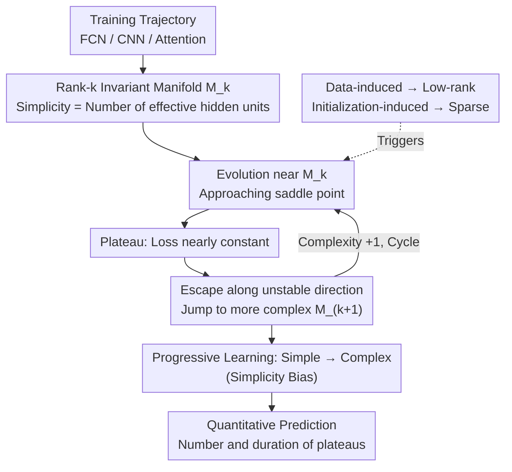

# Saddle-to-Saddle Dynamics Explains A Simplicity Bias Across Neural Network Architectures

**Conference**: ICLR 2026  
**arXiv**: [2512.20607](https://arxiv.org/abs/2512.20607)  
**Code**: None  
**Area**: Optimization Theory / Deep Learning Theory  
**Keywords**: simplicity bias, saddle-to-saddle dynamics, neural network learning dynamics, invariant manifolds, gradient descent

## TL;DR

This paper proposes a unified theoretical framework to explain the pervasive simplicity bias—the phenomenon where gradient descent tends to learn simple solutions before progressively moving to complex ones—across various neural network architectures (fully connected, convolutional, and attention-based) through saddle-to-saddle learning dynamics.

## Background & Motivation

Simplicity bias is a widely observed phenomenon in deep learning: during the training process, neural networks tend to learn "simple" solutions first, followed by increasingly complex ones as training progresses. This behavior has been observed across multiple architectures:

**Phenomenon Description**:
   - Linear networks learn low-rank solutions first, then gradually increase the rank.
   - ReLU networks learn solutions with a small number of "kinks" before adding more.
   - Convolutional networks (CNNs) utilize a small number of kernels initially before activating more.
   - Attention models utilize a few attention heads first, then gradually leverage more.

**Limitations of Prior Work**:
   - Although simplicity bias is widely reported experimentally, existing theoretical analyses are fragmented, with independent analyses for each architecture and a lack of a unified framework.
   - While low-rank bias in linear networks is well-studied, the simplicity bias in ReLU, CNN, and Transformer architectures lacks theoretical explanation.
   - The differing impacts of data distribution versus initialization on simplicity bias have not been clearly distinguished.

**Saddle-to-Saddle Dynamics**:
   - Learning via gradient descent often exhibits "plateaus"—periods where the loss remains nearly constant for a long duration before dropping rapidly.
   - This staircase-like learning behavior is closely related to saddle point dynamics.
   - However, a unified understanding of how these dynamics generate simplicity bias across architectures was previously missing.

## Method

### Overall Architecture

The core question addressed is why networks with vastly different structures, from fully connected to convolutional and attention-based, all exhibit the "simple-to-complex" learning rhythm under gradient descent. The authors argue that the training trajectory can be viewed as a "saddle relay" within the loss landscape. The framework is constructed in three steps: first, "simplicity" is unified as the ability to represent a solution with fewer effective hidden units, formalizing each complexity level as a rank-$k$ invariant manifold. Second, it is proven that the gradient descent trajectory is trapped near these manifolds, jumping upward level by level through a cycle of "evolution–stay–escape" (saddle-to-saddle dynamics). Finally, this mechanism is decomposed into data-induced and initialization-induced paths, allowing for quantitative predictions of the number and duration of plateaus on the learning curve. As the trajectory slowly approaches a saddle point on a low-dimensional manifold, it creates a plateau before escaping along an unstable direction to the next, more complex manifold. This rhythm of "pausing and jumping" is the true origin of simplicity bias.

### Key Designs

**1. Unified Simplicity and Rank-$k$ Invariant Manifolds: Anchoring "Simplicity" as a Mathematical Object**

To discuss simplicity across architectures, different forms of simplicity must be made comparable. The authors provide a unified definition: **simplicity equals representation via fewer hidden units**—referring to the number of hidden neurons in FCNs, effective kernels in CNNs, and effective heads in attention networks. Though seemingly different, these correspond to the same structure in parameter space: low-rank weight matrices (or equivalent sparse structures). Formalizing this results in the rank-$k$ invariant manifold $\mathcal{M}_k$—the set of weight matrices in parameter space with rank exactly $k$, corresponding to "solutions achievable with $k$ effective units." The authors prove that, under appropriate conditions, gradient descent trajectories evolve near these manifolds, which naturally form a nested structure $\mathcal{M}_0 \subset \mathcal{M}_1 \subset \mathcal{M}_2 \subset \cdots$, with each layer being more complex than the last. The key is transforming the vague notion of "complexity level" into an analyzable object: the proximity of the trajectory to a specific $\mathcal{M}_k$.

**2. Formalization of Saddle-to-Saddle Dynamics: Cycles of Pausing and Jumping Produce Progressive Learning**

This is the core mechanism of the framework. The authors prove that gradient descent climbs through these manifolds following a fixed cycle: the trajectory first evolves near the current manifold $\mathcal{M}_k$, approaching a saddle point on it; it stays near the saddle point for a significant time where the loss barely decreases (the observed plateau); it then escapes along the unstable direction of the saddle (corresponding to the largest eigenvalue) and jumps into the next more complex manifold $\mathcal{M}_{k+1}$. This staircase evolution forces the network complexity to grow incrementally, naturally explaining the simple-to-complex progression without requiring external regularization.

**3. Data-induced vs. Initialization-induced: Decoupling Two Independent Sources**

The authors further point out that saddle-to-saddle dynamics can be triggered by two distinct mechanisms with different effects. The first is **data-induced**, determined by the covariance structure of the data, which leads to low-rank weights where learning captures data principal components sequentially. The second is **initialization-induced**, determined by the weight initialization scheme, resulting in sparse weights where the initialization determines which units/kernels/heads are activated first. Separating these two lines is significant because they are independent: low-rankness comes from data, while sparsity comes from initialization. Thus, one can control simplicity bias by adjusting initialization alone without altering the data.

**4. Predicting Plateaus: Upgrading From "Why" to "When and How Long"**

The framework provides two calculable conclusions: the **number** of plateaus equals the number of effective complexity levels the network can express; the **duration** of each plateau depends on the eigenvalue gaps of the data (larger gaps mean shorter plateaus) and the condition number of the initialization. This means that given the covariance spectrum of the data and the initialization scheme, one can quantitatively predict the staircase shape of the entire learning curve beforehand.

### Loss & Training

This is a purely theoretical work analyzing the behavior of standard gradient descent under standard loss functions like Mean Squared Error (MSE). It does not introduce new training strategies; rather, it provides an explanation for the plateau phenomena already observed in existing training processes. The theoretical derivations hold under certain simplifying assumptions, such as small learning rates, the continuous-time limit, and specific initialization distributions.

## Key Experimental Results

### Main Results

Theoretical predictions vs. experimental validation (synthetic and small-scale real experiments):

| Architecture | Simplicity Bias Manifestation | Theoretical Prediction | Experimental Validation |
| :--- | :--- | :--- | :--- |
| Linear Network | Rank increases progressively | ✅ Predicts plateau count/length | ✅ Consistent |
| ReLU Network | Number of kinks increases | ✅ Predicts activation patterns | ✅ Consistent |
| CNN | Active kernels increase | ✅ Predicts kernel activation order | ✅ Consistent |
| Attention | Active heads increase | ✅ Predicts head activation order | ✅ Consistent |

### Ablation Study

| Configuration | Key Metric | Description |
| :--- | :--- | :--- |
| Different Data Spectra | Plateau duration change | Larger eigenvalue gaps → shorter plateaus |
| Initialization Schemes | Sparsity pattern change | Initialization determines which units activate first |
| Learning Rate Change | Qualitative dynamics | Theory holds under small learning rate approximation |
| Hidden Layer Width | Max reachable complexity | Width determines the maximum expressible rank |

### Key Findings

1. **Unified Mechanism Across Architectures**: Simplicity bias in FCN, CNN, and Attention architectures can be explained by the same saddle-to-saddle framework.
2. **Distinct Effects of Data vs. Initialization**: Data-induced dynamics lead to low rank, while initialization-induced dynamics lead to sparsity; these two effects are independent and separable.
3. **Predictable Plateaus**: The data covariance spectrum and initialization scheme can quantitatively predict the staircase shape of learning curves.
4. **Inherent Property of Gradient Descent**: Progressing from simple to complex is an inherent feature of gradient descent in these landscapes, requiring no special regularization.

## Highlights & Insights

1. **Elegance of a Unified Framework**: Uses a single mathematical tool (invariant manifolds + saddle dynamics) to explain universal phenomena across architectures rather than modeling each individually.
2. **Precise Definition of "Simplicity"**: Precisely defines the vague concept of "simplicity" as the "number of effective hidden units," making different architectures comparable.
3. **Clarity of Causal Separation**: Decomposes simplicity bias into data effects (low rank) and initialization effects (sparsity), providing practical guidance, such as controlling bias by tuning initialization.
4. **Quantitative Predictive Power**: Beyond just explaining "why," it predicts "when" and "how long," which is the core strength of the theory.
5. **Practical Implications**: Understanding the mechanism allows for smarter training strategies, such as adaptive learning rates to accelerate transitions across plateaus.

## Limitations & Future Work

1. **Simplifying Assumptions**:
    - Analysis is conducted under small learning rates and continuous-time limits; discrete large learning rate scenarios are more complex.
    - Limits on network structure (e.g., single hidden layer or shallow analyses).
    - Loss functions are limited to MSE; cases like cross-entropy are not fully covered.

2. **Scale Limitations**:
    - Validation primarily involves small-scale networks and synthetic data.
    - Whether saddle-to-saddle dynamics remain the primary mechanism for simplicity bias in large models like GPT remains to be verified.

3. **Gap with Practical Training Configurations**:
    - Real-world training uses Adam, warm-up, Batch Normalization, etc., which may alter dynamic behavior.
    - The idealized gradient flow in theory may deviate under the noise of SGD.

4. **Non-linear Interactions**:
    - Attention mechanism analysis may simplify the non-linear effects of the softmax function.
    - CNN analysis assumes specific kernel initialization conditions.

5. **Future Directions**:
    - Extending the framework to residual connections (ResNet) and full Transformer architectures.
    - Investigating the quantitative impact of simplicity bias on generalization performance.
    - Connecting simplicity bias to other training phenomena like double descent and grokking.

## Related Work & Insights

- **Linear Network Theory**: The foundational work of Saxe et al. (2014, 2019) on the learning dynamics of linear networks is the direct basis for this paper.
- **Simplicity Bias Empirical Studies**: Experimental observations by Shah et al. (2020) and others.
- **Loss Landscape Analysis**: Saddle point analysis by Choromanska et al. (2015) and visualization work by Li et al. (2018).
- **Implicit Regularization**: Theories by Gunasekar et al. (2017) and Arora et al. (2019) regarding the preference of gradient descent for low-rank solutions.
- **Insight**: The saddle-to-saddle framework may provide a theoretical foundation for understanding curriculum learning, which is essentially an artificial acceleration of the simplicity bias process.

## Rating

- **Novelty**: ⭐⭐⭐⭐⭐ — The first unified theoretical framework for simplicity bias across architectures; a significant contribution.
- **Experimental Thoroughness**: ⭐⭐⭐ — Primarily a theoretical paper; experiments are small-scale and purely for validation.
- **Writing Quality**: ⭐⭐⭐⭐ — Well-balanced theoretical depth and readability, aided by good diagrams.
- **Value**: ⭐⭐⭐⭐⭐ — Strongly advances the fundamental understanding of deep learning.

<!-- RELATED:START -->

## Related Papers

- [\[ICLR 2026\] Never Saddle for Reparameterized Steepest Descent as Mirror Flow](never_saddle_for_reparameterized_steepest_descent_as_mirror_flow.md)
- [\[ICML 2026\] Asymmetric Perturbation in Solving Bilinear Saddle-Point Optimization](../../ICML2026/optimization/asymmetric_perturbation_in_solving_bilinear_saddle-point_optimization.md)
- [\[ICML 2026\] Conservation Laws for Modern Neural Architectures](../../ICML2026/optimization/conservation_laws_for_modern_neural_architectures.md)
- [\[ICML 2026\] Balancing Learning Rates Across Layers: Exact Two-Step Dynamics and Optimal Scaling in Linear Neural Networks](../../ICML2026/optimization/balancing_learning_rates_across_layers_exact_two-step_dynamics_and_optimal_scali.md)
- [\[NeurIPS 2025\] Escaping Saddle Points without Lipschitz Smoothness: The Power of Nonlinear Preconditioning](../../NeurIPS2025/optimization/escaping_saddle_points_without_lipschitz_smoothness_the_power_of_nonlinear_preco.md)

<!-- RELATED:END -->
