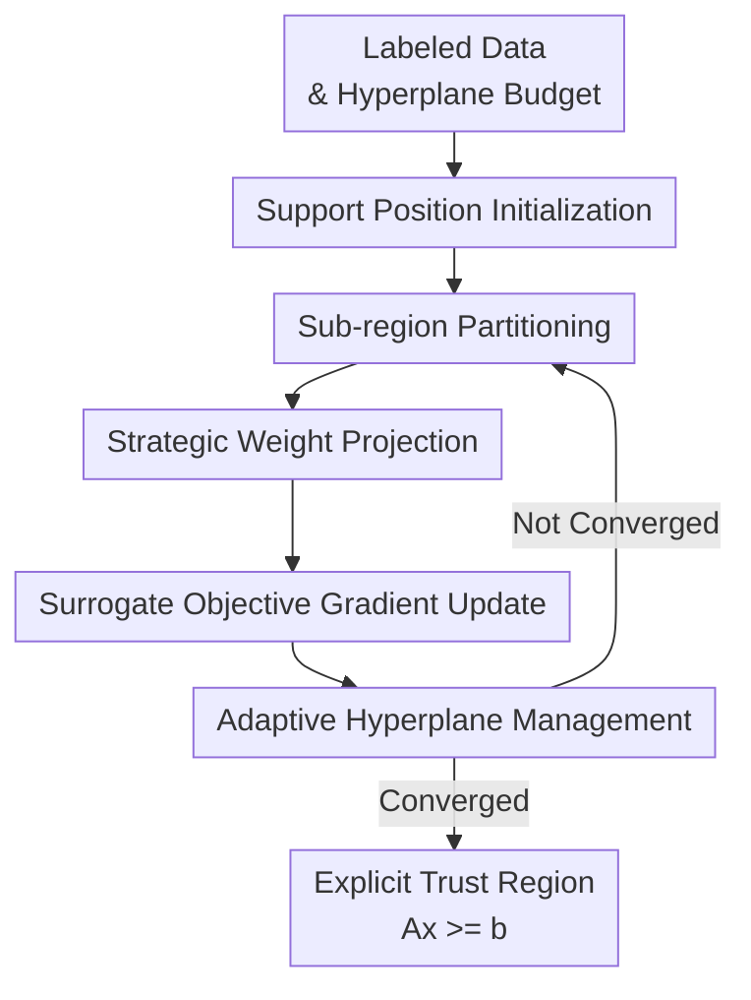

# Scalable and Adaptive Trust-Region Learning via Projection Convex Hull

**Conference**: ICLR2026  
**OpenReview**: [https://openreview.net/forum?id=Kjcs0xJxdg](https://openreview.net/forum?id=Kjcs0xJxdg)  
**Code**: Available (claimed by the paper)  
**Area**: Optimization / Trust-Region Learning  
**Keywords**: Convex hull learning, trust region, mixed-integer optimization, hyperplane budget, constrained learning

## TL;DR
This paper proposes Projection Convex Hull (PCH), which transforms the intractable MINLP of convex hull trust-region learning into a differentiable surrogate optimization with weighted projections. By iteratively learning a small number of supporting hyperplanes, it obtains polyhedral trust regions in high-dimensional data that are tight, interpretable, and directly embeddable into downstream optimization models.

## Background & Motivation
**Background**: The convex hull is a classic geometric object for describing the support domain of data, which is natural in classification, constrained learning, and decision optimization: if positive samples represent "reliable/feasible/in-distribution" regions, a convex region containing all positive samples can serve as a trust region, indicating which inputs remain within the data support. Traditional computational geometry algorithms like QuickHull can accurately construct convex hulls in low-dimensional spaces, but the output is typically a vertex- or facet-driven geometry, which is not like the controllable, trainable, and compressible models in machine learning.

**Limitations of Prior Work**: The first pain point is the curse of dimensionality. The number of facets in an exact convex hull can grow exponentially with dimensionality; in an 8-dimensional example like PH 15 8, QuickHull's complexity explodes to $2.30\times10^7$ hyperplanes, making it impractical. The second is uncontrollable structure. Many methods either provide implicit regions or cannot explicitly limit the number of hyperplanes; in constrained learning, an explicit $Ax\ge b$ is preferred for embedding into MILP/MIP or other decision models. The third is insufficient boundary tightness. Requiring only the exclusion of negative samples leaves many equivalent solutions; the same binary classification objective can correspond to a very loose polyhedron or one that tightly fits the positive samples' convex hull, while trust regions specifically require the latter.

**Key Challenge**: The problem of "enclosing all positive samples with at most $S$ hyperplanes, maximizing the exclusion of negative samples, and maintaining tight boundaries" can be formulated as a Mixed-Integer Nonlinear Program (MINLP), but binary assignment variables and hyperplane normalization make it unbearable for large high-dimensional datasets. Conversely, directly approximating with neural networks or standard classification losses often loses the critical trust-region properties: "all positive samples must be inside" and "output explicit linear constraints."

**Goal**: The authors aim to solve a budgeted polyhedral trust-region learning problem: given labeled data $D=\{(x_i,y_i)\}$, learn a convex region $C=\{x\in\mathbb{R}^d\mid a_s^\top x\ge b_s, s=1,\dots,S\}$ formed by the intersection of $S$ half-spaces, such that all positive samples are within $C$, negative samples are excluded as much as possible, and the boundaries are as tight as possible to the positive sample support.

**Key Insight**: The paper observes that while complex boundaries may be globally nonlinear, they are often locally approximated by a supporting hyperplane. Instead of solving a global MINLP, the problem of "which negative sample is excluded by which hyperplane" is turned into local sub-region assignments, allowing each hyperplane to process only the most informative positive and negative samples in its vicinity. This transforms a global combinatorial search into multiple local, differentiable, and iterative hyperplane updates.

**Core Idea**: Use "sub-region partitioning + strategic weight projection + gradient updates + adaptive hyperplane addition/deletion" to approximate the optimal supporting surfaces of the original MINLP, forming a compact trust region with a few interpretable hyperplanes.

## Method
The PCH method can be understood as an alternating optimization process with geometric constraints. Instead of learning a classifier and extracting rules post-hoc, it directly learns the polyhedron: each hyperplane is placed at a supporting position for the positive sample convex hull, local samples are assigned via bandwidth filtering, sample weights are projected to maintain theoretically required moment conditions, and hyperplane normal vectors are updated via gradient descent on a surrogate objective. Finally, the intersection of all active hyperplanes forms the trust region.

### Overall Architecture
The input consists of a binary dataset and a hyperplane budget $S$; the output is an explicit polyhedron $C=\{x\mid Ax\ge b\}$. The algorithm initializes supporting hyperplanes using an improved PinCHD; in each round, it sets the bias to $b^\star(a_s)=\min_{x\in D^+}a_s^\top x$ to ensure the hyperplane supports the positive samples; it then constructs local sub-regions around each hyperplane to update weights and normals; hyperplanes that no longer contribute are pruned, and if negative samples remain in the current hull and the budget allows, new hyperplanes are added.

### Key Designs
**1. From MINLP to Differentiable Surrogate: Decomposing Global Combinatorial Problems into Local Support Surface Learning**

The paper starts with an ideal but intractable MINLP. The goal is to ensure $a_s^\top x_i-b_s\ge0$ for all positive samples and $a_s^\top x_i-b_s\le-\xi_s$ for negative samples separated by a specific hyperplane, using binary variables $z_i^s$ to indicate sample-hyperplane assignment. This form captures trust-region objectives but is computationally ruined by binary variables.

PCH proves that if $(A^\star,b^\star)$ is the optimal MINLP solution, each $(a_s^\star,b_s^\star)$ can be seen as an optimal support surface for a local subproblem involving only positive samples $D^+$ and assigned negative samples $D_-^s$. The core difficulty shifts from global assignment to constructing a local working set where a differentiable objective approximates the optimal support conditions.

The surrogate objective is a soft splitting loss. For samples in local data $D_s$, left and right soft split probabilities are:

$$
p_i^L=\frac{1}{1+e^{\beta(a^\top x_i-b)/\|a\|}},\quad
p_i^R=\frac{1}{1+e^{\beta(b-a^\top x_i)/\|a\|}}.
$$

Quality is measured by the squared weighted label means:

$$
f(a,b)=-\frac{1}{2}\frac{(\sum_i\omega_i p_i^L y_i)^2}{\sum_i\omega_i p_i^L}
-\frac{1}{2}\frac{(\sum_i\omega_i p_i^R y_i)^2}{\sum_i\omega_i p_i^R}.
$$

Intuition: this encourages the hyperplane to split local positive/negative samples; theoretically, under appropriate weights $\omega_i$, the MINLP's optimal support surface becomes a stationary point of this surrogate.

**2. Sub-region Partitioning: Focusing on Boundary-Relevant Samples**

To prevent PCH from degenerating into expensive global optimization, sub-regions $D_s$ utilize divide-and-conquer. Given normal $a_s$, the bias is fixed at $b^\star(a_s)=\min_{x\in D^+}a_s^\top x$. Only samples within a belt near the hyperplane that remain inside the current hull relative to other hyperplanes are selected:

$$
D_s=\{x\in D\mid -m_s\le a_s^\top x-b^\star(a_s)\le m_s,\ A_{-s}^\top x\ge b_{-s}\}.
$$

This focuses on samples most likely to affect boundary tightness and stops distant, already-excluded negative samples from interfering. Bandwidth $m_s$ adaptively ensures at least $d$ boundary-near positive samples are included.

**3. Strategic Weight Projection: Mapping Surrogate Objectives back to Support Geometry**

Sample weights are crucial. The paper provides moment conditions (e.g., $\sum_i\omega_i=2$, $\sum_i\omega_i y_i=0$) and a fixed-point condition for the normal vector:

$$
a=\sum_i\omega_i p_i^Lp_i^Ry_i x_i.
$$

PCH designs weight updates as a projection optimization: one step along the separation margin $\xi(\omega)$ gradient, followed by projection onto the feasible set. The projection set includes linear moments, non-negativity, and isotonic cones (samples closer to the boundary get higher weights), mirroring SVM intuition through PAVA projections.

**4. Adaptive Structural Adjustment: Balancing Tightness and Budget**

Pruning: if a sub-region's samples are all on the non-negative side, the hyperplane is redundant and removed. Addition: if negative samples remain in the hull and budget permits, a new supporting hyperplane is initialized using an improved PinCHD, selecting anchors that are both inside the current hull and near existing boundaries.

### Loss & Training
Each training round involves:
1. Re-calculating biases $b_s = \min_{x \in D^+} a_s^\top x$.
2. Updating sub-regions $D_s$.
3. Updating weights via gradient ascent on the margin $\xi(\omega)$ followed by a multi-constraint projection $P_F(\omega)$.
4. Performing one step of gradient descent on the surrogate $f(a,b)$ and managing structural changes.

The complexity is $O(InSd)$, ensuring scalability compared to exact convex hulls or MIPs.

## Key Experimental Results

### Main Results
PCH was compared against QuickHull (QH), CGHC, DCH, PinCHD, and DeepHull.

| Dataset / Dim | Metric | QH | CGHC | DeepHull | PCH | Conclusion |
|-------|------|------|------|------|------|------|
| PH 15 2 / Low-D | Accuracy | 100.00 | 99.71 | 97.01 | 100.00 | PCH matches exact hull accuracy |
| PH 15 8 / Low-D high facet | Complexity | 2.30E+7 | 15 | 15 | 15 | QH explodes; PCH remains compact |
| PH 15 100 / High-D | Accuracy | N/A | 57.20 | 64.39 | 99.95 | PCH dominates in high-dim polyhedral tasks |
| NLC N 100 / Non-linear Convex | Accuracy | N/A | 68.89 | 75.39 | 99.01 | Approximates non-linear boundaries well |
| Spambase / Real data | Accuracy | N/A | 86.70 | 91.55 | 94.41 | Better stability on real tabular data |

### Ablation Study
Key conclusions:
- **Full PCH**: Achieves 99.95% accuracy on PH 15 100 with budget 15.
- **CGHC**: Limited by MIP scalability in high dimensions (57.20% accuracy).
- **PinCHD**: Lacks compactness (1499 hyperplanes vs 15 in PCH).
- **DeepHull**: Does not guarantee explicit linear constraints or full positive coverage.

### Key Findings
- **High-dimensional Scalability**: PCH significantly outperforms baselines on 100D tasks where others drop to ~60% accuracy.
- **Compactness**: Reduces complexity from millions of facets to a small budget $S$, essential for downstream optimization.
- **Selective Classification**: PCH serves as an effective filter, improving CART and MLP performance (e.g., CART performance on Spambase improved from 91.10 to 93.27).
- **Constrained Learning**: Improves feasibility rates (94.00 for PCH† vs 88.00 for original MLP) while significantly reducing decision model complexity (binary variables reduced from 205 to 35).

## Highlights & Insights
- **Returning to Geometric Essence**: Focuses on "enclosing all positives, excluding negatives, tightness, and explicit constraints" rather than just classification.
- **Theoretical Bridge**: Provides a link between MINLP optimality and surrogate stationary points, justifying the algorithm beyond mere heuristics.
- **Weight Projection**: Utilizes projections onto isotonic cones and linear moment conditions to enforce geometric intuition in the learning process.
- **Optimization-friendly**: Outputs $Ax \ge b$, which is easier to interpret and embed into MIP than implicit neural representations.

## Limitations & Future Work
- **Convexity Assumption**: PCH learns a single convex polyhedron. Future work could explore multiple convex hulls for non-convex regions.
- **Implementation Gap**: Theory supports stationary points, but practical performance relies on one-step gradient updates and projections.
- **Hyperparameter Sensitivity**: Bandwidth, budget, and learning rate selection remain engineering challenges in noisy data.
- **Outlier Sensitivity**: Hard coverage of all positive samples makes the hull vulnerable to outliers.

## Related Work & Insights
- **vs. QuickHull**: PCH sacrifices exactness for high-dimensional scalability and controllable budget.
- **vs. CGHC**: PCH avoids the instability of integer variables by using differentiable surrogates.
- **vs. PinCHD**: PCH improves initialization and uses weight projection to manage structure and stability.
- **vs. DeepHull**: PCH provides explicit $Ax \ge b$ constraints and guaranteed positive coverage.

## Rating
- **Novelty**: ⭐⭐⭐⭐☆
- **Experimental Thoroughness**: ⭐⭐⭐⭐☆
- **Writing Quality**: ⭐⭐⭐⭐☆
- **Value**: ⭐⭐⭐⭐⭐

<!-- RELATED:START -->

## Related Papers

- [\[ICLR 2026\] Nesterov Finds GRAAL: Optimal and Adaptive Gradient Method for Convex Optimization](nesterov_finds_graal_optimal_and_adaptive_gradient_method_for_convex_optimizatio.md)
- [\[ICLR 2026\] Derandomized Online-to-Non-convex Conversion for Stochastic Weakly Convex Optimization](derandomized_online-to-non-convex_conversion_for_stochastic_weakly_convex_optimi.md)
- [\[ICLR 2026\] A Scalable Constant-Factor Approximation Algorithm for $W_p$ Optimal Transport](a_scalable_constant-factor_approximation_algorithm_for_w_p_optimal_transport.md)
- [\[ICLR 2026\] Convex Dominance in Deep Learning I: A Scaling Law of Loss and Learning Rate](convex_dominance_in_deep_learning_i_a_scaling_law_of_loss_and_learning_rate.md)
- [\[ICLR 2026\] Fast Frank–Wolfe Algorithms with Adaptive Bregman Step-Size for Weakly Convex Functions](fast_frankwolfe_algorithms_with_adaptive_bregman_step-size_for_weakly_convex_fun.md)

<!-- RELATED:END -->
