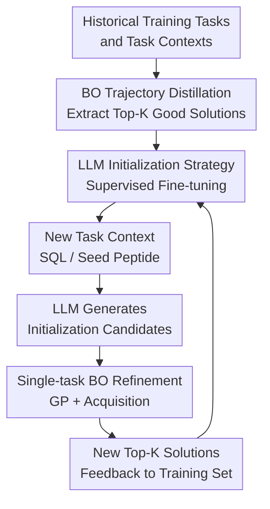

# Scaling Multi-Task Bayesian Optimization with Large Language Models

**Conference**: ICLR2026  
**OpenReview**: [https://openreview.net/forum?id=ekmUkRYnkN](https://openreview.net/forum?id=ekmUkRYnkN)  
**Code**: https://github.com/Yimeng-Zeng/BOLT  
**Area**: Optimization / Bayesian Optimization / LLM for Optimization  
**Keywords**: Multi-task Bayesian Optimization, Large Language Models, Initialization Transfer, Black-box Optimization, Self-augmented Fine-tuning  

## TL;DR
BOLT distills a large number of historical Bayesian Optimization (BO) trajectories into an LLM, enabling the LLM to generate high-quality initial solutions for new tasks. These candidates are then passed to standard single-task BO for continued search, overcoming the performance saturation issues encountered by traditional multi-task BO as the number of tasks increases in domains such as database query plan optimization and antimicrobial peptide design.

## Background & Motivation
**Background**: The typical goal of multi-task Bayesian Optimization is to transfer experience from previously optimized tasks when repeatedly encountering a set of related black-box optimization tasks. Conventional approaches usually incorporate transfer capabilities into a shared surrogate: for example, building multi-output GPs over a joint input-task space, or using a shared neural feature extractor followed by a GP or Bayesian linear regression head, allowing new tasks to inherit the statistical structure of old ones from the start.

**Limitations of Prior Work**: Such shared-surrogate methods often provide benefits across a few dozen tasks, but performance plateaus once the training tasks scale to hundreds or thousands. This is caused not only by computational slowdowns but also by the difficulty of fully capturing task similarities with a unified kernel or shared feature representation. If a surrogate simultaneously handles "cross-task memory" and "current-task uncertainty modeling," bottlenecks arise in model capacity, task kernels, the number of experts, and approximate GP training.

**Key Challenge**: Multi-task BO truly requires providing a "good starting point" using historical tasks, rather than necessarily maintaining a complex cross-task surrogate during test time. Particularly in structured search spaces like query plans and peptide sequences, the tasks themselves have readable contexts: SQL query text, seed peptide sequences, constraint descriptions, etc. LLMs are adept at generating structured strings from context, while BO is efficient at sample-efficient search in local continuous latent spaces; the capabilities of the two can actually be decoupled.

**Goal**: The paper aims to answer three specific questions. First, can an LLM be made responsible only for generating initialization candidates for new tasks without intervening in the BO surrogate and acquisition? Second, as historical BO tasks scale from dozens to thousands, does the quality of LLM initialization continue to improve? Third, is the additional cost of LLM fine-tuning and sampling sufficiently low for real-world high-budget BO workloads.

**Key Insight**: The authors do not design the LLM as an "optimizer that entirely replaces BO," nor do they let it act as a surrogate or acquisition optimizer at every step. The observation for BOLT is simple: every completed BO task contains a set of top-$K$ high-quality solutions, which naturally form supervised data of "task context $\rightarrow$ good solution." By continuously fine-tuning these pairs into an LLM, the model gradually learns to directly produce candidates that resemble good solutions for new tasks.

**Core Idea**: Use BO to generate high-quality training samples, use LLMs to learn task-conditioned initialization strategies, and use single-task BO for refinement. Cross-task knowledge is not stored in the test-time surrogate but is instead front-loaded into the initialization phase.

## Method

### Overall Architecture
BOLT can be viewed as having an outer loop and an inner loop. The outer loop organizes BO trajectories from completed tasks into LLM fine-tuning data, iteratively evolving the model into a stronger initializer. In the inner loop, when facing a new task, the current LLM generates candidates based on the task context, and standard single-task BO then continues optimization based on these candidates.

The key to this design is "initialization-only transfer": the test-time surrogate remains the GP (or approximate GP) of the current task itself, eliminating the need to fit thousands of historical tasks into a single multi-task model. Historical experience affects initial candidates through the LLM parameters, after which existing algorithms for BO acquisition, constraint handling, and latent-space search can be used.

More formally, training tasks are defined as a set of objective functions $f_1, \dots, f_T$, each with context $C[f_t]$, where the goal is to find $x_t^* = \arg\min_{x \in X} f_t(x)$. BOLT extracts top-$K$ observations from each completed BO trajectory and converts them into prompt-solution pairs for LLM supervised fine-tuning. The system prompt describes the domain task, the user prompt provides $C[f_t]$, and the assistant provides a high-quality solution $x$. The fine-tuned LLM $\pi$ receives a new task context and generates an initialization set $X_{init} = \pi(C[f_t])$, after which BO continues to select $X_{next} = \arg\max_x \alpha(x; GP)$ within a budget $B$.

### Key Designs

**1. Initialization-only transfer: Decoupling cross-task transfer from the surrogate**

**Mechanism**: Traditional MTBO often requires the surrogate to learn input space structure, inter-task correlations, and current-task uncertainty simultaneously. BOLT asks: if the primary value of historical tasks is to inform the new task about "regions likely to contain good solutions," this knowledge does not necessarily need to be expressed via a task kernel or shared feature extractor at test time. Consequently, BOLT only uses the LLM to generate initialization candidates. After these candidates are evaluated by the real oracle, the surrogate for the current task fits the posterior starting from these points.

**Function**: This separation provides two direct benefits. First, test-time BO does not scale linearly (or worse) with the number of historical tasks; when training tasks increase from dozens to 1,426 database tasks, the inner loop remains standard single-task BO. Second, BOLT can be prepended to different BO implementations: the main experiments use constrained LOL-BO and latent-space BO, while the appendix demonstrates that global BO + BOLT initialization also yields improvements, showing it is not exclusive to a specific acquisition or surrogate.

**2. Trajectory distillation fine-tuning: Teaching LLMs task-conditioned generation with top-K solutions**

**Design Motivation**: The training data for BOLT is neither manual annotation nor "optimization knowledge" scraped from papers or the web, but high-quality solutions searched by BO itself on each task. For task $t$, the authors extract top-$K$ observations from the optimization trajectory $D_t^*$ and rewrite $(C[f_t], x, y)$ as prompt-solution pairs. The fine-tuning objective is standard autoregressive negative log-likelihood:

$$
L=-\sum_{i=1}^{|x|}\log \pi(x_i \mid C, x_{<i}).
$$

This step accurately leverages LLM strengths: SQL query plans and peptide sequences can be represented as strings, and task contexts are naturally strings. The LLM does not need to understand the mathematical details of BO acquisition; it only needs to learn "given this query/seed peptide, what did good solutions look like for similar historical contexts." As more BO tasks are completed, the coverage and quality of good solutions in the training set improve, leading to a stronger initializer.

**3. Closed outer loop and self-augmentation: Feeding improved BO output back to the LLM**

**Mechanism**: The outer loop of BOLT is not a one-time training process. In the initialization phase, standard BO solves a batch of tasks to obtain the first version of the fine-tuned model. For subsequent batches of new tasks, the current LLM initializes BO, which then finds even better top-$K$ solutions. These are appended to the fine-tuning set to obtain the next version of BOLT-T. This loop creates a positive feedback cycle: the LLM gives BO a better starting point, allowing BO to find better solutions with less exploration, which in turn brings the LLM's initialization distribution closer to high-value regions.

**Novelty**: The paper also explores self-augmentation. A previously fine-tuned LLM can generate more candidates across all training tasks. The authors score these using the real oracle and retain only those exceeding a threshold for further fine-tuning. On database query plans, BOLT-1138 with self-augmentation saw the Best@50 runtime drop from 78.16s to 61.46s, close to the 61.54s of BOLT-1426. This indicates that once the LLM has learned a strong task-conditioned distribution, it is not always necessary to pay the full cost of a BO trajectory; self-generated solutions filtered by an oracle can also drive the model forward.

**4. Compatibility with structured spaces: LLM proposals in sequence space with BO refinement in latent space**

**Mechanism**: Both experimental domains involve non-trivial structured optimization. Database query plans consist of discrete structures (join orders and operators), while antimicrobial peptides are amino acid sequences with a constraint of at least 75% similarity to a seed peptide. BOLT allows the LLM to generate readable sequences directly, which are then mapped to a continuous latent space via an existing VAE, followed by search using LOL-BO / GP acquisition.

**Key Insight**: This combination of "sequence space generation + latent space search" is critical. With only few-shot sampling from the LLM, candidates are already strong even when the sample size is small; yet BO can continue to optimize around the high-quality basins found by the LLM. Conversely, BO starting from random or BAO initialization would spend many oracle calls just finding a direction in high-dimensional structured spaces. BOLT lets the LLM handle global, task-conditioned coarse localization, while BO handles local, sample-efficient refinement.

### Loss & Training
LLM fine-tuning utilizes the GPT-4O-MINI-0718 supervised fine-tuning API. Database tasks use OpenAI's automatic batch size, while peptide design tasks use a fixed batch size of 10. Both task types are trained for 2 epochs with a default learning rate multiplier of 1.8. To reduce formatting errors, generated characters not belonging to integer strings or valid amino acid letters are filtered out.

Inner-loop BO is implemented using constrained LOL-BO, BoTorch, and GPyTorch. For database query plans, a batch size of 1 and a budget of 4,000 oracle calls are used, optimizing in a 64-dimensional query-plan VAE latent space. For antimicrobial peptides, a batch size of 50 and a budget of 20,000 oracle calls are used in a 256-dimensional peptide VAE latent space. The database VAE is fixed after pre-training, while the peptide VAE is updated every 10 optimization steps alongside the surrogate.

The frequency of outer-loop fine-tuning is determined by cost trade-offs. The authors do not fine-tune after every single task; instead, they fine-tune 4 times for database tasks and 7 times for peptide tasks. This sacrifices some black-box evaluation efficiency but significantly reduces the monetary cost and engineering complexity of LLM fine-tuning.

## Key Experimental Results

### Main Results
The paper evaluates the method on two high-throughput task families: 2,933 database query plan optimization tasks (99 for validation) and 1,000 extinct seed peptides (last 100 for validation). Metrics are lower-is-better: summed query runtime for databases and predicted MIC for peptide design.

| Task | Key Settings | BOLT Results | Baselines | Main Conclusions |
|------|----------|-----------|----------|----------|
| Database Query Optimization | 50 LLM init plans, 4,000 BO oracle calls | BOLT continues to improve as training tasks scale to 1426; eventually, few-shot init outperforms BAO/STBO points. | STBO, DKT/FSBO, POGPE/SGPE, Optformer, LLAMBO | DKT/FSBO returns diminish after ~20 tasks; BOLT does not saturate in the same way. |
| Antimicrobial Peptide Design | 1,000 LLM init peptides, 20,000 BO oracle calls | BOLT-600 is significantly better than STBO/MTBO init even at the start. | STBO, DKT/FSBO, Optformer, LLAMBO | LLMs can map seed peptide contexts to low MIC candidates for BO refinement. |
| Few-shot Optimization | Evaluation of top-k LLM samples | BOLT matches or exceeds full BO runs with few samples. | PostgreSQL, BAO, Full STBO/MTBO | After sufficient training, the LLM itself becomes a strong few-shot optimizer. |

Detailed initialization data highlights scaling effects. For the first 10 validation queries in the database domain, the summed runtime for BOLT-1426 with 50-shot initialization is 7.4340s, compared to 12.0967s for STBO/MTBO init. For 20 validation tasks in peptide design, BOLT-600 with 1000-shot initialization achieves a summed MIC of 92.1007, compared to 625.9521 for STBO/MTBO.

| Domain | Oracle Calls / Init Sample Count | Early BOLT | Scalable BOLT | STBO / MTBO Init | Trend |
|----|----------------------------|----------------|------------------|--------------------|------|
| DB (Top 10 Val Qry) | 50 | BOLT-50: 10.3764 s | BOLT-1426: 7.4340 s | 12.0967 s | Performance scales with tasks. |
| DB (Top 10 Val Qry) | 1 | BOLT-50: 53.2584 s | BOLT-1426: 13.9788 s | 15.1161 s | One-shot is competitive at scale. |
| Peptide (20 Val Tasks) | 1000 | BOLT-50: 97.1403 MIC | BOLT-600: 92.1007 MIC | 625.9521 MIC | LLM init significantly beats random/std. |
| Peptide (20 Val Tasks) | 100 | BOLT-50: 112.9047 MIC | BOLT-600: 100.5810 MIC | 1551.4898 MIC | Advantage is more pronounced at low budgets. |

### Ablation Study
| Configuration | Key Metrics | Description |
|------|----------|------|
| BOLT-1426 + BO | DB Top 10 Val Summed Runtime: 6.43 s | Continued BO search after LLM init yields the best result. |
| BOLT-1426 init only | 7.43 s | Using 50 LLM samples without BO already outperforms STBO initialization. |
| STBO | 8.23 s | Standard single-task BO init without historical task knowledge. |
| Previous solutions | 9.18 s | Reusing historical best solutions; weaker than BOLT, indicating context conditioning is vital. |
| TR perturbations | 8.62 s | Trust-region perturbations around historical best solutions; still inferior to BOLT. |

Ablations on self-augmentation and data quality further show that BOLT relies on high-quality, context-aligned samples rather than just volume.

| Ablation | Metric | Result | Explanation |
|------|------|------|------|
| Self-augmentation | DB Best@50 | BOLT-1138 no SA: 78.16 s → BOLT-1138 + SA: 61.46 s | Self-generated candidates filtered by oracle replace part of BO trajectory cost. |
| Data Quality Swap | DB Best@50 | BOLT-1138: 78.16 s; BOLT-1138*: 64.03 s; BOLT-1426: 63.68 s | Improved BO solutions are valuable; more and better data is best. |
| Context Shuffling | DB Best@50 | Aligned: 61.54 s; Shuffled: 402.61 s | Proves the model learns task-conditioned mapping, not just a pool of good solutions. |
| Open-source Models | DB Best@50 | GPT-4O-MINI: 61.54 s; Qwen2.5-7B: 62.04 s; Llama3.1-8B: 155.55 s | Transferable to open-source models, though model capability varies. |

### Key Findings
- Traditional shared-surrogate MTBO gains saturate early, whereas BOLT continues to benefit as the number of training tasks grows from dozens to thousands.
- Context alignment is crucial. Shuffling the relationship between SQL contexts and plans degraded Best@50 runtime from 61.54s to 402.61s, proving the model relies on task descriptions.
- Self-augmentation is effective once the LLM is sufficiently strong but requires oracle filtering; self-generation without scoring does not guarantee quality.
- LLM overhead is small relative to the BO inner loop: in database workloads, BOLT fine-tuning and sampling represent about 1% of total STBO computation, with the primary cost still being 15-20 GPU-hours per task for BO.

## Highlights & Insights
- The most clever aspect is removing "transfer" from the surrogate. While many MTBO methods pile on complex task kernels or shared feature extractors, BOLT opts for initialization-only transfer, keeping the test-time optimizer simple and scalable.
- The paper treats the LLM as a structured candidate generator rather than an all-knowing optimizer. The LLM handles SQL/peptide context and outputs valid strings, while BO handles uncertainty-driven search using oracle feedback.
- The BOLT loop resembles "using search to teach a generative model, then using the generative model to aid search." This pattern applies to many expensive black-box tasks like compiler optimization or chip design, provided the context is text-based and solutions are serializable.
- The context-shuffling experiment is highly persuasive, ruling out the explanation that the LLM is simply memorizing an average pool of good candidates.
- The computational analysis is pragmatic. The paper provides a full accounting of token costs, API fees, and GPU-hour equivalents, supporting the claim that additional overhead is amortizable.

## Limitations & Future Work
- BOLT requires the task family to share an input/solution space and for tasks to be describable by an informative context $C[f_t]$. For tasks like hyperparameter optimization where differences lie in data distributions rather than short text, BOLT may be less effective.
- It depends on a large volume of completed BO trajectories. During a cold start, BOLT-0 is essentially unusable, requiring standard BO to generate initial high-quality samples.
- While the experimental domains are diverse (systems vs. bio-design), they both satisfy the condition of string-based solutions and contexts. Continuous control or complex simulation parameters may not be as easily serialized.
- Self-augmentation requires an oracle to score generated samples. If the oracle is expensive, self-augmentation is not free; if the oracle is a proxy, it introduces model bias.

## Related Work & Insights
- **vs DKT / FSBO / Shared-GP MTBO**: These put cross-task knowledge in surrogates or shared features; BOLT puts it in initialization, allowing it to continue benefiting from thousands of tasks.
- **vs Optformer**: Optformer attempts to learn entire optimization trajectories, which is limited by context length; BOLT only predicts initialization, leaving sequential decision-making to BO.
- **vs LLAMBO**: LLAMBO uses LLMs for surrogate and acquisition steps, which has higher token costs; BOLT only samples candidates at the beginning.
- **Insight**: For many engineering optimization tasks, rather than designing an increasingly complex unified surrogate, it may be better to first ask if the most useful part of historical tasks is a good initialization. If so, BOLT’s decoupled transfer is likely more practical.

## Rating
- **Novelty**: ⭐⭐⭐⭐⭐ Using LLMs as an initialization strategy rather than a test-time surrogate is a simple yet effective way to overcome scaling bottlesnecks.
- **Experimental Thoroughness**: ⭐⭐⭐⭐⭐ High-throughput domains, multiple baselines, few-shot analysis, self-augmentation, and cost analysis are comprehensive.
- **Writing Quality**: ⭐⭐⭐⭐ Clear main storyline and sufficient detail, though some key metrics are scattered across text, figures, and appendices.
- **Value**: ⭐⭐⭐⭐⭐ Highly insightful for structured black-box optimization, especially for scenarios with many similar tasks and serializable solutions.

<!-- RELATED:START -->

## Related Papers

- [\[ICLR 2026\] Adaptive Acquisition Selection for Bayesian Optimization with Large Language Models](adaptive_acquisition_selection_for_bayesian_optimization_with_large_language_mod.md)
- [\[ICLR 2026\] HBO: Hierarchical Balancing Optimization for Fine-Tuning Large Language Models](hbo_hierarchical_balancing_optimization_for_fine-tuning_large_language_models.md)
- [\[ICLR 2026\] Generative Bayesian Optimization: Generative Models as Acquisition Functions](generative_bayesian_optimization_generative_models_as_acquisition_functions.md)
- [\[ICLR 2026\] DiffBED: Scaling Bayesian Experimental Design to High-Dimensions](diffbed_scaling_bayesian_experimental_design_to_high-dimensions.md)
- [\[ICLR 2026\] GIT-BO: High-Dimensional Bayesian Optimization with Tabular Foundation Models](git-bo_high-dimensional_bayesian_optimization_with_tabular_foundation_models.md)

<!-- RELATED:END -->
