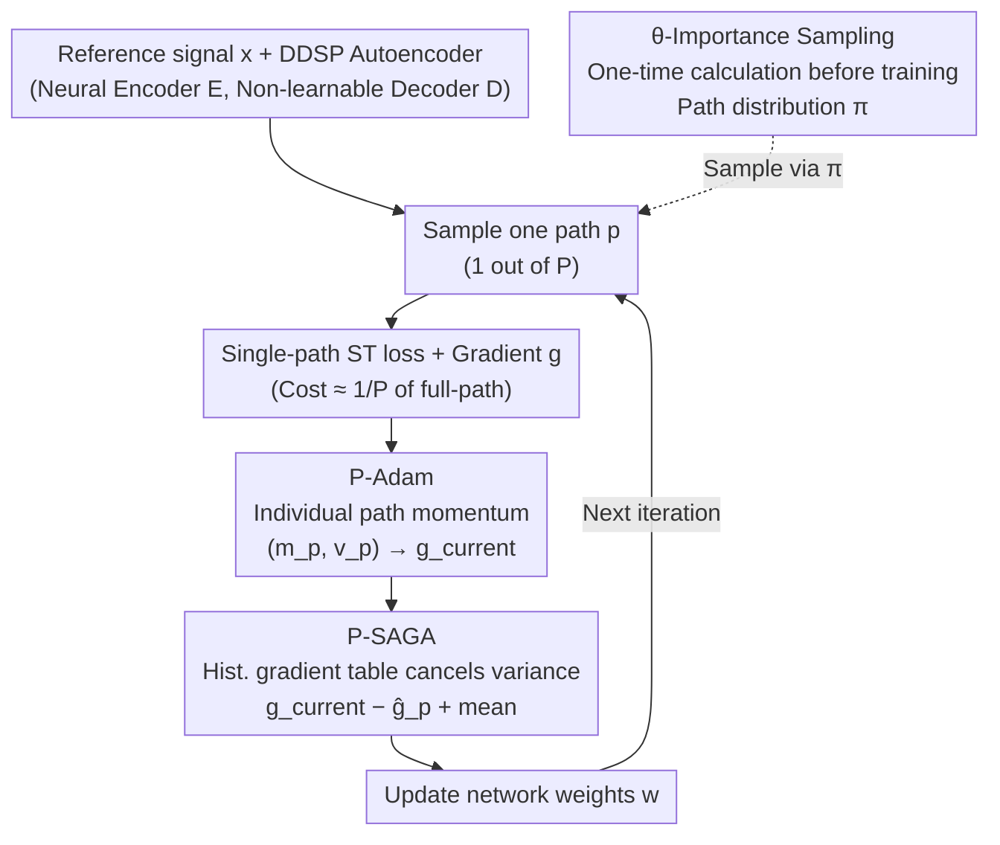

# SCRAPL: Scattering Transform with Random Paths for Machine Learning

**Conference**: ICLR 2026  
**arXiv**: [2602.11145](https://arxiv.org/abs/2602.11145)  
**Code**: Yes (Python package, [Project Website](https://christhetree.github.io/scrapl/))  
**Area**: Signal Processing / Time Series  
**Keywords**: Scattering Transform, Random Path Sampling, DDSP, Importance Sampling, Variance Reduction

## TL;DR

Addressing the high computational cost of the multivariate scattering transform (ST) as a differentiable loss function due to the large number of paths $P$, the authors propose SCRAPL. By randomly sampling only one path per step and employing three variance reduction techniques—P-Adam (Path-adaptive momentum), P-SAGA (Path-stochastic average gradient), and $\theta$-importance sampling—to stabilize gradients, SCRAPL achieves Pareto optimality. It reaches nearly the same accuracy as full-path ST at a low computational cost comparable to MSS in unsupervised sound matching tasks.

## Background & Motivation

**Background** The scattering transform (ST) is a wavelet-based nonlinear operator that decomposes high-resolution inputs into low-resolution coefficients across multiple paths. ST distance has been validated by behavioral studies as a robust predictor of perceived auditory differences, and Joint Time-Frequency Scattering (JTFS) serves as an idealized model for the spectro-temporal receptive fields of the human auditory cortex. This positions ST distance as a theoretically optimal perceptual loss function for fields like audio generation and deep inverse problems.

**Limitations of Prior Work** Theoretical advantages are hindered by practical infeasibility. JTFS contains hundreds of paths, each involving a multivariate wavelet convolution; calculating forward and backward propagation for all $P$ paths is extremely expensive (approximately $P$ times the cost of a single path). For instance, in granular synthesizer matching experiments, full JTFS training is 25 times slower than Multi-Scale Spectral (MSS) loss. Consequently, ST remains almost unusable in practical neural network training. Conversely, while MSS is computationally efficient, its gradients become uninformative when there is time misalignment between input and output or when the synthesizer involves spectro-temporal modulation—rendering it unable to replace ST.

**Key Challenge** The fundamental conflict between the quality advantages of ST loss and its prohibitive computational cost. Naive random path sampling (computing only one path per step) can reduce computation by a factor of $P$, but the resulting sampling variance is too high for training to converge.

**Key Insight** ST loss is essentially the sum of $P$ path losses (a finite-sum structure), which perfectly matches the classical finite-sum scenario in stochastic optimization. Therefore, variance reduction techniques like SAGA can be adapted. However, paths are not independent and identically distributed (different paths correspond to different spectro-temporal modulation modes), so standard algorithms cannot be applied directly.

**Core Idea** Transform the tree structure of the scattering transform into a stochastic optimization problem, utilizing architecture-aware variance reduction techniques to enable stable convergence even when calculating only one path per step.

## Method

### Overall Architecture

SCRAPL replaces the full-path ST loss within standard neural network training loops: at each step, only one path is randomly sampled from $P$ paths. Only the loss and gradient for that path are calculated, reducing the per-step cost to approximately $1/P$ of the full path. To compensate for the high variance of single-path gradients, three complementary optimization techniques are introduced. $\theta$-importance sampling calculates a non-uniform path sampling distribution $\pi$ once **before** training (ensuring informative paths are sampled more frequently). The other two operate at **every step**: P-Adam maintains individual momentum for each path to counter gradient scale disparities, and P-SAGA uses a historical gradient table to explicitly cancel the variance of single-path sampling. Combined, these allow "one path per step" to achieve stable convergence similar to full-path training.

### Key Designs

**1. P-Adam: Individual momentum per path to counter gradient scale disparities**

The primary reason naive random path sampling fails to converge is the "contamination" of moment estimation in standard Adam. Adam uses exponential moving averages to smooth gradients $(m, v)$ over consecutive iterations, implicitly assuming that adjacent steps observe gradients from the same distribution. However, SCRAPL samples a random path at each step, and different paths—corresponding to different spectro-temporal modulation scales—have vastly different gradient distributions. Mixing them into the same $(m, v)$ set causes unstable update directions. P-Adam maintains $(m_p, v_p)$ for each path $p$, updating them only when that specific path is sampled. Crucially, the decay coefficients adapt based on the time interval since the path was last sampled: $(k-\tau_p)/P$ (where $\tau_p$ is the last step path $p$ was sampled and $P$ is the total paths) is used to adjust exponential decay. Longer intervals lead to faster decay to prevent stale historical moments from polluting current updates. Bias correction indices are similarly changed from $\beta^k$ to $\beta^{k/P}$ to match the cadence of "one sample every $P$ steps" on average.

**2. P-SAGA: Gradient table to explicitly cancel single-path sampling variance**

High variance in single-path sampling stems from the large discrepancy between gradients of different paths; using one sample to estimate the sum of all paths introduces significant noise. Since ST loss is a finite-sum of $P$ path losses, it mirrors the scenario where SAGA accelerates SGD. SCRAPL translates SAGA to the path dimension rather than the sample dimension: it maintains the most recent P-Adam update value $\hat g_p$ for every path and the set of visited paths $\Gamma$. The actual update for the current step is:

$$g_{\text{used}} = \hat g_{p} - \hat g_{p}^{\text{old}} + \frac{1}{|\Gamma|}\sum_{q\in\Gamma}\hat g_q,$$

representing "current path new gradient − path's stored old gradient + mean gradient of all visited paths." The difference between the first two terms captures the path's incremental change relative to its history, while the third term adds the global average. In expectation, this still points toward the full-path gradient but cancels out the variance caused by inter-path differences. Unlike sample-wise SAGA, the storage table size here is proportional to the number of paths $P$ (hundreds) rather than the dataset size $N$, making the memory overhead negligible and the method practical.

**3. \theta-Importance Sampling: Biasing sampling budget toward informative paths**

Even with variance reduction, uniform sampling wastes budget on paths irrelevant to the current synthesizer—e.g., for a slow AM synthesizer, only low-frequency modulation paths carry useful gradients. $\theta$-IS calculates a non-uniform sampling distribution $\pi$ once before training. Utilizing the DDSP autoencoder structure (where decoder $D$ is a non-learnable but differentiable synthesizer and encoder $E_x$ is a neural network), the sensitivity of the ST loss to each synthesizer parameter dimension $u$ and path $p$ is calculated. Using Power Iteration of Hessian-vector products, the maximum eigenvalue of the loss landscape is approximated as "importance" $C_{u,p}$. Paths with higher curvature are more sensitive and informative. Aggregating $C_{u,p}$ across parameter dimensions yields the path probability $\pi_p$. This computation is parallelizable and performed only once, adding no overhead to the training phase.

### Loss & Training

The SCRAPL loss is an unbiased estimator of the full-path ST loss (proven in Proposition 3.1 via the chain rule and linearity of expectation). In the DDSP paradigm, the CNN encoder operates on the Constant-Q Transform (CQT), while the decoder is a non-learnable synthesizer. JTFS configuration: J=12, Q1=8, Q2=2, J_fr=3, Q_fr=2, totaling approximately 315-483 paths. Training utilizes AdamW without additional hyperparameters.

## Key Experimental Results

### Main Results (Granular Synthesizer Sound Matching)

| Method | Synth Param L1‰↓ | Comp. Cost (ms) | Note |
|------|----------------|-------------|------|
| Supervised P-loss | 20.5±0.2 | 0.5 | Theoretical upper bound |
| Full JTFS | 42.4 | 1731 | Best unsupervised, but extremely slow |
| **SCRAPL (+θ-IS)** | **65.7±4.2** | **89.8** | Accuracy near JTFS, speed near MSS |
| MSS Log+Linear | 259.1±1.7 | 19.1 | Completely fails to match slope |
| PANNs Wavegram | 158.9±4.4 | 29.3 | Only matches density |
| MS-CLAP | 165.9±8.2 | 75.6 | Only matches density |

### Ablation Study

| Config | Param L1‰↓ | Steps to Converge↓ | Val Curve Var↓ |
|------|---------|----------|-------------|
| SCRAPL (Sampling only) | 99.7±8.2 | 10906±1170 | 5.30±0.25 |
| +P-Adam | 87.4±14.5 | 8006±697 | 6.98±0.25 |
| +P-SAGA | 73.8±13.4 | 7296±683 | **3.46±0.15** |
| **+θ-IS** | **65.7±4.2** | **6014±642** | **3.27±0.12** |
| Full JTFS | 42.4 | 1442 | 5.66 |

### Key Findings

- SCRAPL (even without all optimization techniques) outperforms all non-JTFS methods, proving that random sampling of ST paths is a viable strategy in itself.
- P-SAGA is a critical component for variance reduction (statistically significant, p<0.01), and $\theta$-IS significantly improves total variation and convergence speed.
- In chirplet synthesizer experiments, $\theta$-IS reduces $\theta_{AM}$ parameter error by 25-55% and $\theta_{FM}$ by 14-80%, reducing convergence time by 23-50%.
- Experiments on the Roland TR-808 real drum machine show SCRAPL performs consistently across time alignment and mismatch (meso) scenarios, whereas MSS degrades significantly under mismatch—validating the time-invariance advantage of ST distance.
- Visualization of $\theta$-IS sampling probabilities confirms that the model learns different path distributions for different synthesizer configurations, with high-probability paths aligning with synthesizer parameter ranges.

## Highlights & Insights

- It transforms the scattering transform loss function, long considered "too expensive to be practical," into a viable training tool—a significant contribution for the audio/signal processing community, akin to the shift from batch gradient descent to SGD.
- The mathematical rigor is impressive: Proposition 3.1 proves unbiasedness, and the derivations for P-Adam and P-SAGA are clear and do not introduce extra hyperparameters.
- The design of $\theta$-Importance Sampling reflects "domain knowledge-guided sampling": instead of sampling all paths blindly, it allocates budget based on the curvature of the loss landscape relative to synthesizer parameters—combining signal processing insights with stochastic optimization.
- The experimental design deliberately uses non-deterministic synthesizers (granular synthesis with random microscopic time shifts), precisely where MSS gradients fail but ST distance remains effective—ensuring high alignment between motivation and empirical results.

## Limitations & Future Work

- Currently validated only in audio/DDSP scenarios; SCRAPL is theoretically applicable to computer vision (2D rotation-translation scattering) and other ST-using domains but lacks cross-validation.
- The initial calculation for $\theta$-IS requires Power Iteration of Hessian-vector products, which may still incur some overhead for large-scale models.
- SCRAPL failed to recover the decay portion of drum sounds in TR-808 experiments—possibly because low-frequency paths were undervalued in the sampling distribution, suggesting a need for adaptive updates of importance sampling (adjusting $\pi$ dynamically during training).
- Current theoretical analysis only proves unbiasedness; formal analysis of convergence rates, particularly in non-convex cases, is left for future work.

## Related Work & Insights

- **vs pGST (Pruned Graph Scattering Transform)**: pGST uses fixed feature selection (retaining ~10% of paths), while SCRAPL aggressively uses 1 path per step with variance reduction—the key difference is that pGST discards path info, while SCRAPL retains all info in expectation.
- **vs MSS (Multi-Scale Spectral loss)**: MSS is the DDSP standard but lacks informative gradients in non-deterministic or mismatched scenarios; SCRAPL makes JTFS (a theoretically grounded perceptual loss) usable within an MSS-like computational budget.
- **Transferability**: The strategy of "finite-sum stochastic optimization + architecture-aware importance sampling" can be generalized to any loss function with a tree-like decomposition structure.

## Rating

- Novelty: ⭐⭐⭐⭐ First systematic study of stochastic optimization for the scattering transform; the path-adaptive designs of P-Adam/P-SAGA are non-trivial adaptations.
- Experimental Thoroughness: ⭐⭐⭐⭐ Three DDSP tasks (granular/chirplet/TR-808) + detailed ablation + comparison with full-path + statistical significance tests.
- Writing Quality: ⭐⭐⭐⭐⭐ Mathematically rigorous (including full proofs), clear algorithm pseudocode, and information-dense charts.
- Value: ⭐⭐⭐⭐ Makes a class of high-quality but previously impractical perceptual loss functions accessible—directly impacting differentiable digital signal processing.

<!-- RELATED:START -->

## Related Papers

- [\[ICLR 2026\] FrontierCO: Real-World and Large-Scale Evaluation of Machine Learning Solvers for Combinatorial Optimization](frontierco_real-world_and_large-scale_evaluation_of_machine_learning_solvers_for.md)
- [\[ICLR 2026\] Jacobian Aligned Random Forests](jacobian_aligned_random_forests.md)
- [\[ICLR 2026\] Exploring Diverse Generation Paths via Inference-time Stiefel Activation Steering](exploring_diverse_generation_paths_via_inference-time_stiefel_activation_steerin.md)
- [\[ICLR 2026\] Rapid Training of Hamiltonian Graph Networks using Random Features](rapid_training_of_hamiltonian_graph_networks_using_random_features.md)
- [\[AAAI 2026\] pFed1BS: Personalized Federated Learning with Bidirectional Communication Compression via One-Bit Random Sketching](../../AAAI2026/optimization/personalized_federated_learning_with_bidirectional_communication_compression_via.md)

<!-- RELATED:END -->
