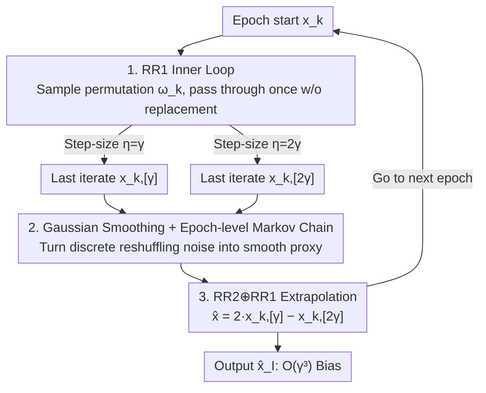

# Shuffling the Data, Stretching the Step-Size: Sharper Bias in Constant Step-Size SGD

**Conference**: ICLR 2026  
**OpenReview**: [https://openreview.net/forum?id=QQZ53UtXgf](https://openreview.net/forum?id=QQZ53UtXgf)  
**Area**: Optimization Theory / Stochastic Optimization  
**Keywords**: Constant Step-Size SGD, Random Reshuffling, Richardson-Romberg Extrapolation, Variational Inequalities, Bias Analysis

## TL;DR
This paper rigorously combines two classic heuristics—**Random Reshuffling (RR1)** and **Richardson–Romberg Extrapolation (RR2)**—into a unified algorithm for the first time. It proves that on quasi-strongly monotone Variational Inequality Problems (VIPs), their synergy can compress the asymptotic bias of constant step-size SGD from $O(\gamma)$ to $O(\gamma^3)$, while maintaining the $O(\gamma^2)$ mean squared error (MSE) provided by RR1. Both theory and experiments validate this "1+1>2" synergy.

## Background & Motivation

**Background**: From adversarial robustness and GAN training to multi-agent learning, many machine learning tasks can be formulated as finite-sum min–max optimization or more general **Variational Inequality Problems (VIP)**: find $x^*$ such that $\langle F(x^*), x-x^*\rangle \ge 0$, where $F(x)=\frac1n\sum_i F_i(x)$. The primary tool for solving these problems is the **constant step-size stochastic gradient method** due to its simple parameter tuning, ability to quickly erase initialization dependence, and fast early convergence.

**Limitations of Prior Work**: The fatal flaw of a constant step-size $\gamma$ is that **convergence stops at a non-zero error**. Even for strongly convex problems with a unique solution $x^*$, the final iteration of SGD typically satisfies
$$\mathrm{MSE}(\mathrm{SGD}) = \limsup_{k\to\infty} \mathbb{E}\|x_k-x^*\|^2 = O(\gamma), \quad \mathrm{bias}(\mathrm{SGD}) = \limsup_{k\to\infty}\|\mathbb{E}[x_k]-x^*\| = O(\gamma).$$
In other words, the iterations stabilize at a distance of approximately one step-size from the optimal solution, containing both variance and systematic bias.

**Key Challenge**: In practice, two independent heuristics are used to mitigate this. **RR1 (Sampling without replacement, visiting each sample exactly once per epoch)** can sharpen the MSE from $O(\gamma)$ to $O(\gamma^2)$. However, since $\mathrm{bias}(\hat x)\le\sqrt{\mathrm{MSE}(\hat x)}$ is only a trivial upper bound, **RR1 does not guarantee an improved bias order**—whether bias can be improved remained an open question. On the other hand, **RR2 extrapolation** runs the same algorithm with two step-sizes $\gamma$ and $2\gamma$ and then uses a linear combination to cancel the leading bias term: if $\mathrm{bias}(\gamma)=\Delta\gamma+O(\gamma^\kappa)$, then $x_{\mathrm{extr}}-x^* = 2x^\gamma_\infty - x^{2\gamma}_\infty - x^* = O(\gamma^\kappa)$. While RR2 alone can achieve $O(\gamma^{3/2})$ bias, it and RR1 have been "orthogonal" lines of research that were never rigorously merged.

**Goal**: To answer a natural question—what new phenomena emerge when **constant step-size, random reshuffling, and Richardson extrapolation** act simultaneously? Can the bias be pushed to the ideal $O(\gamma^3)$?

**Key Insight**: The difficulty lies in the fact that RR1 introduces a **biased, permutation-driven discrete noise oracle**, whereas existing extrapolation analyses almost always assume unbiased or continuously distributed perturbations, making the two incompatible. The authors observe that although reshuffling noise breaks time-homogeneity on a **single-step** scale, it precisely restores time-homogeneity on an **epoch scale**—the distribution of the next iteration after an epoch depends only on the epoch starting point and the sampled permutation, regardless of positions within the permutation.

**Core Idea**: View RR1 as a **time-homogeneous Markov chain** at the epoch level, establish LLN/CLT using continuous-state Markov chain tools, and then use spectral tensor techniques to prove that extrapolation can still debias under the biased oracle induced by reshuffling, thereby obtaining $O(\gamma^3)$ bias.

## Method

### Overall Architecture

The algorithm `SGD-RR2⊕RR1` (Algorithm 1) is a **two-layer structure**: the inner layer is SGD with random reshuffling (RR1), and the outer layer is Richardson–Romberg extrapolation (RR2). In each epoch $k$, the algorithm **parallely** executes a reshuffling pass for two step-sizes $\eta=\gamma$ and $\eta=2\gamma$: first, a random permutation $\omega_k$ over $[n]$ is sampled, and the inner loop updates are performed on $n$ samples in this order:
$$x^{i+1}_{k,[\eta]} = x^i_{k,[\eta]} - \eta\,\mathrm{PreProcess}\big(\mathrm{StochOracle}(x^i_{k,[\eta]}, \omega_k[i])\big),$$
where `StochOracle` returns the stochastic gradient in minimization problems or the operator value $F_{\omega_k[i]}$ in general VI, and `PreProcess` adds a **calibrated Gaussian smoothing** $U_k\sim\mathcal{N}(0,\gamma^2 n\sigma_*^2 I)$. The final iterations of each pass become the starting points for the next epoch; at the end of the epoch, the outer layer performs extrapolation using the final iterations of the two step-counts:
$$\hat x_{k+1} = 2\,x^n_{k,[\gamma]} - x^n_{k,[2\gamma]},$$
letting the leading $O(\gamma)$ bias of each trajectory cancel out. This workflow takes the common engineering practice of "low-level RR1 training + high-level RR2 black-box refinement" and turns it into a unified algorithm with theoretical guarantees for the first time.

### Key Designs

**1. RR1 Inner Loop: Suppressing High-Order Bias Terms via Sampling Without Replacement**

Addressing the pain point that constant step-size SGD bias stops at $O(\gamma)$, the first step is to characterize the convergence of RR1 alone. The authors prove (Theorem 4.1) that under $\lambda$-weak $\mu$-quasi-strong monotonicity, as long as $\gamma\le\gamma_{\max}$, the iterations of Perturbed SGD-RR1 **converge exponentially** to a neighborhood:
$$\mathbb{E}\|x^0_{k+1}-x^*\|^2 \le \Big(1-\tfrac{\gamma n\mu}{2}\Big)^{k+1}\|x^0_0-x^*\|^2 + \frac{8n\gamma^2 L_{\max}^2}{\mu^2}\sigma_*^2 + \frac{8\lambda}{\mu}.$$
In the quasi-strongly monotone case ($\lambda=0$), which already covers strong convexity, the neighborhood is $O(\gamma^2\sigma_*^2)$—an order of magnitude smaller than the $O(\gamma\sigma_*^2)$ neighborhood of SGD with replacement. More crucially, the refined characterization of bias (Lemma 4.5) is:
$$\mathrm{bias}(\text{Perturbed SGD-RR1}) = \limsup_{k\to\infty}\|\mathbb{E}[x_k]-x^*\| = C(x^*)\gamma + O(\gamma^3).$$
Compared to the $\mathrm{bias}(\mathrm{SGD})=C(x^*)\gamma+O(\gamma^{1.5})$ of classic SGD, RR1 **retains the same first-order term $C(x^*)\gamma$, but improves the high-order correction from $O(\gamma^{1.5})$ to $O(\gamma^3)$**. This structure of "invariant first-order term, cleaner high-order terms" is the prerequisite for extrapolation to work—as RR2 aims to cancel that exact $C(x^*)\gamma$ leading term, which is precisely proportional across the two step-sizes.

**2. Epoch-level Markov Chain Perspective + Gaussian Smoothing: Converting Discrete Reshuffling Noise into Analytical Smooth Proxies**

The trouble with reshuffling is that the cumulative gradient estimate after one epoch is **biased**, and the noise is **discrete and tied to the permutation**, making classic unbiased oracle Markov chain theory inapplicable. The authors' solution is two-fold. First, they introduce a calibrated Gaussian perturbation `PreProcess` to smooth the discrete reshuffling noise into a **well-behaved proxy that preserves variance, moments, and bias order** (in practice, this step is negligible for large datasets, but theoretically allows Markov chain tools to be applied). Second, they utilize the "single-step non-homogeneous, epoch homogeneous" phenomenon: by writing the endpoint mapping of one epoch as $x_{k+1}=H(x_k,\omega_k)+U_k$, $U_k\sim\mathcal{N}(0,\Sigma)$, the epoch-level sequence $(x_k)_{k\ge0}$ becomes a **time-homogeneous Markov chain** with the transition kernel:
$$P(x,A) = \frac{1}{n!}\sum_{\omega\in S_n}\int_A \phi\big(y; H(x,\omega), \Sigma\big)\,dy.$$
By verifying irreducibility, aperiodicity, and positive Harris recurrence, the authors prove that this chain has a **unique invariant distribution $\pi_\gamma$**, converges geometrically under total variation (Theorem 4.3), and further establish the **Law of Large Numbers (LLN) and Central Limit Theorem (CLT)** for epoch iterations using the Birkhoff–Khinchin ergodic theorem (Theorem 4.4):
$$\frac{1}{T}\sum_{t=0}^{T-1}\ell(x_t)\xrightarrow{a.s.}\mathbb{E}_{x\sim\pi_\gamma}[\ell(x)], \quad T^{-1/2}\sum_{t=0}^{T-1}\big(\ell(x_t)-\mathbb{E}_{\pi_\gamma}[\ell(x)]\big)\xrightarrow{d}\mathcal{N}(0,\sigma^2_{\pi_\gamma}(\ell)).$$
This Markov chain characterization not only provides geometric ergodicity but also allows consistent estimation of statistics along the trajectory—the theoretical foundation for upgrading extrapolation from an "empirical trick" to a "debiasing tool with asymptotic guarantees."

**3. RR2⊕RR1 Synergy: Cubic Debiasing Under Biased Oracles via Spectral Analysis**

With the bias expansion of RR1 being $C(x^*)\gamma+O(\gamma^3)$, extrapolation can precisely cancel the leading term. The difficulty is that the oracle induced by reshuffling is **biased**, causing standard extrapolation analysis (assuming unbiased/continuous perturbations) to fail. The authors overcome this using two techniques beyond direct generalization: the first is a **spectral study of the full-pass operator** (Lemma F.2), which relates the RR1 full-pass mapping to the multi-step extragradient literature and requires non-trivial handling of spectral properties across permutations; the second is a **combinatorial lemma** (Lemma E.2) to bound the **fourth moments** of finite-sum subsets under sampling without replacement, which is significantly more complex than in the sampling with replacement case. Finally (Theorem 4.6), the algorithm output satisfies:
$$\text{Last-iterate:}\ \|\mathbb{E}[x_k]-x^*\| \le c(1-\rho)^k + O(\gamma^3), \quad \text{Averaged:}\ \Big\|\mathbb{E}\big[\tfrac{1}{k}\textstyle\sum_{m=1}^k x_m\big]-x^*\Big\| \le \frac{c/\rho}{k}+O(\gamma^3),$$
where $\rho\in(0,1)$ and $c<\infty$. This is the **first $O(\gamma^3)$ bias guarantee on structured non-monotone VIPs**: the combined method strictly outperforms either heuristic used alone (RR1 alone has $O(\gamma)$ bias; RR2 alone has $O(\gamma^{1.5})$), while simultaneously preserving the $O(\gamma^2)$ MSE brought by RR1.

### Loss & Training

The algorithm does not introduce new loss functions, only modifies sampling and extrapolation strategies. The key hyperparameter is the step-size $\gamma\le\gamma_{\max}$, where $\gamma_{\max}=\min\big\{\tfrac{1}{3nL_{\max}}, \tfrac{\sqrt{1+6\mu^2 L_{\max}^2}-1}{12nL_{\max}^2}\big\}$; the Gaussian smoothing variance is calibrated at $\gamma^2 n\sigma_*^2$, linked to the second moment of the gradient at the solution $\sigma_*^2=\frac1n\sum_i\|F_i(x^*)\|^2$. Extrapolation can be implemented in two ways: extrapolation of last iterates at epoch end (line 9, theoretically preferred), or extrapolation of epoch averages (line 10, Polyak–Ruppert style, superior variance).

## Key Experimental Results

Experiments focus on the strongly monotone setting, comparing four variants on two-player zero-sum games (strongly convex–strongly concave quadratic forms)—classic SGDA with replacement, SGDA-RR1, SGDA-RR2, and the combination SGDA-(RR2+RR1). Relative error $\log\big(\|x_k-x^*\|^2/\|x_0-x^*\|^2\big)$ is reported as the average of 5 trials.

### Main Results: Comparison of Relative Errors Across Heuristics

| Condition Number $\kappa=L/\mu$ | Algorithm Variant | Convergence Behavior | Terminal Relative Error (Magnitude) |
|------|------|------|------|
| $\kappa=1$ | SGDA / RR1 / RR2 / **(RR2+RR1)** | Linear convergence to neighborhood | RR2+RR1 has smallest neighborhood |
| $\kappa=5$ | Same as above | Same as above | RR2+RR1 significantly smaller |
| $\kappa=10$ | Same as above | Slower convergence, consistent trend | RR2+RR1 reaches $\sim10^{-8}$, superior to others |

Core observation (Figure 2): The combined method RR2⊕RR1 **converges linearly to a smaller neighborhood of the solution**. Even using only the last iterate, the combined method achieves smaller relative error than SGDA / RR1 / RR2 alone, validating the theoretical conclusion that Algorithm 1 improves bias.

### Ablation Study: CLT Concentration Verification

| Configuration | Observation | Phenomenon |
|------|------|------|
| $T=100$ | Histogram of $\frac{1}{\sqrt T}\sum_t f_t$ | Concentrated around game value 0, but distribution is wider |
| $T=500$ | Same as above | Concentration improves |
| $T=1000$ | Same as above | Most concentrated, approaching true value 0 |
| $\gamma=0.1$ vs $\gamma=0.001$ ($T=500$) | Step-size effect | Small step-size $\gamma=0.001$ shows significantly higher concentration |

This set of experiments (Figure 3) directly validates the CLT in Theorem 4.4: the normalized average evaluations become increasingly concentrated around the game value as the number of iterations $T$ increases, and concentration is higher with smaller step-sizes, consistent with the asymptotic normality characterization under $\sqrt T$ scaling.

### Key Findings
- **The synergistic effect is real**: The combined method is not just a "stacking of two tricks" but pushes the bias order from $O(\gamma)$ (RR1) / $O(\gamma^{3/2})$ (RR2) when used alone to $O(\gamma^3)$, with condition number dependence matching vanilla SGDA (unlike previous work such as Emmanouilidis 2024, where the SEG variant had worse condition number dependence).
- **Last iterate is sufficient**: Although the theory prefers last iterates, experiments show that even with the last iterate, the combined method outperforms other variants—indicating that the improvement comes from the bias itself rather than averaging.
- **Smaller step-sizes lead to higher concentration**: CLT concentration is sensitive to step-size; $\gamma=0.001$ is noticeably tighter than $\gamma=0.1$, aligning with the intuition of constant step-size methods: "small step-size for small bias."

## Highlights & Insights
- **"Epoch-level homogeneity" is the masterstroke**: Reshuffling breaks time-homogeneity at the single-step scale. However, the authors keenly observed that after a full reshuffled pass, the distribution depends only on the starting point and permutation, turning the chaotic discrete noise into a clean time-homogeneous Markov chain at the epoch scale—this shift in perspective is key to the entire analysis.
- **"Harmless debiasing" of Gaussian smoothing**: Using calibrated Gaussian perturbations to turn discrete permutation noise into a continuous smooth proxy—while maintaining variance, moments, and bias order—is a clever bridge. It is "introduced to enable the tools but does not change the conclusion." The paper also notes this step can be omitted in practice for large datasets.
- **Transferability**: Designing "low-level reshuffled training + high-level extrapolation refinement" as a guaranteed two-layer algorithm provides a paradigm that can be extended to Q-learning, two-timescale stochastic approximation, and other scenarios using constant step-sizes; the toolbox of Markov chains + spectral analysis + high-order moment bounds can be reused for analyzing other biased oracles.

## Limitations & Future Work
- **Precise dependency of Gaussian smoothing is unclear**: The exact dependency of perturbation variance on dataset size is left for future work; the authors only provide empirical evidence that the impact is negligible in practice and a brief sketch for omitting the step.
- **Theoretically oriented experiments**: Main experiments are conducted on synthetic strongly monotone quadratic games. Although ablation on Wasserstein GAN is mentioned in the appendix, end-to-end validation on large-scale real-world deep learning tasks is missing.
- **Threshold for assumptions**: Requires Lipschitz continuity, $\lambda$-weak $\mu$-quasi-strong monotonicity, and finite second/fourth moments at the solution; the strongest $O(\gamma^3)$ bias conclusion only holds under quasi-strong monotonicity ($\lambda=0$), while weak monotonicity ($\lambda>0$) still leaves an uncancelable $8\lambda/\mu$ term.
- **Future directions**: Extending the combined framework to adaptive step-sizes, momentum methods, or directly handling discrete reshuffling noise without adding Gaussian smoothing are natural extensions.

## Related Work & Insights
- **vs Emmanouilidis et al. (2024)**: Previous work used RR1 only with SEG as a baseline on strongly monotone $F$, yielding $O(\gamma+\gamma^3)$ bias (first-order term remains), with worse condition number dependence than vanilla-SEG. Ours uses RR1⊕RR2 with SGDA as a baseline, relaxes to quasi-strong monotonicity, and achieves $O(\gamma^3)$ bias (leading term canceled) with condition numbers matching vanilla-SGDA—shifting the mechanism from "EG structure + RR1" to "Bias Cancellation (RR1⊕RR2)."
- **vs Vlatakis-Gkaragkounis et al. (2024)**: They used RR2 alone on VIPs to get $O(\gamma^{3/2})$ bias (their claimed $O(\gamma^2)$ depends on additional noise assumptions not met here). This paper proves that stacking RR1 can push this to $O(\gamma^3)$, strictly surpassing extrapolation on its own.
- **vs Classic Extrapolation (Dieuleveut 2020, etc.)**: These works assume unbiased or continuous perturbation oracles, failing to cover the discrete biased noise induced by reshuffling; this paper specifically handles this biased oracle using Gaussian smoothing + spectral tensor techniques, filling the gap.

## Rating
- Novelty: ⭐⭐⭐⭐⭐ First rigorous proof of RR1 and RR2 synergy on non-monotone VIPs, obtaining the first $O(\gamma^3)$ bias guarantee.
- Experimental Thoroughness: ⭐⭐⭐ Solid validation on synthetic games matching theory, but lacks large-scale real-world tasks.
- Writing Quality: ⭐⭐⭐⭐ Motivation progresses logically, with clear explanations for theorems and intuition (epoch homogeneity, bias cancellation).
- Value: ⭐⭐⭐⭐ Bridges the gap from "practice heuristic → provable improvement" for constant step-size stochastic methods; the toolbox is reusable.

<!-- RELATED:START -->

## Related Papers

- [\[ICLR 2026\] Fast Frank–Wolfe Algorithms with Adaptive Bregman Step-Size for Weakly Convex Functions](fast_frankwolfe_algorithms_with_adaptive_bregman_step-size_for_weakly_convex_fun.md)
- [\[ICML 2026\] Adaptive Sharpness-Aware Minimization with a Polyak-type Step size: A Theory-Grounded Scheduler](../../ICML2026/optimization/adaptive_sharpness-aware_minimization_with_a_polyak-type_step_size_a_theory-grou.md)
- [\[ICLR 2026\] High-dimensional limit theorems for SGD: Momentum and Adaptive Step-sizes](high-dimensional_limit_theorems_for_sgd_momentum_and_adaptive_step-sizes.md)
- [\[ICML 2026\] Gradient Descent with Large Step Size Restores Symmetry in Deep Linear Networks with Multi-Pathway](../../ICML2026/optimization/gradient_descent_with_large_step_size_restores_symmetry_in_deep_linear_networks_.md)
- [\[ICLR 2026\] Seesaw: Accelerating Training by Balancing Learning Rate and Batch Size Scheduling](seesaw_accelerating_training_by_balancing_batch_size_and_learning_rate_schedulin.md)

<!-- RELATED:END -->
