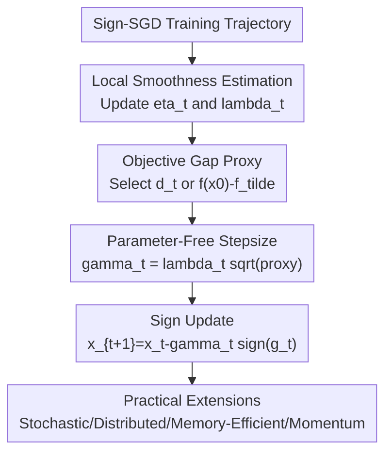

# Sign-SGD via Parameter-Free Optimization

**Conference**: ICLR2026  
**OpenReview**: [https://openreview.net/forum?id=yDLD3D95w3](https://openreview.net/forum?id=yDLD3D95w3)  
**Code**: https://github.com/brain-lab-research/ALIAS  
**Area**: optimization  
**Keywords**: Parameter-free optimization, Sign-SGD, Adaptive stepsize, LLM training, Gradient compression  

## TL;DR

This paper proposes ALIAS, a series of parameter-free Sign-SGD algorithms that eliminate the need for manual learning rate tuning. By estimating the objective gap and local smoothness constants per iteration, ALIAS automatically determines sign update stepsizes. It matches or exceeds tuned Sign-SGD and AdamW across LLaMA pre-training, Swin fine-tuning, and various benchmarks, significantly reducing the total computational cost associated with learning rate grid searches.

## Background & Motivation

**Background**: The appeal of Sign-SGD stems from two directions. In distributed training, workers transmit only gradient signs for majority-vote aggregation, significantly compressing communication. In single-machine large model training, Sign-SGD maintains a lighter optimizer state than AdamW as it avoids storing first and second-moment estimates. As LLM and vision model scales increase, this "direction-only, statistics-free" optimizer has regained practical relevance.

**Limitations of Prior Work**: The actual performance of Sign-SGD is highly dependent on the stepsize $\gamma$. Classical theory for $\ell_\infty$-norm smooth objective functions suggests the average gradient 1-norm follows:

$$
\frac{1}{T}\sum_{t=0}^{T-1}\|\nabla f(x_t)\|_1 \leq \frac{\Delta^*}{\gamma T} + \frac{\gamma L_\infty}{2},
$$

where $\Delta^*=f(x_0)-f(x^*)$ and $L_\infty$ is the smoothness constant. The optimal stepsize $\gamma\propto \sqrt{\Delta^*/(L_\infty T)}$ requires knowledge of both quantities, which are unknown in deep learning. Specifically, $f(x^*)$ and local smoothness vary during training, making pre-specified values unreliable.

**Key Challenge**: While Sign-SGD aims to reduce memory and communication costs, the requirement for expensive grid searches for the learning rate offsets these savings. This is particularly problematic in LLM pre-training, where a single incorrect learning rate can waste significant GPU hours, obscuring whether sign-based optimizers actually save resources.

**Goal**: The authors aim to construct a parameter-free Sign-SGD that does not rely on prior knowledge of $\Delta^*$ or $L_\infty$, requires no restarts or additional searches, and covers deterministic, stochastic, and distributed settings while maintaining performance and memory advantages.

**Key Insight**: Instead of applying general parameter-free methods to SGD, the paper focuses on the two critical unknowns in Sign-SGD theory. The numerator $\Delta^*$ is replaced by cumulative descent evidence or a known lower bound, while the denominator $L_\infty$ is replaced by a local smoothness estimate derived from adjacent gradient changes and distances. Consequently, the stepsize is "bootstrapped" from the training trajectory.

**Core Idea**: Replace unknown constants in the optimal Sign-SGD stepsize with per-iteration proxies for $\Delta^*$ and local $L_\infty$, allowing sign updates to automatically achieve training dynamics comparable to tuned learning rates.

## Method

### Overall Architecture

The primary algorithm is ALIAS (Automatic Local per-Iteration Approximation of the Stepsize). It executes the basic Sign-SGD update $x_{t+1}=x_t-\gamma_t\operatorname{sign}(\nabla f(x_t))$, but replaces the fixed $\gamma_t$ with an auto-calculated value. In each iteration, the gradient is obtained, the local smoothness accumulator $\eta_t$ is updated, an objective gap proxy $d_t$ or $f(x_0)-\tilde f$ is selected, and the step is taken with $\gamma_t=\lambda_t\sqrt{d_t}$ or $\gamma_t=\lambda_t\sqrt{f(x_0)-\tilde f}$, where $\lambda_t=1/\sqrt{\eta_t}$.

ALIAS is presented as a suite of variants: the base version provides the theoretical core; the stochastic version uses sampled gradient differences; the distributed version retains sign aggregation; the memory-efficient version restores low-memory advantages by storing only signs and extrema; and the Adam-style momentum version combines momentum with sign updates for practical deep learning.

### Key Designs

**1. Local Smoothness Estimation: Accumulating $L_\infty$ from the Trajectory**

The optimal stepsize denominator depends on $L_\infty$. ALIAS observes adjacent gradient changes: if large gradient changes occur over small distances, local curvature is high and the stepsize should shrink. The base version uses:

$$
\eta_t=\eta_{t-1}+\frac{\|\nabla f(x_t)-\nabla f(x_{t-1})\|_1}{\|x_t-x_{t-1}\|_\infty},\qquad \lambda_t=\frac{1}{\sqrt{\eta_t}}.
$$

Similar to AdaGrad-Norm, this accumulates historical local variations rather than re-estimating an isolated $L_\infty$, naturally increasing conservatism as training progresses.

**2. Objective Gap Proxy: Replacing $f(x_0)-f(x^*)$ with Descent Evidence**

Two options are provided for the numerator $\Delta^*$. Option I starts with a small estimate $d_0$ and constructs evidence from inner products of gradients and previous sign directions:

$$
\tilde d_t=\sum_{i=0}^{t-1}\gamma_i\langle \nabla f(x_{i+1}),\operatorname{sign}(\nabla f(x_i))\rangle,
\qquad d_t=\max(d_{t-1},\tilde d_t).
$$

Option II uses a natural lower bound (e.g., $\tilde f=0$ for loss), setting the proxy to $f(x_0)-\tilde f$. In practice, Option II is often sufficient as adaptation to $L_\infty$ is typically more critical than adaptation to $\Delta^*$.

**3. Stochastic and Distributed Extensions**

For stochastic gradients, the $L_\infty$ proxy is updated using differences between stochastic realizations. Theoretical analysis handles the dependencies by using a subsequent realization to measure local change. The distributed version utilizes Sign-SGD's inherent advantage where nodes transmit signs for majority voting, showing that parameter-free stepsize estimation is compatible with sign-based communication.

**4. Low Memory and Momentum Variants**

To avoid storing full gradients as required by the base version, "memory-efficient ALIAS" swaps norm structures:

$$
\eta_t=\eta_{t-1}+\frac{\|\nabla f(x_t)-\nabla f(x_{t-1})\|_\infty}{\|x_t-x_{t-1}\|_1}
$$

By storing only the previous gradient's extrema to approximate $\|\nabla f(x_t)-\nabla f(x_{t-1})\|_\infty$ as an upper bound, the extra state is reduced to two scalars and one sign vector. Additionally, the "ALIAS Adam version" combines sign descent with Adam-style momentum and weight decay, demonstrating how the parameter-free scale can be embedded into modern training recipes.

### Loss & Training

Theoretical analysis focuses on $\min_{x\in\mathbb{R}^d} f(x)$, evaluating the average gradient 1-norm $\frac{1}{T}\sum_t\|\nabla f(x_t)\|_1$. Deterministic analysis assumes $\ell_\infty$-smoothness, convexity, and a finite lower bound. Stochastic analysis assumes unbiased gradients with bounded coordinate variance.

Deep learning experiments use LLaMA pre-training (130M, 350M parameters) on the C4 dataset and Swin Transformer fine-tuning on Tiny ImageNet. Baselines include tuned AdamW, Prodigy, DOG, and D-Adaptation. ALIAS Adam version incorporates sign descent with momentum, weight decay, and optional cosine scheduling to compare against state-of-the-art tuned baselines.

## Key Experimental Results

### Main Results

| Task | Method | Tuned LR/Schedule | Metric | Results |
|------|------|--------------------|------|------|
| LLaMA 130M | SIGN-SGD (wd, lr, cosine) | Yes | Val Loss / PPL | 2.980 / 19.693 |
| LLaMA 130M | ALIAS (wd) | No | Val Loss / PPL | 3.006 / 20.169 |
| LLaMA 130M | AdamW (wd, beta, lr, cosine) | Yes | Val Loss / PPL | 2.929 / 18.698 |
| LLaMA 130M | Prodigy (wd, beta, cosine) | Partial | Val Loss / PPL | 2.930 / 18.727 |
| LLaMA 130M | ALIAS Adam version | Partial | Val Loss / PPL | 2.918 / 18.504 |
| LLaMA 350M | SIGN-SGD (wd, lr, cosine) | Yes | Val Loss / PPL | 2.819 / 16.760 |
| LLaMA 350M | ALIAS (wd) | No | Val Loss / PPL | 2.821 / 16.793 |
| LLaMA 350M | ALIAS Adam version | Partial | Val Loss / PPL | 2.707 / 14.984 |

Base ALIAS matches tuned Sign-SGD closely, while ALIAS Adam version outperforms AdamW and Prodigy.

| Task | Method | Metric | Result |
|------|------|------|------|
| Swin-T Fine-tuning | SIGN-SGD (tuned) | Accuracy | 78.885 |
| Swin-T Fine-tuning | AdamW (tuned) | Accuracy | 77.612 |
| Swin-T Fine-tuning | ALIAS Adam (cosine) | Accuracy | 79.161 |
| ALGOPERF MRI | AdamW | SSIM | 0.723 |
| ALGOPERF MRI | ALIAS Adam | SSIM | 0.724 |

### Ablation Study

| Config | Key Metric (LLaMA 130M) | Notes |
|------|---------|------|
| SIGN-SGD (tuned) | 2.980 / 19.693 | Tuned baseline |
| ALIAS (base) | 3.006 / 20.169 | Parameter-free |
| memory-efficient ALIAS | 3.019 / 20.471 | Approx. smoothness via extrema |
| memory-efficient ALIAS | 0.41 GB Memory | Matches Sign-SGD overhead |
| ALIAS Adam version | 1.91 GB Memory | Strongest performance |

Sensitivity analysis confirms ALIAS is robust to the initial smoothness estimate $L_\infty$ and distance estimate $d_0$. Batch size ablation shows ALIAS maintains a stable gap vs tuned Sign-SGD even under increased gradient noise.

### Key Findings

- The base ALIAS achieves performance comparable to tuned Sign-SGD without manual learning rate search.
- ALIAS Adam version is the strongest engineering variant, outperforming AdamW and other parameter-free optimizers like Prodigy and MOMO.
- The memory-efficient version reduces overhead to the level of basic Sign-SGD (0.41 GB) with only minor perplexity degradation.
- Significant end-to-end speedups are achieved primarily by eliminating the grid search phase.

## Highlights & Insights

- **Theoretical-Practical Alignment**: The paper mapping Sign-SGD theory directly to per-iteration estimators for $\Delta^*$ and $L_\infty$ provides a grounded design for "automatic" learning rates.
- **Local Smoothness as a Driver**: Using adjacent gradient changes (local curvature) allows the learning rate schedule to emerge naturally from the training trajectory.
- **Addressing Memory Trade-offs**: The inclusion of a memory-efficient version acknowledges the conflict between high-fidelity curvature estimation and the low-memory goals of sign-based optimizers.
- **Practical Embedding**: Demonstrating that ALIAS scale estimation can be integrated into standard recipes (momentum, weight decay) makes the method a viable alternative for large-scale training.

## Limitations & Future Work

- Theoretical analysis is primarily convex, while neural networks are non-convex, leading to a gap between theory and LLM experiments.
- The memory-efficient version uses an upper-bound approximation for smoothness, which slightly underestimates the optimal stepsize and affects final performance.
- Stochastic theory necessitates increasing mini-batches for convergence to a stationary point, which was not implemented in the engineering benchmarks.
- Evaluation was conducted up to the 350M scale; behavior on multi-billion parameter models and large-scale distributed clusters requires further verification.

## Related Work & Insights

- **vs. original Sign-SGD**: ALIAS automates the manual stepsize $\gamma$, removing the reliance on expensive grid searches while maintaining compatibility with sign aggregation.
- **vs. AdamW**: ALIAS Adam version rivals AdamW performance while the sign-based core offers potential memory and communication benefits.
- **vs. AdaGrad-Norm**: While both use cumulative denominators, ALIAS specifically targets local smoothness ($L_\infty$) via gradient differences rather than just gradient norms.
- **Parameter-free context**: Compared to Prodigy and D-Adaptation, ALIAS focuses on the specific stepsize structure of sign-descent, making it more tailored for compressed optimization.

## Rating

- Novelty: ⭐⭐⭐⭐☆
- Experimental Thoroughness: ⭐⭐⭐⭐☆
- Writing Quality: ⭐⭐⭐⭐☆
- Value: ⭐⭐⭐⭐⭐

<!-- RELATED:START -->

## Related Papers

- [\[NeurIPS 2025\] Problem-Parameter-Free Decentralized Bilevel Optimization](../../NeurIPS2025/optimization/problem-parameter-free_decentralized_bilevel_optimization.md)
- [\[ICLR 2026\] Celo2: Towards Learned Optimization Free Lunch](celo2_towards_learned_optimization_free_lunch.md)
- [\[ICLR 2026\] Cutting the Skip: Training Residual-Free Transformers](cutting_the_skip_training_residual-free_transformers.md)
- [\[ICLR 2026\] DNT: a Deeply Normalized Transformer that can be trained by Momentum SGD](dnt_a_deeply_normalized_transformer_that_can_be_trained_by_momentum_sgd.md)
- [\[ICLR 2026\] Bayesian Parameter Shift Rules in Variational Quantum Eigensolvers](bayesian_parameter_shift_rules_in_variational_quantum_eigensolvers.md)

<!-- RELATED:END -->
