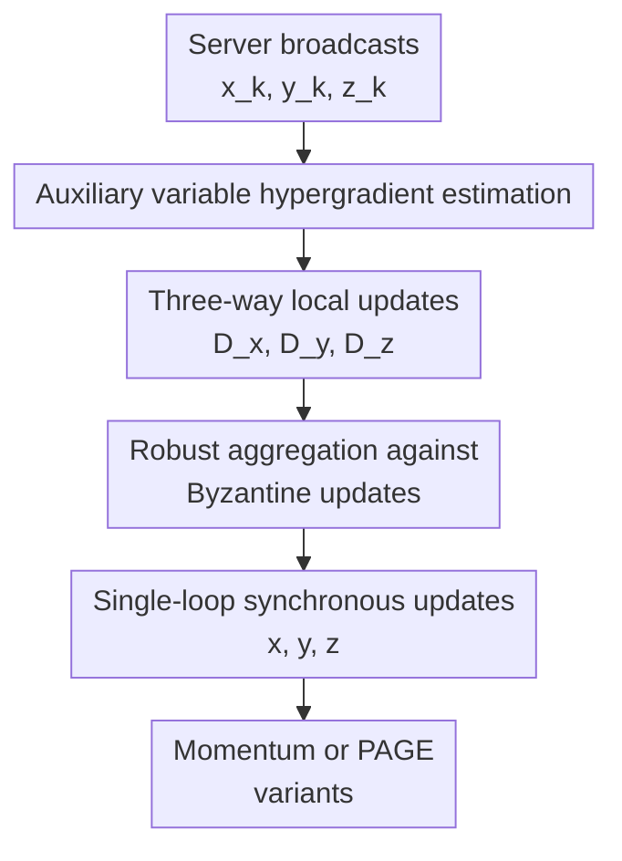

# Single-Loop Byzantine-Resilient Federated Bilevel Optimization

**Conference**: ICLR 2026  
**OpenReview**: [https://openreview.net/forum?id=AzaE6Dcz1C](https://openreview.net/forum?id=AzaE6Dcz1C)  
**Code**: None  
**Area**: Federated Bilevel Optimization / Byzantine-Robust Optimization  
**Keywords**: Federated Bilevel Optimization, Byzantine Robustness, Single-Loop Algorithm, Hypergradient Estimation, Robust Aggregation

## TL;DR
This paper investigates federated bilevel optimization in the presence of Byzantine clients. It first derives an asymptotic error lower bound determined by the heterogeneity of both upper and lower levels, then proposes the single-loop algorithm BR-FedBi and its Momentum/PAGE variants. These algorithms utilize auxiliary variables for hypergradient estimation combined with robust aggregation, theoretically achieving optimal Byzantine resilience or optimal sample complexity, and experimentally outperforming BILANTINE which requires sub-loops.

## Background & Motivation

**Background**: Federated Bilevel Optimization (FBO) adapts hierarchical learning problems to multi-client scenarios, such as federated meta-learning, hyperparameter optimization, and federated reinforcement learning. The objective is $\min_x \Phi(x)=\frac{1}{n}\sum_i f_i(x,y^*(x))$, where $y^*(x)$ solves the lower-level problem $\min_y \frac{1}{n}\sum_i g_i(x,y)$. The challenge lies in distributed communication and efficient hypergradient calculation.

**Limitations of Prior Work**: Existing robust federated learning methods mostly serve single-level optimization. Applying them to bilevel optimization introduces complications because global hypergradients involve global Hessian-inverse-vector products, and most relevant methods like BILANTINE rely on AID and sub-loops, requiring frequent communication that increases exposure to attackers.

**Key Challenge**: FBO requires accurate global hypergradients while Byzantine robustness demands stability against arbitrary malice. Data heterogeneity naturally causes gradient inconsistencies among honest clients. In bilevel structures, this error is amplified through lower-level solutions and Hessian terms.

**Goal**: The authors aim to establish the asymptotic error lower bound caused by Byzantine attacks in FBO and design a single-loop algorithm that maintains efficiency and reaches optimal robustness without sub-loops.

**Key Insight**: Leveraging SOBA-style single-loop optimization, the paper introduces an auxiliary variable $z$ to approximate the Hessian-inverse-vector product. This decomposes hypergradient estimation into three synchronous updates: upper-level $x$, lower-level $y$, and auxiliary variable $z$. All updates are passed through $(\alpha,c)$-robust aggregators.

**Core Idea**: Replace "inner sub-loops + frequent hypergradient communication" with an "$x/y/z$ three-variable single-loop + robust aggregation" approach. Use Momentum to cancel variance-related asymptotic error and PAGE to further reduce sample complexity.

## Method

### Overall Architecture

The server minimizes $\Phi_H(x)=\frac{1}{|H|}\sum_{i\in H} f_i(x,y^*(x))$ where $y^*(x)$ is the optimal solution for the honest lower-level objective $g_H(x,y)$. Up to a ratio $\alpha < 1/2$ of clients are Byzantine. BR-FedBi broadcasts $(x_k,y_k,z_k)$, honest clients compute updates for the three variables, and the server applies robust aggregation to each channel.

### Key Designs

**1. Auxiliary Variable Hypergradient Estimation**
The hypergradient is approximated using $z$ to solve the linear system $\nabla_{yy}g_H(x,y)z+\nabla_y f_H(x,y)=0$. Honest clients compute local quantities:
$$D_{x,i}=\nabla_{xy}G_i(x_k,y_k;\xi_i)z_k+\nabla_xF_i(x_k,y_k;\zeta_i)$$
$$D_{y,i}=\nabla_yG_i(x_k,y_k;\xi_i)$$
$$D_{z,i}=\nabla_{yy}G_i(x_k,y_k;\xi_i)z_k+\nabla_yF_i(x_k,y_k;\zeta_i)$$

**2. Three-way Robust Aggregation**
Byzantine clients can contaminate all update directions. BR-FedBi applies $AGG(\cdot)$ separately to $D_x$, $D_y$, and $D_z$:
$$x_{k+1}=x_k-\eta_x AGG(D_{x,1},...,D_{x,n})$$
$$y_{k+1}=y_k-\eta_y AGG(D_{y,1},...,D_{y,n})$$
$$z_{k+1}=z_k-\eta_z AGG(D_{z,1},...,D_{z,n})$$

**3. Lower Bound and Momentum Matching**
The paper establishes an ineradicable error lower bound $\Omega(\alpha^2(\delta_f^2+\delta_g^2))$. BR-FedBiM uses Polyak momentum to cancel stochastic variance, matching this lower bound and achieving optimal Byzantine resilience.

**4. PAGE Variant**
BR-FedBiP uses probabilistic gradient estimation to achieve $O(\epsilon^{-1.5})$ sample complexity, matching the best known complexity for expected stochastic bilevel optimization under mean-squared smoothness.

## Key Experimental Results

### Main Results

| Dataset / Setup | Aggregator | Method | ALIE | IPM | Worst | Conclusion |
|--------|------|------|------|------|------|------|
| MNIST Hetero | Median | BILANTINE | 73.74 | 46.02 | 46.02 | Baseline collapses under IPM |
| MNIST Hetero | Median | BR-FedBiP | 83.24 | 82.24 | 81.36 | Single-loop + PAGE is stable |
| MNIST Hetero | RFA | BILANTINE | 66.96 | 32.02 | 19.96 | Baseline nearly fails with RFA |
| MNIST Hetero | RFA | BR-FedBiM | 72.76 | 81.95 | 72.76 | Momentum variant has best worst-case |

### Ablation Study

| Config / Analysis | Key Metric | Description |
|------|---------|------|
| BR-FedBi vs BILANTINE Comm. | ~3 comm/epoch vs ~8 | Avoids inner-loop repeated communication |
| MNIST 200 epochs Total Time | BILANTINE ~6590-7701s; BR-FedBi ~3102-3139s | Wall-clock time roughly halved |

### Key Findings

- **Structural Robustness**: The "single-loop + three-way aggregation" design provides stable gains across various attackers and aggregators.
- **Resilience Matching**: BR-FedBiM consistently achieves the highest worst-case accuracy, matching the theoretical optimal Byzantine resilience.
- **Efficiency**: Reducing communication via single-loop design significantly lowers the wall-clock time compared to sub-loop methods like BILANTINE.

## Highlights & Insights

- **Optimal Resilience**: Establishes theoretical tightness by matching the upper bound of Momentum variants with the established FBO-specific lower bound.
- **Asymmetric Defense**: Protecting $x$, $y$, and $z$ channels separately ensures that corruption in lower-level or Hessian approximations does not contaminate the upper-level gradient.

## Limitations & Future Work

- Convergence analysis currently requires strong convexity of the lower-level problem.
- Large-scale models and diverse non-IID system dynamics remain areas for future evaluation.

## Related Work & Insights

- **vs BILANTINE**: BILANTINE uses AID/sub-loops; this work uses SOBA-style single-loop updates, reducing communication while achieving matching lower-bound resilience.
- **vs Byzantine-robust single-level FL**: This work demonstrates that bilevel problems require safeguarding nested variables ($y$ and $z$), not just the final gradient.

## Rating

- Novelty: ⭐⭐⭐⭐⭐
- Experimental Thoroughness: ⭐⭐⭐⭐
- Writing Quality: ⭐⭐⭐⭐
- Value: ⭐⭐⭐⭐⭐

## Related Papers

- [\[NeurIPS 2025\] A Single-Loop First-Order Algorithm for Linearly Constrained Bilevel Optimization](../../NeurIPS2025/optimization/a_single-loop_first-order_algorithm_for_linearly_constrained_bilevel_optimizatio.md)
- [\[ICLR 2026\] Byzantine-Robust Federated Learning with Learnable Aggregation Weights](byzantine-robust_federated_learning_with_learnable_aggregation_weights.md)
- [\[ICLR 2026\] Reducing Contextual Stochastic Bilevel Optimization via Structured Function Approximation](reducing_contextual_stochastic_bilevel_optimization_via_structured_function_appr.md)
- [\[ICLR 2026\] On the Surprising Effectiveness of a Single Global Merging in Decentralized Learning](on_the_surprising_effectiveness_of_a_single_global_merging_in_decentralized_lear.md)
- [\[ICML 2026\] Delayed Momentum Aggregation: Communication-efficient Byzantine-robust Federated Learning with Partial Participation](../../ICML2026/optimization/delayed_momentum_aggregation_communication-efficient_byzantine-robust_federated_.md)

<!-- RELATED:END -->

<!-- RELATED:START -->

## Related Papers

- [\[ICLR 2026\] Byzantine-Robust Federated Learning with Learnable Aggregation Weights](byzantine-robust_federated_learning_with_learnable_aggregation_weights.md)
- [\[ICLR 2026\] Bilevel Optimization with Lower-Level Uniform Convexity: Theory and Algorithm](bilevel_optimization_with_lower-level_uniform_convexity_theory_and_algorithm.md)
- [\[ICLR 2026\] Reducing Contextual Stochastic Bilevel Optimization via Structured Function Approximation](reducing_contextual_stochastic_bilevel_optimization_via_structured_function_appr.md)
- [\[ICLR 2026\] On the Surprising Effectiveness of a Single Global Merging in Decentralized Learning](on_the_surprising_effectiveness_of_a_single_global_merging_in_decentralized_lear.md)
- [\[ICLR 2026\] DeepAFL: Deep Analytic Federated Learning](deepafl_deep_analytic_federated_learning.md)

<!-- RELATED:END -->
