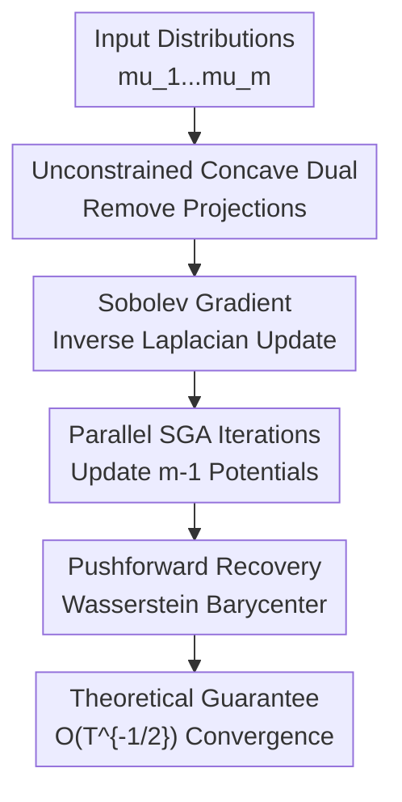

# Sobolev Gradient Ascent for Optimal Transport: Barycenter Optimization and Convergence Analysis

**Conference**: ICLR 2026  
**OpenReview**: [https://openreview.net/forum?id=IjL1xEoxXi](https://openreview.net/forum?id=IjL1xEoxXi)  
**Paper**: [OpenReview](https://openreview.net/forum?id=IjL1xEoxXi)  
**Code**: Supplementary Material  
**Area**: Optimal Transport / Barycenter Optimization  
**Keywords**: Wasserstein Barycenter, Sobolev Gradient Ascent, Unconstrained Dual, Exact Optimal Transport, Convergence Analysis  

## TL;DR

This paper reformulates the exact Wasserstein barycenter as an unconstrained concave dual problem and performs gradient ascent directly in the $\dot H^1$ Sobolev geometry. This approach eliminates expensive $c$-concavity projections while providing a global $O(T^{-1/2})$ convergence guarantee, matching the order of classical non-smooth convex optimization.

## Background & Motivation

**Background**: The Wasserstein barycenter is a natural generalization of the "average" in optimal transport: given multiple probability distributions $\mu_1,\ldots,\mu_m$ and weights $\alpha_i$, the goal is to find a distribution $\nu$ that minimizes the sum of weighted second-order Wasserstein distances to all input distributions. This concept is useful in image processing, shape analysis, video frame compression, measure-valued clustering, and scalable Bayesian inference because it preserves the geometric structure of distributions rather than merely performing coordinate-wise averaging in Euclidean vector space.

**Limitations of Prior Work**: The main difficulty lies in the high cost of computing the "exact barycenter." Linear programming formulations are theoretically straightforward but consumption of time and space is prohibitive on large grids. On the primal side, Wasserstein gradient descent requires computing multiple OT maps per iteration, which becomes heavy as the number of marginal distributions increases. Dual formulations for multi-marginal OT avoid some primal computations but introduce $O(m^2)$ constraints. Recent methods like WDHA perform well on exact barycenters, but their theoretical versions require expensive convex/smooth projections, while practical implementations replace projections with cheaper conjugate envelopes, leading to a gap between "provable algorithms" and "actual implementations."

**Key Challenge**: Kantorovich dual potentials are typically restricted to $c$-concave functions; otherwise, traditional derivations face issues with dual feasibility and convergence. However, projecting back to the $c$-concave set at every step is the primary source of both algorithmic and theoretical complexity. Existing exact barycenter methods are thus caught between two requirements: preserving the sharp geometry of exact OT and avoiding the high cost of maintaining dual feasibility.

**Goal**: The authors aim to answer a direct question: when computing 2D/3D exact Wasserstein barycenters on regular grids, is it possible to completely remove the $c$-concavity projection and use only simple first-order Sobolev gradient ascent while still proving global convergence? This objective involves three layers: finding an unconstrained concave dual for the barycenter, deriving computable $\dot H^1$ gradients, and extending subgradient rates from non-smooth convex optimization to this infinite-dimensional Sobolev space problem.

**Key Insight**: The paper starts with an observation from two-marginal OT: even if the potential $f$ is not $c$-concave, the first-order variation of the objective $I(f)=\int f d\mu+\int f^c d\nu$ still exists, and the gradient calculation only depends on $f^c$, where $f^{ccc}=f^c$. This implies that the double $c$-transform does not change the gradient direction but rather maintains the appearance of constraints. The authors generalize this observation to the barycenter dual, replacing "per-iteration projection" with "direct ascent in the unconstrained dual space."

**Core Idea**: Utilize an unconstrained concave dual combined with Sobolev inverse-Laplacian gradients to replace barycenter dual optimization requiring $c$-concavity projections.

## Method

### Overall Architecture

The method presented is not a neural network architecture but a reformulation of an optimization problem and its corresponding algorithm. The input consists of $m$ probability densities $\mu_1,\ldots,\mu_m$ defined on the same compact domain $\Omega$ and discretized on a regular grid; the output is their exact Wasserstein barycenter. The core process involves: rewriting the barycenter primal objective into an unconstrained concave maximization problem containing only $m-1$ dual potentials; calculating the $\dot H^1$ gradient for each potential; updating via the solution of a Poisson equation in each iteration; and finally recovering the barycenter using the pushforward measure induced by the learned dual potentials.

The original barycenter problem is:

$$
B(\nu)=\sum_{i=1}^{m}\frac{\alpha_i}{2}W_2^2(\mu_i,\nu),
$$

which requires minimization over the probability measure $\nu$. The key reformulation in this paper keeps only $f_1,\ldots,f_{m-1}$ and defines:

$$
f_{mix}=-\sum_{i=1}^{m-1}\frac{\alpha_i}{\alpha_m}f_i.
$$

Then, the barycenter is written as the following unconstrained dual maximization:

$$
D(f_1,\ldots,f_{m-1})=
\sum_{i=1}^{m-1}\alpha_i\int_{\Omega} f_i^c d\mu_i
+\alpha_m\int_{\Omega} f_{mix}^c d\mu_m.
$$

The "unconstrained" property is crucial: $f_i$ does not need to be projected to be $c$-concave in each iteration. The authors prove that $D$ is jointly concave with respect to all variables and exhibits strong duality with the primal barycenter problem when the input distributions are absolutely continuous. If $(\tilde f_1,\ldots,\tilde f_{m-1})$ is the optimal solution, the barycenter can be obtained by the pushforward of any marginal:

$$
\tilde\nu=(T_{\tilde f_i^c})_\#\mu_i=(T_{\tilde f_{mix}^c})_\#\mu_m.
$$

### Key Designs

**1. Unconstrained Concave Dual: Converting Barycenter from "Measure Minimization" to "Potential Maximization"**

Traditional exact barycenter calculations often handle $\nu$ in the primal measure space or maintain feasibility constraints in the dual space. The first step here is to push all dependence on the barycenter measure into the $c$-transform and optimize only $m-1$ potentials. The elegance of this reformulation is that the last potential is not an independent variable but is automatically determined by $f_{mix}=-\sum_i(\alpha_i/\alpha_m)f_i$, ensuring all marginals align at the same barycenter. 

This form directly inherits the geometric meaning of the Kantorovich dual: $f_i^c$ induces the transport map from $\mu_i$ to the barycenter, and $f_{mix}^c$ handles the $m$-th marginal. The authors further prove that $D$ is jointly concave and its optimal value equals the primal $\min_\nu B(\nu)$. Thus, the algorithm does not solve a regularized approximation or a heuristic but an equivalent concave dual of the exact Wasserstein barycenter.

**2. Removing $c$-concavity Projections: Exploiting $f^{ccc}=f^c$ to Maintain Gradient Invariance**

Many OT dual algorithms perform a double $c$-transform ($f\leftarrow f^{cc}$) after a gradient step to pull the potential back into the $c$-concave class. The problem is that this operation is not an orthogonal projection in the $\dot H^1$ sense, so it does not naturally provide contraction properties like $\|f^{cc}-g\|\le \|f-g\|$ found in standard projected gradient methods. This makes theoretical proofs awkward and adds an expensive computational step.

The key observation is that the gradient only depends on $f^c$, and for any continuous $f$, $f^{ccc}=f^c$. In other words, calculating the gradient after $f$ is transformed to $f^{cc}$ is consistent with calculating it directly from the original $f$ regarding the critical $c$-transform part. Consequently, the authors remove the constraints entirely, optimize the relaxed dual over continuous functions, and use strong duality to prove that this does not change the optimal value. This simplification is the most critical algorithmic contribution: it changes "projection for feasibility" to "unconstrained and provable dual."

**3. Sobolev Gradient: Using Poisson Equations to Transform Measure Residuals into Smooth Update Directions**

Standard $L^2$ gradients are often numerically unstable for OT problems because the residual is the difference between two pushforward densities; local spikes and grid noise enter the updates directly. Following the $\dot H^1$ geometry of Jacobs and Léger, the first variation is converted into a Sobolev gradient via Riesz representation. For two-marginal OT, the gradient is given by the Neumann Poisson problem:

$$
-\Delta g=\mu-(T_{f^c})_\#\nu,
\qquad \frac{\partial g}{\partial n}=0.
$$

In the barycenter dual, the first variation with respect to the $i$-th potential is:

$$
\delta D_{f_i}=-\alpha_i\left((T_{f_i^c})_\#\mu_i-(T_{f_{mix}^c})_\#\mu_m\right),
$$

so the Sobolev gradient is:

$$
\nabla_{f_i}D=(-\Delta)^{-1}\delta D_{f_i}.
$$

Intuitively, it compares the "result of pushing the $i$-th marginal to the current barycenter" with the "result of pushing the $m$-th marginal through the mixed potential to the current barycenter." Any inconsistency indicates the direction in which the potential should be adjusted. The inverse Laplacian acts as Sobolev smoothing on the residual, making the update direction more consistent with the geometric structure of the transport potential.

**4. Global Convergence Analysis: Extending Non-smooth Subgradient Rates to Barycenter Duals**

The SGA iteration is straightforward: in each round, update all $i=1,\ldots,m-1$ in parallel:

$$
f_i^{(t)}=f_i^{(t-1)}+\eta_{t-1}\nabla_{f_i}D(f_1^{(t-1)},\ldots,f_{m-1}^{(t-1)}).
$$

The challenge lies in proving it does not diverge without projections. The authors treat $D$ as a concave functional defined on the product Hilbert space $(\dot H^1)^{m-1}$ and apply the telescoping analysis for subgradient descent from non-smooth convex optimization. Provided the iterative trajectory remains continuous and the Sobolev gradient norm is bounded by $M$, an upper bound on the dual gap of the best iterate is obtained.

When the total number of iterations $T$ is fixed and the step size is constant $\eta\propto 1/(M\sqrt T)$, the paper derives:

$$
D(\tilde f)-D(f^{best})\le
M\left(\sum_{i=1}^{m-1}\|f_i^{(0)}-\tilde f_i\|_{\dot H^1}^2\right)^{1/2}\frac{1}{\sqrt T}.
$$

If $T$ is unknown and $\eta_t\propto 1/\sqrt t$ is used, an additional $\log T$ factor appears. This result signifies that the paper does not just report that "no projection works in experiments" but proves that the version without projection still has a global convergence rate on the exact barycenter dual, with the constant step size case matching the optimal order of classical Euclidean non-smooth convex optimization.

### Example Case

Consider the 2D synthetic experiment as a specific workflow. The inputs are 4 two-dimensional densities supported on different shapes, each discretized on a $1024\times1024$ grid, with weights such as $(1/4,1/6,1/4,1/3)$. Traditional exact methods either iterate on the barycenter measure side and repeatedly solve for OT maps or, like WDHA, maintain projection or envelope operations alongside dual updates.

The SGA approach is more direct: initialize $f_1, f_2, f_3$; let the 4th potential be $f_{mix}=-(\alpha_1f_1+\alpha_2f_2+\alpha_3f_3)/\alpha_4$. In each round, calculate the difference between $(T_{f_i^c})_\#\mu_i$ and $(T_{f_{mix}^c})_\#\mu_4$, solve 3 Poisson equations to get Sobolev gradients, and update the 3 potentials in parallel. After 300 rounds, the pushforward measure induced by these potentials serves as the barycenter estimate.

This example illustrates the algorithm's simplicity: heavy operations per round include the fast $c$-transform, pushforward, and FFT-based Poisson solver, with a complexity of $O(mn\log n)$ where $n$ is the grid size. There are no additional $c$-concavity projections and no $O(m^2)$ constraint graph structures. In the same 300 rounds, SGA achieves a lower barycenter functional value and is faster than WDHA, CWB, and DSB.

### Loss & Training

There is no neural network training loss; the optimization target is the unconstrained dual functional $D$ of the barycenter. Implementation-wise, each round requires: obtaining $f_i^c$ and $f_{mix}^c$ via fast $c$-transforms; calculating pushforward densities using the induced maps $T_h=id-\nabla h$; and solving Neumann Poisson equations for $\dot H^1$ gradients.

The paper analyzes two types of step sizes. If the total iteration count $T$ is known, a constant step size yields the $O(T^{-1/2})$ bound; in 2D synthetic experiments, $\eta_t=0.1$ is used. If $T$ is not fixed, annealing step sizes like $\eta_t=0.5/\sqrt t$ or $\eta_t=5\times10^{-3}/\sqrt t$ (for 3D interpolation) are used, though they theoretically add a $\log T$ factor. The appendix also provides an SGA-AdaGrad variant, which performs similarly to SGA in handwritten digit experiments.

## Key Experimental Results

### Main Results

| Scenario | Metric | SGA | WDHA | CWB | DSB |
|------|------|-----|------|-----|-----|
| 2D synthetic, weights $(2/3,0,0,1/3)$ | barycenter value $\times10^3$ ↓ | **3.917** | 3.940 | 4.202 | 3.926 |
| 2D synthetic, weights $(1/3,1/4,1/6,1/4)$ | barycenter value $\times10^3$ ↓ | **5.923** | 5.952 | 6.153 | 5.936 |
| 2D synthetic, weights $(0,0,1/3,2/3)$ | barycenter value $\times10^3$ ↓ | **1.646** | 1.649 | 1.821 | 1.648 |
| MNIST "2", 10 images ($500\times500$) | barycenter value ↓ | **$5.992\times10^{-3}$** | $6.049\times10^{-3}$ | $6.463\times10^{-3}$ | $6.021\times10^{-3}$ |
| Truncated Gaussian | $W_2^2$ to ground truth ↓ | **0.4636** | 20.3449 | 21.7867 | 0.4925 |

| Scenario | Metric | SGA | WDHA | CWB | DSB |
|------|------|-----|------|-----|-----|
| 2D synthetic, weights $(2/3,0,0,1/3)$ | Time (sec) ↓ | **298** | 625 | 1346 | 3643 |
| 2D synthetic, weights $(1/3,0,0,2/3)$ | Time (sec) ↓ | **221** | 569 | 1328 | 3679 |
| 2D synthetic, weights $(1/3,1/4,1/6,1/4)$ | Time (sec) ↓ | **700** | 1064 | 2290 | 5003 |
| MNIST "2" | Time (sec) ↓ | **406** | 415 | 430 | 670 |
| Truncated Gaussian | barycenter functional ↓ | 89.0074 | 102.0016 | 109.4954 | 89.0247 |

### Ablation Study

| Configuration | Key Metric | Description |
|------|---------|------|
| SGA parallel, constant step size | Lowest barycenter value in most 2D synthetic cases | Main algorithm; parallel update of all $m-1$ potentials, covered by theoretical convergence. |
| SGA annealing, $\eta_t=0.5/\sqrt t$ | Value 5.288 for $(1/4,1/6,1/4,1/3)$, better than WDHA 5.323 | Total $T$ not pre-set; theoretical $\log T$ overhead; some 300-round visual results not fully converged. |
| SGA-AdaGrad | Value $5.992\times10^{-3}$ on MNIST, 409 sec | Adaptive step size version; nearly identical precision to SGA. |
| WDHA | Diverges in 3D ball-cube interpolation with same step size | Shows removing projection in SGA does not sacrifice stability; SGA is more stable in 3D settings. |
| 2-marginal SGA residual $r_t$ | $\|\mu-(T_{f^c})_\#\nu\|_{\dot H^{-1}}$ drops from $t=100$ to $300$ | Appendix diagnostic supporting bounded gradients and convergence trends. |

### Key Findings

- SGA achieves the smallest barycenter functional value in nearly all 12 2D synthetic weight combinations while typically requiring half the time of WDHA, one-third of CWB, and one-seventh of DSB.
- Visually, SGA and WDHA (exact methods) are sharper than entropic CWB/DSB. SGA's primary advantages are simplicity, speed, and global convergence proofs.
- In 3D ball-cube interpolation, where POT's 2D barycenter tools are unavailable, SGA runs on $200\times200\times200$ grids. WDHA diverges under the same settings, highlighting SGA's numerical stability.
- In real video frame compression, the SGA barycenter preserves moving object trajectories and clear static backgrounds better than competitors, serving as a more effective "video summary."
- In Gaussian experiments with analytical ground truth, SGA has the lowest $W_2^2$ error to the true barycenter and lower relative $L^2$ error in learned optimal maps compared to WDHA.

## Highlights & Insights

- The highlight of this paper is transforming "removing projections" from an engineering trick into a theoretical object. Many algorithms skip expensive steps as an empirical heuristic; this paper rewrites the dual so that the algorithm without projections is provably correct.
- The use of Sobolev gradients is natural and critical. It is not just an arbitrary optimizer change but uses Poisson equations to turn pushforward residuals into smooth update directions for potentials, matching OT geometry and allowing efficient FFT solving on regular grids.
- Theoretical and algorithmic contributions are well-integrated. The unconstrained concave dual simplifies the algorithm, joint concavity and strong duality ensure the original problem is maintained, and subgradient analysis in Hilbert space provides the global rate.
- For the exact barycenter community, this paper offers an insightful perspective: some dual feasibility constraints that seem mandatory might be absorbed by choosing a more appropriate dual representation rather than being fixed per round via projections.

## Limitations & Future Work

- SGA is primarily designed for densities on 2D/3D regular grids. Grid size grows exponentially with dimension, so the curse of dimensionality for high-dimensional barycenters remains.
- The paper relies on fast $c$-transforms, FFT-based Poisson solvers, and pushforward calculations on regular grids. Transitioning to non-uniform meshes would require parametric Legendre transforms, multigrid Poisson solvers, and complex Jacobian handling, significantly increasing costs.
- Convergence theorems assume continuous iterative trajectories and bounded gradient norms. While the authors provide reasonable explanations and empirical diagnostics, systematic verification of these conditions in discrete implementations remains a gap between theory and numerical analysis.
- Experiments focus on 2D images, 3D geometric interpolation, video frames, and Gaussian checks. Larger-scale real-world 3D point clouds, medical volumetric data, or large-scale multi-marginal scenarios require further engineering evaluation.
- Future directions include: combining SGA with multigrid/adaptive meshes for non-uniform grids; and extending the unconstrained dual approach to signed barycenters, partial OT barycenters, or other non-regularized OT aggregation problems.

## Related Work & Insights

- **vs. Linear Programming Barycenter**: LP solves exact barycenters directly and is well-defined but is computationally prohibitive on large grids. SGA maintains the exact objective but limits per-round complexity to $O(mn\log n)$.
- **vs. Primal Wasserstein Gradient Descent**: Primal methods update the barycenter measure directly, usually requiring multiple OT maps per round. SGA operates entirely on dual potentials, aligning marginals via pushforward residuals to avoid the explicit computation of full OT maps.
- **vs. WDHA**: WDHA is a strong exact barycenter baseline with a primal-dual structure, but its theoretical version requires projections and its practical version uses envelopes. SGA is simpler, maintains theoretical-implementation consistency, and is faster and more stable.
- **vs. Entropic Barycenters (CWB/DSB)**: Entropic methods are scalable and mature but yield regularized approximations that tend to be blurrier. SGA pursues the exact barycenter, making it attractive for applications requiring high precision and sharp geometric detail.
- **vs. Jacobs & Léger (Two-marginal Sobolev OT)**: This paper adopts the numerical stability of $\dot H^1$ gradients but extends it from two-marginal OT to multi-distribution barycenters with a new unconstrained dual and global convergence analysis.

## Rating

- Novelty: ⭐⭐⭐⭐⭐ The combination of the unconstrained concave barycenter dual and projection-free SGA is a very clean theoretical/algorithmic synthesis.
- Experimental Thoroughness: ⭐⭐⭐⭐ Covers synthetic, 3D, video, MNIST, and Gaussian ground truth, though larger-scale real 3D applications could be further explored.
- Writing Quality: ⭐⭐⭐⭐ Clear main storyline with tight mapping between theorems and algorithms; the threshold for non-OT readers might be high due to proofs and notation.
- Value: ⭐⭐⭐⭐⭐ Highly valuable for exact Wasserstein barycenter computation, especially in scenarios where high-precision geometric averaging is required without entropic blur.

<!-- RELATED:START -->

## Related Papers

- [\[ICLR 2026\] A Convergence Analysis of Adaptive Optimizers under Floating-Point Quantization](a_convergence_analysis_of_adaptive_optimizers_under_floating-point_quantization.md)
- [\[ICLR 2026\] HOTA: Hamiltonian Framework for Optimal Transport Advection](hota_hamiltonian_framework_for_optimal_transport_advection.md)
- [\[ICLR 2026\] Neural Optimal Transport Meets Multivariate Conformal Prediction](neural_optimal_transport_meets_multivariate_conformal_prediction.md)
- [\[ICLR 2026\] Elastic Optimal Transport: Theory, Application, and Empirical Evaluation](elastic_optimal_transport_theory_application_and_empirical_evaluation.md)
- [\[ICLR 2026\] Hyperparameter Trajectory Inference with Conditional Lagrangian Optimal Transport](hyperparameter_trajectory_inference_with_conditional_lagrangian_optimal_transpor.md)

<!-- RELATED:END -->
