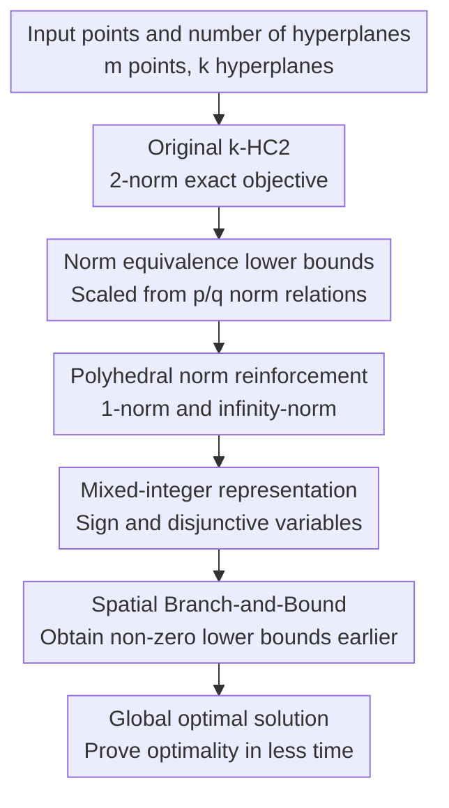

# Solving the 2-norm k-hyperplane clustering problem via multi-norm formulations

**Conference**: ICLR 2026  
**OpenReview**: [https://openreview.net/forum?id=VJAqqtVXfD](https://openreview.net/forum?id=VJAqqtVXfD)  
**Code**: https://github.com/stefanoconiglio/khc-multinorm  
**Area**: Optimization / Clustering  
**Keywords**: k-hyperplane clustering, global optimization, spatial branch-and-bound, multi-norm relaxation, mixed-integer programming  

## TL;DR

This paper transforms the non-convex exact solution problem of 2-norm k-hyperplane clustering into a multi-norm mixed-integer model reinforced by 2-norm, 1-norm, and $\infty$-norm constraints. This allows spatial branch-and-bound to obtain non-zero lower bounds earlier, accelerating median solution time by up to approximately $41\times$ on LowDim/HighDim benchmarks.

## Background & Motivation

**Background**: k-Hyperplane Clustering (k-HC) fits a set of points using $k$ hyperplanes, where each point is assigned to its nearest hyperplane. It can be viewed as k-means where "centroids" are replaced by "lines/planes/hyperplanes," commonly found in scenarios such as line/surface detection, piecewise affine model fitting, PCA/sparse component analysis, and LiDAR geometric structure recognition. Classic k-HC2 uses Euclidean distance—the 2-norm distance from a point to a hyperplane—because this distance is rotation-invariant and its geometric meaning is most natural.

**Limitations of Prior Work**: The difficulty lies not in writing the objective function but in solving it globally. Given a hyperplane $H_j=\{x\in\mathbb{R}^n:x^\top w_j=\gamma_j\}$, the 2-norm distance of point $a_i$ to this hyperplane involves $|a_i^\top w_j-\gamma_j|/\|w_j\|_2$. The $w_j$ in the denominator makes the model non-convex and causes the expression to degenerate when $w_j=0$. Existing MI-QCQP exact models can describe this problem, but when passed to spatial branch-and-bound (SBB) for global optimality, the lower bound remains at 0 for a long time, making the branch-and-bound tree difficult to prune.

**Key Challenge**: While the 2-norm is the geometrically preferred distance, the complement of the feasible region for the 2-norm constraint $\|w_j\|_2\ge 1$ has a spherical structure. When using common convex hull/McCormick outer approximations for SBB, the root node includes $w_j=0$ in the relaxation, allowing the objective $\sum_i d_i^2$ to take the value 0. In other words, the geometric representation of the model is natural, but the initial relaxation it provides to the solver is too weak.

**Goal**: Instead of proposing a faster heuristic, the authors aim to maintain the k-HC2 Euclidean distance objective while enabling exact solvers to prove global optimality faster. Specific goals include: constructing valid reinforced formulations; proving that reinforcement constraints derived from other norms remain valid relaxations/lower bounds for the original problem; analyzing when non-zero lower bounds can be obtained within a linear or polynomial number of SBB nodes; and verifying whether these theoretical reinforcements translate into significant acceleration in real solvers.

**Key Insight**: A key observation is that the $p$-norm distance from a point to a hyperplane is controlled by the dual norm of $w$. Although the target problem is the 2-norm version, the 1-norm and $\infty$-norm constraints have polyhedral structures and can be expressed in a mixed-integer linear fashion. The authors utilize equivalence inequalities between different norms to incorporate these polyhedral norm constraints as effective reinforcement terms for the 2-norm model, rather than directly changing the problem to a different distance metric.

**Core Idea**: Use scaled 1-norm/$\infty$-norm formulations to add polyhedral norm constraints to 2-norm k-HC2, allowing SBB to possess stronger lower bounds and a more "branchable" geometric structure while preserving the original Euclidean clustering objective.

## Method

### Overall Architecture

The workflow of this paper can be understood as "first obtaining valid lower bounds from norm equivalence relations, then embedding the polyhedral constraints corresponding to these lower bounds back into the original 2-norm exact model." The input consists of $m$ points $a_i\in\mathbb{R}^n$ and the number of hyperplanes $k$; the output is not an approximate clustering but a k-HC2 solution with a global optimality certificate. The real change occurs at the formulation level: the original model retains $\|w_j\|_2\ge 1$ but additionally incorporates $\|w_j\|_1\ge 1$, $\|w_j\|_\infty\ge 1/\sqrt{n}$, or both, thereby altering the geometry of the SBB relaxation.

Specifically, the authors first define a generalized problem $k\text{-}HC(p,c)$, which still minimizes the sum of squared residuals to the nearest hyperplane, but with the constraint relaxed from $\|w_j\|_2\ge 1$ to $\|w_j\|_{p'}^2\ge c$, where $p'$ is the dual norm of $p$. They subsequently prove that different versions of $p$ and $q$ can form lower bounds for the objective value via scaling constants. The most important cases for this paper are $q=1$ and $q=\infty$, as their corresponding dual constraints are of the $\|w_j\|_\infty$ or $\|w_j\|_1$ type, which can be characterized using mixed-integer linear structures.

### Key Designs

**1. Norm Scaling Lower Bounds: Turning "Norm Switching" into Provable Relaxations**

The authors do not simply claim that the 1-norm is easier to compute and thus should be used instead. That would change the problem itself and provide no guarantee of the relationship between the result and k-HC2. Instead, they establish a general theorem: if two norms satisfy $\alpha(p,q)\|x\|_p\le \beta(p,q)\|x\|_q\le \delta(p,q)\|x\|_p$, then the optimal value of a properly scaled $k\text{-}HC(q,c')$ will fall below that of $k\text{-}HC(p,c)$, with a clear multiplicative approximation factor.

The practical role of this conclusion is to provide "legitimacy proof" for formulation reinforcement. When the target problem is $k\text{-}HC(2,1)$, the authors can safely use constraints generated by $k\text{-}HC(\infty,1)$ and $k\text{-}HC(1,1/\sqrt{n})$ because their corresponding feasible regions are relaxations of the 2-norm constraint, and their objective values are lower bounds for the original problem's objective. For single 1-norm or $\infty$-norm relaxations, the paper provides $\frac{1}{n}OPT(k\text{-}HC(2,1))\le OPT(\cdot)\le OPT(k\text{-}HC(2,1))$, indicating that these reinforcement constraints are not arbitrary but have clear approximate meanings.

**2. Multi-norm Relaxation: Leveraging the Geometric Complementarity of 1-norm and $\infty$-norm**

Adding $\|w_j\|_1\ge 1$ or $\|w_j\|_\infty\ge 1/\sqrt{n}$ individually provides valid relaxations, but the shapes of the excluded external regions differ. The paper further applies both simultaneously to obtain $k\text{-}HC(multi,1)$:

$$
\|w_j\|_1\ge 1,\qquad \|w_j\|_\infty\ge \frac{1}{\sqrt n},\qquad j\in[k].
$$

This is equivalent to requiring $\|w_j\|_{multi}=\min\{\|w_j\|_1,\sqrt n\|w_j\|_\infty\}\ge 1$. The challenge is that $\|\cdot\|_{multi}$ is not a standard $p$-norm and cannot directly use the previous theorem. To address this, the authors construct an implied distance $\max\{d_\infty(a_i,H_j),\frac{1}{\sqrt n}d_1(a_i,H_j)\}$ and prove it is induced by the norm $\max\{\|x\|_\infty,\frac{1}{\sqrt n}\|x\|_1\}$, yielding a stronger lower bound $\frac{1}{\sqrt n}OPT(k\text{-}HC(2,1))\le OPT(k\text{-}HC(multi,1))\le OPT(k\text{-}HC(2,1))$ via a new congruence inequality. This factor is stronger than the $1/n$ from individual relaxations, showing that the multi-norm combination is theoretically tighter.

**3. MILP Representation of Polyhedral Constraints: Guiding Solvers along Correct Variables**

Theoretical relaxations are only valuable if they can be effectively utilized by solvers. For $\|w_j\|_1\ge 1$, the authors introduce $w^+_{jh}$, $w^-_{jh}$, and binary sign variables $s_{jh}$, representing the positive and negative parts as $w^+_{jh}-w^-_{jh}=w_{jh}$. They ensure mutual exclusivity via $w^+_{jh}\le s_{jh}$ and $w^-_{jh}\le 1-s_{jh}$, and express the 1-norm lower bound as $\sum_h(w^+_{jh}+w^-_{jh})\ge 1$.

For $\|w_j\|_\infty\ge 1/\sqrt n$, they write it as a disjunctive structure meaning "at least one coordinate magnitude is large enough." Utilizing sign symmetry, they choose a single-sided disjunction with binary variables $u_{jh}$ indicating if the $h$-th coordinate is selected, adding $\sum_h u_{jh}=1$. If a certain $u_{jh}=1$, the corresponding $w_{jh}\ge 1/\sqrt n$ is activated. The beauty of this design is that it not only reinforces the root node relaxation but also provides SBB with a clear discrete branching entry: branching on these sign/coordinate selection variables allows for faster exclusion of pseudo-solutions like $w=0$ that cause zero lower bounds.

**4. SBB Node Complexity Analysis: Explaining why the $\infty$-norm Reinforcement is Often Fastest**

The core flaw of the original 2-norm formulation is that SBB based on convex hull outer approximation cannot exclude $w_j=0$ from the relaxation for a long time. The paper proves under common midpoint branching assumptions that solving the original $k\text{-}HC(2,1)$ requires generating at least $2^{k(n-1)}$ branch nodes before obtaining a non-zero lower bound; until then, the lower bound remains 0, making pruning nearly impossible.

With polyhedral norms, the geometry changes. If $\|w_j\|_1\ge 1$ is applied and $s_{jh}$ is branched on first, fully describing these 1-norm polyhedral constraints still involves exponential structures, but leaf nodes already satisfy the polyhedral constraints. More crucially, for $\|w_j\|_\infty\ge 1/\sqrt n$, branching on $u_{jh}$ first requires only $k(n-1)$ nodes to obtain a non-zero lower bound. This linear node count explains why $(k\text{-}HC(2,1),(1,1/\sqrt n))$ is often faster than the multi version in experiments: while multi provides a tighter bound, the overhead of 1-norm variables and branching may offset the gains.

### Loss & Training

This paper does not involve neural network training; the "loss" is the mixed-integer optimization objective:

$$
\min \sum_{i=1}^{m} d_i^2.
$$

Here $x_{ij}\in\{0,1\}$ indicates whether point $a_i$ is assigned to the $j$-th hyperplane, with $\sum_j x_{ij}=1$ ensuring assignment to exactly one hyperplane. The distance variable $d_i$ is bound to the selected hyperplane via big-M inequalities: when $x_{ij}=1$, $d_i$ must cover at least $|a_i^\top w_j-\gamma_j|$; when $x_{ij}=0$, the distance constraint is relaxed using an upper bound $d^U$.

The strategy is to use the spatial branch-and-bound in Gurobi 10 with a time limit totaling 168,000 seconds across 12 threads on 2.6GHz Intel Core i7-9750H, 32GB RAM hardware. The paper compares four formulations: the original $(k\text{-}HC(2,1))$, $(k\text{-}HC(2,1),(1,1/\sqrt n))$ adding $\infty$-norm constraints, $(k\text{-}HC(2,1),(\infty,1))$ adding 1-norm constraints, and $(k\text{-}HC(multi,1))$ adding both.

## Key Experimental Results

### Main Results

The paper evaluates on two synthetic benchmarks: LowDim, covering low-dimensional line/plane clustering, and HighDim, covering instances with higher dimensions or more clusters. The table below represents the subset of instances where all four formulations were solved successfully, comparing median times and relative speedup.

| Dataset | Formulation | Median Time (s) | Relative Speedup | Significance |
|---------|-------------|-----------------|------------------|--------------|
| LowDim | $(k\text{-}HC(2,1))$ | 169.9 | $1\times$ | - |
| LowDim | $(k\text{-}HC(2,1),(1,1/\sqrt n))$ | 4.15 | $40.9\times$ | $1.1\times 10^{-4}$ |
| LowDim | $(k\text{-}HC(2,1),(\infty,1))$ | 6.10 | $27.9\times$ | $1.1\times 10^{-4}$ |
| LowDim | $(k\text{-}HC(multi,1))$ | 5.00 | $34.0\times$ | $1.1\times 10^{-4}$ |
| HighDim | $(k\text{-}HC(2,1))$ | 208.6 | $1\times$ | - |
| HighDim | $(k\text{-}HC(2,1),(1,1/\sqrt n))$ | 18.20 | $11.5\times$ | $5.6\times 10^{-9}$ |
| HighDim | $(k\text{-}HC(2,1),(\infty,1))$ | 20.65 | $10.1\times$ | $7.5\times 10^{-9}$ |
| HighDim | $(k\text{-}HC(multi,1))$ | 37.35 | $5.6\times$ | $8.7\times 10^{-4}$ |

On LowDim, the three reinforced formulations reduced solution times for 21 instances that remained unsolved after 46 hours by the original model to under 2 hours. On HighDim, the best reinforced formulation solved 10 more instances than the original model.

### Ablation Study

Here, "ablation" compares the contribution of different norm constraints to solver behavior. HighDim node statistics show that reinforcement constraints indeed reduce the SBB tree size.

| Configuration | HighDim Solved | Avg HighDim SBB Nodes | Description |
|---------------|----------------|-----------------------|-------------|
| Original $(k\text{-}HC(2,1))$ | 31 | 7,987,723.07 | 2-norm only, weak early lower bound |
| Plus $\infty$-norm $(1,1/\sqrt n)$ | 41 | 3,201,881.49 | Most instances solved, nodes significantly reduced |
| Plus 1-norm $(\infty,1)$ | 40 | 2,741,496.67 | Lowest average node count |
| Multi-norm | 37 | 4,632,264.51 | Tighter theoretical bound, but higher variable/branch overhead |

### Key Findings

- Polyhedral norm reinforcement significantly improves global solving rather than just improving heuristic initial values.
- $(k\text{-}HC(2,1),(1,1/\sqrt n))$ stands out in overall performance, consistent with the theory that $\infty$-norm constraints require only linear nodes to obtain non-zero lower bounds.
- The multi-norm theoretical lower bound is tighter, but experimental speed is not always best, indicating that the introduction of more binary variables and branches can offset benefits.
- LowDim results also proved the optimality of several heuristic solutions from Amaldi & Coniglio 2013.

## Highlights & Insights

- The cleverest part is using different norm formulations as lower bound generators for the original 2-norm problem rather than as objective replacements.
- The theoretical analysis aligns closely with solver behavior, explaining why the original model requires exponential nodes to generate a non-zero lower bound.
- The multi-norm results provide a honest look at the tension between tighter relaxations and additional solution overhead, which is instructive for MILP/MINLP modeling.
- The method is transferable to other non-convex clustering problems involving norm normalization or point-to-subspace distances.

## Limitations & Future Work

- Experimental scales remain small; although the time limit is long, the data is synthetic. Scalability for large-scale real point clouds or high-dimensional subspace clustering may still face SBB bottlenecks.
- The multi-norm relaxation is not always the best choice, suggesting there is no automatic mechanism yet to decide which norm constraints to add.
- The node complexity advantages are proved under specific branching assumptions and Gurobi 10 behavior; generalizability across solvers needs further evaluation.
- Future work could combine exact SBB with coreset techniques to handle larger data volumes while maintaining global optimality.

## Related Work & Insights

- **vs Bradley & Mangasarian (k-plane clustering heuristics)**: Early methods are suitable for finding usable solutions quickly but lack global optimality certificates. This paper focuses on exact solving.
- **vs Amaldi & Coniglio (MI-QCQP formulation)**: The prior work gave the exact model, but the original 2-norm constraint led to weak SBB lower bounds. This work reinforces rather than replaces that model.
- **vs Common Norm Substitution**: Typically, norms are substituted for different regularization effects. Here, the "switch" is used to generate lower bounds for a specific target norm, requiring scaling and proof.

## Rating

- Novelty: ⭐⭐⭐⭐☆
- Experimental Thoroughness: ⭐⭐⭐⭐☆
- Writing Quality: ⭐⭐⭐⭐☆
- Value: ⭐⭐⭐⭐☆

## Related Papers

- [\[ICML 2025\] Clipping Improves Adam-Norm and AdaGrad-Norm when the Noise Is Heavy-Tailed](../../ICML2025/optimization/clipping_improves_adam-norm_and_adagrad-norm_when_the_noise_is_heavy-tailed.md)
- [\[ICLR 2026\] CogFlow: Bridging Perception and Reasoning through Knowledge Internalization for Visual Mathematical Problem Solving](cogflow_bridging_perception_and_reasoning_through_knowledge_internalization_for_.md)
- [\[ICML 2026\] Conflicting Biases at the Edge of Stability: Norm versus Sharpness Regularization](../../ICML2026/optimization/conflicting_biases_at_the_edge_of_stability_norm_versus_sharpness_regularization.md)
- [\[ICLR 2026\] Scalable Second-Order Riemannian Optimization for K-means Clustering](scalable_second-order_riemannian_optimization_for_k-means_clustering.md)
- [\[AAAI 2026\] GHOST: Solving the Traveling Salesman Problem on Graphs of Convex Sets](../../AAAI2026/optimization/ghost_solving_the_traveling_salesman_problem_on_graphs_of_convex_sets.md)

<!-- RELATED:END -->

<!-- RELATED:START -->

## Related Papers

- [\[ICLR 2026\] Learning to Solve Orienteering Problem with Time Windows and Variable Profits](learning_to_solve_orienteering_problem_with_time_windows_and_variable_profits.md)
- [\[ICLR 2026\] From Gradient Volume to Shapley Fairness: Towards Fair Multi-Task Learning](from_gradient_volume_to_shapley_fairness_towards_fair_multi-task_learning.md)
- [\[ICLR 2026\] Rethinking Consistent Multi-Label Classification Under Inexact Supervision](rethinking_consistent_multi-label_classification_under_inexact_supervision.md)
- [\[ICLR 2026\] Hierarchical Multi-Stage Recovery Framework for Kronecker Compressed Sensing](hierarchical_multi-stage_recovery_framework_for_kronecker_compressed_sensing.md)
- [\[ICLR 2026\] Scaling Multi-Task Bayesian Optimization with Large Language Models](scaling_multi-task_bayesian_optimization_with_large_language_models.md)

<!-- RELATED:END -->
