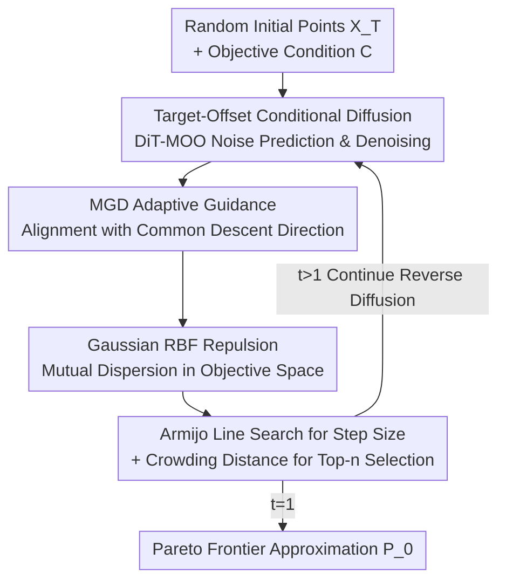

# SPREAD: Efficient Sampling-based Adaptive Diffusion Pareto Frontier Refinement

**Conference**: ICLR 2026  
**OpenReview**: [https://openreview.net/forum?id=4731mIqv89](https://openreview.net/forum?id=4731mIqv89)  
**Code**: https://github.com/safe-autonomous-systems/moo-spread  
**Area**: Multi-Objective Optimization / Diffusion Models / Pareto Frontier  
**Keywords**: Multi-objective optimization, conditional diffusion models, multi-gradient descent, Pareto frontier, diversity

## TL;DR
SPREAD treats the conditional DDPM as a multi-objective optimization (MOO) solver: it first trains a Diffusion Transformer conditioned on "objective values," then injects a guidance term consisting of a "multi-gradient descent direction + Gaussian RBF repulsion" into each reverse diffusion step. This enables a batch of candidate points to converge rapidly to the Pareto optimality while spreading uniformly to cover the entire Pareto frontier, matching or exceeding specialized SOTA methods in online, offline, and Bayesian settings.

## Background & Motivation

**Background**: Multi-objective optimization aims to identify an entire Pareto frontier—a set of non-dominated trade-off solutions—among multiple conflicting objectives. Classical approaches include evolutionary algorithms, scalarization, and multi-gradient descent (MGD) combined with multi-start (running from multiple random initial values).

**Limitations of Prior Work**: These methods struggle in high-dimensional, large-scale, or computationally expensive evaluation scenarios. Multi-start MGD guarantees convergence to Pareto stationary points but does not inherently promote diversity, often causing multiple start points to cluster on a small segment of the frontier. To accelerate specific scenarios, various domain-specific algorithms (offline MOO, Bayesian MOO, federated MOO) have been developed, sacrificing generalizability.

**Key Challenge**: MOO requires simultaneous "convergence" (each point approaching the Pareto frontier) and "diversity" (the points covering the entire frontier). Pure gradient-based methods naturally favor the former and are prone to mode collapse. A trade-off also exists between universality and efficiency.

**Goal**: To develop a **unified** framework that can handle large-scale high-dimensional problems, remain reusable across different resource-constrained settings (online/offline/Bayesian), and balance convergence speed with frontier coverage.

**Key Insight**: The authors observe a structural isomorphism between the "iterative refinement" nature of DDPM (denoising from noise to high-quality samples) and the MOO process of "iteratively pushing candidate solutions toward the frontier." Since diffusion models reshape samples at every step, MOO directional signals can be directly embedded into the reverse diffusion steps.

**Core Idea**: Use a diffusion model conditioned on objective values to generate candidate solutions. In each step of the reverse diffusion, the denoising trajectory is jointly guided by "MGD common descent directions (for convergence) + Gaussian RBF repulsion (for diversity)," integrating generation, convergence, and spreading into a single sampling loop.

## Method

### Overall Architecture

The workflow of SPREAD under the "online setting" (with direct access to the objective function $F$) is as follows: first, a conditional Diffusion Transformer (DiT-MOO) is trained using $N$ points sampled via Latin Hypercube Sampling to learn the mapping from "target objective values" to "predicted noise on decision variables." During inference, $n$ random initial points $X_T$ are used to start the reverse diffusion. At each step, a guidance update is superimposed on standard denoising. This guidance drives each point along its MGD common descent direction (approaching the frontier) while enforcing mutual repulsion in the objective space (spreading). The step size is determined by Armijo backtracking line search. After each step, the top-$n$ non-dominated points are maintained in a Pareto archive using crowding distance, finally outputting $P_0$.

### Key Designs

**1. Target-Offset Conditioning: Directing "Denoising" towards Dominance**

Standard conditional diffusion generates samples based on conditions but does not inherently improve the solution relative to the initial point. SPREAD utilizes a **positive offset** during training for each sample $x_i$:

$$c_i = F(x_i) + \Xi, \quad \Xi \in (0, \infty)^m,$$

where $\Xi$ is an arbitrary offset vector with all positive components. During sampling, the **un-offset** real objective value $F(x_i)$ is used as the condition. The intuition is that the model learns what solutions with "worse" (larger) objective values look like, so querying with the "better" (smaller) real objective value prompts the model to output a superior solution. Theorem 1 formalizes this: given the total variation distance between the sampler and the true distribution is within $\tau$, the generated $x_0$ dominates $x_T$ ($P(x_0 \prec x_T) \ge 1-\tau$). This transforms conditional diffusion into a high-probability improvement operator.

**2. MGD-Inspired Adaptive Guidance: Injecting Common Descent in Reverse Diffusion**

To enhance stability, a gradient guidance term is added to the denoised result $X'_t$ at each step. Standard DDPM denoising provides $X'_t$, which is then corrected by the guidance direction $\tilde{h}_t$:

$$X_{t-1} \leftarrow X'_t - \eta_t \tilde{h}_t(X'_t), \qquad \tilde{h}^i_t = h^i_t + \gamma^i_t \delta_t.$$

Here $g^i_t = g(x'^i_t)$ is the MGD common descent direction for the $i$-th point (the aggregated gradient from $\min_{\lambda \in \Delta_m} \|\sum_j \lambda_j \nabla f_j\|^2$). The primary direction $h^i_t$ is optimized to align with $g^i_t$ by maximizing the average inner product $\frac{1}{n}\sum_i \langle g^i_t, h^i_t\rangle$. $\delta_t$ is a random perturbation with strength $\gamma^i_t$. Theorem 2 proves that if $\gamma^i_t$ is correctly bounded, $-\tilde{h}^i_t$ remains a common descent direction for all objectives, ensuring convergence while allowing random exploration.

**3. Gaussian RBF Repulsion: Embedding Diversity into the Guidance Objective**

To prevent points from clustering (mode collapse), SPREAD minimizes a Gaussian RBF repulsion energy in the objective space when calculating $h^i_t$. Defining $y^i_t$ as the objective values after an update, the repulsion function is:

$$\Gamma_t(Y_t) = \frac{2}{n(n-1)} \sum_{1\le i<j\le n} \exp\!\Big(-\frac{\|y^i_t - y^j_t\|^2}{2\sigma^2}\Big),$$

where $\sigma$ is the length scale. This pushes points apart in the objective space. The primary direction is determined by a joint sub-problem:

$$ (h^i_t)_{i=1}^n = \arg\min_{(u^i)} \Big( -\frac{1}{n}\sum_i \langle g^i_t, u^i\rangle + \nu_t\, \Gamma_t\big(F(X'_t - \eta_t((u^i) + \gamma_t^T\delta_t))\big)\Big),$$

The first term drives points toward MGD convergence, while the second term, weighted by $\nu_t$, spreads them. Crowding distance is further applied to maintain the archive, favoring solutions in sparse regions.

### Loss & Training
Training utilizes the standard DDPM noise prediction loss $L_s(\theta) = \mathbb{E}\big[\|\epsilon - \hat{\epsilon}_\theta(X_t, t, C)\|^2\big]$ with a cosine variance schedule and condition $C = F(X) + \Xi$. For resource-constrained settings: Offline MOO replaces $F$ with a trained surrogate $\tilde{F}$; Bayesian MOO adopts a Gaussian Process surrogate and utilizes data extraction strategies from CDM-PSL + Simulated Binary Crossover (SBX).

## Key Experimental Results

### Main Results (Online MOO, Hypervolume HV ↑ / Δ-spread ↓)
Evaluated on synthetic benchmarks (ZDT/DTLZ, $d=30$) and real-world engineering tasks (RE) against baselines including PMGDA, STCH, MOO-SVGD, and HVGrad.

| Task | Metric | SPREAD | Best Baseline |
|------|------|--------|---------------|
| RE21 (m=2) | HV | **70.10** | 48.14 (PMGDA) |
| RE33 (m=3) | HV | **133.76** | 43.06 (PMGDA) |
| RE34 (m=3) | HV | **243.15** | 210.07 (PMGDA) |
| DTLZ7 (m=3) | HV | **18.07** | 17.82 (PMGDA) |
| RE41 (m=4) | HV | **1008.75** | 936.17 (HVGrad) |
| ZDT3 (m=2) | Δ-spread | **0.53** | 0.90 (MOO-SVGD) |
| RE21 (m=2) | Δ-spread | **0.44** | 1.00 (Various) |

SPREAD matches or outperforms baselines on bi-objective problems and shows increasing superiority as the number of objectives $m$ grows, particularly in HV and Δ-spread.

### Ablation Study (Impact of Diversity Mechanism)

| Configuration | Observation | Explanation |
|------|------|------|
| Full SPREAD | Optimal HV/Δ-spread | Complete model |
| w/o diversity ($\tilde{h}=g$) | Δ-spread = $+\infty$ | degenerates to pure MGD; solutions collapse |
| w/o repulsion (No RBF) | HV drops significantly | Lack of repulsion prevents frontier coverage |
| w/o perturbation (No $\gamma\delta$) | Modest HV decrease | Perturbation primarily aids local exploration |

### Key Findings
- **Repulsion is critical for diversity**: Removing diversity or repulsion leads to point collapse (Δ-spread = $+\infty$), confirming that embedding diversity in the guidance objective is essential.
- **Diffusion stochasticity contributes to diversity**: Even without explicit diversity guidance, the DDPM noise terms provide some inherent spreading effect.
- **Superior scalability trade-off**: SPREAD maintains a computational cost significantly lower than PMGDA and only slightly higher than lower-performing baselines like MOO-SVGD, while delivering stable leadership in HV.
- **Cross-setting performance**: In offline settings (Off-MOO-Bench), SPREAD achieves the best average rank, outperforming generative competitors like ParetoFlow and PGD-MOO.

## Highlights & Insights
- **Dual-Mechanism MOO**: Convergence is handled by target-offset conditioning (ensuring dominance per Theorem 1), while diversity is handled by RBF repulsion within the guidance term.
- **Bounded Perturbation**: Theorem 2 provides a clever way to include random exploration ($\delta_t$) without violating the common descent property, by "clamping" the perturbation magnitude.
- **Universal Loop**: The "plug-and-play" design allows the same sampling loop to work across online, offline, and Bayesian settings by simply swapping the objective source ($F$, $\tilde{F}$, or GP).

## Limitations & Future Work
- **Differentiability Requirement**: MGD guidance requires objective gradients. In offline/Bayesian settings, surrogate quality directly dictates the accuracy of these gradients.
- **Overhead**: SPREAD requires pre-training DiT-MOO and involves $T=5000$ reverse diffusion steps, which may be heavy for simpler problems.
- **Hyperparameter Sensitivity**: Parameters like $\nu_t$, $\rho$, $\sigma$, and $\Xi$ require tuning. Automated scheduling of $\nu_t$ (prioritizing convergence early and diversity later) and faster sampling (e.g., DDIM) are potential future directions.

## Related Work & Insights
- **vs Generative MOO (ParetoFlow, PGD-MOO)**: Unlike ParetoFlow (flow-matching) or PGD-MOO (preference classifier), SPREAD uses objective values directly as conditions and MGD as guidance, achieving convergence and spread without a separate preference model.
- **vs Gradient Methods (MGD, MOO-SVGD)**: While MGD multi-start suffers from mode collapse, SPREAD embeds MGD signals into the diffusion process, utilizing the generative model's global structure and the gradient method's local convergence.

## Rating
- Novelty: ⭐⭐⭐⭐⭐ 
- Experimental Thoroughness: ⭐⭐⭐⭐ 
- Writing Quality: ⭐⭐⭐⭐ 
- Value: ⭐⭐⭐⭐

<!-- RELATED:START -->

## Related Papers

- [\[ICLR 2026\] Diffusion-DFL: Decision-focused Diffusion Models for Stochastic Optimization](diffusion-dfl_decision-focused_diffusion_models_for_stochastic_optimization.md)
- [\[ICML 2026\] Diversity-Driven Offline Multi-Objective Optimization via Nested Pareto Set Learning](../../ICML2026/optimization/diversity-driven_offline_multi-objective_optimization_via_nested_pareto_set_lear.md)
- [\[ICLR 2026\] NExCO: Native Solution Expansion for Diffusion-based Combinatorial Optimization](nexco_native_solution_expansion_for_diffusion-based_combinatorial_optimization.md)
- [\[NeurIPS 2025\] Efficient Adaptive Experimentation with Noncompliance](../../NeurIPS2025/optimization/efficient_adaptive_experimentation_with_noncompliance.md)
- [\[NeurIPS 2025\] Efficient Adaptive Federated Optimization](../../NeurIPS2025/optimization/efficient_adaptive_federated_optimization.md)

<!-- RELATED:END -->
