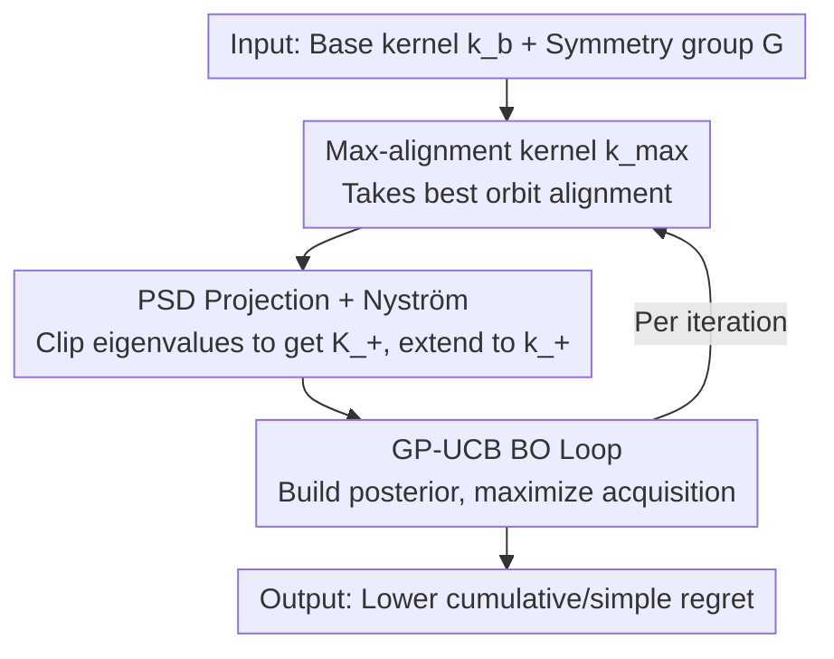

# Symmetry-Aware Bayesian Optimization via Max Kernels

**Conference**: ICLR 2026  
**OpenReview**: [https://openreview.net/forum?id=zUbBaWAM1Q](https://openreview.net/forum?id=zUbBaWAM1Q)  
**Code**: https://github.com/abardou/max-kernel  
**Area**: Bayesian Optimization / Gaussian Processes / Symmetry Priors  
**Keywords**: Bayesian Optimization, Invariant Kernels, Group Symmetry, Max-alignment Kernels, PSD Projection

## TL;DR
When the black-box objective function is invariant under the action of a group $G$, this paper departs from the mainstream approach of "averaging" over group orbits to obtain an invariant kernel. Instead, it adopts the "maximum alignment" similarity $k_{\max}$ between orbits and recovers a valid (Positive Semi-Definite) GP kernel $k_+^{(D)}$ via eigenvalue clipping and Nyström extension. This significantly reduces cumulative regret in Bayesian Optimization (BO) without increasing asymptotic costs, with the advantage becoming more pronounced as the group size increases.

## Background & Motivation

**Background**: Bayesian Optimization (BO) is the standard framework for optimizing "expensive, noisy, black-box" objective functions. it places a Gaussian Process (GP) prior $f \sim \mathcal{GP}(0, k)$ on the objective, where the kernel $k$ determines the covariance structure and encodes prior assumptions. In many real-world problems (molecular property prediction, wireless network design, particle packing), the objective function is known to be invariant under the action of a group $G$, i.e., $f^\star(x) = f^\star(gx)$ for all $g \in G$. Ginsbourger et al. proved that for a GP prior to be $G$-invariant, its covariance function must also be $G$-invariant. Thus, the problem becomes: how to construct an invariant kernel from a base kernel $k_b$ and a group $G$?

**Limitations of Prior Work**: The prevailing answer is the "orbit-averaging kernel" $k_{avg}(x,x') = \frac{1}{|G|^2}\sum_{g,g'\in G} k_b(gx, g'x')$, which averages over all combinations of group transformations for a pair of points. While it is invariant and has a clean functional interpretation, averaging "dilutes" information: when two points can be perfectly aligned under one specific transformation but do not match under most others, the average drowns the meaningful alignment in a multitude of dissimilar terms. An intuitive example involves rotationally invariant images: for two rotated versions of the same cat, only the "correct" rotation angle aligns them, while most other angles look very different, leading to low similarity after averaging.

**Key Challenge**: Another long-standing idea is to take the "maximum alignment"—retaining only the best match between two orbits, i.e., $k_{\max}(x,x') = \max_{g,g'\in G} k_b(gx, g'x')$, which has precedents in convolution/best-match kernels for structured data. However, the max kernel faces a fatal issue: it is generally **not positive semi-definite (PSD)**, whereas standard GP mechanisms (inversion, sampling) underlying BO require PSD kernels. This obstacle has long prevented max kernels from being adopted in BO.

**Goal**: To introduce the intuitively superior "maximum alignment" similarity structure into BO while bypassing the non-PSD barrier without increasing the asymptotic computational cost per iteration.

**Core Idea**: Utilize a PSD projection of the max kernel (via eigenvalue clipping) followed by a Nyström extension to obtain a valid, $G$-invariant kernel $k_+^{(D)}$. This kernel matches $k_{\max}$ when the latter is already PSD, retaining the "high-contrast orbit alignment" geometry of the max kernel while being directly pluggable into the GP-UCB BO loop.

## Method

### Overall Architecture

The method addresses "how to transform a non-PSD max-alignment kernel into a valid GP kernel for BO." The pipeline is as follows: Given a base kernel $k_b$ (e.g., RBF, Matérn) and a known symmetry group $G$ → Construct the Gram matrix for the max-alignment kernel $k_{\max}$ on a finite design set $D$ → Project this matrix onto the PSD cone via eigenvalue clipping to obtain $K_+$ → Extend the kernel to new points using Nyström extension to get the valid kernel $k_+^{(D)}$ → Plug $k_+^{(D)}$ as a standard GP kernel into the standard GP-UCB loop (build posterior, maximize acquisition function to select the next query point).

This modification only occurs at the "kernel" layer; the rest of the BO process (acquisition functions, optimization budget) remains unchanged, allowing for a drop-in replacement of existing $k_{avg}$ implementations.

### Key Designs

**1. Max-alignment kernel $k_{\max}$: Replacing averaging with best orbit match to retain meaningful similarity**

To address the "averaging dilutes information" issue, this paper revisits an idea long overlooked in BO: similarity should be based on the **best** alignment between two orbits rather than an average over all transformations. Formally, $k_{\max}(x,x') = \max_{g,g'\in G} k_b(gx, g'x')$. The authors first demonstrate that this is a "true kernel" by constructing a mapping $\phi_G$ that maps each point to its orbit representative (satisfying $\phi_G(x)=\phi_G(gx)$ and $\|\phi_G(x)-\phi_G(x')\|_2 = \min_{g,g'}\|gx-g'x'\|_2$). If $f(x)=h(\phi_G(x))$ with $h\sim\mathcal{GP}(0,k_b)$, then $f$ is a $G$-invariant GP whose covariance is exactly $k_{\max}$ (Proposition 1). This shows that $k_{\max}$ is naturally the covariance of a valid class of $G$-invariant GPs.

Why is max better than avg? A lemma clarifies: for any base kernel, $k_{avg}$ equals $k_{\max}$ on an orbit if and only if the base kernel itself already equals $k_{\max}$—meaning averaging **can never** reproduce the geometry of max (unless the average is redundant). A closed-form example: under planar rotational invariance with an RBF base kernel, $k_{\max}(x,x')=\exp(-(\|x\|_2-\|x'\|_2)^2/2l^2)$. This yields a maximum similarity of 1 whenever two points have the same norm, precisely capturing the rotational invariance of "equal radius implies equal value." In contrast, $k_{avg}(x,x') = \exp(-\tfrac{\|x\|_2^2+\|x'\|_2^2}{2l^2}) I_0(\tfrac{\|x\|_2\|x'\|_2}{l^2})$ (where $I_0$ is the modified Bessel function) produces distorted iso-similarity curves, potentially judging two points with the same norm as highly dissimilar. A geometrically more accurate kernel prevents the acquisition function from repeatedly exploring "symmetrically equivalent" points and provides more reliable uncertainty modeling for unexplored regions.

**2. PSD Projection + Nyström Extension: Rescuing the non-PSD max kernel into a valid GP kernel without extra asymptotic cost**

Although $k_{\max}$ is symmetric and invariant, it is generally not PSD and cannot be fed directly into a GP. The remedy is a standard but critical two-step operation. First, on a finite design set $D=\{x_1,\dots,x_n\}$, the Gram matrix $K=k_{\max}(D,D)$ is computed. Eigen-decomposition $K=Q\Lambda Q^\top$ is performed, and negative eigenvalues are clipped to zero:

$$K_+ = Q\,\max(0,\Lambda)\,Q^\top$$

This projects $K$ onto the PSD cone (the nearest semi-definite matrix). Second, Nyström extension is used to extend the kernel to points outside $D$:

$$k_+^{(D)}(x,x') = k_{\max}(x,D)\,K_+^{\dagger}\,k_{\max}(D,x')$$

where $K_+^{\dagger}$ is the Moore-Penrose pseudoinverse. This construction is equivalent to $k_+^{(D)}(x,x')=\phi(x)^\top\phi(x')$ with features $\phi(x)=K_+^{\dagger/2}k_{\max}(D,x)$, ensuring PSD. It also inherits $G$-invariance from $k_{\max}$ and coincides with $k_{\max}$ on $D$ when $k_{\max}$ is already PSD.

**3. Asymptotic cost comparable to orbit-averaging kernels**

The observation is that the eigen-decomposition/SVD required to compute $K_+$ and $K_+^{\dagger}$ is of the same order ($O(n^3)$) as the matrix inversion already required by BO to build the acquisition function. Thus, the PSD projection step **does not** increase the asymptotic complexity per iteration compared to $k_{avg}$.

### Loss & Training
This is not a training-based method and has no loss function. BO uses GP-UCB as the acquisition function. Each kernel $k\in\{k_b, k_{avg}, k_+^{(D)}\}$ shares the same acquisition and optimization budget, with results averaged over 10 random seeds.

## Key Experimental Results

The experiments address: (Q1) Does $k_+^{(D)}$ reduce regret compared to $k_{avg}$? (Q2) How does performance scale with group size $|G|$ and dimensionality? The baselines are $k_b$ (no symmetry) and $k_{avg}$ (Brown et al. 2024).

### Main Results

Cumulative regret is reported for synthetic functions (lower is better), and negative best reward for real-world tasks (lower is better).

| Benchmark | $\|G\|$ | $k_b$ | $k_{avg}$ | $k_+^{(D)}$ |
|-----------|------|-------|-----------|------------|
| Ackley2d | 8 | 382.7 ± 5.7 | 128.2 ± 10.4 | **126.4 ± 3.6** |
| Griewank6d | 64 | 3840.3 ± 177.7 | 3067.4 ± 841.9 | **1832.6 ± 146.3** |
| Rastrigin5d | 3,840 | 3568.5 ± 91.3 | 1583.5 ± 341.9 | **813.4 ± 70.6** |
| Radial2d | ∞ | 388.6 ± 20.3 | 480.9 ± 76.4 | **199.7 ± 11.6** |
| Scaling2d | ∞ | 1820.6 ± 1135.4 | 3361.8 ± 742.9 | **25.4 ± 6.4** |
| WLAN8d (Real) | 24 | −65.0 ± 3.2 | −51.8 ± 1.7 | **−74.4 ± 0.7** |
| PartPack6d (Real)| ∞ | −0.79 ± 0.10 | −0.69 ± 0.01 | **−0.92 ± 0.10** |

Ours ($k_+^{(D)}$) achieves the best results across **all** tasks, with improvements up to 50%. This answers Q1 affirmatively.

### Ablation Study

| Observation | Phenomenon | Description |
|----------|------|------|
| Small Groups | $k_{avg}$ and $k_+^{(D)}$ are comparable | Difference between averaging and max alignment is minor for small $|G|$. |
| Large Groups | $k_+^{(D)}$ cumulative regret is ~40-49% lower than $k_{avg}$ | The advantage grows more pronounced as the group size increases. |
| Continuous Groups | $k_{avg}$ degrades below $k_b$, $k_+^{(D)}$ remains strong | Averaging suffers severe dilution under continuous groups. |
| Empirical Spectrum | $k_{avg}$ spectral decay is similar to or faster than $k_+^{(D)}$ | **Contrary** to regret performance. |

### Key Findings
- **Advantage scales with group size**: As $|G|$ grows (e.g., hyperoctahedral group $|G|=2^d d!$), $k_{avg}$ performance degrades, sometimes falling below $k_b$, while $k_+^{(D)}$ is robust to group size.
- **Spectral theory does not explain the gain (Counter-intuitive)**: Mainstream BO theory suggests that kernels with faster eigenvalue decay have tighter regret bounds. However, $k_{avg}$ exhibits similar or faster decay than $k_+^{(D)}$ in experiments, yet performs consistently worse. This suggests that spectral decay rate alone cannot characterize the structural advantage of $k_+^{(D)}$.
- **Hypotheses**: 1. Geometry over rate: Decay only describes how fast the spectrum shrinks but ignores **which** eigenfunctions are prioritized; $k_{avg}$ often distorts search geometry via "similarity reversal." 2. Approximation difficulty: $f^\star$ may belong to the RKHS of both, but $k_+^{(D)}$ might allow for easier approximation.

## Highlights & Insights
- **Reclaiming the "rejected" max kernel**: Max-alignment kernels were long excluded from BO due to non-PSD issues. This paper uses a standard projection to resolve this, offering a "low-risk, high-reward, effectively free" drop-in replacement.
- **Exposure of theoretical vs. practical contradiction**: The authors do not hide the fact that spectral decay theory predicts $k_+^{(D)}$ should be worse, while it is practically better. Highlighting this as an open problem suggests that BO regret analysis may need to look beyond spectral rates toward geometric alignment.
- **Transferable design insight**: "Invariance vs. How to encode invariance" are distinct issues—merely ensuring the kernel is invariant (as $k_{avg}$ does) is insufficient; the **mechanism** of orbit alignment is crucial.

## Limitations & Future Work
- **Theoretical Gap**: Why $k_+^{(D)}$ is superior remains grounded in hypotheses rather than a new regret bound—a limitation the authors acknowledge.
- **Known Group Assumption**: The method assumes prior knowledge of $G$; performance under unknown or approximate symmetries is not explored.
- **Data-dependent Construction**: $k_+^{(D)}$ depends on the design set $D$. While theoretical convergence to an intrinsic $k_+$ exists, projection quality and numerical stability in $K_+^{\dagger}$ for small $D$ or ill-conditioned spectra warrant attention.
- **Future Directions**: Formalizing "geometric alignment" in regret bounds, or exploring soft-max alignment (e.g., temperature-scaled softmax) to interpolate between max and average.

## Related Work & Insights
- **vs. Orbit-averaging kernel $k_{avg}$**: Averaging dilutes similarity; Ours uses max alignment to preserve high-contrast structures, showing significant gains for large groups with identical asymptotic costs.
- **vs. Data Augmentation**: Adding all transformations of observations to the dataset increases BO complexity cubically ($O((n|G|)^3)$) and is inapplicable to continuous groups.
- **vs. Searching in Fundamental Domains**: Restricting the search space to a fundamental domain is complementary to this work. This paper focuses on the kernel itself, which is still needed even when searching in a restricted domain.
- **vs. Best-match Kernels (Gärtner 2003)**: Max-alignment and best-match kernels in structured data faced non-PSD issues; this work adapts PSD projection remedies from SVM literature to the BO context.

## Rating
- Novelty: ⭐⭐⭐⭐ Rescuing max kernels via standard projection is simple but insightful.
- Experimental Thoroughness: ⭐⭐⭐⭐ Comprehensive across synthetic/real tasks and group sizes.
- Writing Quality: ⭐⭐⭐⭐⭐ Clear motivation and honest discussion of theoretical anomalies.
- Value: ⭐⭐⭐⭐ A practical, drop-in replacement for symmetry-aware BO.

<!-- RELATED:START -->

## Related Papers

- [\[ICLR 2026\] From Sorting Algorithms to Scalable Kernels: Bayesian Optimization in High-Dimensional Permutation Spaces](from_sorting_algorithms_to_scalable_kernels_bayesian_optimization_in_high-dimens.md)
- [\[ICML 2026\] Cost-Aware Stopping for Bayesian Optimization](../../ICML2026/optimization/cost-aware_stopping_for_bayesian_optimization.md)
- [\[ICLR 2026\] Local Entropy Search over Descent Sequences for Bayesian Optimization](local_entropy_search_over_descent_sequences_for_bayesian_optimization.md)
- [\[ICLR 2026\] Generative Bayesian Optimization: Generative Models as Acquisition Functions](generative_bayesian_optimization_generative_models_as_acquisition_functions.md)
- [\[ICLR 2026\] Globally Aware Optimization with Resurgence](globally_aware_optimization_with_resurgence.md)

<!-- RELATED:END -->
