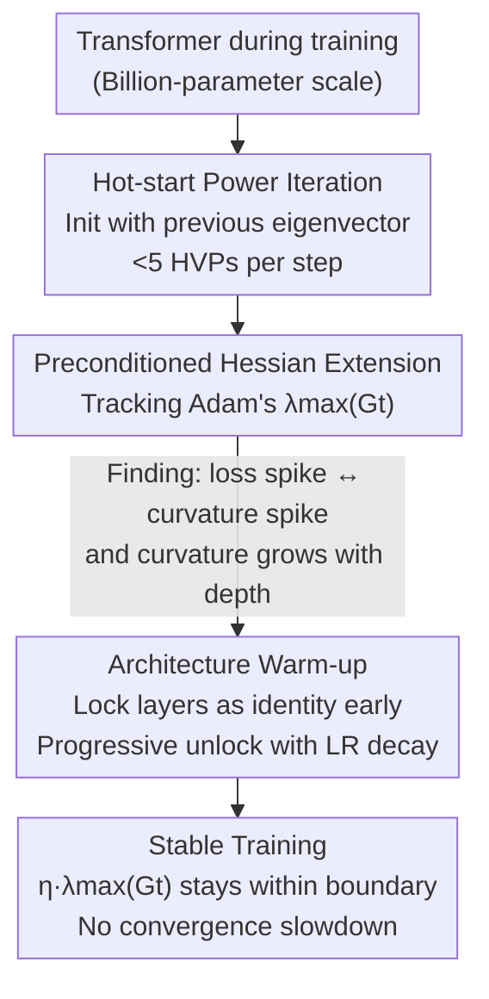

# Taming Curvature: Architecture Warm-up for Stable Transformer Training

**Conference**: ICLR 2026  
**OpenReview**: [https://openreview.net/forum?id=DuNf2vPTTK](https://openreview.net/forum?id=DuNf2vPTTK)  
**Area**: LLM Efficiency / Training Stability / Optimization  
**Keywords**: Training stability, Edge of Stability, Curvature tracking, Hessian, Progressive depth

## TL;DR
This paper employs "hot-start power iteration" to reduce the online tracking cost of the (preconditioned) Hessian's maximum eigenvalue for billion-parameter Transformers to $<5$ HVPs per step. It confirms that training loss spikes are accompanied by curvature surges and that curvature increases with depth. Consequently, it proposes "Architecture Warm-up"—freezing most layers as identity early in training and progressively unfreezing them as the learning rate decays—to significantly suppress divergence and spikes without slowing convergence.

## Background & Motivation

**Background**: Training billion-parameter Transformers is highly susceptible to instantaneous loss spikes or complete divergence, leading to wasted compute. Most industry stabilization techniques are empirical "patches": soft-capping logits, limiting dot-product magnitudes via QK-Norm or QK-Clip, or suppressing early updates with learning rate/batch size warmup.

**Limitations of Prior Work**: Parallel Edge of Stability (EoS) theory provides a more fundamental perspective—gradient methods are pushed toward regions where the "step size × curvature" approaches the stability boundary, i.e., $\eta\,\lambda_{\max}(H)\approx 2$ (for adaptive methods, this concerns the preconditioned curvature $\lambda_{\max}(P_t^{-1/2}HP_t^{-1/2})$, with a threshold around 38 for Adam). Theoretically, training is stable if $\eta\,\lambda_{\max}$ is kept below the boundary, but this theory has previously only been validated on small models ($\le 25M$).

**Key Challenge**: Applying EoS theory to large models requires **online** curvature estimation (maximum eigenvalue). However, explicit Hessian construction causes memory explosion, and iterative approximations are too slow—traditional power iteration starts from a random vector every step, and in high dimensions, the initial alignment with the principal eigenvector is only $O(1/\sqrt{d})$, requiring many Hessian-vector products (HVP) to converge. Thus, "curvature-controlled stabilization" has remained impractical for large-scale training.

**Goal**: (1) Make online curvature tracking feasible for billion-parameter models; (2) Verify if loss spikes in large models are truly caused by curvature spikes; (3) Design a stabilization method that can be directly integrated into existing training pipelines without performance loss.

**Key Insight**: The authors observe that the **principal eigenvector of the Hessian is slow-varying**. Since parameters change minimally between adjacent training steps, the principal eigenvector from the previous step serves as an excellent initial guess for the current step, allowing power iteration to be "hot-started," which drastically reduces iteration counts.

**Core Idea**: First, use hot-start power iteration to make curvature tracking inexpensive. Then, observing that curvature increases with depth and peaks during the learning rate warmup phase, use "effective depth control" to stabilize the curvature curve—keeping it shallow early and deep later—ensuring $\eta\,\lambda_{\max}(G_t)$ remains within the stability envelope.

## Method

### Overall Architecture

The method consists of two components: **a "cheap curvature ruler" followed by a "depth-adjusted stabilization strategy" guided by that ruler**. The first component is an online curvature tracker based on hot-start HVP power iteration, estimating the (preconditioned) Hessian's maximum eigenvalue in $<5$ HVPs per step and extending seamlessly to Adam’s preconditioned geometry. Using this ruler, the authors find that loss spikes coincide with preconditioned curvature spikes and that curvature rises with network depth. The second component, "Architecture Warm-up," addresses this: since the EoS stability threshold is inversely proportional to the learning rate (the threshold tightens as $\eta$ rises during LR warmup), the network is kept "shallow" (low curvature) early on. As the learning rate decays and the threshold relaxes, the network is progressively deepened. This is implemented not by dynamic computation graphs, but by "locking" Transformer layers as identity mappings at initialization and smoothly unlocking them according to a schedule.

### Key Designs

**1. Hot-start Power Iteration: Reducing online tracking from "dozens of HVPs" to "<5"**

Traditional power iteration starts from a random vector, which is nearly orthogonal to the principal eigenvector in high dimensions, requiring many HVPs to converge. The authors utilize the "slow-varying" nature of the principal eigenvector for cross-step hot-starting: step $k+1$ is initialized with the principal eigenvector $v_{1,k}$ from step $k$. Theoretically (Theorem 1), the angle between adjacent principal eigenvectors is bounded by the Hessian's Lipschitz constant $L_H$, the spectral gap $\gamma$, and the parameter displacement:

$$\sin\angle(v_{1,k+1}, v_{1,k}) \le \frac{\|H_{k+1}-H_k\|}{\gamma} \le \frac{L_H}{\gamma}\|\theta_{k+1}-\theta_k\|.$$

As training progresses and displacements $\|\theta_{k+1}-\theta_k\|$ shrink, the previous eigenvector becomes an increasingly accurate guess. Theorem 2 shows that hot-starting saves approximately $\big(\tfrac12\log d - \log(\tfrac{L_H}{\gamma}\|\theta_{k+1}-\theta_k\|)\big)/\log(1/\rho_{k+1})$ iterations over random starts. Empirically, convergence is reached in $\tau^\star<5$ HVPs, an order of magnitude lower than existing methods, with higher precision and lower variance.

**2. Preconditioned Hessian Extension: Measuring the geometry "seen" by adaptive optimizers**

For adaptive optimizers like Adam/AdamW, stability is determined by the preconditioned curvature—the spectrum of the effective Hessian $G_t := P_t^{-1/2}H(\theta_t)P_t^{-1/2}$ under the preconditioner $P_t=\mathrm{diag}(\sqrt{v_t}+\varepsilon)$. Since $P_t$ changes slowly when $\beta_2\approx 1$, and $H$ is Lipschitz smooth, $G_t$ also varies slowly. The hot-start analysis for $H$ applies to $G_t$ as well. Implementation involves a composite "$P^{-1/2}$ scaling → HVP → $P^{-1/2}$ scaling" operation, with the previous eigenvector transported via $P_t^{1/2}P_{t-1}^{-1/2}$ and re-normalized as the hot-start value. This bridges EoS theory to real-world Adam training.

**3. Architecture Warm-up: Controlling curvature via effective depth**

Based on the observation that curvature grows with depth and spikes during LR warmup, the EoS stability threshold $\propto O(1/\eta)$ tightens as $\eta$ climbs. The strategy is to keep the network shallow (low $\lambda_{\max}(G_t)$) during this phase. To avoid functional or gradient discontinuities upon deepening, the authors propose a specific unlocking mechanism. Simply setting residual projection weights to zero is insufficient; because other weights are randomly initialized, any deviation from zero upon unlocking would cause a sharp jump in the Jacobian disturbance, potentially triggering a spike.

The solution is to zero out all weights in a block (**except RMSNorm weights**, which converge poorly from zero) and remove them from the optimizer. While locked, the block is strictly an identity mapping with a Jacobian of $I$. Upon unlocking, all paths start from zero, and the Jacobian disturbance grows continuously as new trainable weights drift from zero, ensuring continuity in both the function and its first derivative. This mechanism requires no computation graph changes and integrates into standard Transformer recipes.

### Loss & Training
The objective remains standard AdamW with cross-entropy. Curvature tracking uses 5 hot-start HVP steps. The default Architecture Warm-up schedule keeps the model at half-depth until the LR warmup completes, then unlocks groups of layers every 500 steps. Experiments use a 1024 context window, 2048 embedding dimension, 32 heads, and scale up to 3B parameters.

## Key Experimental Results

### Main Results
On FineWeb, DCLM, and OLMo-Mix datasets with Llama 3-style decoder-only Transformers (1B parameters, 16 layers) using a deliberately high peak LR of $8\times10^{-3}$, validation perplexity (↓):

| Dataset | Baseline | QK-Norm | QK-Clip | Softcap | Arch-Warmup (Ours) |
|--------|----------|---------|---------|---------|---------------------|
| FineWeb | Diverged* | 49.88 | Diverged* | 51.41 | **25.02** |
| DCLM | 165.62 | 61.57 | Diverged* | 43.38 | **22.64** |
| OLMo-Mix | Diverged* | Diverged* | Diverged* | Diverged* | **18.54** |

`*` indicates divergence. Architecture Warm-up never diverged, significantly outperformed perplexity baselines, and converged faster. QK-Clip was found to be highly unstable, often resulting in NaNs.

### Ablation Study

| Configuration | Observation | Explanation |
|------|------|------|
| 5-step Hot-start HVP | Low error | Cold starts have higher error/variance even with $\ge 20$ iterations. |
| 8 vs 16 vs 32 layers | Curvature grows with depth | 16/32 layer models spike and diverge during LR warmup; 8-layer models remain stable. |
| LR Sweep ($3{\sim}8\times10^{-3}$) | Ours remains stable | Standard networks diverge as $\eta$ increases; ours keeps $\lambda_{\max}(G_t)$ bounded. |
| Arch-Warmup vs. LR Warmup | Comparable convergence | Architecture Warm-up alone yields convergence comparable to tuned LR schedules while being more stable. |

### Key Findings
- **Principal eigenvectors are indeed slow-varying**: Step-wise eigenvector angles on a 4-layer Transformer were typically $<0.1$ radians, validating the premise for hot-starting.
- **Curvature grows with depth and spikes during LR warmup**: This justifies the "shallow-to-deep" motivation of architecture warm-up.
- **Broadens the stable learning rate range**: Architecture Warm-up allows for higher peak $\eta$ without divergence or performance penalties.
- **Potential to replace LR warmup**: Both mechanisms are complementary; however, Architecture Warm-up can function independently to provide stability.

## Highlights & Insights
- **The "Slow-varying Eigenvector → Hot-start" Lever**: Redfines expensive online spectral estimation into a low-cost operation by reusing information across steps, backed by Theorem 1/2.
- **Focus on Preconditioned Curvature**: Correctly identifies that $G_t$, not $H$, governs stability in adaptive optimizers, ensuring the "ruler" measures the correct metric.
- **Zero-init Block Unlocking**: The detail of zeroing the entire block (except RMSNorm) to ensure first-order continuity is a crucial insight for avoiding spikes during progressive deepening.
- **Holistic Depth-based Stabilization**: Moving beyond local patches like QK-Norm, controlling effective depth offers a global approach to curvature scheduling.

## Limitations & Future Work
- **Theoretical Bounds**: The theory provides upper bounds but does not strictly guarantee monotonic curvature growth with depth; conclusions rely partly on empirical evidence.
- **Manual Schedules**: Unlocking schedules (e.g., "half-depth then 500-step intervals") are currently predefined; automated unlocking based on curvature metrics is a potential future direction.
- **Scale and Tasks**: Validations were performed up to 3B parameters; verifyng slow-varying properties on significantly larger models or different modalities (e.g., Diffusion) remains for future work.
- **RMSNorm Caveat**: The necessity of excluding RMSNorm from zero-initialization suggests the technique may require minor adjustments for certain architecture components.

## Related Work & Insights
- **Comparison with QK-Norm / QK-Clip / Softcap**: These methods use local limiting to indirectly suppress curvature. Ours manages curvature via "effective depth," showing superior stability and convergence at high learning rates.
- **Comparison with LR/Batch Warmup**: While LR warmup expands the stability margin $O(1/\eta)$, architecture warm-up directly suppresses curvature. They are complementary.
- **Comparison with EoS Theory (Cohen et al.)**: Extends prior EoS work from small models ($<25M$) to billion-parameter scales by making online curvature tracking feasible.
- **Comparison with Progressive Growth (Net2Net)**: Inherits the idea of deepening but aligns it with EoS stability thresholds and ensures first-order continuity for stability.

## Rating
- Novelty: ⭐⭐⭐⭐⭐ Establishes a clear causal chain from slow-varying eigenvectors to preconditioned curvature to depth-based stabilization.
- Experimental Thoroughness: ⭐⭐⭐⭐ Extensive comparisons across datasets and hypers, though precise Hessian validation is limited to smaller models.
- Writing Quality: ⭐⭐⭐⭐ Clear motivation and technical detail; logical flow from theory to practice.
- Value: ⭐⭐⭐⭐⭐ Directly addresses the pain point of training divergence in large models with a practical, low-overhead solution.

<!-- RELATED:START -->

## Related Papers

- [\[ICLR 2026\] Predictive Differential Training Guided by Training Dynamics](predictive_differential_training_guided_by_training_dynamics.md)
- [\[ICLR 2026\] MILPnet: A Multi-Scale Architecture with Geometric Feature Sequence Representations for Advancing MILP Problems](milpnet_a_multi-scale_architecture_with_geometric_feature_sequence_representatio.md)
- [\[ICLR 2026\] Newton Method Revisited: Global Convergence Rates up to $O(1/k^3)$ for Stepsize Schedules and Linesearch Procedures](newton_method_revisited_global_convergence_rates_up_to_o1k3_for_stepsize_schedul.md)
- [\[ICLR 2026\] DNT: a Deeply Normalized Transformer that can be trained by Momentum SGD](dnt_a_deeply_normalized_transformer_that_can_be_trained_by_momentum_sgd.md)
- [\[ICML 2025\] Efficient Curvature-Aware Hypergradient Approximation for Bilevel Optimization](../../ICML2025/optimization/efficient_curvature-aware_hypergradient_approximation_for_bilevel_optimization.md)

<!-- RELATED:END -->
