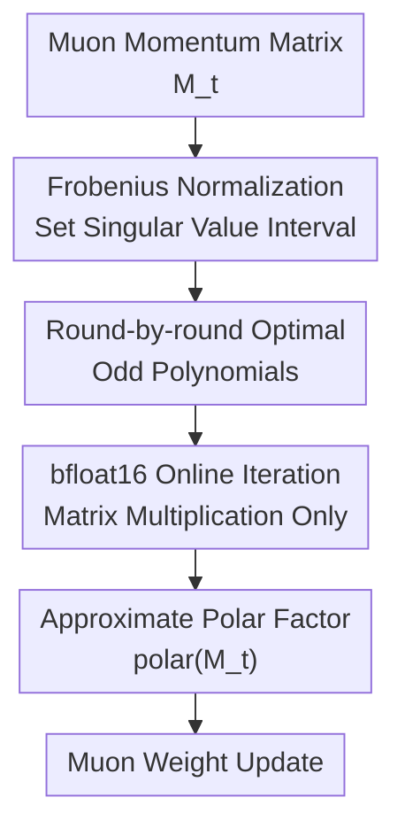

# The Polar Express: Optimal Matrix Sign Methods and their Application to the Muon Algorithm

**Conference**: ICLR 2026  
**OpenReview**: [https://openreview.net/forum?id=yRtgZ1K8hO](https://openreview.net/forum?id=yRtgZ1K8hO)  
**Code**: https://github.com/NoahAmsel/PolarExpress  
**Area**: Optimization / Matrix Sign Function / Muon Optimizer  
**Keywords**: Matrix sign function, Polar decomposition, Muon optimizer, Minimax polynomial, Low-precision training  

## TL;DR
Polar Express transforms the polar decomposition approximation in Muon from heuristic Newton-Schulz coefficient searches into solving for the worst-case error-optimal combination of odd polynomials each round. While remaining purely matrix-multiplication-based and bfloat16-friendly, it allows Muon updates in GPT-2 training to converge faster and more stably toward valid polar factors.

## Background & Motivation
**Background**: The core idea of the Muon optimizer is to perform polar decomposition on the gradient momentum matrix first, then update weights along the semi-orthogonal direction. For a momentum matrix $M=U\Sigma V^\top$, Muon uses the direction $\operatorname{polar}(M)=UV^\top$, which can be viewed as mapping all non-zero singular values to $1$—essentially a rectangular version of the matrix sign function applied in matrix optimization.

**Limitations of Prior Work**: Direct computation of $UV^\top$ via SVD is too expensive for deep learning training and is not GPU-friendly. Muon consequently adopts Newton-Schulz-style polynomial iterations containing only matrix multiplications. However, classic Newton-Schulz converges very slowly in early stages: when initial singular values are far from $1$, the first many rounds are spent slowly raising small singular values.

**Key Challenge**: Deep learning training does not require the high-precision polar decomposition common in numerical linear algebra; it prioritizes obtaining a sufficiently good update direction within a few iterations. However, pursuing only early-stage coarse precision often causes methods, such as the heuristic coefficients from Jordan or You, to stall at error plateaus, failing to achieve true convergence to the polar factor.

**Goal**: The authors aim to design a matrix sign function method that preserves Muon’s desirable properties—pure matrix multiplication, low memory, and high GPU throughput—while rapidly reducing error within few iterations and maintaining rigorous convergence guarantees as iterations continue.

**Key Insight**: The paper views each polynomial update step as a minimax problem approximating the constant function $1$ over the current singular value interval $[\ell_t, u_t]$. Instead of fixing a single Newton-Schulz polynomial or searching for coefficients via empirical targets, it asks a direct question: for a given iteration count and polynomial degree, which odd polynomial minimizes the worst-case singular value error?

**Core Idea**: Polar Express approximates the matrix sign function using a sequence of round-by-round adaptive optimal odd polynomials, moving the Muon polar decomposition subprogram from "useful heuristics" to "GPU-friendly polynomial iterations with provable worst-case optimality."

## Method

### Overall Architecture
The input to Polar Express is a matrix $M$ requiring polar decomposition approximation, and the output is a low-precision approximation of $\operatorname{polar}(M)$. The method is divided into offline and online phases: the offline phase precomputes coefficients for each round based on a preset lower bound $\ell$, upper bound $u$, iteration count $T$, and odd polynomial degree $d$; the online phase applies these coefficients to the current momentum matrix using only matrix multiplications and linear combinations.

Specific to Muon, the weight update remains $W_{t+1}=W_t-\lambda\operatorname{polar}(M_t)$, where $M_t$ is the gradient momentum. Polar Express only replaces the step of "how to compute $\operatorname{polar}(M_t)$" without changing Muon's outer optimization rules.

The basic form of online iteration is $X_0=M/(\|M\|_F+10^{-2})$, followed by applying an odd polynomial $p_t$ each round:

$$
X_t=p_t(X_{t-1}).
$$

When $p_t(x)=a_tx+b_tx^3+c_tx^5$, the odd powers for rectangular matrices do not require explicit SVD but are implemented via $X(X^\top X)^q$. Thus, one degree-5 polynomial update consists of several matrix multiplications and linear combinations, matching the high-throughput GEMM operations on GPUs.

### Key Designs
**1. Round-by-round minimax polynomials: Replacing "coefficient tuning" with "worst-case error optimality"**

Muon needs to push singular values from the current interval $[\ell_t, u_t]$ toward $1$ as quickly as possible. Polar Express selects an odd polynomial $p_t \in P_d^{\mathrm{odd}}$ in each round by solving:

$$
p_t=\arg\min_{p\in P_d^{\mathrm{odd}}}\max_{x\in[\ell_t,u_t]}|1-p(x)|.
$$

This objective is cleaner than "searching for coefficients based on training loss" because it directly corresponds to the spectral norm error of the polar decomposition approximation. If $M=U\Sigma V^\top$, then $p(M)=Up(\Sigma)V^\top$, and the error satisfies $\|\operatorname{polar}(M)-p(M)\|_2=\max_{\sigma_i}|1-p(\sigma_i)|$. In other words, the uniform approximation problem on a scalar interval is exactly the matrix polar decomposition approximation problem.

Crucially, the paper proves that this greedy round-by-round selection is not just locally lucky but globally optimal. Let $p^\star=p_T \circ \cdots \circ p_1$; Theorem 3.1 shows it minimizes the worst-case error over the interval among all compositions formed by $T$ odd polynomials of degree $d$. This provides Polar Express with strong theoretical standing: it is not just another set of manual Newton-Schulz coefficients, but the optimal combination for a fixed iteration budget and polynomial degree.

**2. Interval recursion: Tracking singular value bounds per round**

The optimal polynomial of each round maps the current interval $[\ell_t, u_t]$ to a new interval $[\ell_{t+1}, u_{t+1}]$. Utilizing the equioscillation property, the paper derives a concise recursion:

$$
\ell_{t+1}=p_t(\ell_t),\qquad u_{t+1}=2-\ell_{t+1}.
$$

This makes the method highly practical. The offline phase does not need to know the true singular value distribution at each training step; given conservative initial bounds, coefficients can be precomputed. During online training, only the hardcoded coefficients are read, requiring no Remez algorithm or extra optimization.

The authors default to using $\|M\|_F$ as the upper bound for normalization with $u=1$, and for the lower bound in bfloat16 scenarios, $\ell=10^{-3}$ is used. This lower bound does not need to be extremely accurate; experiments show that even if it differs by orders of magnitude from the true minimum singular value, it typically only delays convergence by a few rounds without breaking the method.

**3. Degree-5 odd polynomial implementation: Preserving Muon’s engineering advantages**

Polar Express primarily recommends $d=5$, meaning $p_t(x)=a_tx+b_tx^3+c_tx^5$. For rectangular matrices, $x^3$ and $x^5$ correspond to matrix forms $X(X^\top X)$ and $X(X^\top X)^2$. Thus, an update is implemented as:

$$
X_t=a_tX_{t-1}+b_tX_{t-1}(X_{t-1}^\top X_{t-1})+c_tX_{t-1}(X_{t-1}^\top X_{t-1})^2.
$$

The provided PyTorch implementation also transposes matrices when the aspect ratio is appropriate to form smaller Gram matrices, reducing FLOPs. Thus, Polar Express maintains a per-round overhead similar to Jordan/You variants: all perform degree-5 iterations, with the primary differences being the optimality of coefficients and convergence behavior.

This design explains why the paper avoids classic high-performance polar decomposition methods like QDWH or Zolotarev rational iterations. Those methods, while strong in numerical linear algebra, often require matrix inversion, QR, or complex decompositions—operations that are harder to saturate GPUs with or stabilize at low precision compared to matrix multiplications.

**4. Low-precision stabilization: Sacrificing theoretical optimality for practical bfloat16 usability**

Purely optimal theoretical polynomials face two issues in finite precision. First, rounding errors might push singular values slightly above the current upper bound $u_t$, where the polynomial might amplify the deviation, causing iterations to explode. The authors replace $p_t(x)$ with $p_t(x/1.01)$, creating a 1% safety margin (the scaling is omitted in the final round to minimize bias).

Second, optimal polynomials equioscillate within the interval, which can temporarily push singular values very low or change their signs—leading to directional errors in bfloat16. Drawing from Chen & Chow, if $\ell_t$ is too small in early rounds, the method solves for a slightly conservative, less oscillatory polynomial over a "thicker" interval. In Implementation 2, this "cushion" maintains a safer lower bound for $p_t(x)/x$.

These small modifications are critical for enabling the algorithm as a training kernel rather than just a numerical experiment. The final implementation uses float64 for offline coefficients and bfloat16 for online application, resulting in short, low-dependency code that directly replaces existing Muon matrix sign function implementations.

### Loss & Training
Polar Express itself is not a model with learnable parameters, so it has no traditional training loss. Its "optimization objective" is the uniform approximation error during offline polynomial construction: $\max_{x\in[\ell_t,u_t]}|1-p_t(x)|$.

When applied to GPT-2 training, all Muon variants are compared under the same outer training setup: the matrix sign function part uses bfloat16 with five rounds of degree-5 iterations; Muon handles parameters of 2D or higher, while AdamW handles embedding, unembedding, position encoding, and RMS norm parameters. This isolates the impact to the "polar factor approximation method."

## Key Experimental Results

### Main Results
The paper first compares GPT-2 training results when different matrix sign function methods are embedded in Muon. Results show Polar Express consistently outperforms Jordan/You heuristic polynomial versions across GPT-2 Small and Large, with gains not limited to specific learning rates.

| Setup | Method | Best LR | Final Val Loss | Description |
|------|------|------------|----------------|------|
| GPT-2 Small, FineWeb 1B tokens, no WD | AdamW | 0.0005 | 4.197 | Non-Muon baseline |
| GPT-2 Small, FineWeb 1B tokens, no WD | muon-Jordan | 0.01 | 3.639 | Heuristic degree-5 |
| GPT-2 Small, FineWeb 1B tokens, no WD | muon-You | 0.01 | 3.629 | 6-step heuristic coeffs |
| GPT-2 Small, FineWeb 1B tokens, no WD | muon-PolarExp | 0.005 | 3.588 | Ours |
| GPT-2 Large, FineWeb 1B tokens, no WD | muon-You | 0.02 | 3.399 | Heuristic method |
| GPT-2 Large, FineWeb 1B tokens, no WD | muon-Jordan | 0.02 | 3.398 | Heuristic method |
| GPT-2 Large, FineWeb 1B tokens, no WD | muon-PolarExp | 0.02 | 3.340 | Ours |

In longer training runs, the advantage of Polar Express narrows but persists. For GPT-2 Large on FineWeb 10B tokens with weight decay 0.1, the best validation losses for muon-Jordan / muon-You / muon-PolarExp are 2.921, 2.919, and 2.913, respectively, indicating it is not only superior in short training or under-converged stages.

| Setup | Method | Best LR | Final Val Loss | Observation |
|------|------|------------|----------------|------|
| GPT-2 Large, 10B tokens, WD 0.1 | muon-Jordan | 0.002 | 2.921 | Reliable in long training |
| GPT-2 Large, 10B tokens, WD 0.1 | muon-You | 0.002 | 2.919 | Close to Jordan |
| GPT-2 Large, 10B tokens, WD 0.1 | muon-PolarExp | 0.002 | 2.913 | Small but consistent gain |
| GPT-2 Small, 10B tokens, no WD | AdamW | 0.0005 | 3.370 | Non-Muon baseline |
| GPT-2 Small, 10B tokens, no WD | muon-Jordan | 0.005 | 3.233 | Muon significantly beats AdamW |
| GPT-2 Small, 10B tokens, no WD | muon-You | 0.005 | 3.234 | Close to Jordan |
| GPT-2 Small, 10B tokens, no WD | muon-PolarExp | 0.005 | 3.231 | Marginal lead |

### Ablation Study
Ablations focus on: how accurate does the polar decomposition in Muon need to be? The authors compare different iteration counts of Polar Express against exact SVD polar factors. Conclusions are practical: fewer than 5 rounds cause significant degradation, but exceeding 6 rounds—or even using exact SVD—does not further improve validation loss, while SVD significantly increases step time.

| Configuration | Key Metrics | Observation |
|------|----------|------|
| Polar Express 2-3 rounds | Val loss significantly worse than 5-6 rounds | Poor factor approx quality |
| Polar Express 5-6 rounds | Reaches optimal region | Sufficient for critical singular directions |
| Polar Express 10/20/30 rounds | No further val loss improvement | Higher numerical precision $\neq$ better training |
| Exact SVD | Val loss not better than 5-6 rounds Polar Express | Over-accurate decomposition has no benefit |
| Exact SVD | Step time roughly doubles | SVD unsuitable for training inner loops |

An insightful experiment involved modifying the treatment of small singular value directions. Truncating singular directions smaller than $10^{-3}\sigma_{\max}$ to 0—or even reversing them to $-1$—yielded training results close to the true polar factor. This suggests Muon is insensitive to directions of minimal singular values. Five rounds of Polar Express are just enough to push singular values greater than $\approx 10^{-3}$ near $1$, explaining why it works well even when not numerically fully converged.

### Key Findings
- Polar Express outperforms Newton-Schulz, Jordan, and You in spectral norm, Frobenius norm, and cosine similarity convergence on both synthetic and GPT-2 gradient matrices, especially in fair degree-5, same-iteration-count comparisons.
- Classic Newton-Schulz has ultimate convergence but is too slow early on; Jordan/You are fast initially but stall at error plateaus; Polar Express balances early speed with late-stage convergence.
- In language model training, 5 or 6 iterations represent a reasonable engineering point, as further increasing polar decomposition accuracy does not improve loss, whereas kernel stability and throughput are paramount.
- In image classification supplementary experiments (CIFAR/ViT), while the Muon family performs well, the advantage of Polar Express is not as stably amplified across all vision settings, suggesting its clearest benefits currently reside in LLM training and the Muon matrix sign function subprogram.

## Highlights & Insights
- The primary highlight is reframing a heuristic coefficient tuning problem in Muon as a minimax approximation problem for composite odd polynomials. This provides a provable answer to "why these coefficients are better" rather than relying on empirical search.
- Theorem 3.1 is elegant: greedily selecting the optimal polynomial per round still results in a composition that is globally worst-case error-optimal. This is valuable for practical systems as it allows offline step-by-step construction of coefficients without solving a massive global optimization problem.
- The paper avoids blindly chasing high-precision polar decomposition, instead analyzing what parts of the singular value spectrum Muon actually needs. The insensitivity to small singular value directions explains many empirical Muon phenomena and clarifies objectives for future optimizer designs.
- Engineering-wise, Polar Express is restrained: it replaces only the matrix sign function calculation without changing outer Muon rules; uses only matrix multiplications without QR/SVD; and uses hardcoded coefficients for an online phase with minimal control flow. This facilitates the transition of theoretical improvements into production.

## Limitations & Future Work
- Polar Express depends on a preset singular value lower bound $\ell$. While experiments show it works even when the bound is off by orders of magnitude, low-overhead adaptive estimation of spectral intervals could potentially reduce iteration counts or further enhance stability.
- Current gains are mainly demonstrated in GPT-2/FineWeb language model settings. While the paper gives positive signals, public replication at larger model scales, different architectures, and longer training runs is still needed.
- In vision experiments, Polar Express did not consistently and significantly lead other Muon variants, suggesting "better polar factor approximation" does not automatically translate to optimization gains in every task. Task type, model structure, and which parameters Muon is applied to remain critical factors.
- The appendix suggests fast polynomial iterations for rectangular matrices and attention-head-wise Muon variants, though no runtime gains were observed on GPT-2 Small. These ideas warrant verification on larger models or higher aspect ratio matrices.
- From an optimization theory perspective, the paper guarantees the polar decomposition approximation error, not the convergence or generalization of the full non-convex training process. Connecting the approximation properties of Polar Express more tightly to Muon's training dynamics is a natural direction for future theoretical work.

## Related Work & Insights
- **vs Newton-Schulz**: Newton-Schulz uses fixed Padé-type odd polynomials, which are simple and eventually convergent but slow to advance small singular values. Polar Express adapts coefficients per round to the current interval, achieving faster early progress and maintaining super-exponential convergence for the same degree-5 cost.
- **vs Jordan / You Muon Coefficients**: These methods address Muon's low-precision needs by quickly identifying coarse directions, but their coefficients come from heuristic searches, and Jordan stalls at a $\approx 0.3$ error plateau. Polar Express provides an optimal worst-case construction that drops error quickly and continues to converge.
- **vs QDWH / Zolo-pd (Rational methods)**: Strong in traditional polar decomposition tasks, these often use matrix inverses, QR, or rational functions for high precision. Polar Express avoids these training-kernel-unfriendly operations in favor of a pure polynomial path optimized for GPUs and bfloat16.
- **vs Chen & Chow / Nakatsukasa & Freund**: The paper inherits ideas regarding adaptive scaling, optimal approximation, and finite-precision stabilization from numerical linear algebra but organizes them into a composite odd polynomial framework tailored for Muon, proving global optimality at the composition level.
- **Insight**: Linear algebra subroutines in deep learning optimizers do not have to mirror traditional high-precision goals. A better problem setting is: construct optimal approximations under fixed GPU budgets and low-precision constraints for the spectral intervals to which training is truly sensitive.

## Rating
- Novelty: ⭐⭐⭐⭐⭐ Elevates Muon's matrix sign function approximation to provably optimal composite minimax polynomial construction; tightly integrates theory and engineering.
- Experimental Thoroughness: ⭐⭐⭐⭐☆ Solid LM main experiments, iteration ablations, and small singular value analysis. More large-scale replication would be beneficial.
- Writing Quality: ⭐⭐⭐⭐⭐ Progresses clearly from Muon motivation and approximation theory to finite-precision implementation and experiments.
- Value: ⭐⭐⭐⭐⭐ Highly practical for the LLM training community adopting Muon; serves as a paradigm for "training-kernel-oriented numerical linear algebra."

<!-- RELATED:START -->

<!-- RELATED:END -->

## Related Papers

- [\[ICLR 2026\] Elastic Optimal Transport: Theory, Application, and Empirical Evaluation](elastic_optimal_transport_theory_application_and_empirical_evaluation.md)
- [\[ICLR 2026\] A Memory-Efficient Hierarchical Algorithm for Large-scale Optimal Transport Problems](a_memory-efficient_hierarchical_algorithm_for_large-scale_optimal_transport_prob.md)
- [\[ICLR 2026\] A Scalable Constant-Factor Approximation Algorithm for $W_p$ Optimal Transport](a_scalable_constant-factor_approximation_algorithm_for_w_p_optimal_transport.md)
- [\[ICLR 2026\] Riemannian Optimization on Relaxed Indicator Matrix Manifold](riemannian_optimization_on_relaxed_indicator_matrix_manifold.md)
- [\[ICLR 2026\] Muon Outperforms Adam in Tail-End Associative Memory Learning](muon_outperforms_adam_in_tail-end_associative_memory_learning.md)

<!-- RELATED:END -->
