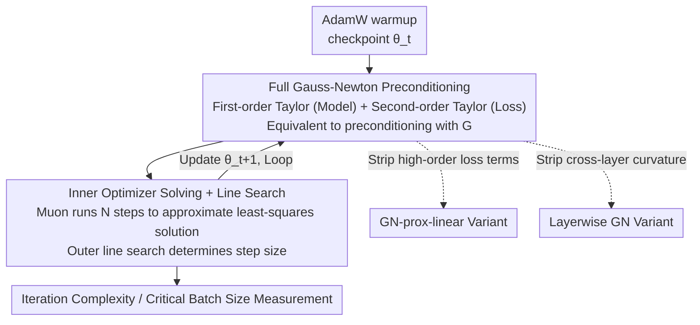

# The Potential of Second-Order Optimization for LLMs: A Study with Full Gauss-Newton

**Conference**: ICLR 2026  
**OpenReview**: [https://openreview.net/forum?id=yxEop1S5le](https://openreview.net/forum?id=yxEop1S5le)  
**Code**: https://github.com/natalieabreu/full-gauss-newton  
**Area**: LLM Efficiency / Optimizers  
**Keywords**: Second-order optimization, Gauss-Newton, Preconditioning, Critical batch size, Iteration complexity

## TL;DR
Instead of designing a new optimizer, this paper utilizes Jacobian-vector products to perform **actual full Gauss-Newton (GN) preconditioning** on 45M/150M LLaMA models. Treating this as a "performance upper bound" for second-order optimization, the study investigates the gap left by existing methods like SOAP/Muon/Shampoo that use approximate Hessians. Results demonstrate that full GN reduces the iterations required to reach a target loss by $5.4\times$ compared to SOAP and $16\times$ compared to Muon at large batch sizes. Furthermore, layerwise curvature—completely ignoring cross-layer information—nearly matches the performance of full GN.

## Background & Motivation
**Background**: The sequential wall of LLM pre-training is rising (taking days to months), making optimizers a core lever for compressing training time. While first-order methods like Adam/SGD remain mainstream, second-order methods (Shampoo, SOAP, Muon) have gained significant momentum. Shampoo won the AlgoPerf benchmark, outperforming Adam by 28%, and Muon has been scaled to 16B models, being 50% faster than AdamW. Theoretically, their acceleration stems from faster second-order convergence rates and the ability to sustain larger batch sizes (improving data parallelism efficiency).

**Limitations of Prior Work**: Existing "second-order" methods do not utilize complete second-order information. Storing or inverting a Hessian for an LLM (with billions of parameters) is computationally and memory-wise infeasible. Consequently, SOAP, Shampoo, and Muon rely on **layerwise, computationally efficient Hessian approximations** for preconditioning. However, the performance sacrifice incurred by these approximations has never been quantified.

**Key Challenge**: While research has focused on making approximations cheaper, there is a lack of a reference frame—**how well an ideal, full second-order method can actually perform**, and which structural properties of the Hessian (e.g., cross-layer information, high-order loss terms) are the critical sources of performance. Without this upper bound, it is impossible to determine if existing methods are near their limit or if substantial room for improvement remains.

**Goal**: (1) Establish a practical performance upper bound for full second-order optimization; (2) Disentangle which Hessian structures are essential—specifically, the importance of cross-layer curvature and high-order loss terms.

**Key Insight**: The authors compute the full Gauss-Newton matrix as a preconditioner regardless of the cost. The GN matrix is the first term of the Hessian decomposition and is naturally positive semi-definite (PSD) for cross-entropy and MSE losses, avoiding the divergence issues Newton's method faces with negative curvature, thus serving as a reasonable proxy for "ideal second-order" optimization.

**Core Idea**: Use Jacobian-vector products to bypass explicit Hessian storage. By performing a first-order Taylor linearization of the model and a second-order Taylor expansion of the loss, the problem of "minimizing this quadratic approximation" is mathematically **equivalent** to preconditioning with the GN matrix. An inner optimizer (Muon) is then used to solve this least-squares subproblem, obtaining the full GN update without ever materializing an $n \times n$ Hessian.

## Method

### Overall Architecture
The objective is to measure the performance ceiling of second-order optimization; thus, the framework is not a new optimizer but a training pipeline that **solves a full GN update at each step**. The primary difficulty is that the GN matrix $G := \nabla_\theta f(\theta)^\top \nabla_z^2 L(\theta) \nabla_\theta f(\theta)$ cannot be stored, and the ideal Newton/GN update $\theta^* = \theta - G^{-1}g$ cannot be computed directly.

The authors translate the problem: at the current parameters $\theta_t$, the model $f$ is linearized via a first-order Taylor expansion to get $f^{(1)}_{\theta_t}$, and the loss is expanded via a second-order Taylor approximation on this linearized model to yield $\tilde{L}^{(2)}_{\theta_t}(\theta)$. The update is defined as:

$$\theta^* = \arg\min_\theta \tilde{L}^{(2)}_{\theta_t}(\theta)$$

It is proven that the solution to this minimization is equivalent to a GN-preconditioned update. Since this least-squares subproblem cannot be solved analytically, an **inner optimizer** (Muon) runs $N$ steps to approximate $\theta^*$. An outer **line search** is then performed to determine the step size for the actual $\theta_{t+1}$. The global batch size is denoted as $b = N \times b_{\text{inner}}$.

To isolate which information in the Hessian is critical, two **structural ablation variants** are compared: GN-prox-linear (removing high-order loss terms) and Layerwise GN (removing cross-layer curvature). The pipeline starts from an AdamW warmup checkpoint (5% Chinchilla tokens) to ensure a fair comparison.

### Key Designs

**1. Full Gauss-Newton Preconditioning: Converting $G^{-1}g$ to Least-Squares via JVP**

The direct pain point is the storage and inversion of the LLM Hessian/GN matrix. Using the equivalence that the ideal GN update $\theta^* = \theta - G^{-1}g$ is the minimum of the convex quadratic objective $\tilde{L}^{(2)}_{\theta_t}(\theta)$, the authors compute gradients and Hessian-vector products using Jacobian-vector products (JVP). This **avoids explicit materialization of $G$** (implemented via the neural-tangents library). GN is chosen over the full Hessian because it is naturally PSD for cross-entropy/MSE, whereas the full Hessian's negative curvature can lead to unreliable updates or divergence. This implementation is ~1.5× slower than standard training, but serves as a diagnostic tool rather than a production optimizer.

**2. Inner Optimizer + Line Search: Stabilizing the Subproblem Solution**

The GN subproblem $\arg\min_\theta \tilde{L}^{(2)}_{\theta_t}(\theta)$ is solved iteratively. Muon significantly outperforms AdamW as an inner optimizer using $b_{\text{inner}}=32$ (45M) / $128$ (150M) for $N$ steps. Two elements are critical for stability: first, an **outer line search** $\alpha^* = \arg\min_\alpha L(\theta_t + \alpha(\hat\theta - \theta_t))$ to control step size; second, **cross-iteration information sharing**—initializing the inner minimization with parameters from the previous step (before line search). This aligns with findings in Hessian-free optimization (Martens, 2010). The reliance on these techniques suggests the results are a conservative upper bound.

**3. Structural Ablation Variants: Deconstructing Hessian Information**

To identify essential structural properties, two variants were designed. **GN-prox-linear**: Minimizes the **full loss** on the linearized model $\arg\min_\theta \tilde{L}_{\theta_t}(\theta)$ without the second-order Taylor expansion of the loss. By retaining high-order loss terms, the gap between this and GN reveals the utility of those terms. **Layerwise GN**: Performs Taylor expansion and solves second-order subproblems $\theta_{l,t+1} = \arg\min_{\theta_l}\tilde{L}^{(2)}_{\theta_{l,t}}(\theta_l)$ layer-by-layer, **ignoring cross-layer curvature**. The gap between this and full GN quantifies the importance of cross-layer Hessian information.

### Loss & Training
Models: 45M and 150M LLaMA models on the C4 dataset with a sequence length of 1024, trained on Chinchilla-optimal token counts. Baselines (AdamW, Muon, SOAP) underwent hyperparameter sweeps for learning rate, weight decay, and $\beta/\mu$. Learning rate schedules included global cosine, global+inner cosine, and constant+inner cosine. Normalization included inner weight decay/$\ell_2$ penalty and outer line search.

## Key Experimental Results

### Main Results: Iteration Complexity (Steps to reach loss 3.25, large batch regime)
Batches were selected above the critical batch size for each method to ensure that increasing the batch size further would not reduce steps.

| Method | Steps to reach loss 3.25 | Gap vs. GN |
|------|----------------------|----------------|
| Gauss-Newton (Ours) | **54** | 1× |
| Layerwise GN | 78 | 1.4× |
| SOAP | 292 | 5.4× |
| Muon | ~864 (16× GN) | 16× |
| AdamW | Slower | — |

GN progresses extremely rapidly in the first 10 steps, reaching a loss below 3.75 while other methods remain near the starting point. Layerwise GN requires only 1.4× more steps than full GN, yet is still 3.4× faster than SOAP.

### Fixed Token Count / Large Batch Performance (150M, 3B tokens)

| Configuration | Result | Note |
|------|------|------|
| GN @ batch 120M | loss **3.45**, only 20 steps | Strong at large batches |
| AdamW @ batch 1.2M | loss 3.4 | Peak performance at small batch |
| AdamW @ batch 120M | loss > 4.4 | Collapses at large batch |
| SOAP vs GN @ batch ≤ 4M | Close | GN advantage minimal at small batch |
| SOAP vs GN @ batch > 4M | GN Leads significantly | All gains are in large batch regime |

### Ablation Study

| Configuration | Key Observation | Conclusion |
|------|---------|-----------|
| Full GN | 54 steps, critical batch extends to 40M+ | True second-order upper bound |
| GN-prox-linear | Nearly overlaps with GN | **High-order loss terms are not necessary for acceleration** |
| Layerwise GN | 78 steps, approaches full GN | **Layerwise Hessian information provides most of the gains** |
| SOAP | 3.4× slower than Layerwise GN | Significant gap exists between current approximations and the bound |

### Key Findings
- **High-order loss terms are dispensable**: GN-prox-linear performs similarly to GN, suggesting that second-order (GN) information is sufficient and higher-order curvature is not critical for convergence speed.
- **Cross-layer curvature is largely dispensable**: Layerwise GN, which ignores cross-layer information, is only 1.4× slower than full GN. This implies that improving the accuracy of single-layer Hessian approximations (the strategy of SOAP/Shampoo) can theoretically capture most GN gains.
- **Significant Extension of Critical Batch Size**: Full GN continues to reduce step counts at 40M tokens, whereas AdamW plateaus at 4M and SOAP/Muon at 12M.
- **Advantage is in the Large Batch Regime**: At small batches (≤4M), GN and SOAP are similar; gain is derived entirely from the large-batch regime, consistent with theory regarding preconditioning benefits.

## Highlights & Insights
- **The "Upper Bound" as a First-class Citizen**: The paper's brilliance lies in its positioning—intentionally accepting a 1.5× overhead to establish a benchmark for the second-order optimization community.
- **JVP + Nested Optimization**: The use of model linearization and inner Muon solving provides a reusable framework for measuring "ideal second-order" performance in any architecture.
- **Controlled Ablation Experiments**: GN-prox-linear and Layerwise GN cleanly separate the contributions of high-order terms and cross-layer information.
- **Guiding Optimizer Research**: The fact that layerwise GN nearly matches full GN informs researchers that focusing on accurate single-layer Hessian approximations is the most productive path.

## Limitations & Future Work
- **Small Scale**: Experiments are limited to 150M parameters and 3B tokens. Whether these conclusions extrapolate to billion-parameter models is unverified.
- **Not a Practical Optimizer**: The current implementation is ~1.5× slower than standard training and is intended only as a diagnostic tool.
- **Potential for Improvement in Subproblem Solving**: The reliance on inner optimization means the measured upper bound may be conservative; a truly precise GN update might be even stronger.
- **Preconditioning Choice**: The study only uses $G^{-1}$ for preconditioning; other uses (damping, different inverse approximations) remain for future work.
- **Hyperparameter Sensitivity**: GN stability at high learning rates depends heavily on line search and scheduling.

## Related Work & Insights
- **vs. SOAP / Shampoo**: These use layerwise approximations. This paper shows SOAP is still 3.4× slower than its "ideal" layerwise counterpart, defining a clear room for improvement.
- **vs. Muon**: Muon uses Newton-Schulz orthogonalization. This paper reuses Muon as an inner optimizer to solve the GN subproblem.
- **vs. Hessian-free Optimization (Martens 2010)**: Similar to Hessian-free methods using CG, this paper uses JVP to avoid explicit Hessians but focuses on LLMs and replaces CG with Muon/Adam, confirming Martens' findings on the importance of information sharing across iterations.

## Rating
- Novelty: ⭐⭐⭐⭐⭐ Establishes the first practical full GN upper bound for LLMs.
- Experimental Thoroughness: ⭐⭐⭐⭐ Excellent analysis of iteration complexity and structural ablation; limited by model scale.
- Writing Quality: ⭐⭐⭐⭐⭐ Clear motivation and logical progression of conclusions.
- Value: ⭐⭐⭐⭐⭐ Provides a rigorous benchmark and clear direction for the development of approximate second-order optimizers.

<!-- RELATED:START -->

## Related Papers

- [\[ICLR 2026\] Scalable Second-Order Riemannian Optimization for K-means Clustering](scalable_second-order_riemannian_optimization_for_k-means_clustering.md)
- [\[AAAI 2026\] FedPM: Federated Learning Using Second-order Optimization with Preconditioned Mixing of Local Parameters](../../AAAI2026/optimization/fedpm_federated_learning_using_second-order_optimization_with_preconditioned_mix.md)
- [\[ICML 2025\] Sassha: Sharpness-aware Adaptive Second-order Optimization with Stable Hessian Approximation](../../ICML2025/optimization/sassha_sharpness-aware_adaptive_second-order_optimization_with_stable_hessian_ap.md)
- [\[ICLR 2026\] Convergence of Regret Matching in Potential Games and Constrained Optimization](convergence_of_regret_matching_in_potential_games_and_constrained_optimization.md)
- [\[ICLR 2026\] Hinge Regression Tree: A Newton Method for Oblique Regression Tree Splitting](hinge_regression_tree_a_newton_method_for_oblique_regression_tree_splitting.md)

<!-- RELATED:END -->
