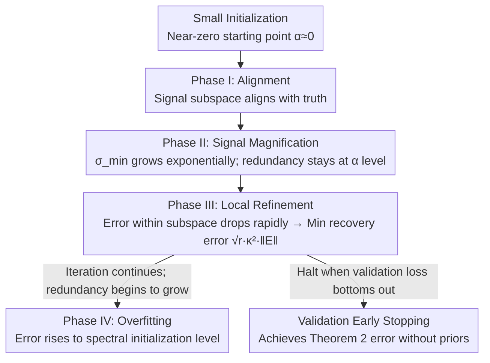

# The Power of Small Initialization in Noisy Low-Tubal-Rank Tensor Recovery

**Conference**: ICLR 2026  
**OpenReview**: [https://openreview.net/forum?id=6lobo2PXdl](https://openreview.net/forum?id=6lobo2PXdl)  
**Code**: To be confirmed  
**Area**: Optimization Theory / Low-Rank Tensor Recovery / Implicit Regularization  
**Keywords**: Low tubal-rank tensor recovery, factorized gradient descent, small initialization, over-parameterization, minimax optimal, early stopping

## TL;DR
In noisy low-rank tensor recovery with an over-estimated tubal-rank, this paper proves that setting the initialization scale of Factorized Gradient Descent (FGD) close to zero (small initialization) allows the final recovery error to depend only on the true tubal-rank $r$ rather than the over-estimated rank $R$. This approaches the information-theoretic minimax lower bound and can be achieved without any prior knowledge by using early stopping on a validation set.

## Background & Motivation

**Background**: Multi-dimensional data such as hyperspectral images, videos, and sensor arrays are naturally low-rank in tensor form. Many inverse problems (image completion, compressive imaging, background modeling, CT reconstruction) can be formulated as "recovering a low-rank tensor from a small number of noisy linear measurements $y=\mathcal{M}(\mathcal{X}^\star)+s$." Under the t-SVD / t-product framework, rank is characterized by tubal-rank. Directly minimizing the nuclear norm requires repeated t-SVD computations, which is computationally expensive for high dimensions. A more popular approach follows the Burer–Monteiro decomposition for matrices, representing a large tensor as the t-product of two small factor tensors $\mathcal{U}*\mathcal{U}^\top$ and applying Factorized Gradient Descent (FGD) to significantly save computational resources.

**Limitations of Prior Work**: FGD typically requires knowledge of the true tubal-rank $r$. However, in practice, $r$ is often unknown, necessitating an over-estimated rank $R>r$ (i.e., "over-parameterization" or "over-rank"). The problem arises when measurements are corrupted by dense noise (e.g., Gaussian noise), as over-parameterization amplifies the recovery error. Liu et al. (2024b) proved that for FGD with spectral initialization, the recovery error grows linearly with the over-estimated rank $R$—the more $R$ is over-estimated, the larger the error. Furthermore, over-parameterization degrades convergence from linear to sublinear.

**Key Challenge**: The dependence of the error on $R$ stems from the accumulation of noise components in the "over-parameterized directions." Spectral initialization provides an initial point where energy is already spread across the entire $R$-dimensional factor space, causing noise to be fitted in all $R$ directions simultaneously. To make the error depend only on the true rank $r$, one must prevent the $R-r$ redundant directions from growing.

**Goal**: This work aims to obtain an error upper bound for noisy over-parameterized low-rank tensor recovery that depends **only on the true tubal-rank $r$ and is independent of the over-estimated rank $R$**, and to show that this error can be achieved in practice without prior knowledge.

**Key Insight**: The authors observe a counterintuitive phenomenon (Fig. 1): when the initialization scale is set near zero, FGD first converges linearly to a low error level identical to that of the "known exact rank" case, remains there for a period, and only later does the error slowly climb back to the level of spectral initialization. This indicates that small initialization creates a "low-error window." The key task is to mathematically characterize when this window opens and closes.

**Core Idea**: Replace spectral initialization with small initialization so that signal directions are amplified rapidly while redundant directions remain suppressed at the initialization scale for a long duration. By using validation-based early stopping, the process can be halted within the low-error window, ensuring the recovery error depends only on $r$ and approaches minimax optimality.

## Method

### Overall Architecture

This paper does not propose a new algorithm but rather **establishes a four-phase analytical framework for the simple pipeline of "Small Initialization + FGD + Early Stopping," providing the tightest error bound to date**. The algorithm is minimalist: for a symmetric semi-definite true tensor $\mathcal{X}^\star=\mathcal{X}*\mathcal{X}^\top$ ($\mathcal{X}\in\mathbb{R}^{n\times r\times k}$), use an over-parameterized decomposition $\mathcal{U}\in\mathbb{R}^{n\times R\times k}$ to minimize

$$\min_{\mathcal{U}}\ f(\mathcal{U})=\frac{1}{4m}\big\|y-\mathcal{M}(\mathcal{U}*\mathcal{U}^\top)\big\|^2,$$

The FGD update is $\mathcal{U}_{t+1}=\mathcal{U}_t-\eta\cdot\big(\frac{1}{m}\mathcal{M}^*\mathcal{M}(\mathcal{U}_t*\mathcal{U}_t^\top-\mathcal{X}^\star)-\mathcal{E}\big)*\mathcal{U}_t$, where each element of the initial point is sampled i.i.d. from $\mathcal{N}(0,\alpha^2/R)$, with $\alpha$ being the initialization scale and $\mathcal{E}=\frac{1}{m}\mathcal{M}^*(s)$ being the noise term.

The core of the analysis involves **decomposing the factor $\mathcal{U}_t$ into "signal terms" and "over-parameterized terms."** Using the column space of the true tensor $\mathcal{V}_{\mathcal{X}}$ and performing a t-SVD on $\mathcal{V}_{\mathcal{X}}^\top*\mathcal{U}_t$ to obtain an alignment subspace $\mathcal{W}_t$:

$$\mathcal{U}_t=\underbrace{\mathcal{U}_t*\mathcal{W}_t*\mathcal{W}_t^\top}_{\text{Signal Term}}+\underbrace{\mathcal{U}_t*\mathcal{W}_{t,\perp}*\mathcal{W}_{t,\perp}^\top}_{\text{Over-parameterized Term}}.$$

Three scalars characterize the dynamics: signal strength $\sigma_{\min}(\mathcal{U}_t*\mathcal{W}_t)$, redundant energy $\|\mathcal{U}_t*\mathcal{W}_{t,\perp}\|$, and the subspace alignment between the signal and truth $\|\mathcal{V}_{\mathcal{X}_\perp}^\top*\mathcal{V}_{\mathcal{U}_t*\mathcal{W}_t}\|$. The FGD trajectory is partitioned into four phases; the minimum error occurs in Phase III, and the error increases in Phase IV—which is precisely where early stopping intervenes.

### Key Designs

**1. Small Initialization: Decoupling Recovery Error from Highly Over-estimated Rank $R$**

This design directly addresses the limitation of "error growing linearly with $R$." Spectral initialization starts with energy spread across all $R$ factor directions, leading to noise being fitted by all directions. Small initialization (e.g., $\alpha=10^{-10}$) ensures all directions start near zero. Gradient dynamics cause the $r$ directions occupied by the true signal to amplify exponentially due to the "attraction" of the true value, while the $R-r$ redundant directions lack a source of magnification and remain at the initialization scale $\alpha$ for a prolonged period. During the minimum error phase, the over-parameterized term $\|\mathcal{U}_t*\mathcal{W}_{t,\perp}\|^2$ is negligible, and the error is dominated by components within the subspace. Using a key inequality for the column space projection $\mathcal{V}_{\mathcal{X}}$:

$$\|\mathcal{V}_{\mathcal{X}}^\top*(\mathcal{U}_t*\mathcal{U}_t^\top-\mathcal{X}^\star)\|_F\le \sqrt{r}\,\|\mathcal{V}_{\mathcal{X}}^\top*(\mathcal{U}_t*\mathcal{U}_t^\top-\mathcal{X}^\star)\|,$$

the final error is bounded by $\|\mathcal{U}_{\hat t}*\mathcal{U}_{\hat t}^\top-\mathcal{X}^\star\|_F\lesssim\sqrt{r}\,\kappa^2\|\mathcal{E}\|$—containing only the true rank $r$, condition number $\kappa$, and noise spectral norm $\|\mathcal{E}\|$, and **entirely independent of $R$** (Theorem 2). This is the first known error bound independent of the over-estimated tensor rank and makes no specific assumptions about noise distribution as long as $\|\mathcal{E}\|\le c\kappa^{-2}\sigma_{\min}^2(\mathcal{X})$. Theorem 2 also provides upper bounds for $\alpha$ and required iterations $\hat t$ across three degrees of over-estimation ($R=r$, $r<R<3r$, $R\ge 3r$); more extreme over-estimation requires smaller $\alpha$.

**2. Four-stage Trajectory Analysis: Characterizing why the "Low-error Window" Opens and Closes**

To prove the error bound, one must precisely track the evolution of signal and redundant terms over time. This work divides the FGD trajectory into four phases: **(I) Alignment Phase**—alignment $\|\mathcal{V}_{\mathcal{X}_\perp}^\top*\mathcal{V}_{\mathcal{U}_t*\mathcal{W}_t}\|$ decreases as the signal subspace turns toward the truth while both signal and redundancy remain small; **(II) Signal Magnification Phase**—$\sigma_{\min}(\mathcal{U}_t*\mathcal{W}_t)$ grows exponentially until it reaches at least $\sigma_{\min}(\mathcal{X})/\sqrt{10}$, while redundant terms stay at the initialization scale; **(III) Local Refinement Phase**—the error is decomposed as $\|\mathcal{U}_t*\mathcal{U}_t^\top-\mathcal{X}^\star\|\le 4\|\mathcal{V}_{\mathcal{X}}^\top*(\mathcal{U}_t*\mathcal{U}_t^\top-\mathcal{X}^\star)\|+\|\mathcal{U}_t*\mathcal{W}_{t,\perp}\|^2$, where the redundancy term is small and the subspace error drops rapidly to reach the global minimum; **(IV) Overfitting Phase**—redundant terms $\|\mathcal{U}_t*\mathcal{W}_{t,\perp}\|$ finally begin to grow, causing the overall error to rise and approach the levels of spectral initialization.

Unlike Karnik et al. (2025), who only split noise-free trajectories into "spectral" and "convergence" phases, the four-phase decomposition here tracks noise evolution per phase, enabling minimax-level guarantees under noisy conditions. Reducing this framework to $k=1$ (the third dimension) recovers the matrix case. However, the tensor case is non-trivial: when certain tubes of the true tensor are non-invertible in the Fourier domain, the range and kernel are no longer complementary, causing signal/redundancy decomposition to fail. This necessitates a more refined tensor condition number and consideration of coupling across frequency slices by the measurement operator.

**3. Minimax Lower Bound: Proving the Error Bound is "Near-Optimal"**

An upper bound alone is insufficient; it must be shown how good it is. This work derives an information-theoretic minimax lower bound for the Gaussian noise case (Theorem 3): under $(r,\delta)$ t-RIP and $s\sim\mathcal{N}(0,\sigma^2 I)$, the worst-case mean squared error for any estimator $\mathcal{X}^{est}$ satisfies:

$$\sup_{\mathcal{X}^\star}\mathbb{E}\|\mathcal{X}^{est}-\mathcal{X}^\star\|_F^2\ge\frac{1}{1+\delta}\cdot\frac{nrk\sigma^2}{m},$$

meaning no method can consistently suppress error below $\Theta(nrk\sigma^2/m)$. Correspondingly, Corollary 1 proves that under Gaussian noise, the error of small-initialization FGD is $\|\mathcal{U}_{\hat t}*\mathcal{U}_{\hat t}^\top-\mathcal{X}^\star\|_F^2\lesssim nkr\kappa^4\sigma^2/m$. This differs from the lower bound only by constant factors and the dependence on $\kappa$, making it **near minimax optimal**. Regarding sample complexity, this work requires only $(2r+1,\delta)$ t-RIP ($m\gtrsim nkr/\delta^2$), whereas Liu et al. (2024b) required $(4R,\delta)$ t-RIP; here, the sampling requirement is independent of $R$, representing the first minimax error analysis in the tensor setting.

**4. Validation Early Stopping: Reaching the Minimum Error without Priors**

The optimal stopping step $\hat t$ in Theorem 2 depends on the unknown $\mathcal{X}^\star$. Stopping too early or too late (falling into Phase IV) increases the error, making it impractical. This work employs validation-based early stopping: the observations $\{\mathcal{A}_i,y_i\}_{i=1}^m$ are randomly split into training and validation sets. FGD runs exclusively on the training set, and the validation loss $e_t=\frac14\|y_{val}-\mathcal{M}_{val}(\mathcal{U}_t*\mathcal{U}_t^\top)\|^2$ is monitored. The output is $\mathcal{U}_{\check t}*\mathcal{U}_{\check t}^\top$ where $\check t=\arg\min_t e_t$. Theorem 4 provides the theoretical guarantee: when the number of validation samples satisfies $m_{val}\ge C_1\frac{m_{train}^2\log T}{(rnk\kappa^4)^2}$, the selected solution still satisfies $\|\mathcal{U}_{\check t}*\mathcal{U}_{\check t}^\top-\mathcal{X}^\star\|_F^2\le C\,nkr\sigma^2\kappa^4/m_{train}$, matching the Theorem 2 bound. Given $m_{train}\gtrsim nkr^2\kappa^8$, the required $m_{val}\gtrsim r^2\kappa^8\log T$ is relatively small and practically feasible; experiments show 5%–10% of total samples suffice.

### Loss & Training
The objective function is the squared measurement residual $f(\mathcal{U})=\frac{1}{4m}\|y-\mathcal{M}(\mathcal{U}*\mathcal{U}^\top)\|^2$. Optimization is performed using fixed-step FGD. Critical hyperparameters include the initialization scale $\alpha$ (set to $10^{-10}$ for small initialization; spectral/large initialization might require smaller step sizes like $0.001$ to prevent divergence), step size $\eta$, validation ratio $m_{val}/m$ (recommended 5%–10%), and the early stopping point $\check t$ triggered by the validation loss.

## Key Experimental Results

Simulation setup: Synthetic $\mathcal{X}^\star=\mathcal{X}*\mathcal{X}^\top$ (elements sampled from $\mathcal{N}(0,1)$ and normalized), Gaussian measurement operator, noise $s\sim\mathcal{N}(0,\sigma^2)$, $n=30, k=3, r=3$. Metrics use Relative Square Error RSE $=\|\mathcal{U}_t*\mathcal{U}_t^\top-\mathcal{X}^\star\|_F^2/\|\mathcal{X}^\star\|_F^2$, averaged over 20 trials. Comparison of four initiations: exact rank baseline, spectral initialization, large random initialization, and small random initialization (best step / ES).

### Main Results (Simulation, Key Conclusions from Fig. 2)

| Variation | Spectral / Large Random Init | Small Initialization (best/ES) |
| :--- | :--- | :--- |
| Increasing Over-estimated Rank $R$ | Error increases monotonically with $R$. | Consistently matches baseline; independent of $R$. |
| Increasing Noise $\sigma$ | Higher error than small initialization. | Closely follows baseline. |
| Increasing Dimension $n$ | Converges to spectral levels with more iterations. | Closely follows baseline. |
| Decreasing Samples $m=2C_m nrk$ | Higher error. | Maintains low error at $m=3nrk$; more sample efficient. |

Core Observation: In all four settings, small initialization achieves the same minimum error as the "exact rank" baseline. The ES version approaches the baseline without any prior knowledge. Spectral and large random initialization errors grow with $R$; large random initialization suffers particularly high error due to slow convergence.

### Real Data (Color Image Completion, Excerpt from Table 2, $p=0.3$)

| Method | $\sigma=0.07$ PSNR↑ | RE↓ | $\sigma=0.1$ PSNR↑ | RE↓ |
| :--- | :--- | :--- | :--- | :--- |
| TCTF (Rank Est.) | 20.67 | 0.2008 | 20.63 | 0.2024 |
| TNN (Convex) | 22.06 | 0.1681 | 20.17 | 0.2082 |
| GTNN (Non-convex) | 23.15 | 0.1481 | 21.11 | 0.1867 |
| **FGD-ES (Ours, Early Stop)** | 23.66 | 0.1426 | 22.72 | 0.1585 |
| **FGD-best (Ours, Best Step)** | **23.84** | **0.1395** | **22.86** | **0.1559** |

In completion tasks on 50 $481\times321\times3$ color images from the Berkeley dataset (Bernoulli sampling + Gaussian noise), FGD-best leads in PSNR across all采样率/noise combinations. FGD-ES is slightly lower but consistently outperforms all baseline methods. Notably, as tensor completion does not satisfy t-RIP, small initialization still achieves the lowest reconstruction error.

### Key Findings
- **Small initialization is the sole switch for decoupling error from $R$**: With the same FGD and early stopping, simply changing the initialization scale from spectral/large to near-zero transforms the error from "linearly increasing with $R$" to "constant at the exact rank baseline."
- **Validation ratio sweet spot**: Too many validation samples reduce training data and increase error, while too few (<5%) make validation unreliable. 5%–10% is most robust; the validation loss minimum aligns perfectly with the true RSE minimum.
- **Insensitivity to Rank Over-estimation**: In real data, setting $R=50/75/100/125$ had minimal impact on PSNR, confirming that taking a larger value for $R$ is a safe strategy when the rank is unknown.

## Highlights & Insights
- **First rigorous extension of the "small initialization implicit regularization" from matrices to the tensor t-SVD setting while including noise**: The core challenge involved the non-complementary nature of tensor range/kernels and coupled frequency slices. These were addressed through four-phase decomposition, column space projection, and tensor condition numbers.
- **Combined upper and lower bounds establish "near-optimality"**: The upper bound $\sqrt{r}\kappa^2\|\mathcal{E}\|$ is compared against the minimax lower bound $\Omega(nrk\sigma^2/m)$, showing they differ only by constants and $\kappa$ dependence.
- **The non-monotonic error curve (convergence followed by overfitting)** is precisely characterized as the transition from Phase III to Phase IV. This transforms early stopping from an empirical heuristic into a theoretically grounded procedure.

## Limitations & Future Work
- **Theory assumes a symmetric semi-definite tensor** $\mathcal{X}^\star=\mathcal{X}*\mathcal{X}^\top$; the general asymmetric case $\mathcal{X}\approx\mathcal{L}*\mathcal{R}^\top$ requires symmetrization and analysis of imbalance terms between factor trajectories, which are only briefly discussed in the appendix.
- **The error bound still carries a high-degree dependence on the condition number $\kappa$** (e.g., $\kappa^4$), which might lead to poor constants for ill-conditioned tensors.
- **t-RIP is a strong sampling assumption for theoretical proof**; the authors acknowledge that in practice, much fewer samples than required by theory are sufficient. Real-world tasks like completion do not satisfy t-RIP, leaving a gap between theory and practice.

## Related Work & Insights
- **vs. Liu et al. (2024b)**: Both use FGD for low tubal-rank recovery, but their spectral initialization leads to sublinear convergence under over-parameterization, $R$-dependent error, and a requirement for $(4R,\delta)$ t-RIP. This work uses small initialization to maintain linear convergence, achieve $r$-only error, and require only $(2r+1,\delta)$ t-RIP.
- **vs. Karnik et al. (2025)**: They studied implicit regularization of small initialization in the noise-free case with a two-phase trajectory. This work provides noisy recovery guarantees, uses four-phase decomposition to track noise, and offers a more relaxed initialization scale $\alpha$ upper bound.
- **vs. Rank-estimation methods (TCTF / TC-RE / Shi et al. 2021)**: These attempt to identify true tubal-rank. This work avoids rank estimation entirely, ensuring "over-estimation is safe" and providing the first rank-independent error bound in the t-SVD setting.

## Rating
- Novelty: ⭐⭐⭐⭐⭐ First error bound independent of over-estimated tensor rank + first minimax analysis in the tensor setting.
- Experimental Thoroughness: ⭐⭐⭐⭐ Extensive simulation scans plus real image completion, though primarily focused on theoretical validation.
- Writing Quality: ⭐⭐⭐⭐ The four-phase framework and comparison tables clearly articulate the contributions; the density of formulas may be high for non-theory readers.
- Value: ⭐⭐⭐⭐ "Large $R$ + Small Initialization + Validation Early Stopping" is a practical, theoretically backed recipe.

<!-- RELATED:START -->

## Related Papers

- [\[ICLR 2026\] Trion: FFT-based Dynamic Subspace Selection for Low-Rank Adaptive Optimization of LLMs](trion_fft-based_dynamic_subspace_selection_for_low-rank_adaptive_optimization_of.md)
- [\[ICLR 2026\] Towards Efficient Optimizer Design for LLM via Structured Fisher Approximation with a Low-Rank Extension](towards_efficient_optimizer_design_for_llm_via_structured_fisher_approximation_w.md)
- [\[ICLR 2026\] LoRA meets Riemannion: Muon Optimizer for Parametrization-independent Low-Rank Adapters](lora_meets_riemannion_muon_optimizer_for_parametrization-independent_low-rank_ad.md)
- [\[ECCV 2024\] Handling the Non-smooth Challenge in Tensor SVD: A Multi-objective Tensor Recovery Framework](../../ECCV2024/optimization/handling_the_non-smooth_challenge_in_tensor_svd_a_multi-objective_tensor_recover.md)
- [\[ICLR 2026\] Hierarchical Multi-Stage Recovery Framework for Kronecker Compressed Sensing](hierarchical_multi-stage_recovery_framework_for_kronecker_compressed_sensing.md)

<!-- RELATED:END -->
## Related Papers

- [\[ICLR 2026\] Trion: FFT-based Dynamic Subspace Selection for Low-Rank Adaptive Optimization of LLMs](trion_fft-based_dynamic_subspace_selection_for_low-rank_adaptive_optimization_of.md)
- [\[ICLR 2026\] Towards Efficient Optimizer Design for LLM via Structured Fisher Approximation with a Low-Rank Extension](towards_efficient_optimizer_design_for_llm_via_structured_fisher_approximation_w.md)
- [\[ICLR 2026\] LoRA meets Riemannion: Muon Optimizer for Parametrization-independent Low-Rank Adapters](lora_meets_riemannion_muon_optimizer_for_parametrization-independent_low-rank_ad.md)
- [\[ECCV 2024\] Handling the Non-smooth Challenge in Tensor SVD: A Multi-objective Tensor Recovery Framework](../../ECCV2024/optimization/handling_the_non-smooth_challenge_in_tensor_svd_a_multi-objective_tensor_recover.md)
- [\[ICLR 2026\] Combinatorial Bandit Bayesian Optimization for Tensor Outputs](combinatorial_bandit_bayesian_optimization_for_tensor_outputs.md)

<!-- RELATED:END -->
