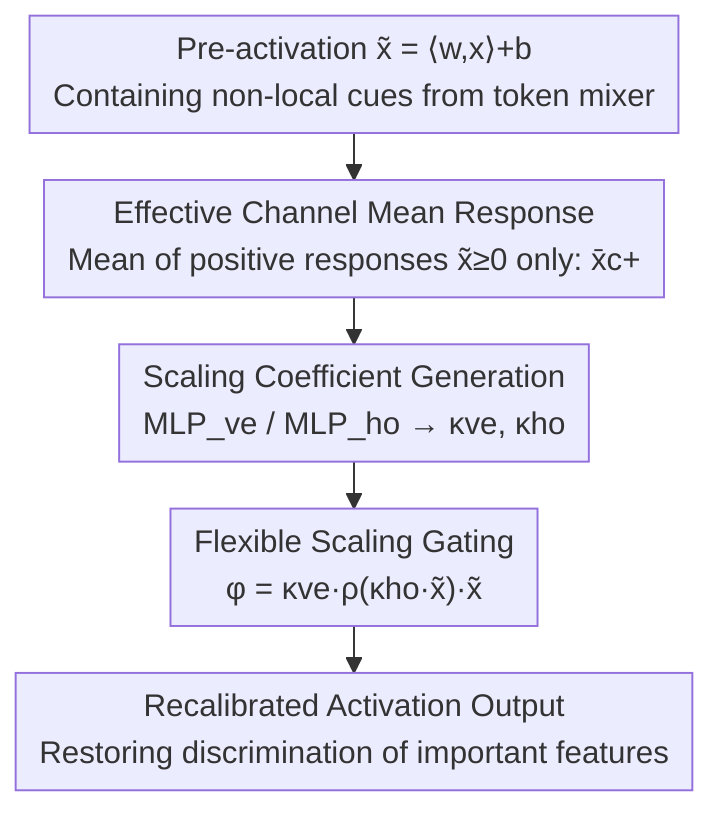

# Toward Principled Flexible Scaling for Self-Gated Neural Activation

**Conference**: ICLR 2026  
**OpenReview**: [https://openreview.net/forum?id=XGODWn7HeJ](https://openreview.net/forum?id=XGODWn7HeJ)  
**Code**: https://github.com/SudongCAI/FleS  
**Area**: Optimization / Activation Functions  
**Keywords**: Self-gated activation, non-local tension, convergence limitation, flexible scaling, decision-making perspective

## TL;DR
From a decision-making (multi-criteria scoring) perspective, this paper reveals the root cause of why self-gated activation functions underperform in layers already modeling fine-grained context (e.g., Transformers): gating function saturation leads to "trivially discriminative gating weights" for important features. The authors propose FleS, which uses sign-sensitive channel statistics via a small MLP to generate adaptive "vertical + horizontal" scaling coefficients. These coefficients dynamically adjust the upper bound and steepness of the gating curve. FleS consistently outperforms SOTA activation functions on Swin/PoolFormer/ResNet (e.g., 71.4% vs. 68.7% for GELU on Swin-Min).

## Background & Motivation

**Background**: Activation functions are essential for neural networks to acquire non-linear expressive power. The evolution has progressed from rigid 0/1 rectification (ReLU) to self-gated activations (SiLU / GELU / Mish), and further to dynamic activations introducing learnable boundaries, content-adaptability, and non-local cues (Swish / ACON / Meta-ACON). The primary objective has been increasing the "flexibility" of the activation curve. The unified form of self-gated activation is $\phi(\tilde{x}) = \rho(\tilde{x})\,\tilde{x}$, where $\tilde{x} = \langle w, x\rangle + b$ is the pre-activation and $\rho(\cdot) \in (0,1)$ is the weighting function assigning gating weights to each feature.

**Limitations of Prior Work**: While these SOTA dynamic activations improve performance in traditional CNNs, they suffer from significant "effectiveness failure" when integrated into Transformer layers. Since Transformers already use attention to model fine-grained non-local dependencies outside the activation module, introducing another layer of non-local cues within the activation leads to redundant information that offsets benefits. The authors term this overlooked phenomenon **non-local tension**.

**Key Challenge**: From a decision-making perspective, the "affine → activation" process is analogous to Gray Relational Analysis in multi-criteria decision-making—filter $w$ represents the "ideal pattern" $w_A$, feature $x$ is the "candidate," channels are "decision criteria," pre-activation $\tilde{x} = \|w\|\|x\|\cos\theta_{w,x} + b$ is the importance score of $x$ relative to $w_A$, and $\rho(\cdot)$ is the "decision weight" for sign-sensitive recalibration. Through this lens, the root cause is identified as the **saturation of the gating function $\rho$**. When two features are both highly important (large $\tilde{x}_i, \tilde{x}_j$), even if $\tilde{x}_i$ is significantly larger than $\tilde{x}_j$, the saturated sigmoid/ERF assigns them nearly identical gating weights, smoothing out importance differences. This is named the **convergence limitation**, which is proven to be the upstream cause of non-local tension.

**Goal**: (1) Elevate the empirical observation of "why dynamic activations fail in Transformers" to a provable mechanism; (2) Design an activation function that maintains fine-grained discrimination even when important features are pushed to large values.

**Key Insight**: Since the fixed upper bound $M$ of $\rho$ is the root cause, rather than fixing the shape of $\rho$, it should be equipped with **adaptively scalable boundaries and steepness**. This allows the gating curve to re-expand the "information-rich response interval."

**Core Idea**: Utilize a pair of "vertical scaling $\kappa_{ve}$ (adjusting the bound) + horizontal scaling $\kappa_{ho}$ (adjusting steepness)" coefficients, generated from non-local statistical cues, to dynamically deform the gating curve and resolve the convergence limitation.

## Method

### Overall Architecture
The objective of FleS is to introduce two adaptive scaling coefficients into a standard self-gated activation $\phi(\tilde{x}) = \rho(\tilde{x})\tilde{x}$, allowing the "height (upper bound)" and "transverse steepness" of the gating function $\rho$ to vary with the current layer and channel feature distribution. The prototype form (FleS-Proto) is defined as:

$$\phi(\tilde{x}) = \kappa_{ve}\,\rho(\kappa_{ho}\,\tilde{x})\,\tilde{x}$$

Where $\kappa_{ve}$ (vertical) raises or lowers the value range of gating weights, and $\kappa_{ho}$ (horizontal) modifies the steepness of $\rho$ along the horizontal axis—effectively pulling the high-response interval back from the saturated "plateau" into the sloped region to restore discriminative power between important features. Both coefficients are derived from a **signed, per-channel statistic** non-local cue: the mean of **positive response** features (effective mean response) for each channel, which is then normalized and mapped to scaling coefficients via a pair of small MLPs. The pipeline consists of "computing channel effective response → MLP transformation to scaling coefficients → deforming the gating curve → recalibrating feature contributions."

### Key Designs

**1. Flexible Bi-directional Scaling: Re-expanding Saturated Gating Curves**

Addressing the convergence limitation where important features yield nearly identical gating weights, FleS does not change the analytical form of $\rho$ but introduces vertical and horizontal scaling knobs. The vertical coefficient $\kappa_{ve}$ makes the upper bound $M$ adjustable, while the horizontal coefficient $\kappa_{ho}$ scales the input proportionally. The latter is critical: when $\tilde{x}_i, \tilde{x}_j$ fall into the saturation plateau of $\rho$, $\kappa_{ho}$ adjusts the "steepness," equivalent to re-mapping these points to a section where $\rho$ still has a gradient, thereby widening the gap between $\rho(\kappa_{ho}\tilde{x}_i)$ and $\rho(\kappa_{ho}\tilde{x}_j)$. This is theoretically supported by the Convergence Limitation Theorem (Theorem 3.1), which proves that if $\lim_{\tilde{x}\to+\infty}\rho(\tilde{x}) = M > 0$, for any $\epsilon > 0$, there exists a threshold $X$ such that for all $\tilde{x}_i, \tilde{x}_j > X$, $|\rho(\tilde{x}_i) - \rho(\tilde{x}_j)| < \epsilon$. Fixed bound equals inevitable saturation, which nullifies discrimination; thus, making the bound and steepness variable is the direct remedy. Notably, FleS reduces to SiLU when $\kappa_{ve}, \kappa_{ho}$ are omitted, making it a strict generalization of self-gated activations.

**2. Signed Effective Channel Mean Response: Focusing on Positive Features**

What cues should drive the scaling coefficients? The authors argue that non-local tension is a **statistical/collective** effect triggered by a group of relatively important features. Thus, scaling must be based on the relative relationship of a "reference feature group" rather than individual features. The cue is the mean of **non-negative response** features in each channel $c$:

$$\bar{x}_c^{+} = \mathrm{mean}_{\tilde{x}\in \mathcal{X}_c}\{\tilde{x}\mid \tilde{x}\geq 0\}$$

Followed by cross-channel normalization $\mu(\{\bar{x}_c^{+}\}) = \bar{x}_c^{+} / (\tfrac{1}{C}\sum_i \bar{x}_i^{+})$. The rationale for only using positive responses is supported by Proposition 4.1 (Relative Recalibration Bias): under the assumption of sigmoid-type $\rho$ and $\tilde{x}\sim N(\mu,\sigma)$, the ratio of expected contributions from negative vs. positive features $R(\mu,\sigma) = \frac{E(\rho(\tilde{x})|\tilde{x}<0)}{E(\rho(\tilde{x})|\tilde{x}>0)}$ satisfies $\lim_{\sigma\to\infty}R(\mu,\sigma) = 0$. As the distribution spreads, positive features dominate the contribution. Negative features would "neutralize" the effective information of positive features if included in the mean. Gradient statistics confirm this: the gradient magnitude at positive response positions is significantly larger than at negative ones (ratio of ~5.3× to 13.8× from stages 1 to 4), indicating optimization signals are concentrated on the positive side.

**3. Small MLP as "Channel Attribute Recorder": Enabling Scaling on Real Distributions**

FleS-Proto directly generates coefficients using $\kappa = \mathrm{softplus}(\alpha\,\mu(\{\bar{x}_c^{+}\}) + \gamma)$ with linear + softplus mapping ($\alpha$ initialized at $1\times10^{-3}$ for adaptivity, $\gamma$ at $0.6$ to keep $\kappa$ near $1.0$ early in training). However, Proto relies on "clean, category-sorted" statistical intervals. In non-shuffled evaluations, Swin-Micro reaches 85.2%, but crashes to 77.3% (below the vanilla baseline) when the batch is shuffled. To make the method robust for real-world scenarios, FleS replaces coefficient generation with a lightweight MLP (compression ratio 32): $\kappa_{ve} = \mathrm{MLP}_{ve}(\bar{x}^{+})$ and $\kappa_{ho} = \mathrm{MLP}_{ho}(\bar{x}^{+})$. The translation invariance of the MLP allows it to "sniff out" informative patterns within the effective channel mean vector $\bar{x}^{+}\in\mathbb{R}^C$ of complex distributions. For dense tasks like COCO, $\bar{x}_c^{+}$ is calculated over finer local neighborhoods (e.g., 9×15 patches). This step transitions the "theoretically elegant Proto" into a "practical model" applicable to any recognition task.

### Loss & Training
FleS does not modify the training objective, only the activation functions. The visual backbones follow standard Transformer/CNN recipes (300-epoch DeiT recipe for Swin/PoolFormer; 120-ep for Swin-Min; standard CNN recipe for ResNet). Initialization of $\alpha, \gamma$ is key for stability: a minimal $\alpha$ ensures early training resembles identity gating, while $\gamma=0.6$ allows scaling coefficients to expand smoothly from 1.0.

## Key Experimental Results

### Main Results
Comparison of activation functions on MetaFormer backbones (Swin-Min / PoolFormer-S12) which already model non-local context (ImageNet Top-1):

| Backbone | Activation | #Params | Top-1(%) |
|----------|------------|---------|----------|
| Swin-Min (120ep) | GELU | 11.8M | 68.7 |
| Swin-Min | SMU | 11.8M | 68.9 |
| Swin-Min | IIEU | 13.4M | 69.5 |
| Swin-Min | AdaS | 13.7M | 69.7 |
| Swin-Min | Meta-ACON | 13.4M | 68.3 |
| Swin-Min | **FleS** | 13.0M | **71.4** |
| Swin-Min | **FleS-AdaS** | 14.1M | **73.0** |
| PoolFormer-S12 (300ep) | GELU | 11.9M | 77.2 |
| PoolFormer-S12 | IIEU | 14.3M | 78.6 |
| PoolFormer-S12 | **FleS** | 13.8M | **79.4** |

Key observation: The gains of FleS over SOTA activations are larger than the gains of those SOTA activations over the GELU baseline. Dynamic activations like Meta-ACON / SMU barely outperform GELU in Transformer layers, confirming the existence of non-local tension and the correctness of the FleS approach. FleS also scales to larger backbones (Swin-M 78.7→80.3, ViT-B/16 79.7→80.7) and achieves 80.1% on ResNet-50 (vs. 77.2% ReLU), proving general versatility.

### Ablation Study

| Config | Backbone | Top-1(%) | Description |
|--------|----------|----------|-------------|
| GELU | Swin-Min | 68.7 | Baseline |
| FleS-DG | Swin-Min | 69.1 | Without channel statistics, $\kappa=\mathrm{softplus}(\gamma)$ |
| FleS-P&N | Swin-Min | 69.8 | Mean of both positive and negative responses |
| FleS (Full) | Swin-Min | **71.4** | Full model |

### Key Findings
- **Channel statistical cues contribute most**: Removing them (FleS-DG) drops accuracy from 71.4% to 69.1%, though still slightly above GELU—indicating that while "scaling coefficients" are useful, "effective statistics-driven scaling" is the primary driver.
- **Signed separation is necessary**: Including negative responses (FleS-P&N) yields only 69.8%, far lower than the 71.4% of positive-only responses, validating Prop 4.1's analysis of "negative features neutralizing positive contributions."
- **Proto sensitivity to statistical purity**: Accuracy dropped from 85.2% (non-shuffle) to 77.3% (shuffle) for Proto, justifying the MLP-based practical version.
- **Asymmetric gradients intensify with depth**: The positive/negative gradient ratio increases from 5.3× in shallow layers to 13.8× in deep layers, aligning with the "signed, positive-biased" design.

## Highlights & Insights
- **Formalizing empirical failure into theorem**: The Convergence Limitation Theorem (fixed bound ⇒ converged gating weights) explains why Meta-ACON/SMU fail in Transformers. This "falsify then remedy" narrative is highly persuasive.
- **Decision-making perspective as an analytical tool**: Mapping filters/features/channels to ideals/candidates/criteria makes "gating weight = decision weight," naturally leading to the criterion that importance score differences should not be smoothed out.
- **Horizontal scaling $\kappa_{ho}$ is an underrated knob**: While most dynamic activations only adjust the bound (vertical), FleS shows that adjusting "steepness" is the key to bringing saturated points back to the sloped region. This insight is transferable to any module with saturated gating (e.g., softmax temperature in attention).
- **Listening only to positive features**: Explicitly encoding sign information into statistics via softplus and positive-only means is a lightweight yet efficient design trick backed by theory (Prop 4.1) and gradient measurements.

## Limitations & Future Work
- **Extra parameters and statistical dependency**: FleS requires MLP recorders for extra parameters (though FLOPs increase is negligible) and depends on the quality of "effective channel mean response." While the MLP mitigates the Proto version's failure under shuffling, robustness in extreme long-tail or multi-class mixed scenarios requires more validation.
- **Applicability of theoretical assumptions**: Theorems assume $\rho$ has a fixed positive bound and $\tilde{x}$ is approximately Gaussian. Real deep network distributions may vary; conclusions are "motivating insights" rather than strict guarantees (⚠️ see Appendix for derivation details).
- **Limited NLP evaluation**: Although the text mentions GLUE validation and a FleS-SeqGate variant, main results are concentrated on vision. Cross-modal systematic comparisons are currently less comprehensive.
- **Future Improvements**: Extending coefficient generation from channel-wise to token/spatial adaptive, or joint learning with attention temperature, could further alleviate non-local tension.

## Related Work & Insights
- **vs. Meta-ACON / SMU**: They also use non-local cues to recalibrate boundaries but only adjust the upper bound and inject relatively coarse cues. In Transformer layers with pre-existing context, this triggers non-local tension and limited gains. FleS resolves this using signed channel statistics and bi-directional scaling.
- **vs. IIEU / AdaShift (Cai 2023/2024a)**: Also belonging to the decision-making perspective, IIEU solves "Mismatch Feature Scoring (MFS)" and AdaShift adds adaptive bias. FleS identifies the "contradictory use of non-local cues" as the missing piece and can be stacked with AdaShift (FleS-AdaS improves Swin-Min from 69.7% to 73.0%).
- **vs. SiLU / GELU**: FleS is a strict generalization—removing the scaling coefficients reduces it back to SiLU. The difference is that FleS allows the gating curve to deform dynamically with feature distribution, whereas SiLU/GELU curves are static and lose discrimination in the high-response region.

## Rating
- Novelty: ⭐⭐⭐⭐⭐ First to formalize "dynamic activation failure in Transformers" as convergence limitation/non-local tension and provide a theoretically grounded bi-directional scaling solution.
- Experimental Thoroughness: ⭐⭐⭐⭐ Covers Swin/PoolFormer/ViT/ResNet across multiple backbones with sufficient ablation, though NLP main results are somewhat sparse.
- Writing Quality: ⭐⭐⭐⭐ Self-consistent decision-making perspective; theorems and designs align well, though theoretical density might be high for some readers.
- Value: ⭐⭐⭐⭐⭐ A plug-and-play activation function providing immediate gains for modern networks using non-local token mixers.

<!-- RELATED:START -->

## Related Papers

- [\[ICLR 2026\] Multi-Action Self-Improvement for Neural Combinatorial Optimization](multi-action_self-improvement_for_neural_combinatorial_optimization.md)
- [\[ICLR 2026\] Neural Multi-Objective Combinatorial Optimization for Flexible Job Shop Scheduling Problems](neural_multi-objective_combinatorial_optimization_for_flexible_job_shop_scheduli.md)
- [\[ICLR 2026\] Activation Function Design Sustains Plasticity in Continual Learning](activation_function_design_sustains_plasticity_in_continual_learning.md)
- [\[ICLR 2026\] Provable and Practical In-Context Policy Optimization for Self-Improvement](provable_and_practical_in-context_policy_optimization_for_self-improvement.md)
- [\[ICLR 2026\] Exploring Diverse Generation Paths via Inference-time Stiefel Activation Steering](exploring_diverse_generation_paths_via_inference-time_stiefel_activation_steerin.md)

<!-- RELATED:END -->
