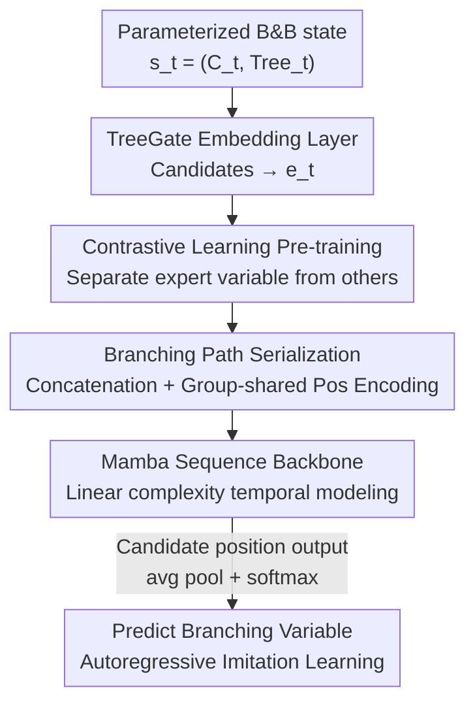

# Towards Better Branching Policies: Leveraging the Sequential Nature of Branch-and-Bound Tree

**Conference**: ICLR 2026  
**OpenReview**: [https://openreview.net/forum?id=iQKzHeLDrN](https://openreview.net/forum?id=iQKzHeLDrN)  
**Code**: https://github.com/doctor-watson626/Mamba-Branching/  
**Area**: Combinatorial Optimization / Learned Branching Policies  
**Keywords**: Branch-and-Bound, MILP, Variable Branching, Mamba, Contrastive Learning, Imitation Learning  

## TL;DR
This paper proposes Mamba-Branching: explicitly modeling the Branch-and-Bound (B&B) solving process as a sequence of branching paths from the root to the optimal solution node. By utilizing Mamba with linear complexity for ultra-long sequence modeling and pre-training discriminative embeddings for candidate variables via contrastive learning, it outperforms all existing neural branching policies on heterogeneous MILPs and surpasses SCIP's default `relpscost` rule with faster convergence on difficult instances.

## Background & Motivation

**Background**: Mixed Integer Linear Programming (MILP) is NP-hard. Practical solving relies almost entirely on Branch-and-Bound (B&B)—repeatedly selecting a fractional integer variable $x_j$ to split, creating two child nodes $x_j \le \lfloor b_j \rfloor$ and $x_j \ge \lfloor b_j \rfloor + 1$, combined with bounding and pruning to achieve convergence. The choice of the branching variable significantly impacts solving efficiency. Recent learned branching policies (GCNN, TreeGate, T-BranT) attempt to replace heuristic rules with neural networks and achieve cross-instance generalization by parameterizing the B&B tree into instance-independent features.

**Limitations of Prior Work**: Existing methods largely ignore the **sequential nature** of the B&B tree expansion. TreeGate only considers the instantaneous state of the current node, completely discarding history. Although T-BranT preserves historical branching records, it treats them as an **unordered graph** encoded with graph attention, failing to explicitly capture the chronological order of decision steps. This is akin to navigating a maze by only looking at the current tile without reviewing the path taken, which leads to dead ends and redundant exploration.

**Key Challenge**: The author's key insight is that the "branching path" from the root to the optimal node is essentially a **sequential process**, where each preceding step (parameterized tree state + selected branching variable) significantly influences the current decision. Modeling this sequentiality faces two major hurdles: (1) **Ultra-long sequences**: Each step contains multiple candidate variables, and the sequence length grows exponentially with branching steps; the quadratic complexity of standard Transformers is computationally prohibitive. (2) **Discriminative embeddings**: Candidate variables within the same B&B step share constraints and problem structures, resulting in highly similar features. Unlike tokens in NLP that are naturally distinct, this requires learning a highly discriminative representation space to distinguish "which variable to select."

**Goal / Core Idea**: To treat B&B as a path-aware sequential decision-making problem—leveraging Mamba (linear complexity) for ultra-long sequence modeling, employing contrastive learning to pre-train discriminative embeddings, and using autoregressive imitation learning to feed the entire branching path into the sequence model for predicting the next branching variable.

## Method

### Overall Architecture

Mamba-Branching adopts the parameterized B&B tree representation from Zarpellon et al.: the state at each step $t$ is $s_t = (C_t, \text{Tree}_t)$, where $C_t \in \mathbb{R}^{|C_t| \times 25}$ represents candidate variable features and $\text{Tree}_t \in \mathbb{R}^{61}$ represents tree features. These are passed through a TreeGate network to obtain candidate embeddings $e_t \in \mathbb{R}^{|C_t| \times d}$. This representation is instance-independent, allowing it to handle heterogeneous MILPs uniformly.

Training is conducted in two serial stages: **Stage 1 (Contrastive Learning)** pre-trains the TreeGate embedding layer in isolation to separate the "expert-selected variable" from other candidates in the embedding space. **Stage 2 (Autoregressive Imitation Learning)** maps the entire branching trajectory $(s_0, a_0, \dots, s_T)$ into embeddings. These are concatenated into a "branching path" sequence with group-shared position encodings and fed into the Mamba sequence model. Cross-entropy imitation learning is performed using the expert decision $a_t$ as the label, with the output at candidate variable positions being mean-pooled and passed through a softmax. During inference, previous predictions serve as inputs for the current step to select variables autoregressively.

### Key Designs

**1. Modeling B&B Search as a "Branching Path" Sequence: Adding the Historical Dimension**

To address the issue of prior methods discarding history or treating it as an unordered graph, this paper explicitly defines the search trajectory as a structured sequence $S$. Each step $t$ is decomposed into its candidate variable embeddings and the selected expert decision embedding, forming a group:

$$S = [\,\underbrace{e_0^1, \dots, e_0^{|C_0|}, e_0^{a_0}}_{|C_0|+1}, \dots, \underbrace{e_t^1, \dots, e_t^{|C_t|}, e_t^{a_t}}_{|C_t|+1}, \dots, \underbrace{e_T^1, \dots, e_T^{|C_T|}}_{|C_T|}\,]$$

This preserves both **inter-step temporal dependencies** and **intra-step candidate relationships**. To inform the sequence model which embeddings belong to the same step, the authors use a learnable position encoding matrix $E_{pos}$, assigning **the same position index to all embeddings within the same step** $\text{pos} = [0,\dots,0, \dots, T,\dots,T]$, followed by element-wise addition $S' = E_{pos} \oplus S$. This "group-shared position encoding" is the key to organizing unordered sets of candidates into an ordered path.

**2. Contrastive Learning Pre-trained Embeddings: Making the "Right Choice" Stand Out**

To address the high similarity between candidate variables, the authors detach the embedding layer for independent pre-training. Theoretically, effective branching requires the embedding space to satisfy Proposition 1: the similarity of the selected variable's embedding to an anchor must be higher than all other candidates by a positive margin $\delta$, i.e., $\text{sim}(e_t^a, e_t^m) \ge \max_{i \ne a} \text{sim}(e_t^i, e_t^m) + \delta$.

To approximate this, a contrastive loss is designed ($\text{sim}$ is cosine similarity, anchor $e_t^m$ is obtained via max-pooling candidate embeddings):

$$\mathcal{L}_c(\gamma) = \frac{1}{T} \sum_t \Big( -\frac{e_t^m \cdot e_t^a}{\|e_t^m\|\|e_t^a\|} + \frac{1}{|C_t|-1} \sum_{i \ne a} \frac{e_t^m \cdot e_t^i}{\|e_t^m\|\|e_t^i\|} \Big)$$

The intuition is that max-pooling extracts globally salient features as an anchor; the loss maximizes the similarity between the anchor and the expert variable while minimizing the similarity with other candidates, pushing the expert variable's features toward the "globally significant direction" and amplifying its distinctness.

**3. Mamba Backbone + Autoregressive Imitation Learning: Efficient Long Sequence Modeling**

Since the input length of a branching path is $\sum_{t=0}^{T} |C_t| + T$, it expands drastically as $T$ or $|C_t|$ increases. Transformer's quadratic complexity leads to OOM (in experiments, Transformer-Branching was limited to $T=9$, while Mamba handled $T=99$). Mamba offers **linear complexity** relative to sequence length, a decisive advantage in scenarios where inference time is critical.

Training uses `relpscost` (SCIP's default) as the expert to collect demonstrations. Autoregressive imitation learning jointly optimizes the embedding layer and the sequence model:

$$L(\theta, \gamma) = -\frac{1}{|D|} \sum_{\tau \in D} \sum_{(s_t, a_t) \in \tau} \log \pi_\theta(a_t \mid \tau_{0:t})$$

### Loss & Training
Two-stage optimization: first pre-train the embedding layer with $\mathcal{L}_c$, then jointly fine-tune the embedding layer and Mamba with the imitation loss $L(\theta, \gamma)$. Exploration is enhanced by using random branching for the initial $r \in \{0,1,5,10,15\}$ steps before switching to `relpscost`. Training utilizes $T=99$, while evaluation employs autoregressive generation with a budget of $T=24$.

## Key Experimental Results

### Main Results
Evaluated on two heterogeneous datasets (MILP-S small-scale, MILP-L large-scale) constructed from MIPLIB + CORAL. Metrics include Nodes, Fair Nodes, Time, and Prime-Dual Integral (PD Integral) for difficult instances.

| Method | MILP-S Fair Nodes | MILP-S Time | MILP-L Easy Time | MILP-L Difficult PD Integral |
|------|------|------|------|------|
| **Mamba-Branching** | **2091.54** | **111.78** | **123.79** | **12319.55** |
| TreeGate | 2180.04 | 113.85 | 145.44 | 14625.68 |
| T-BranT | 2715.16 | 165.59 | 210.27 | 13538.47 |
| Transformer-Branching | 3120.04 | 3153.66 | OOM | OOM |
| pscost (Heuristic) | 7308.23 | 209.30 | 183.36 | 17097.06 |
| relpscost (Expert) | 1227.25 | 82.51 | 68.43 | 12741.36 |

Mamba-Branching is the best performing policy besides the expert. On MILP-L difficult instances, its PD Integral (12319.55) **exceeds the expert relpscost** (12741.36), indicating faster primal/dual bound convergence.

### Ablation Study
Ablation on MILP-S using Mamba-Branching-p (pure neural version without `relpscost` root initialization). Metric: Nodes (lower is better).

| Configuration | Nodes | Description |
|------|------|------|
| Mamba-Branching-p (Full) | 2272 | Full model |
| w/o CL (No Contrastive) | 3001 | Decreased embedding discriminability |
| SL (Supervised Pre-training) | 4287 | SL generalizes worse than contrastive learning |
| w/o PE (No Position Encoding) | 3481 | Sequential modeling disrupted |
| Transformer-Branching-p | 5138 | Quadratic complexity limits history to 10 steps |
| GRU-Branching-p | 5684 | Using GRU as the sequence model performed worst |

### Key Findings
- **Sequentiality is the Driver**: Mamba-Branching consistently outperforms TreeGate (no history) and T-BranT (unordered history).
- **Position Encoding is Crucial**: Performance drops significantly without group-shared position encoding (2272 → 3481).
- **Contrastive Learning > Supervised Pre-training**: Replacing CL with supervised classification (SL) resulted in worse performance (4287).
- **Mamba is Essential**: Alternatives like Transformer or GRU performed significantly worse; Transformer's inference was 1-2 orders of magnitude slower.
- **Why Beat Expert**: `relpscost` requires many strong branching initializations in large problems; neural policies benefit from faster inference on difficult instances.

## Highlights & Insights
- **Redefining "Branching Decision" as "Path Sequence Prediction"**: Uses the maze analogy to highlight that sequential history is a vital but previously ignored dimension.
- **Group-shared Position Encoding**: An elegant trick for encoding "unordered candidate sets + ordered steps" into a single sequence.
- **Contrastive Learning for Homogeneity**: Addresses the issue of highly similar candidate variables, a technique applicable to other discrete decision tasks with homogeneous options.
- **Linear Complexity as a Requirement**: Mamba's efficiency makes sequence-based branching viable for real-time solvers where inference overhead must be minimized.

## Limitations & Future Work
- **Dependency on Experts**: Data collection for `relpscost` is time-consuming, and the policy's upper bound is partially limited by the expert. Future work involves RL-based branching.
- **Performance on Easy Instances**: On easy MILP-L instances, Mamba-Branching still lags behind fine-tuned `relpscost`.
- **Evaluation Budget Discrepancy**: While trained on $T=99$, the evaluation is capped at $T=24$, possibly under-representing the benefits of long-range modeling.

## Related Work & Insights
- **vs TreeGate**: Mamba-Branching adds the sequential history missing in TreeGate's Markovian approach.
- **vs T-BranT**: While T-BranT uses history as an unordered graph, this work treats it as a chronological sequence, leading to superior performance.
- **vs Transformer-Branching**: Mamba handles longer history buffers and maintains faster inference speeds necessary for practical solvers.

## Rating
- Novelty: ⭐⭐⭐⭐⭐ 
- Experimental Thoroughness: ⭐⭐⭐⭐ 
- Writing Quality: ⭐⭐⭐⭐⭐ 
- Value: ⭐⭐⭐⭐ 

<!-- RELATED:START -->

## Related Papers

- [\[ICLR 2026\] Hinge Regression Tree: A Newton Method for Oblique Regression Tree Splitting](hinge_regression_tree_a_newton_method_for_oblique_regression_tree_splitting.md)
- [\[ICLR 2026\] Leveraging Discrete Function Decomposability for Scientific Design](leveraging_discrete_function_decomposability_for_scientific_design.md)
- [\[ICLR 2026\] Birch SGD: A Tree Graph Framework for Local and Asynchronous SGD Methods](birch_sgd_a_tree_graph_framework_for_local_and_asynchronous_sgd_methods.md)
- [\[ICLR 2026\] Proving the Limited Scalability of Centralized Distributed Optimization via a New Lower Bound Construction](proving_the_limited_scalability_of_centralized_distributed_optimization_via_a_ne.md)
- [\[ICLR 2026\] From Sequential to Parallel: Reformulating Dynamic Programming as GPU Kernels for Large-Scale Stochastic Combinatorial Optimization](from_sequential_to_parallel_reformulating_dynamic_programming_as_gpu_kernels_for.md)

<!-- RELATED:END -->
