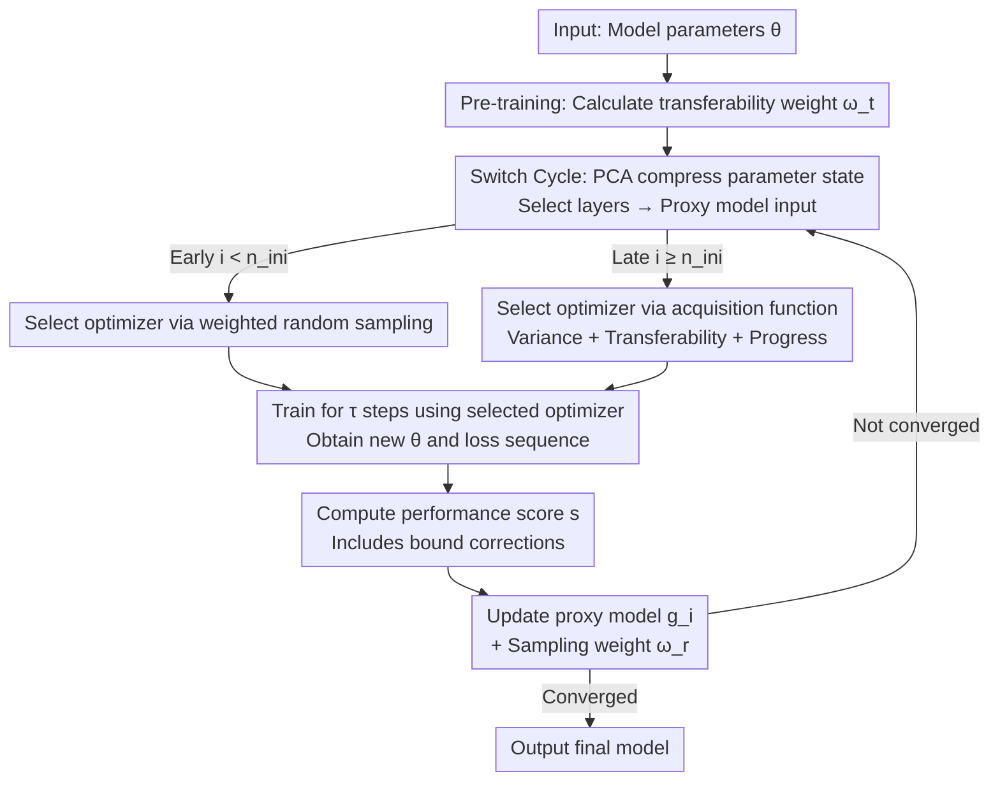

# Towards Dynamic Interleaving Optimizers

**Conference**: ICLR 2026  
**OpenReview**: [https://openreview.net/forum?id=AII8ADdDHt](https://openreview.net/forum?id=AII8ADdDHt)  
**Code**: To be confirmed (Authors promised open source)  
**Area**: Optimizers / Training Dynamics / AutoML  
**Keywords**: Dynamic optimizer switching, Proxy models, Gaussian Processes, Acquisition functions, Transferability

## TL;DR
DOIT treats the problem of "which optimizer to use during training" as an online decision-making problem that changes based on the training state. It utilizes Gaussian Process (GP) proxy models to predict the short-term reward of each optimizer at the current parameter state and selects the optimizer using an acquisition function that integrates transferability and training progress. This allows for dynamic interleaving between multiple optimizers, achieving $2\%–10\%$ faster convergence and $1\%–3\%$ higher accuracy compared to single or simple hybrid optimizers.

## Background & Motivation

**Background**: Training of deep networks almost exclusively relies on a single static optimizer (e.g., constant SGD or AdamW). Different optimizers have distinct strengths—SGD often yields better generalization and is used for head fine-tuning, while Adam converges faster and is commonly used for LoRA. To combine these benefits, a class of "hybrid optimizers" (SWATS, Padam, AdaBound, AGD) attempts to merge the generalization of SGD with the fast convergence of adaptive methods.

**Limitations of Prior Work**: Static optimizers remain unchanged throughout training, limiting both model quality and convergence speed. Finding a better optimizer requires expensive trial-and-error. Existing hybrid methods are mostly **one-time, coarse-grained switches** (e.g., SWATS switching from Adam to SGD), failing to leverage the unique advantages of multiple optimizers or adjust repeatedly during training, which leads to unstable model quality and restricted convergence.

**Key Challenge**: Recent studies found that different optimizers perform differently not only across **different tasks** but, more importantly, across **different stages (parameter states) of the same training run**. Visualizations of Three-Hump Camel and Rosenbrock functions (Fig. 1, Fig. 4) prove that even if multiple optimizers start in similar directions, their paths diverge after a few steps—"different optimizers suit different training states." Static and one-time switching methods fail to capture these training dynamics.

**Goal**: Upgrade optimizer selection from a "one-time pre-training choice" to "repeated selection during training based on current parameter states," implementing fine-grained dynamic scheduling of optimizer types.

**Key Insight**: The authors model this as a dynamic hyperparameter optimization problem **within a single training run**. The configuration $c=(o, \lambda, t)$ consists of optimizer type $o$, hyperparameters $\lambda$, and duration $t$. The training process is a sequence of configurations $C=\{c_1, \dots, c_n\}$, and the goal is to find the optimal $C^* = \arg\min_C L(\theta_0, M, D, C)$. While sharing the "proxy model + acquisition function" framework with SMBO/Bayesian Optimization, DOIT seeks the **adaptive synergy** of optimizers throughout the process rather than a single fixed configuration.

**Core Idea**: Build a Gaussian Process proxy model for each candidate optimizer to predict "how much **short-term** loss reduction will occur if training continues in the current parameter state." Use an acquisition function that integrates variance, transferability, and training progress to score optimizers, selecting the highest-scoring one at each switch cycle to enable dynamic interleaving.

## Method

### Overall Architecture

DOIT (Dynamic Optimizer Interleaving Training) partitions the training process into a series of "switch cycles" of length $\tau$. Before training starts, the **transferability weight** $\omega_t$ of the model for the current task is calculated. In each cycle, four steps are performed: 1) Compress the current parameter state as proxy model input; 2) Train for $\tau$ steps using a selected optimizer; 3) Calculate a performance score $s$ based on the loss trajectory of these $\tau$ steps; 4) Update the corresponding proxy model and sampling weights using $s$. Optimizer selection is split into two phases: **weighted random sampling** for cold-start when experience is limited, and **acquisition function** scoring once sufficient experience is gathered.

### Key Designs

**1. Estimating "short-term" gain via proxy models: GP + performance score $s$ instead of final accuracy**

DOIT builds a separate Gaussian Process (GP) proxy model $g_i$ for each candidate optimizer $o_i$. GP is chosen because it allows incremental updates, provides predictive variance (for exploration/exploitation trade-offs), and is interpretable as a probabilistic model. The **input** $VEC_i$ to the proxy model includes not only hyperparameters $\lambda$ (as in traditional SMBO) but also a vector representation of the **current parameter state $\theta$**, enabling the model to learn that "optimizer performance varies with parameter states." To reduce costs, DOIT uses PCA to compress parameters layer-wise, selecting only specific layers (e.g., classification head plus few hidden layers); in PEFT scenarios, only trainable parameters (e.g., LoRA $A$ and $B$) are considered.

The **output** of the proxy model is a performance score $s \in [-1, 1]$ reflecting the immediate gain. Given a loss sequence $l=\{l_1, \dots, l_\tau\}$ over $\tau$ steps, step-wise relative drops are calculated as $\Delta l_i = \frac{l_{i-1} - l_i}{\max(l_i, l_{i-1})}$, yielding mean $\mu_\Delta$ (exploitation) and variance $\sigma_\Delta$ (exploration). To capture the "direction of variance," DOIT introduces upper and lower bounds $\Delta_{\text{UPPER}} = \frac{l_0 - \max(l)}{\max(l_0, \max(l)) \times \tau}$ and $\Delta_{\text{LOWER}} = \frac{l_0 - \min(l)}{\max(l_0, \min(l)) \times \tau}$. The final score is:

$$s = \tanh\left(\tfrac{1}{3}\big(\mu_\Delta + \Delta_{\text{UPPER}} + \Delta_{\text{LOWER}}\big) + \alpha\sigma_\Delta\right)$$

This encodes average drop, best/worst-case boundaries, and volatility into a bounded score, characterizing short-term optimization quality.

**2. Selecting optimizers via acquisition function: Integrating variance, transferability, and progress**

Using $s$ directly would be too "myopic." DOIT adopts the acquisition function logic from Bayesian Optimization but incorporates three layers of consideration. The first is the standard exploration/exploitation trade-off using GP mean $s_\mu$ and variance $s_\sigma$: $ACQ = s_\mu + \alpha s_\sigma$.

The second is **transferability**: The intuition is that "the less similar the pre-trained model is to the downstream task (lower transferability), the more drastic adjustments are needed." Thus, $(1-\omega_t)$ weights the variance term to amplify exploration when transferability is low: $ACQ = s_\mu + (1-\omega_t)s_\sigma$. Here, $\omega_t = \beta \omega_p + (1-\beta)\frac{1}{k}\sum_{i=1}^{k}\mathrm{sigmoid}(\omega_d^i)$, where $\omega_p$ is raw pre-trained performance and $\omega_d^i$ represent transferability metrics like LogME or LEEP.

The third is **training progress**: As the model stabilizes, finer adjustments are needed. The exploration term is halved periodically: $e = \mathrm{sigmoid}\big(s_\mu + (1 - 2^{-\lfloor i/n \rfloor} \cdot \omega_t)s_\sigma\big)$, where $i$ is the iteration and $n$ the halving period. This naturally transitions from "aggressive exploration" to "stable convergence."

**3. Weighted random cold-start and switch cycles: Providing experience for the proxy model**

Initially, DOIT uses **weighted random initialization**. Each optimizer $o_j$ has a sampling weight $\omega_r[j] \in [0, 1]$, initialized to 1. After each segment, it is updated to a normalized performance score: $\omega_r[j] = \max\left(\tfrac{1}{2}(s+1), \omega_{\min}\right)$. This ensures high-performing optimizers are sampled more frequently without starving others. After $n_{ini}$ steps, the acquisition function takes over.

## Key Experimental Results

### Main Results

Datasets include 6 CV tasks (USPS, MNIST, STL10, CIFAR10, ImageNet, ImageNet-A), 2 NLP tasks (MRPC, QQP), WMT14, EUNITE (regression), and COCO (detection). Models include ResNet, MobileNetV2, ViT, RoBERTa, etc. Baselines include 9 single optimizers and 4 hybrid optimizers (SWATS/Padam/AdaBound/AGD). The optimizer space is [SGD, SGDM, Adagrad, RMSprop, Adam], $\tau=25$, $n_{ini}=50$.

Test Accuracy (%) for ViT Full Training / RoBERTa(LoRA) PEFT (selected):

| Setting | Dataset | Best Baseline | DOIT |
| :--- | :--- | :--- | :--- |
| Full | CIFAR10 | 97.58 (SGDM) | **98.04** |
| Full | STL10 | 97.83 (SGD) | **98.21** |
| Full | ImageNet | 78.73 (SGD) | **79.98** |
| PEFT | MRPC | 86.52 (Adam) | **87.99** |
| PEFT | QQP | 83.47 (Adagrad) | **85.57** |

On ImageNet-A (imbalanced), the improvement is more significant:

| Metric | Best Baseline | DOIT |
| :--- | :--- | :--- |
| acc@1 | 16.31 (Padam) | **18.47** |
| acc@3 | 31.76 (Padam) | **33.83** |
| acc@5 | 40.01 (Padam) | **41.32** |

Overall, DOIT achieves $2\%–10\%$ faster convergence.

### Ablation Study

| Dimension | Control Setting | Conclusion |
| :--- | :--- | :--- |
| Selection Strategy | Random switch / Periodic vs DOIT | DOIT is superior |
| Acquisition Function | w/o $\omega_t$ / w/o progress halving | Both contribute positively |
| Initial Selection | Uniform vs Weighted Random | Weighted is better |
| Compression | Random projection / UMAP vs PCA | PCA is optimal |

Computational overhead is extremely low: additional components account for $< 1\%$ of total FLOPs (measured at $< 0.5\%$).

### Key Findings
- **Each component is essential**: Removing transferability weights or progress halving degrades results, proving the acquisition function design is not mere stacking.
- **Switching behavior is interpretable**: DOIT triggers switches when convergence slows or local stability is detected.
- **Preferences align with intuition**: Early stages favor Adam (fast convergence), while later stages favor SGD (stability).
- **Hyperparameter robustness**: DOIT is insensitive to hyperparameters like $n_{ini}$ and $\tau$.

## Highlights & Insights
- **Reformulating optimizer selection as "online, state-dependent" SMBO**: Unlike traditional HPO which treats optimizers as static, DOIT's use of parameter state $\theta$ and short-term scores is a powerful paradigm shift.
- **Clever performance score $s$ correction**: Using $\Delta_{\text{UPPER}}/\Delta_{\text{LOWER}}$ to address variance directionality is a reusable trick for trajectory scoring.
- **Synergistic acquisition factors**: Using transferability as a variance weight and training progress via exponential decay integrates "task difficulty" and "stage" into exploration intensity effectively.
- **Almost zero overhead**: The $< 1\%$ FLOPs increase makes this approach highly practical for deployment.

## Limitations & Future Work
- **No inheritance of internal optimizer states**: Momentum and other states are not passed during switches. Simple inheritance has shown instability in preliminary tests (Appendix G).
- **Classic optimizer space**: The study covers standard optimizers; second-order or meta-learned optimizers were not included.
- **Dependence on parameter compression**: PCA on selected layers assumes they represent the training dynamics; the robustness across all architectures requires deeper analysis.
- **Scalability of GP**: Maintaining a GP for each optimizer might become costly if the candidate space grows significantly.

## Related Work & Insights
- **vs Hybrid Optimizers (SWATS, etc.)**: While prior methods use one-time transitions or fixed rules, DOIT performs fine-grained, state-based interleaving.
- **vs SMBO/Bayesian Optimization**: DOIT extends the framework by including parameter states and aiming for "adaptive synergy" rather than a single static best-fit.
- **vs Meta-Learning**: Meta-learning focuses on cross-task adaptation; DOIT focuses on scheduling within a single training run.

## Rating
- Novelty: ⭐⭐⭐⭐ Systemsize dynamic optimizer selection as state-dependent online SMBO.
- Experimental Thoroughness: ⭐⭐⭐⭐ Diverse tasks and ablation, though lacking ultra-large-scale model verification.
- Writing Quality: ⭐⭐⭐⭐ Clear logic and rich visualization.
- Value: ⭐⭐⭐⭐ Significant performance gain with $< 1\%$ overhead.

<!-- RELATED:START -->

## Related Papers

- [\[ICLR 2026\] Fantastic Pretraining Optimizers and Where to Find Them](fantastic_pretraining_optimizers_and_where_to_find_them.md)
- [\[ICLR 2026\] $\mu$LO: Compute-Efficient Meta-Generalization of Learned Optimizers](mulo_compute-efficient_meta-generalization_of_learned_optimizers.md)
- [\[ICLR 2026\] A Convergence Analysis of Adaptive Optimizers under Floating-Point Quantization](a_convergence_analysis_of_adaptive_optimizers_under_floating-point_quantization.md)
- [\[ICLR 2026\] A Tale of Two Geometries: Adaptive Optimizers and Non-Euclidean Descent](a_tale_of_two_geometries_adaptive_optimizers_and_non-euclidean_descent.md)
- [\[ICLR 2026\] Incorporating Expert Priors into Bayesian Optimization via Dynamic Mean Decay](incorporating_expert_priors_into_bayesian_optimization_via_dynamic_mean_decay.md)

<!-- RELATED:END -->
