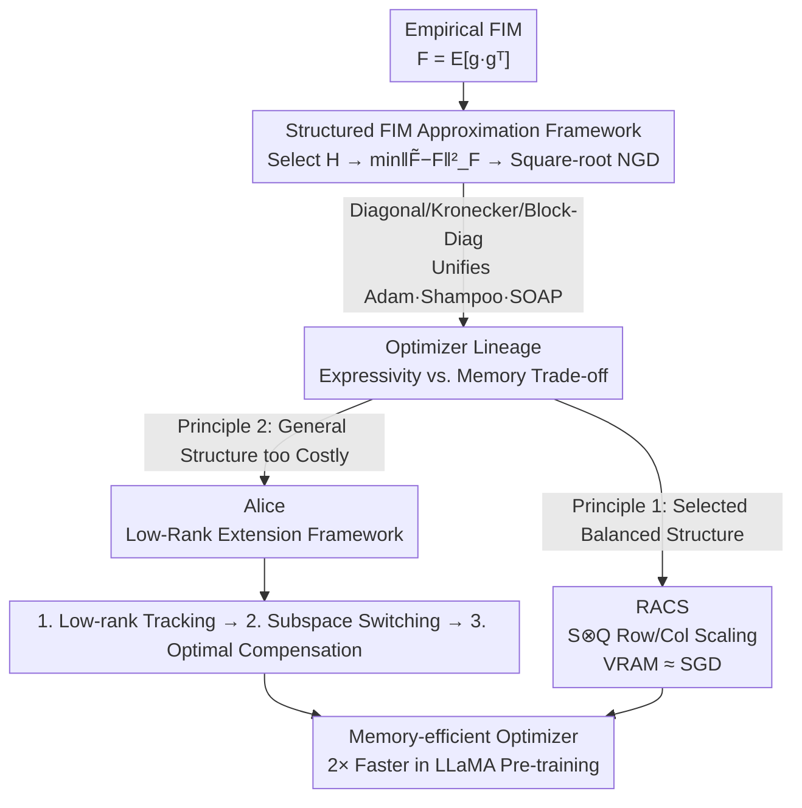

# Towards Efficient Optimizer Design for LLM via Structured Fisher Approximation with a Low-Rank Extension

**Conference**: ICLR 2026  
**OpenReview**: [https://openreview.net/forum?id=KUFZXdem5R](https://openreview.net/forum?id=KUFZXdem5R)  
**Code**: None  
**Area**: LLM Efficiency / Optimizer Design  
**Keywords**: Fisher Information Matrix, Memory-efficient Optimizer, Natural Gradient, Low-rank Extension, LLaMA Pre-training

## TL;DR
This paper provides a unified interpretation of optimizers such as Adam, Shampoo, and SOAP as "optimal Frobenius approximations of the Fisher Information Matrix (FIM) under different structural assumptions." Based on this, two design principles—structure selection and low-rank extension—are proposed, leading to two new memory-efficient optimizers: RACS and Alice. In LLaMA pre-training (up to 1.3B), these optimizers converge over 2$\times$ faster than Adam with almost no additional VRAM overhead.

## Background & Motivation
**Background**: Mainstream LLM training relies on adaptive optimizers (represented by Adam). However, Adam stores two EMA states (first and second moments), requiring VRAM equal to 3$\times$ the parameter count. Optimizers like Shampoo and SOAP, while converging faster in terms of step count, increase VRAM overhead by several times—SOAP's state can reach 7$\times$ that of SGD. Conversely, zero-state methods like SGD save VRAM but fail to effectively train LLMs.

**Limitations of Prior Work**: Existing "memory-efficient" optimizer designs are highly ad-hoc, relying on intuition and trial-and-error: either manually removing a state (e.g., Muon, SWAN) or forcing a low-rank projection (e.g., GaLore, Fira). These designs are isolated, lacking a unified principle to explain "why they work" or a systematic way to derive new methods.

**Key Challenge**: There is a fundamental trade-off between the "generality" of structural assumptions (more accurate FIM approximation leading to better convergence) and "practical efficiency" (higher VRAM/computational cost). More general structures better approximate the true FIM but at the cost of memory explosions.

**Goal**: (1) Identify a design principle that unifies existing optimizers; (2) Provide actionable design rules under this principle to create new optimizers that are both memory-efficient and fast-converging.

**Key Insight**: Natural Gradient Descent (NGD) uses the inverse of the FIM to correct local geometry. The authors note that the preconditioners of almost all efficient optimizers are essentially "optimal approximations of the FIM under specific structural assumptions." Thus, FIM approximation serves as a unified lens: Different Optimizers = Solutions to $\min_{\tilde F\in\mathcal{H}}\|\tilde F-F\|_F^2$ under different structural families $\mathcal{H}$.

**Core Idea**: Use "Structured FIM Approximation" as a yardstick to measure all optimizers, then construct new ones via two paths—either selecting a structure with a good balance of generality and efficiency (RACS) or applying low-rank compression to a general-structure optimizer (Alice).

## Method

### Overall Architecture
The core is a three-step recipe: **① Select a structural family $\mathcal{H}$ to approximate the empirical FIM $F=\mathbb{E}[\vec g\,\vec g^\top]$; ② Solve for the optimal approximation under the Frobenius norm $\tilde F^*=\arg\min_{\tilde F\in\mathcal{H}}\|\tilde F-F\|_F^2$; ③ Use the approximated $\tilde F$ for square-root NGD updates $W\leftarrow W-\lambda\,\mathrm{Mat}(\tilde F^{-1/2}\nabla_\theta L)$.** The authors prove: pure diagonal $\mathcal{H}$ recovers Adam; Kronecker product $R^{1/2}\otimes L^{1/2}$ recovers Shampoo; block-diagonal with shared eigen-spaces yields OSOAP (a strict generalization of Adam); and adding Kronecker products yields SOAP—a lineage mapping all optimizers by "Expressivity vs. Memory."

On this lineage, two design principles are implemented: **Principle 1**—select a structure with "sufficient generality but SGD-level VRAM," resulting in RACS; **Principle 2**—for expensive general structures (like OSOAP), apply a three-step low-rank extension framework (Tracking → Switching → Compensation), resulting in Alice.

### Key Designs

**1. Structured FIM Approximation Framework: Converting Optimizer Design into "Structure Selection + Optimal Approximation"**

To address the issue of ad-hoc designs, the authors formalize optimizer design as a provable three-step process. Given vectorized gradients $\vec g=\mathrm{Vec}(G)$, the empirical FIM is $F=\mathbb{E}[\vec g\,\vec g^\top]$. Since the $mn\times mn$ scale is too large to invert, an optimal Frobenius approximation is sought within a structural family $\mathcal{H}$:

$$\min_{\tilde F\in\mathcal{H}}\|\tilde F-F\|_F^2,\qquad W\leftarrow W-\lambda\,\mathrm{Mat}(\tilde F^{-1/2}\vec g).$$

Different $\mathcal{H}$ yield existing optimizers: $\mathcal{H}=\{\mathrm{Diag}_v(v)\}$ leads to $\tilde F^*=\mathrm{Diag}_v(\mathbb{E}[\vec g^2])$, which with first-order momentum is Adam. $\mathcal{H}=\{R^{1/2}\otimes L^{1/2}\}$ with an upper-bound minimization leads to Shampoo. Normalization, Muon, LARS, and LAMB are also recovered as special cases of simple block-diagonal structures. Furthermore, "block-diagonal with shared eigen-space" $\mathcal{H}=\{\mathrm{DiagB}(U_fD_iU_f^\top)\}$ yields OSOAP, and adding Kronecker products yields SOAP. This lens maps "Expressivity vs. Memory" onto a comparable axis.

**2. RACS: Selecting a "General but SGD-like" Structure**

Following Principle 1, where general structures (like SOAP) are costly (VRAM $\approx$ 7$\times$ SGD), the authors select a minimal structure that generalizes "gradient normalization" by scaling both rows and columns:

$$\mathcal{H}=\{S\otimes Q\},\quad S\in\mathbb{R}^{n\times n},\,Q\in\mathbb{R}^{m\times m}\ \text{are positive diagonal matrices}.$$

The optimal solution is found via a fixed-point iteration: $s=\mathrm{Diag}(\mathbb{E}[G^\top QG])/\|Q\|_F^2,\ q=\mathrm{Diag}(\mathbb{E}[GSG^\top])/\|S\|_F^2$, which converges to the left and right principal singular vectors of $\mathbb{E}[G^2]$. The corresponding update is $\mathrm{Mat}(\tilde F^{-1/2}\vec g)=Q^{-1/2}GS^{-1/2}$, termed Row and Column Scaled SGD (RACS). In implementation, 5 fixed-point iterations are used with a norm-growth limiter. Its VRAM cost is only $m+n+1$—essentially the same as SGD—yet it stably trains 1B models.

**3. Alice: Low-rank Extension via "Tracking → Switching → Compensation"**

Following Principle 2, for general structures like OSOAP that lack memory-efficient versions, the authors propose a low-rank extension framework to compress full-rank optimizers. The key state in OSOAP is the projection matrix $U_{f,t}=\mathrm{EVD}(\mathbb{E}[GG^\top])$. The framework performs three steps:

First, **Low-rank tracking**: only keep the top $r$ eigenvectors $U_t$. States are projected to low-rank $\sigma_t=U_t^\top G_t,\ \tilde Q_{t+1}=\beta_3\tilde Q_t+(1-\beta_3)\sigma_t\sigma_t^\top$. Reconstruction $Q_t\approx U_t\tilde Q_tU_t^\top$ reduces VRAM from $m^2$ to $r^2$. However, this loses information from the complementary space $U_{c,t}$. Second, **Subspace switching**: theoretically, $Q_t$ can be decomposed into a low-rank reconstruction and a residual term measuring $U_{c,t}$ importance. When the residual dominates, the complementary space should be prioritized. The authors intentionally replace some principal eigenvectors with bases randomly sampled from the complementary space (Algorithm 1), forcing exploration. Third, **Optimal compensation**: low-rank updates lose parameter updates in $U_{c,t}$. The authors prove the full-rank update can be split into low-rank and complementary terms. The latter is an NGD using $\tilde F_c$ as a preconditioner. By applying the FIM lens again with a normalized diagonal structure for $\tilde F_{c}$, the optimal compensation term $C=U_cU_c^\top GS$ is derived, where:

$$\mathrm{Diag}(S)=\frac{\sqrt{m-r}}{\sqrt{\mathbb{E}[\mathbf 1_m^\top G^2-\mathbf 1_r^\top(U^\top G)^2]}}.$$

The combination is Alice (Alice-0 is the variant without tracking). GaLore is essentially Alice with tracking, switching, and compensation disabled, explaining why GaLore works: it is a low-rank version of the powerful OSOAP optimizer.

### Loss & Training
No new loss functions are introduced; standard pre-training objectives are used. Training is conducted in BF16 (model, parameters, and states). RACS uses 5 fixed-point iterations. Alice maintains the top $r$ bases for tracking, with $l$ principal bases and $r-l$ randomly sampled complementary bases during switching. Both use a norm-growth limiter to stabilize updates.

## Key Experimental Results

### Main Results
LLaMA pre-training on C4 (60M/130M/350M/1.3B) evaluated by Perplexity (Ppl, lower is better) and VRAM. Parentheses indicate versions with Adam for the final layer.

| Method | 60M Ppl | 130M Ppl | 350M Ppl | 1.3B Ppl | 1.3B VRAM |
|------|---------|----------|----------|----------|-----------|
| AdamW | 33.94 | 25.03 | 19.24 | 16.44 | 7.48G |
| GaLore | 38.91 | 27.18 | 21.11 | 16.60 | 4.25G |
| Fira | 33.77 | 25.21 | 18.93 | 15.14 | 4.25G |
| Apollo-svd | 31.26 | 22.84 | 16.67 | 14.10 | 4.43G |
| Muon | 31.6 | 24.59 | 19.30 | 16.08 | 5.23G |
| **RACS** | 30.25 | 22.67 | 16.51 | **13.52** | **2.98G** |
| **Alice-0** | 28.83 | 21.99 | 16.66 | 13.97 | 4.25G |
| **Alice** | **28.69** | **21.95** | 16.61 | 13.85 | 4.42G |

Alice achieves acceleration of 2.22$\times$/2.00$\times$/2.45$\times$/**2.82$\times$** over Adam by step count. In terms of effective wall-clock TP, Alice/RACS reach 123,048/129,817 compared to Adam's 53,588. RACS achieves the lowest Ppl (13.52) with SGD-level VRAM.

1B vs. 7B comparison (Table 3): 1B models trained with Alice/RACS consistently outperform 7B baseline models across checkpoints. For 150K steps on 8$\times$A100, Apollo takes 15 days, while Alice takes only 3.8 days.

### Ablation Study
Step-by-step addition of Alice components (350M, Table 4):

| Config | Eval Ppl | Description |
|------|---------|------|
| w/o Tracking/Switching/Compensation | 26.96 | Equivalent to vanilla low-rank (near GaLore) |
| + Tracking | 27.35 | Tracking alone slightly degrades (stable eigen-space) |
| + Tracking + Switching | 25.11 | Switching breaks steady state, significant recovery |
| + Tracking + Switching + Compensation | **21.95** | Compensation recovers lost info, largest gain |

### Key Findings
- **Compensation is the primary contributor**: Ppl drops from 25.11 to 21.95. It recovers low-rank losses in an analytically optimal way, outperforming Fira's heuristic.
- **Tracking requires Switching**: Tracking alone increases Ppl (26.96 to 27.35) because it makes the eigen-space overly stable, trapping the optimizer in old principal bases. "Subspace Switching" is mandatory to explore the complementary space.
- **Switching strategy is superior**: Sampling from the complementary space significantly outperforms alternatives like Gaussian sampling or joint sampling.

## Highlights & Insights
- **A Unified Yardstick**: Reducing Adam/Shampoo/SOAP/Muon/GaLore to optimal FIM approximations provides a unified coordinate system, turning optimizer design from a "black art" into "structure selection."
- **GaLore as "Crippled Alice"**: Deriving GaLore as Alice with components disabled provides a theoretical foundation for GaLore's effectiveness (it is a low-rank version of OSOAP).
- **Challenging the "Top Eigenvector" Convention**: Subspace switching's use of random complementary bases is theoretically justified by residual dominance, applicable to any scenario involving low-rank tracking and subspace exploration.
- **Recursive use of FIM lens**: The compensation step proves the lost update is still an NGD form, applying the FIM lens again for an optimal solution—proving strong methodological consistency.

## Limitations & Future Work
- The authors state this is not a final answer for LLM optimizer design but a demonstration of the "Structured FIM Approximation" principle. Finding specific structures (like RACS) is not always straightforward.
- The low-rank framework is instantiated only for OSOAP (Alice); generalization to SOAP is left for future work.
- Convergence proofs are limited to the continuous-time setting.
- Scales are limited to 1.3B and the BF16 format. Downstream task coverage is limited to GLUE.

## Related Work & Insights
- **vs. Shampoo / SOAP**: These use general Kronecker/block-diagonal structures for accurate approximation at the cost of high VRAM. This paper interprets them through the same lens but provides more efficient alternatives.
- **vs. GaLore / Fira**: GaLore uses ad-hoc projections; this paper shows it lacks switching and compensation. Fira uses heuristic compensation, while Alice uses analytically optimal compensation.
- **vs. Muon / SWAN / LARS / LAMB**: These are unified as special cases of simple block-diagonal structures, with the authors theoretically recovering a missing $\sqrt n$ coefficient in the original Muon.

## Rating
- Novelty: ⭐⭐⭐⭐⭐ Unifying optimizers via structured FIM approximation and deriving systematic methods is highly original.
- Experimental Thoroughness: ⭐⭐⭐⭐ Good LLaMA scaling (60M–1.3B) and ablations, but limited by scale and precision formats.
- Writing Quality: ⭐⭐⭐⭐ Clear lineage and framework diagrams, though mathematically dense.
- Value: ⭐⭐⭐⭐⭐ Provides both practical optimizers and a sustainable design principle for LLM training.

<!-- RELATED:START -->

## Related Papers

- [\[ICLR 2026\] LoRA meets Riemannion: Muon Optimizer for Parametrization-independent Low-Rank Adapters](lora_meets_riemannion_muon_optimizer_for_parametrization-independent_low-rank_ad.md)
- [\[ICML 2026\] Memory-Efficient LLM Pretraining via Minimalist Optimizer Design](../../ICML2026/optimization/memory-efficient_llm_pretraining_via_minimalist_optimizer_design.md)
- [\[ICLR 2026\] Reducing Contextual Stochastic Bilevel Optimization via Structured Function Approximation](reducing_contextual_stochastic_bilevel_optimization_via_structured_function_appr.md)
- [\[ICLR 2026\] The Power of Small Initialization in Noisy Low-Tubal-Rank Tensor Recovery](the_power_of_small_initialization_in_noisy_low-tubal-rank_tensor_recovery.md)
- [\[ICLR 2026\] Trion: FFT-based Dynamic Subspace Selection for Low-Rank Adaptive Optimization of LLMs](trion_fft-based_dynamic_subspace_selection_for_low-rank_adaptive_optimization_of.md)

<!-- RELATED:END -->
