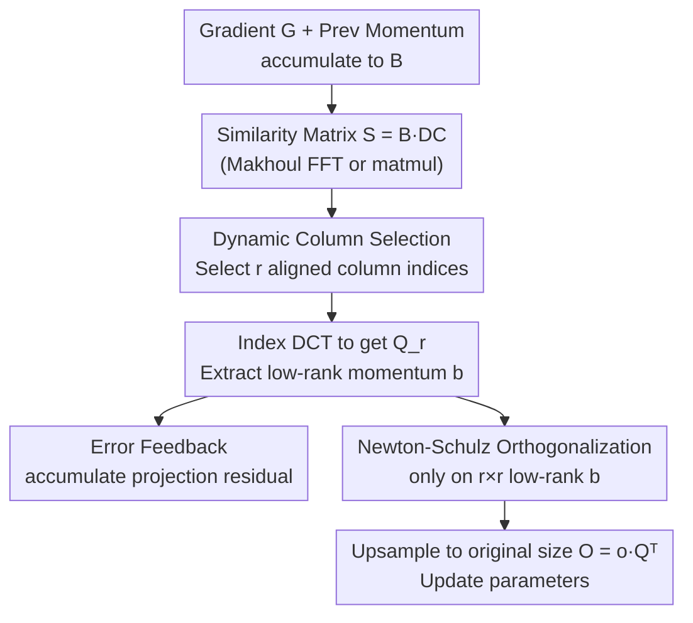

# Trion: FFT-based Dynamic Subspace Selection for Low-Rank Adaptive Optimization of LLMs

**Conference**: ICLR 2026  
**OpenReview**: [https://openreview.net/forum?id=TkHjRwbMNl](https://openreview.net/forum?id=TkHjRwbMNl)  
**Code**: https://github.com/IST-DASLab/Trion  
**Area**: LLM Efficiency / Optimizers / Memory-efficient Training  
**Keywords**: Low-Rank Optimization, DCT, Dynamic Column Selection, Optimizer State Compression, FFT

## TL;DR
This paper uses a **fixed Discrete Cosine Transform (DCT) orthogonal matrix + dynamic column selection** to replace the expensive SVD/QR projections in low-rank optimizers such as GaLore and Dion. By storing only $r$ integer indices per layer instead of full projection matrices, the authors develop two optimizers, Trion and DCT-AdamW, achieving rank-independent runtime and up to a 25% reduction in memory without sacrificing accuracy.

## Background & Motivation

**Background**: AdamW is the de facto standard for training LLMs, but it maintains two momentum buffers for every parameter, causing memory usage to scale linearly with model size. To minimize this overhead, a "low-rank optimizer" roadmap has emerged: GaLore uses SVD to project gradients into a low-dimensional subspace for momentum updates. Subsequent methods like LDAdam, FRUGAL, FIRA, Q-GaLore, and recent momentum-orthogonalization methods like Muon and Dion, all follow the strategy of "using matrix decomposition to find projection matrices."

**Limitations of Prior Work**: The bottlenecks for these methods are SVD/QR decompositions. First, the decomposition must be performed for **every linear layer** (either at every step or every few steps), which is computationally heavy for large models. Second, the resulting projection matrices must be **explicitly stored for each layer**, consuming extra memory. Third, in methods like Dion (using QR) and Muon (using Newton-Schulz), the runtime **increases with the rank $r$**, leading to slower training as the rank increases.

**Key Challenge**: Low-rank compression aims to save memory and time, but "dynamically finding an optimal orthogonal basis for each layer" is inherently expensive and memory-intensive—there is a trade-off between projection quality (closeness to the current gradient) and projection cost (SVD/QR overhead).

**Goal**: To find a **cheap, portable, and accurate** alternative to SVD/QR-based orthogonal matrices that can be integrated into various memory-efficient optimizers.

**Key Insight**: The authors observe that it is not necessary to calculate an orthogonal basis **from scratch** for every layer. One can fix a "universal" orthogonal matrix (DCT) beforehand and then **dynamically select the $r$ most aligned columns** from it for each layer's gradient. DCT has long been proven in JPEG image compression to efficiently approximate energy-concentrated subspaces and benefits from fast algorithms like FFT.

**Core Idea**: Replace "per-layer SVD/QR" with a "fixed DCT matrix + dynamic column selection based on alignment," compressing the per-layer projection matrix storage from a dense matrix to "$r$ column indices."

## Method

### Overall Architecture

The core of the method is a subroutine decoupled from the specific optimizer—**Dynamic Column Selection**: Given a fixed $n\times n$ orthogonal matrix $Q$ (DCT) and the current layer's gradient/momentum matrix $G$, the similarity matrix $S=GQ$ is calculated. Columns are ranked by their $\ell_1/\ell_2$ norms, and the $r$ largest column indices are selected to form the layer-specific projection matrix $Q_r$. This process requires only one matrix multiplication and one sorting operation. The DCT matrix is computed once at the start of training and stored once per GPU.

The authors integrate this subroutine into two major optimizer types, resulting in two independent optimizers: **Trion** (modifying Dion by replacing Power-Iteration with DCT selection and performing Newton-Schulz on low-rank momentum) and **DCT-AdamW** (modifying low-rank AdamW variants like LDAdamW by replacing SVD with DCT projection, with optional 8-bit quantized error feedback). Both share the "Dynamic Column Selection" kernel.

The following diagram illustrates the data flow of a single training step in Trion:

### Key Designs

**1. Dynamic Column Selection: Converting "finding projection matrices" into "picking column indices"**

This is the key step to replace SVD/QR, directly addressing the cost and memory overhead of per-layer decomposition. Given a fixed orthogonal matrix $Q\in\mathbb{R}^{n\times n}$ and gradient $G\in\mathbb{R}^{n\times n}$, calculating $S=GQ$ yields columns representing the alignment between $G$ and the basis vectors in $Q$. Selecting the top $r$ indices $i_t$ allows extracting $Q_r$ and projecting the gradient to $r$ dimensions: $g=GQ_r$. The "dynamic" nature resides in the **index set** rather than the matrix itself. Each layer selects the best combination from $\binom{n}{r}$ possibilities, but only $r$ integers need to be stored rather than a $C\times r$ dense matrix. Section 4 theoretically demonstrates that this alignment-based selection minimizes projection error.

**2. DCT as the Fixed Orthogonal Matrix + Makhoul FFT Acceleration**

DCT is chosen because it excels at energy concentration and supports fast algorithms. Trion uses DCT-II/III, where $Q_{ij}=\sqrt{2/n}\cdot\cos\frac{i(2j+1)\pi}{2n}$, materialized once on the GPU. Computing $S=GQ$ would usually take $O(n^3)$ for dense multiplication, but since $Q$ is a DCT matrix, **Makhoul’s N-point algorithm** allows completion in $O(n^2\log n)$ using FFT. For large layers, this speeds up calculation by $8\sim 50\times$ (particularly on GPUs with weaker tensor cores). This design makes Trion’s runtime **rank-independent**, unlike Dion where runtime scales with $r$.

**3. Trion: Low-Rank Momentum + Newton-Schulz**

Trion replaces Dion’s Power-Iteration and QR with "DCT Dynamic Column Selection + Newton-Schulz on low-rank momentum." Specifically, the projection residual $\Delta_t=B_t-b_tQ_t^\top$ is accumulated back via **error feedback** ($M_t=\mu B_t+(1-\mu)\Delta_t$) to avoid information loss. Critically, Newton-Schulz is applied **only to the $r\times r$ low-rank momentum $b_t$**, not the full-sized momentum $B_t$. This reduces the complexity of orthogonalization from full-size to $r\times r$. In DDP settings, it also enables communicating only low-rank terms $o_t$ across GPUs.

**4. DCT-AdamW: Replacing Two Projection Matrices with Two Index Sets**

To ensure momentum buffers accumulate gradients in a consistent subspace (as in LDAdamW), LDAdamW stores two adjacent projection matrices per layer, making its memory usage close to full-rank AdamW. DCT-AdamW replaces these with **two sets of $r$ indices**, combined with optional 8-bit quantized error feedback and ZeRO-redundancy techniques, significantly reducing memory while maintaining subspace consistency.

## Main Results

Pre-training Llama 350M/800M/1.3B on C4 using Chinchilla optimal settings (20 tokens/param), sequence length 512, 8×H100 DDP, and global batch 512.

### Trion vs Dion (PT, rank 256)

| Model | Metric | Trion | Dion | Muon (Ref) |
|------|------|-------|------|-----------|
| 350M | Val PPL | 15.30 | 15.64 | 14.99 |
| 350M | Memory(GB) | 42.42 | 45.59 | 42.42 |
| 350M | Runtime | 1h53m | 2h3m | 1h52m |
| 800M | Val PPL | 12.22 | 12.42 | 12.05 |
| 800M | Memory(GB) | 67.45 | 71.75 | 67.45 |
| 1.3B | Val PPL | 11.28 | 11.47 | 11.13 |
| 1.3B | Memory(GB) | 63.62 | 68.58 | 63.64 |

Trion achieves lower loss/PPL than Dion across all models and ranks, with ~10% lower memory usage. Its runtime is nearly independent of rank, while Dion’s runtime increases significantly with $r$. Trion provides a speedup of roughly 4.5–18% over Dion as rank increases.

### DCT-AdamW vs LDAdamW (Llama-800M, 100 tokens/param)

| Optimizer | Val PPL | Mem(GiB) | Time |
|-----------|---------|----------|------|
| AdamW (Full-rank Ref) | 11.73 | 73.72 | 1d13h22m |
| LDAdamW | 13.91 | 72.10 | 2d1h24m |
| DCT-AdamW | 13.69 | 57.82 | 1d15h17m |

DCT-AdamW achieves lower PPL than LDAdamW, reduces memory from 72.10 to 57.82 GiB, and is approximately 25% faster. While LDAdamW saves little memory compared to AdamW due to projection matrix storage, DCT-AdamW saves significant memory by storing indices.

### Key Findings
- **Higher projection accuracy drives performance**: The $\ell_2$ projection error of Trion is consistently lower than Dion, explaining the lower loss.
- **Rank-independent runtime** is Trion's primary engineering advantage over Dion, becoming more significant at larger scales and higher ranks.
- **Memory savings stem from "storing indices instead of matrices"**: Replacing per-layer dense matrices with $r$ integers results in 10%–25% memory reduction.
- The DCT subroutine is portable, as verified by replacing SVD in FRUGAL/FIRA.

## Highlights & Insights
- **"Fixed Base + Selection" vs. "Per-layer Decomposition"**: The most clever realization is that projection matrices do not need to be computed from scratch; a universal DCT matrix + dynamic column selection can approximate SVD/QR well while reducing storage to indices.
- **Borrowing JPEG wisdom for optimizers**: The authors introduce DCT (a stalwart of signal/image compression) to low-rank adaptive gradients and use Makhoul’s FFT to optimize computation to $O(n^2\log n)$.
- **Newton-Schulz on low-rank momentum**: Shifting the expensive orthogonalization from the full matrix to $r\times r$ is a generalizable trick for accelerating Muon/Dion-style optimizers.
- **DDP Communication Efficiency**: Under DDP, only the low-rank term $o_t$ needs to be communicated, as the DCT matrix is replicated locally, saving bandwidth.

## Limitations & Future Work
- The advantage of Makhoul FFT over matmul is less pronounced on newer GPUs (like H100) where tensor cores are extremely fast, making "FFT acceleration" more of a theoretical or legacy-hardware advantage (Appendix D/E).
- Evaluations focus on PPL for pre-training and accuracy for fine-tuning; larger-scale validation on diverse downstream tasks is needed.
- Using a fixed DCT base essentially limits the "dictionary" of the subspace; if the gradient's primary direction is poorly aligned with all DCT bases, approximation quality may drop.
- Implementing FSDP is more complex than DDP due to the need for specific sharding based on left/right projections.

## Related Work & Insights
- **vs. GaLore / LDAdamW (SVD-based)**: These perform per-layer SVD and store matrices; DCT-AdamW uses fixed DCT selection to reduce storage to indices and eliminate decomposition overhead.
- **vs. Dion (QR + Power-Iteration)**: Dion's runtime scales with rank and requires storing matrices; Trion is rank-independent, more accurate, and uses less memory.
- **vs. Muon (Full-rank Newton-Schulz)**: Muon requires full-size matrix iterations on GPU; Trion reduces the complexity of Newton-Schulz by operating on the $r\times r$ low-rank approximation.

## Rating
- Novelty: ⭐⭐⭐⭐ Introducing DCT/FFT "fixed base + selection" to low-rank optimizer compression is elegant and portable.
- Experimental Thoroughness: ⭐⭐⭐⭐ Covers various scales and ranks with detailed error analysis, though limited to smaller models and fewer downstream tasks.
- Writing Quality: ⭐⭐⭐⭐ Clear motivation, complete pseudocode, and honest discussion of FFT benefit conditions.
- Value: ⭐⭐⭐⭐ A plug-and-play replacement for S-tier/QR operations, offering 10–25% memory savings and rank-independent runtime for large-scale training.

<!-- RELATED:START -->

## Related Papers

- [\[ICLR 2026\] The Power of Small Initialization in Noisy Low-Tubal-Rank Tensor Recovery](the_power_of_small_initialization_in_noisy_low-tubal-rank_tensor_recovery.md)
- [\[ICLR 2026\] Towards Efficient Optimizer Design for LLM via Structured Fisher Approximation with a Low-Rank Extension](towards_efficient_optimizer_design_for_llm_via_structured_fisher_approximation_w.md)
- [\[ICLR 2026\] LoRA meets Riemannion: Muon Optimizer for Parametrization-independent Low-Rank Adapters](lora_meets_riemannion_muon_optimizer_for_parametrization-independent_low-rank_ad.md)
- [\[ICLR 2026\] Adaptive Acquisition Selection for Bayesian Optimization with Large Language Models](adaptive_acquisition_selection_for_bayesian_optimization_with_large_language_mod.md)
- [\[ICLR 2026\] Towards Dynamic Interleaving Optimizers](towards_dynamic_interleaving_optimizers.md)

<!-- RELATED:END -->
