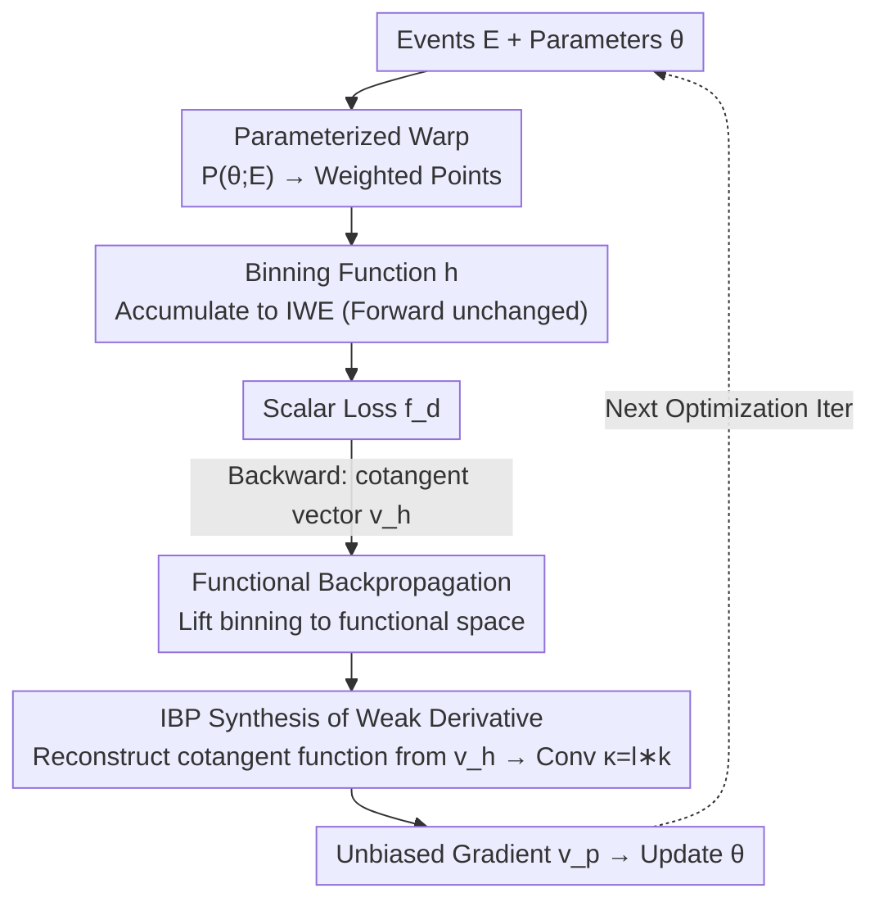

# Unbiased Gradient Estimation for Event Binning via Functional Backpropagation

**Conference**: ICLR 2026  
**OpenReview**: [https://openreview.net/forum?id=BRj3HvQnSZ](https://openreview.net/forum?id=BRj3HvQnSZ)  
**Code**: https://github.com/chjz1024/EventFBP  
**Area**: Optimization / Gradient Estimation / Event Vision  
**Keywords**: Event Camera, Binning Function, Unbiased Gradient, Weak Derivative, Integration by Parts

## TL;DR
Addressing the issue of biased gradients when learning directly from raw events due to the discontinuity of binning functions used for aggregating events into frames, this paper proposes **Functional Backpropagation (FBP)**. By lifting the binning function into functional space and utilizing integration by parts, the cotangent function emerges naturally. It is then reconstructed from sampled cotangent vectors to synthesize **provably unbiased** weak derivatives that approximate long-range finite differences. This approach keeps the forward output unchanged and only modifies backpropagation, consistently benefiting tasks such as egomotion, optical flow, and SLAM.

## Background & Motivation

**Background**: Event cameras encode high-speed dynamic scenes using asynchronous spatiotemporal pulses (events). To reuse mature image processing pipelines, the mainstream approach is to "bin" irregular events into dense frames—typically by warping events based on motion parameters and accumulating them into an Image of Warped Events (IWE), followed by constructing sharpness/contrast losses on the IWE to solve for motion parameters. This "Contrast Maximization" paradigm supports a wide range of work in event-based optical flow, localization, and SLAM.

**Limitations of Prior Work**: Binning functions are inherently **discontinuous** (an event falling into a specific bin is a step-like assignment). Discontinuity means gradients are truncated at the frame level, forcing most event algorithms to rely on "frame-level features" and abandon end-to-end learning from raw events. A few works attempting direct learning are forced to use "smooth binning" or adopt straight-through estimators (STE) or surrogate gradients (SG) from spiking neural networks.

**Key Challenge**: These approximations are **heuristic**. Smooth binning changes the forward output and destroys its physical meaning; STE/SG replaces the true gradient with an arbitrary smooth shape. Their common fatal flaw is **gradient bias**, with no guarantee of unbiasedness, which limits learning efficiency. The mathematical root is that classical derivatives of discontinuous functions produce Dirac deltas that cannot be computed point-wise, making the "warp coordinate gradient w.r.t. parameters" step in backpropagation impossible to calculate.

**Key Insight**: Starting from **weak derivatives** in functional analysis, the authors observe a crucial fact—while the point-wise value of a weak derivative might be uncomputable (Dirac delta), its **integral is well-defined** and can be calculated using **integration by parts**. That is, as long as the computation aligns with the integral of the weak derivative, the resulting gradient estimate can restore unbiasedness.

**Core Idea**: Lift the binning function from a "function" to a "functional." During backpropagation, its derivative naturally appears in the form of an **integral + cotangent function**. A continuous cotangent function is reconstructed from discrete cotangent vectors via signal reconstruction, and integration by parts is used to replace the uncomputable Dirac delta with a single convolution, analytically synthesizing an unbiased weak derivative.

## Method

### Overall Architecture

The entire event optimization pipeline is split into forward and backward paths. **Forward**: A set of events $E=\{e_i=(t_i,x_i,y_i,p_i)\}$ undergoes parameterized transformation $P(\theta;E)$ to produce a weighted point set, which is then accumulated by a binning function $h$ into an IWE. Finally, a scalar loss $f_d$ is calculated. The forward path is **entirely unchanged**—binning is computed as usual, and output remains bit-identical.

The problem lies in the **Backward** path. In standard backpropagation, when the cotangent vector $v_{h_j}$ of the IWE is passed back to the "warped coordinate $x_i'$," it hits the discontinuity of the binning function, generating uncomputable Dirac deltas. FBP "lifts" this step from discrete space to functional space. Discrete cotangent vectors are actually **samples** of a continuous cotangent function $v_h(\cdot)$ at grid points (valid as bin width $\Delta\to0$). Thus, $v_h(\cdot)$ is reconstructed from these sampling points, and integration by parts is used to replace "convolution with Dirac delta" with "convolution with the derivative of the (reconstruction kernel * binning kernel)," obtaining an unbiased gradient $v_p$ to update parameters.

The pipeline is as follows, where the forward path on the left remains unchanged, and the previously broken backward path on the right is reconnected via the functional path:

### Key Designs

**1. Functional Backpropagation: Lifting binning to functional space to let the cotangent function emerge**

Standard backpropagation applies the chain rule in finite dimensions: $v J_{g\circ f}=(vJ_g)\cdot J_f$, where $v$ is a cotangent vector. The first step involves generalizing this chain rule to **infinite-dimensional functionals**. A functional $f$ maps a function $u\in H(X)$ to another function $f[u]\in H(Y)$. According to Fréchet derivatives and the Riesz representation theorem, its derivative is represented by a "derivative kernel function" $\frac{\delta f[u](y)}{\delta u(x)}$ (Definition 1). Thus, the functional chain rule (Theorem 1) is no longer matrix multiplication but an **integral transform**:

$$\frac{\delta g[f[u]](z)}{\delta u(x)}=\int_Y \frac{\delta g[f[u]](z)}{\delta f[u](y)}\,\frac{\delta f[u](y)}{\delta u(x)}\,dy.$$

When $X,Y,Z$ are finite sets, the integral degenerates to a summation, and the equation reverts to the familiar finite-dimensional chain rule—rendering the functional chain rule a strict generalization. Under this framework, the recursive computation involves cotangent **functions** $v(\cdot)\in H(Z)$ rather than vectors, a process named Functional Backpropagation (FBP). The significance of this step is finding a continuous "home" for discontinuous binning—within functional space, the derivative exists as an integral rather than a point-wise Dirac delta.

**2. IBP Synthesis of Weak Derivatives: Reconstructing the continuous cotangent function from discrete vectors**

This is the core technique. The 1D binning function is defined as $h_j(P)=\sum_i w_i' k\!\left(\frac{x_i'-j\Delta}{\Delta}\right)$. Replacing $j\Delta$ with a continuous variable $x$ yields the continuous binning $h[P](x)$, with a sampling functional $S$ existing between them. To calculate $\frac{\partial f_c}{\partial x_i'}$, FBP gives:

$$v_{x_i'}=\int_{\mathbb{R}} v_h(x)\,\frac{\partial h(x)}{\partial x_i'}\,dx,\qquad v_h(x)=\sum_{j=1}^{W} v_{h_j}\,\delta(x-j\Delta).$$

This implies that standard backpropagation yields a **Dirac comb** modulated by cotangent vectors—which is exactly the sampled continuous cotangent function $v_h(\cdot)$. For fixed $W\Delta$ and $\Delta\to0$, the sampling relationship holds precisely: $\lim_{\Delta\to0}\frac{1}{\Delta}v_{h_j}=v_h(j\Delta)$. Since the cotangent function encodes continuous motion flow and is naturally smooth, it can be recovered from samples using **signal reconstruction**: replacing $\delta(\cdot)$ with a reconstruction kernel $\frac1\Delta l(\frac\cdot\Delta)$ and applying integration by parts yields the synthesized weak derivative:

$$\widetilde{\frac{\partial h_j}{\partial x_i'}}=w_i'\,\frac{\partial}{\partial x_i'}\,\kappa\!\left(\frac{x_i'-j\Delta}{\Delta}\right),\qquad \kappa(x)=(l*k)(x).$$

Comparing this to the formal derivative $\frac{\partial h_j}{\partial x_i'}=w_i'\frac{\partial}{\partial x_i'}k(\cdot)$, the synthesized weak derivative is equivalent to a "surrogate gradient of the convolution kernel $\kappa=l*k$." Unlike STE/SG which pick arbitrary smooth shapes, this surrogate shape is determined by the **convolution of the reconstruction kernel $l$ and the true binning kernel $k$**—capturing the geometry of binning, proving unbiasedness, and approximating **long-range finite differences** with finite-order accuracy.

**3. Plug-and-play implementation and Choice of Reconstruction Kernels**

While theoretical, the implementation is lightweight: FBP **only modifies the gradient accumulation step in backpropagation**, replacing the discontinuous binning kernel derivative with the synthesized weak derivative $\kappa'(\cdot)$. Forward binning, forward-mode JVP, and backward-mode VJP all follow standard structures. The choice of reconstruction kernel $l$ corresponds to different priors on the smoothness of the cotangent function: Linear (triangular kernel) has the weakest assumption, Bicubic assumes $C^2$ smoothness, and Lanczos assumes band-limiting. Experiments show the Linear kernel provides the best trade-off between accuracy and speed.

### Loss & Training
The method introduces no new losses but wraps around existing Contrast Maximization objectives. Bias analysis uses two types of scores: Variance $\mathrm{Var}=\frac{1}{N_p}\sum_{i,j}(h_{i,j}-\mu_H)^2$ and Log-Likelihood $\mathrm{LL}=\sum_{i,j}\log\mathrm{NB}(h_{i,j}|r,p)$. Optimizers are chosen based on kernel properties: L-BFGS-B for rect/linear kernels and trust-ncg for gauss kernels. IWE resolution is $200\times150$, binning step $\Delta=0.01$, with $N_e=20000$ events per packet, implemented in JAX.

## Key Experimental Results

### Main Results

Event motion estimation (ECD dataset, 8 sequences, rotation + translation) and two downstream tasks:

| Task | Metric | Baseline | Ours (FBP) | Gain |
|------|------|----------|-----------|------|
| Angular Velocity | RMS (°/s) | Raw Grad | Func Grad | RMS ↓10.3%, Conv. ↑1.66× |
| Linear Velocity | RMS (m/s) | Raw Grad | Func Grad | RMS ↑3.9% (task singularity), Conv. ↑1.48× |
| Overall Egomotion | RMS / Conv. | Raw | Func | RMS ↓3.2%, Conv. ↑1.57× |
| Optical Flow (MotionPriorCMax) | EPE↓ (DSEC) | 2.81 | **2.54** | ↓9.4% |
| Optical Flow | AE↓ / 3PE↓ | 8.96 / 14.5 | **8.33 / 13.3** | ↓0.63 / ↓1.2 |
| SLAM (CMax-SLAM) | RMS Traj. Error | baseline | Ours | ↓5.1% |

In optical flow, the authors replaced the linear binning kernel in MotionPriorCMax with a **rect kernel + FBP gradient**, still achieving lower EPE. This proves that FBP allows networks to learn sharper IWEs and more robust features using discontinuous kernels that were previously untrainable.

### Ablation Study

| Configuration | Key Metric | Description |
|------|---------|------|
| Linear Kernel | Optimal Acc/Time | Adopted overall |
| Bicubic / Lanczos | Similar Acc, Higher Time | Diminishing returns from higher smoothness |
| STE Surrogate | High Error Floor (shapes Var 96.89) | Heuristic and unstable |
| Sigmoid Surrogate | Better than STE but < FBP | Forced smooth shape |
| FBP (Ours) | Lower Error + Faster Conv. | IBP captures binning geometry |
| Compute Overhead | ≈2× standard JVP | Offset by optimization efficiency |

### Key Findings
- **Unbiasedness is the true source of gain**: FBP only changes gradients without altering the solution space. Performance improvements indicate that synthesized gradients provide more effective update directions.
- **vs. Heuristic Surrogate Gradients**: Compared to STE and Sigmoid, FBP shows lower error floors and better convergence times, validating that gradients derived from integration by parts fit the binning geometry better than manually specified shapes.
- **Cost vs. Boundary**: Gradient computation adds ~2× overhead, but faster optimization with fewer iterations results in a net gain. For LL scores with strong second-order nonlinearity, accuracy with the triangular kernel is limited, requiring task-specific reconstruction adjustments.

## Highlights & Insights
- **From "Uncomputable" to "Computable Convolution"**: The core trick is lifting to functional space, where integration by parts turns the convolution with a Dirac delta into a convolution with the derivative of $\kappa=l*k$—turning a mathematical singularity into an engineering-friendly convolution.
- **Zero Forward Changes, Plug-and-Play**: By only modifying the backward gradient accumulation, forward output remains bit-identical. This allows FBP to be dropped into existing Contrast Maximization pipelines or SOTA optical flow networks without destroying physical meaning.
- **Transferable Perspective**: The view that "discrete backward is a sampling of a continuous cotangent function" can theoretically generalize to any scenario in neuromorphic computing involving "discontinuous nonlinearity + gradient requirement" (spiking neurons, quantization), providing a theoretically grounded alternative to STE/SG.

## Limitations & Future Work
- **Kernel-Task Coupling**: The Linear reconstruction kernel has only second-order accuracy; bias might increase for scores like LL. The authors admit that precise gradient estimation should be application-dependent.
- **Computational Overhead**: Synthesized gradients take ~2× the time of standard JVP (up to 3.68× on CPU with large $N_e$), requiring trade-offs for large-scale training.
- **Task Singularity**: Linear velocity estimation saw a slight 3.9% RMS increase due to task-specific singularities, showing that better gradient directions cannot eliminate ill-posedness.
- **Validation Scope**: Experiments focus on motion/flow/SLAM. While theoretically general, gains in classification or detection remain to be verified.

## Related Work & Insights
- **vs. Function Relaxation (Smooth Binning)**: Smooth binning changes forward outputs; FBP keeps them identical while restoring differentiability in the backward pass.
- **vs. STE / Surrogate Gradient (SNNs)**: STE/SG use heuristic smooth shapes with no unbiasedness guarantee. FBP's surrogate shape is mathematically derived from $l*k$, providing provable unbiasedness and approximation of long-range finite differences.
- **vs. Contrast Maximization Series**: These methods were limited by binning differentiability. FBP, as a pluggable module, enables training on previously unusable discontinuous kernels (like rect) to improve accuracy.

## Rating
- Novelty: ⭐⭐⭐⭐⭐ Analytical framework for unbiased gradients in discontinuous binning via functional analysis.
- Experimental Thoroughness: ⭐⭐⭐⭐ Three layers of validation, though tasks are concentrated in motion estimation.
- Writing Quality: ⭐⭐⭐⭐ Clear derivation and figures, though functional notation may be challenging for some.
- Value: ⭐⭐⭐⭐⭐ Removes a fundamental barrier to direct learning from raw events with a plug-and-play method.

<!-- RELATED:START -->

## Related Papers

- [\[ICLR 2026\] Multilevel Control Functional](multilevel_control_functional.md)
- [\[ICLR 2026\] Binomial Gradient-Based Meta-Learning for Enhanced Meta-Gradient Estimation](binomial_gradient-based_meta-learning_for_enhanced_meta-gradient_estimation.md)
- [\[ICLR 2026\] Riemannian Zeroth-Order Gradient Estimation with Structure-Preserving Metrics for Geodesically Incomplete Manifolds](riemannian_zeroth-order_gradient_estimation_with_structure-preserving_metrics_fo.md)
- [\[ICML 2025\] Revisiting Unbiased Implicit Variational Inference](../../ICML2025/optimization/revisiting_unbiased_implicit_variational_inference.md)
- [\[ICLR 2026\] On the Convergence Direction of Gradient Descent](on_the_convergence_direction_of_gradient_descent.md)

<!-- RELATED:END -->
