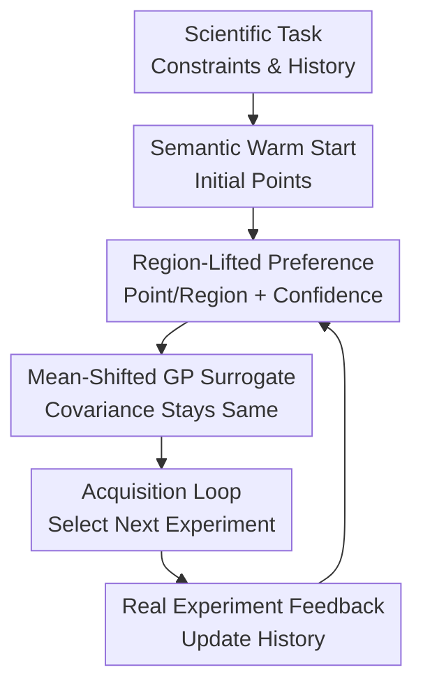

# Unleashing LLMs in Bayesian Optimization: Preference-Guided Framework for Scientific Discovery

**Conference**: ICLR2026  
**OpenReview**: [https://openreview.net/forum?id=LktUOZayG9](https://openreview.net/forum?id=LktUOZayG9)  
**Code**: Not yet public  
**Area**: Bayesian Optimization / Scientific Discovery  
**Keywords**: Bayesian Optimization, LLM Preference, Region Lifting, Scientific Experiment Optimization, Wet-lab  

## TL;DR
LGBO continuously converts LLM semantic preferences about "where is worth trying" into controllable mean shifts of the GP surrogate model. This allows Bayesian optimization (BO) to utilize domain knowledge to accelerate cold starts in scientific discovery tasks without delegating final point selection to potentially unstable LLMs.

## Background & Motivation
**Background**: Many optimization tasks in scientific discovery are essentially expensive black-box optimizations: a single experiment might involve synthesizing materials, measuring battery electrolytes, printing structures, or running chromatography, characterized by high costs, slow feedback, and non-analytic target functions. Bayesian optimization is therefore frequently used in self-driving labs and AI for Science scenarios, employing surrogate models like GP to estimate the target function and selecting the next experiment via acquisition functions like EI, UCB, or qEI to balance exploration and exploitation.

**Limitations of Prior Work**: A long-standing issue with standard BO is the slow cold start. When very few experimental points are available initially, the GP posterior relies heavily on kernel extrapolation, often wasting budget on physically meaningless regions in high-dimensional spaces. LLMs seem capable of filling this gap by inferring promising regions from literature, chemical knowledge, or task descriptions; however, existing LLM+BO methods usually only use LLMs for initialization or as candidate generators for acquisition filtering. In these cases, the LLM's role is either transient or limited, leaving the optimization loop dominated by standard BO.

**Key Challenge**: While LLM knowledge is useful, its output is coarse, noisy, and may drift across rounds. Directly allowing LLMs to modify acquisition functions or decide the next point risks breaking the statistical structure of BO. Conversely, if the LLM only suggests candidates, its preferences can be easily overridden by the GP and acquisition function. The core challenge is how to embed LLM semantic preferences into every round of BO while maintaining the stability of the GP posterior and acquisition decision-making.

**Goal**: The authors decompose the problem into three steps: first, have the LLM express coarse-grained preferences as points or regions rather than precise function values; second, convert these preferences into a mathematically tractable GP prior/posterior transformation; third, iteratively update LLM preferences in each BO round to evolve with the experimental history rather than being a one-time warm start.

**Key Insight**: A key observation is that LLMs are better at providing region-level suggestions, such as "near high temperature and low pressure" or "certain formula ratios are worth exploring," rather than judging which of two specific points has a higher function value. Consequently, the authors do not frame LLM preferences as pairwise comparisons but lift them into a preference for generally higher function values within a region. Using the exponential linear tilting property of Gaussian measures, this is equivalent to a translation of the GP mean function.

**Core Idea**: Use "region-lifted preferences" to transform LLM point/region suggestions into GP surrogate mean shifts, allowing the LLM to provide continuous semantic direction while final point selection remains the responsibility of standard acquisition functions.

## Method
### Overall Architecture
The input to LGBO consists of a scientific optimization task, observed experiment history, and parameter constraints; it outputs the experimental point for the next round. It retains the standard BO setup with a GP surrogate and acquisition function but queries the LLM each round: based on background knowledge, constraints, historical results, and previous reasoning, which point or region should the next step favor? This suggestion is then converted into a region-lifting term to shift the GP mean, after which acquisition functions like qEI select a point on the updated surrogate.

The most critical boundary of this framework is that the LLM does not directly control the experimental points. It only provides a preference direction, which enters the surrogate model as a calibrated mean shift; uncertainty, acquisition functions, and real experimental feedback maintain the closed-loop structure of BO. Thus, searches accelerate toward promising regions when the LLM possesses knowledge, yet the model can still correct errors via GP uncertainty and acquisition exploration when LLM preferences are weak or incorrect.

### Key Designs
**1. Region-Lifted Preference: Transforming coarse LLM suggestions into tractable GP prior signals**

The paper does not treat the LLM as a precise predictor because, in scientific optimization, it is difficult for LLMs to reliably state the target value of a specific formula. The authors restrict LLM output to two controlled formats: point mode (a point with confidence) and region mode (a hyper-rectangle with confidence). For region mode, the system constructs a Sobol grid $G=\{x_g\}_{g=1}^G$ within the region $R \subseteq X$, using non-negative weights $a_g$ to represent the importance of grid points. For point mode, weights are designed as a neighborhood average decaying smoothly around the point.

The preference function is formulated as an exponential linear lift: $\rho(f)=\exp(\lambda a^\top F_G)$, where $F_G=[f(x_1),\ldots,f(x_G)]^\top$. This encourages higher overall function values in the LLM-indicated region rather than strictly assuming the global optimum lies within it. This design is crucial: it preserves the "this direction might be good" soft information from the LLM while avoiding intractable posteriors inherent in argmax-type preferences.

**2. Mean Shift: Moving only the GP mean without disrupting the uncertainty structure**

While region lifting appears to rewrite the posterior, the authors prove that for a GP, an exponential linear lift is exactly equivalent to a translation of the mean function, while the covariance kernel remains unchanged. If the original process is $f\sim GP(\mu,k)$, the lifted mean becomes $\mu_\lambda(x)=\mu(x)+\lambda\sum_{g=1}^{G}a_g k(x,x_g)$, corresponding to $F_X\sim N(\mu_X+\lambda\Sigma_{XG}a,\Sigma_{XX})$ on a finite set.

This provides LGBO with a practical interface: LLM preferences are neither post-hoc rules nor ad-hoc acquisition bonuses; they become a kernel-induced bump in the GP surrogate mean. Points near the LLM-favored region with high kernel correlation receive a mean boost, while distant points are less affected. Constant covariance ensures that exploration is still calculated based on data and kernel structure, preventing false reductions in uncertainty due to LLM statements.

**3. Confidence Calibration: Controlling LLM preference strength via posterior variance**

Fixed LLM preference strength can lead to two issues: over-pushing the mean in known regions (leading to premature exploitation) or providing insufficient push in high-uncertainty regions (failing to aid cold starts). The authors define $\lambda$ using the LLM's confidence $c\in[0,1]$ and normalize it by the posterior variance of the regional functional $a^\top F_G$: $\lambda = c / \sqrt{a^\top \Sigma_{GG} a}$.

The intuition is to calibrate the lift to a scale of "$c$ standard deviations." If a region is already well-understood by data, $a^\top \Sigma_{GG}a$ is small, and the offset will not be mindlessly amplified. If a region is highly uncertain, the preference can more significantly influence the mean, guiding the acquisition to try areas with scientific justification but little data. LLM confidence thus becomes an offset strength mapped to the same scale as GP uncertainty.

**4. Acquisition Loop: Continuous LLM updates with final BO decision-making**

In each round, LGBO retrains the GP, summarizes the history, and feeds the dynamic history alongside previous reasoning to the LLM. Once the LLM produces a point or region, it is converted into a region-lifted preference, and acquisition functions like qEI are run on the mean-shifted surrogate. After the real experiment, the observation is added to the dataset, and the process repeats.

The difference from LLAMBO-like methods is that the LLM is not just a first-round warm start or a per-round candidate generator. Its preferences are continuously embedded into the surrogate, while the acquisition function remains responsible for the final tradeoff between preference, mean, and uncertainty. Theoretical analysis shows that under fixed lift, aligned preferences tighten the regret bound by reducing the effective RKHS radius, whereas misleading preferences only increase the radius by a constant term related to the lift size.

## Key Experimental Results

### Main Results
The paper validates LGBO using dry benchmarks (offline oracle queries) and wet-lab experiments (real Fe-Cr electrolyte experiments with noise and unknown targets).

| Scenario | Task / Metric | Baseline | LGBO Results | Key Findings |
|------|-------------|----------|-----------|----------|
| Dry | LNP3 Lipid Nanoparticles, Multiobjective | GPBO, LLAMBO | Faster convergence, higher objective, more stable | GPBO has slow cold start; LLAMBO plateaus early |
| Dry | HPLC Chromatography | GPBO, LLAMBO | Highest performance despite noise | Maintains advantage in noisy processes |
| Dry | Cross-barrel Structure Toughness | GPBO, LLAMBO | Reached optimal toughness | Better exploration in high-performance regions |
| Dry | Concrete Strength | GPBO, LLAMBO | Surpassed baselines in later stages | Continuous preferences help escape local optima |
| Wet | Fe-Cr Battery Electrolyte | GPBO, LLAMBO | Reached 90% of observed best by round 6 | Baselines required 10+ rounds |
| Extended | COF Xe/Kr Selectivity (14D) | Multiple | Best or near-best | Scalable to high-dimensional scientific search |

### Ablation Study
| Configuration | Key Impact | Description |
|------|---------|------|
| LGBO full | Faster convergence, higher final peak area | Uses both LLM warm start and per-round region lifting |
| Sobol-init LGBO | Still superior to GPBO | Continuous preferences contribute significantly even without LLM warm start |
| Random region lifting | Slow early convergence | Lifting requires valid semantic information to be effective |
| Different LLM backbones | Larger/Scientific models are more stable | Intern-S1 is stable; Qwen3 Thinking can reach higher values but slower |
| LLAMBO | Initial advantage but limited growth | Shows benefit of continuous embedding over just initialization |

### Key Findings
- The core gain of LGBO comes from "continuous preference embedding" rather than just LLM initialization.
- Random region lifting cannot replicate LGBO's results and may hinder convergence, proving region lifting must be driven by informative semantic preferences.
- In Fe-Cr wet-lab tests, LGBO reached 90% of the observed best in 6 rounds, which is significant as it cannot rely on benchmark memorization.
- In high-noise tasks like HPLC, LGBO maintains higher final performance, showing that mean shifts in the surrogate are more stable than direct LLM point selection.
- The 14D COF task demonstrates scalability beyond toy optimization to high-dimensional material screening.

## Highlights & Insights
- Restricting LLM output to point/region + confidence is a disciplined and effective design. It acknowledges LLM shortcomings in precision while leveraging their strengths in scientific direction.
- The equivalence between region-lifted preferences and GP mean shifts is the most elegant part of the paper. It grounds a heuristic LLM preference module within standard GP structures.
- Confidence calibration links LLM confidence to GP posterior variance, allowing preference strength to scale with uncertainty and reducing exploitation risk.
- Maintaining acquisition function control is ideal for AI for Science, where knowledge is useful but not infallible. The LLM guides search while BO remains the data-driven decision-maker.

## Limitations & Future Work
- Theoretical analysis uses a fixed lift simplification, whereas real LGBO updates preferences adaptively. The proof explains the core mechanism but does not fully cover dynamic LLM sequences.
- Comparison is largely against GPBO, LLAMBO, and select LLM-BO methods, lacking systematic contrast with more high-dimensional, trust-region, or multi-fidelity BO methods.
- Prompt design sensitivity is not fully quantified, though modular prompts are provided.
- The framework assumes hyper-rectangular regions; discrete structures or graph-based molecules might require redesigned region lifting or grid discretization.
- Wet-lab validation is limited to one task; further validation across diverse closed-loop experimental scientific fields is needed.

## Related Work & Insights
- **vs Standard GPBO**: GPBO relies solely on data; LGBO adds LLM regional priors to improve sample efficiency without changing the acquisition framework.
- **vs LLAMBO**: LLAMBO uses LLM for warm starts and candidates, but semantic info is easily lost in sparse GPs; LGBO embeds preferences into the surrogate mean.
- **vs ColaBO / ColaLLM**: These are typically for static expert preferences; LGBO handles LLM preferences that evolve with history using mean shifts to avoid re-weighting instability.
- **vs BOPRO**: BOPRO uses LLMs as implicit priors via in-context learning; LGBO emphasizes structured, auditable outputs mapped to explicit GP kernels.
- **vs CAKE**: CAKE uses LLMs to design kernels; LGBO keeps the kernel structure and modifies the mean, though the two could potentially be combined.

## Rating
- Novelty: ⭐⭐⭐⭐⭐ The connection between region-level LLM preferences and GP mean shifts is clean and deeply integrated.
- Experimental Thoroughness: ⭐⭐⭐⭐ Covers dry benchmarks, high-dimensional COF, and one wet-lab task, though more wet-lab tasks would be ideal.
- Writing Quality: ⭐⭐⭐⭐ Clear motivation and methodology, though precise numerical tables for all tasks are sparse.
- Value: ⭐⭐⭐⭐⭐ High potential for AI for Science, especially in low-budget workflows where domain knowledge is available.

<!-- RELATED:START -->

## Related Papers

- [\[ICLR 2026\] Combinatorial Bandit Bayesian Optimization for Tensor Outputs](combinatorial_bandit_bayesian_optimization_for_tensor_outputs.md)
- [\[ICLR 2026\] BoGrape: Bayesian optimization over graphs with shortest-path encoded](bogrape_bayesian_optimization_over_graphs_with_shortest-path_encoded.md)
- [\[ICLR 2026\] Adaptive Acquisition Selection for Bayesian Optimization with Large Language Models](adaptive_acquisition_selection_for_bayesian_optimization_with_large_language_mod.md)
- [\[ICLR 2026\] Leveraging Discrete Function Decomposability for Scientific Design](leveraging_discrete_function_decomposability_for_scientific_design.md)
- [\[ICML 2025\] BOPO: Neural Combinatorial Optimization via Best-anchored and Objective-guided Preference Optimization](../../ICML2025/optimization/bopo_neural_combinatorial_optimization_via_best-anchored_and_objective-guided_pr.md)

<!-- RELATED:END -->
