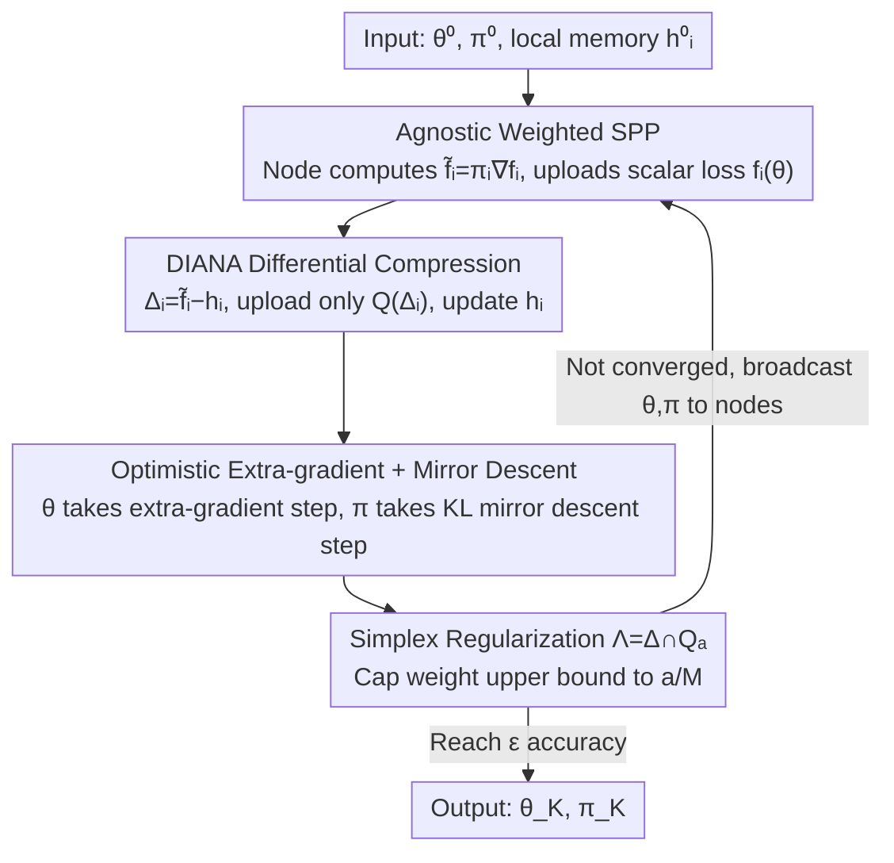

# Unlocking the Potential of Weighting Methods in Federated Learning through Communication Compression

**Conference**: ICLR 2026  
**OpenReview**: [https://openreview.net/forum?id=zOWljZMbCm](https://openreview.net/forum?id=zOWljZMbCm)  
**Code**: None  
**Area**: Federated Learning / Distributed Optimization / Communication Compression  
**Keywords**: Weighted Federated Learning, Communication Compression, Saddle Point Problem, DIANA, Optimistic Extra-gradient

## TL;DR
This paper proposes ADI (Agnostic DIANA), which embeds "DIANA-style differential compression" into the solving of the agnostic weighted federated learning saddle point problem. This makes the two previously incompatible paths—"automatic weighting" and "communication compression"—simultaneously viable for the first time. By using a $\min_\theta\max_\pi$ weighting framework to combat data heterogeneity while only uploading compressed differential vectors and a scalar loss, it breaks the communication bottleneck. Theoretically, it covers exact gradient, stochastic gradient, and partial participation scenarios; experimentally, it achieves better convergence than pure compression baselines on heterogeneously partitioned CIFAR-10.

## Background & Motivation

**Background**: The standard objective of federated/distributed learning is $\min_\theta f(\theta)=\frac{1}{M}\sum_{i=1}^M f_i(\theta)$, treating all devices equally. However, node data is naturally heterogeneous (varying in volume, category distribution, and noise levels). Consequently, "weighting methods" emerged—rewriting the objective as $\min_\theta \sum_i \pi_i f_i(\theta)$ to assign large weights to clients with clean/unique data and small weights to noisy ones. One of the most elegant branches is **agnostic (adversarial) weighting**: $\min_\theta \max_{\pi\in\Lambda} \sum_i \pi_i f_i(\theta)$, where weights are automatically selected during training, and the server only needs to extra-know the scalar loss $f_i(\theta)$ for each node, adding almost no communication.

**Limitations of Prior Work**: While weighting methods have attractive iteration complexity, they completely ignore the other core obstacle in federated learning—the **communication bottleneck**. Each round needs to synchronize $d$-dimensional local gradients or model states, a step that can be expensive enough to offset all parallelization gains. In other words, weighting methods only solve "heterogeneity" but not "communication cost," making them impractical for real-world systems in isolation.

**Key Challenge**: Although communication compression (e.g., RandK / TopK / quantization) can slash upload costs, it is "incompatible" with agnostic weighting. First, agnostic weighting is essentially a **saddle point problem (SPP)** rather than a classic minimization; the vast majority of compression algorithms (QSGD, EF21, MARINA, DASHA) are designed for minimization, making their analyses non-transferable. Second, the distortion of unbiased compressors scales with the input norm—directly compressing local gradients near the optimum injects non-eliminable noise, leading to irreducible variance terms theoretically and severe oscillation near the solution in practice.

**Goal**: To answer a specific question—**can weighting-based methods be effectively combined with communication compression?** That is, to introduce compression into the saddle point framework while providing convergence guarantees for exact gradient, stochastic oracle, and partial participation scenarios.

**Key Insight**: The authors leverage the key trick of DIANA—instead of compressing the gradient itself, they compress the "difference between the gradient estimate and the local memory state." Since this difference tends to zero along with the step size near the optimum, compressing this quantity does not introduce non-eliminable noise. By porting this mechanism into the saddle point solver, one can enjoy cheap communication without breaking the convergence to the exact solution.

**Core Idea**: Solve the agnostic weighted saddle point problem using "DIANA-style differential compression + optimistic extra-gradient/mirror descent," allowing compression and weighting to take effect simultaneously without ever transmitting full gradients.

## Method

### Overall Architecture

ADI solves the agnostic weighted saddle point problem $\min_{\theta\in\mathbb{R}^d}\max_{\pi\in\Lambda}\sum_{i=1}^M \pi_i f_i(\theta)$, where the weights $\pi$ are constrained to a simplex subset $\Lambda\subseteq\Delta^{M-1}$. Each iteration is divided into "node-side" and "server-side" stages: nodes compute the weighted gradient $\tilde f_i=\pi_i\nabla f_i(\theta)$, take the difference with local memory $h_i$ as $\Delta_i=\tilde f_i-h_i$, and upload **only the compressed difference** $\hat\Delta_i=Q(\Delta_i)$ and the **scalar loss** $f_i(\theta)$. The server aggregates the differences to obtain the gradient estimate $g$ for $\theta$, constructs the gradient estimate $p$ for $\pi$ using each node's loss, and then performs an optimistic extra-gradient update for $\theta$ and a mirror descent step with KL divergence for $\pi$, before broadcasting the new $\theta$ and $\pi_i$ back. The core of the entire design is ensuring the $d$-dimensional uplink vector at the communication bottleneck is always the "compressed difference," while the information determining weights is just a scalar.

### Key Designs

**1. Agnostic Weighted SPP: Trading Scalar Losses for Automatic Weighting**

The fundamental difficulty of weighting methods is "where weights $\pi_i$ come from." FedAvg weights by data volume $\pi_i=m_i/m$, which is fixed before training and only considers quantity, not quality. Subsequent dynamic weighting methods often rely on gradient differences or distribution divergence, which usually require extra communication. This paper adopts the agnostic form $\min_\theta\max_{\pi\in\Lambda}\sum_i\pi_i f_i(\theta)$, turning "weight selection" into an inner $\max$ over $\pi$: which client's loss decreases slowly (indicating more unique or difficult data), their $\pi_i$ will be automatically raised, pulling the model towards higher-quality observations to mitigate data imbalance. Most cleverly, this mechanism is nearly free for communication—the server only needs each node's scalar loss $f_i(\theta)$, and uploading a single number is much cheaper than uploading even a compressed gradient. The trade-off: the problem changes from classic minimization to a saddle point problem, introducing extra difficulty in algorithm design and convergence analysis, which is why existing compression algorithms cannot be directly applied.

**2. DIANA-style Differential Compression: Replacing "Compressing Gradients" with "Compressing Differences" to Eliminate Irreducible Terms**

Unbiased compressors satisfy $\mathbb{E}[Q(x)]=x$ and $\mathbb{E}\|Q(x)\|^2\le\omega\|x\|^2$, where distortion scales with the input norm $\|x\|$. If local gradients are compressed directly, although aggregated gradients should vanish near the optimum $\theta^*$, the noise injected by compression does not, causing oscillations in practice and irreducible variance terms in theory. ADI draws from DIANA: nodes do not compress the gradient $\tilde f_i$, but compress its difference from local memory $\Delta_i^k=\tilde f_i^k-h_i^k$, uploading $\hat\Delta_i^k=Q(\Delta_i^k)$ then updating $h_i^{k+1}=h_i^k+\beta\hat\Delta_i^k$. Since each $f_i$ is $L$-smooth, gradient differences between adjacent points are bounded; as the algorithm approaches the optimum and step sizes decrease, the differential to be compressed also becomes finer. Thus, local states $h_i^k\to\nabla f_i(\theta^*)$ and aggregated estimates $h^k\to 0$, allowing convergence to the **exact optimum** rather than its neighborhood. The authors specifically argue why DIANA was chosen as the compression basis over SOTA DASHA or MASHA: DASHA's analysis is built on non-convex minimization and is hard to port to SPP; MASHA performs compression under SPP but requires periodic transmission of full gradients, which severely limits practicality. Using DIANA as a base, ADI avoids "full gradient transmission" while gaining the benefit of eliminating irreducible terms.

**3. Optimistic Extra-gradient + Mirror Descent: Dual Variable Alternating Updates**

Saddle point problems cannot be solved with simple Descent-Ascent, as it fails to converge for many simple objectives. ADI uses optimistic extra-gradient for the primal variable $\theta$: first perform extrapolation $\hat g^k=(1+\alpha)g^k-\alpha g^{k-1}$, then $\theta^{k+1}=\theta^k-\gamma_\theta\hat g^k$, requiring only one gradient evaluation per round while maintaining the stability of extra-gradient. For the weight $\pi$, since it is constrained to the simplex subset $\Lambda$, Mirror Descent is used with KL divergence as the Bregman divergence:

$$\pi^{k+1}=\arg\min_{\pi\in\Lambda}\Big\{-\gamma_\pi\langle\hat p^k,\pi\rangle+D_{\mathrm{KL}}(\pi,\pi^k)\Big\}$$

Where the negative sign before the inner product correctly corresponds to taking the $\max$ over $\pi$ in the agnostic objective. Combining the extra-gradient step for $\theta$ and the mirror step for $\pi$ forms an optimistic extra-gradient method that is perfectly compatible with DIANA's differential compression—the latter itself resembles variance reduction, and the combination allows stochastic terms in the convergence analysis to be canceled out.

**4. Simplex Regularization $\Lambda=\Delta^{M-1}\cap Q_a^M$: Preventing Weight Collapse to Noisy Clients**

If $\Lambda=\Delta^{M-1}$ is left completely free, the optimal solution degrades to $\pi_{i_0}=1$ and others $0$, putting all weight on the client with the largest loss. However, a large loss does not necessarily mean "unique data"; it could mean "severe noise"—noisy clients' losses drop slowly, causing their weights to be pushed higher and lead to the model overfitting to noise. The authors use the constraint $\Lambda=\Delta^{M-1}\cap Q_a^M$, where $Q_a^M=\{x\in\mathbb{R}^M\mid 0\le x_i\le a/M\}$ and $a\in[1,M]$. The parameter $a$ adjusts the trade-off between "flexible weighting" and "strong averaging": $a=1$ reverts to the equal-weighted standard objective (1), while $a=M$ implies no extra constraint. Regularization is not just an engineering trick; it also plays a role in theory—enabling a square root term to be accelerated by a factor of $\sqrt{a/M}$.

### Loss & Training

ADI provides convergence guarantees under three sets of assumptions: each $f_i$ is $\tilde L$-Lipschitz (Assumption 1), $L$-smooth (Assumption 2), and convex (Assumption 3). Convergence is measured by the standard Gap function for convex-concave saddle points. Under **exact gradients** (Theorem 1, with $\alpha=1,\beta=1/\omega,\gamma_\pi=\gamma_\theta=\gamma\le\gamma_0$), we have $\mathbb{E}[\mathrm{Gap}(z_K)]\le \frac{V}{2\gamma K}$, requiring

$$\mathcal{O}\!\left(\frac{1}{\varepsilon}\Big[\tilde L\omega^{3/2}+\tilde L M^{1/2}\omega+L\big(\sqrt{a\omega^3/M}+\omega\big)\Big]\right)$$

communication rounds to reach $\varepsilon$ accuracy. Under **stochastic oracles** (Theorem 2, Assumption 5: unbiased, variance $\le\sigma^2$), an extra irreducible term $\gamma\frac{64a^2\omega^2}{M}\sigma^2$ introduced by oracle randomness appears, and the optimal step size becomes $\gamma=\min\{\gamma_0,\sqrt{VM/(128a^2\omega^2\sigma^2 K)}\}$. Under **partial participation** (Corollary 4-5, nodes participate with $\eta\sim\mathrm{Bern}(p)$ and upload $\hat\Delta_i=\frac{\eta_i}{p}Q(\Delta_i)$), unbiasedness is maintained by simply scaling the compression rate $\omega$ by the factor $p$. The authors also relax the convexity assumption to a Minty-type Assumption 4, extending the analysis to non-convex settings (Corollary 2).

## Key Experimental Results

### Main Results

Experiments were conducted on CIFAR-10 with ResNet-18 for image classification, with $M=10$ clients. Baselines include representative methods using only compression or only weighting: ADI (no compression), DIANA, and EF21. Data partitioning included i.i.d. (uniform volume and categories across clients) and non-i.i.d. (Dirichlet $\alpha=0.5$, non-uniform volume). The compressor used was RandK ($K=10\%, 50\%$), and 10k rounds of stochastic oracles were run with respective hyperparameter tuning. Since weighting methods and classic methods optimize different objective forms (1) and (3), losses are not directly comparable; hence, accuracy is used for comparison.

| Setting | Compressor | Baselines | ADI Performance |
|------|--------|----------|----------|
| non-i.i.d. | Rand10% / Rand50% | DIANA, EF21 | Both convergence speed and final accuracy are superior to pure compression baselines; advantages increase with heterogeneity |
| i.i.d. (Homogeneous) | Rand10% / Rand50% | DIANA, EF21 | Comparable to baselines (weighting does not harm homogeneous scenarios) |
| ADI vs ADI(no comp.) | RandK | —— | Compression only slightly slows iteration convergence while delivering significant savings in communication bits |

Core conclusion: The weighting mechanism is decisive for convergence under non-i.i.d. settings, and "stacking" compression and weighting results in almost no loss of iteration efficiency; when the compressor is the identity, ADI degrades to an optimistic extra-gradient method for problem (4), acting as an independent weighted optimizer.

### Ablation Study

A second set of experiments (Figure 2) added a heuristic descent-ascent style agnostic weighting to the same compression baselines (RandK $K=10\%$, non-i.i.d.) to isolate the actual contribution of "the principled joint compression-weighting design."

| Method | Weighted? | Phenomenon |
|------|----------|------|
| DIANA / EF21 (Original) | No | Weak convergence under high heterogeneity |
| DIANA / EF21 (Heuristic Weighted) | Yes (Naive Integration) | Consistent improvements across methods, but gains are limited |
| ADI (Joint Design) | Yes (Principled) | Achieves the strongest gains over naive integrations |

Weight evolution analysis (Figure 3) shows: initially all client weights are equal; during training, weights rapidly differentiate and converge to stable plateaus, revealing two stages—(i) an early exploration period with drastic weight adjustment; and (ii) a late stable period where weights barely change once the global model approaches the optimum. This indicates weighting mainly acts during the high-gradient transient phase, precisely when client contribution differences are most distinguishable.

## Limitations & Future Work

- **Theory guarantees degrade monotonically with compression**: Weighting-induced terms deteriorate convergence guarantees as compression rates increase; only when weights are fixed and $\omega\le M$ does compression guarantee no increase in communication complexity—this is consistent with the current status of weighting methods having relatively weak theoretical guarantees (e.g., sublinear for FedAvg under strong convexity).
- **Reliance on convexity/smoothness**: Main results are established under convex + smooth + Lipschitz assumptions. While extended to non-convex via Minty assumptions, they still do not cover general non-smooth, strongly non-convex real world deep network scenarios.
- **Limited to unbiased compressors**: Analysis is only for unbiased compression operators (RandK class) and does not cover contractive (biased) compressors like TopK, which the authors list as a future direction.
- **Limited experimental scale**: The main text experiments involve $M=10$ and CIFAR-10 scale; larger scale studies and finer weight-compression interaction research are left to the appendix.
- **Future Directions**: Adapting acceleration methods for saddle point problems into this framework and extending the analysis to contractive compression operators.

<!-- RELATED:START -->

## Related Papers

- [\[ICLR 2026\] Enhancing Communication Compression via Discrepancy-aware Calibration for Federated Learning](enhancing_communication_compression_via_discrepancy-aware_calibration_for_federa.md)
- [\[AAAI 2026\] Personalized Federated Learning with Bidirectional Communication Compression via One-Bit Random Sketching](../../AAAI2026/optimization/personalized_federated_learning_with_bidirectional_communication_compression_via.md)
- [\[ICLR 2026\] LEGACY: A Lightweight Dynamic Gradient Compression Strategy for Distributed Deep Learning](legacy_a_lightweight_dynamic_gradient_compression_strategy_for_distributed_deep_.md)
- [\[ICLR 2026\] The Potential of Second-Order Optimization for LLMs: A Study with Full Gauss-Newton](the_potential_of_second-order_optimization_for_llms_a_study_with_full_gauss-newt.md)
- [\[ICLR 2026\] DeepAFL: Deep Analytic Federated Learning](deepafl_deep_analytic_federated_learning.md)

<!-- RELATED:END -->
