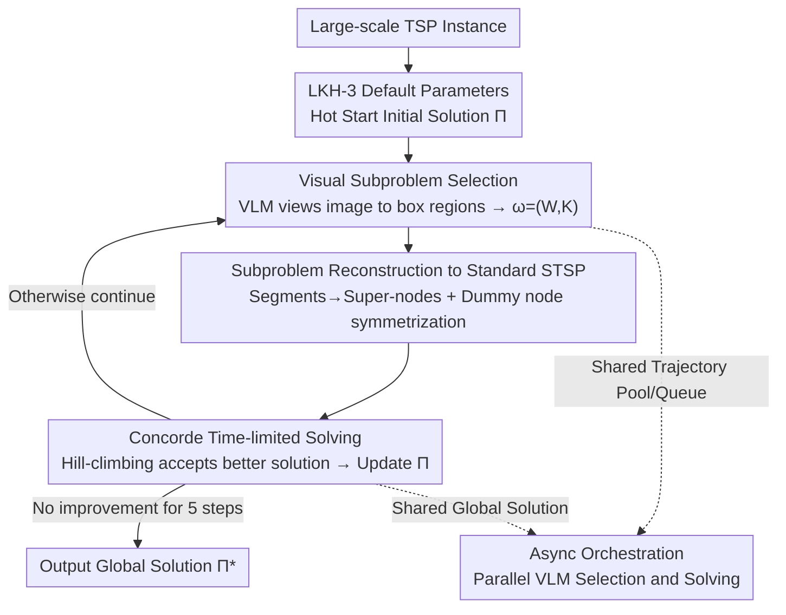

# ViTSP: Guiding Large-Scale Traveling Salesman Problem Solving with Vision-Language Models

**Conference**: ICLR 2026  
**OpenReview**: [https://openreview.net/forum?id=2LoaiaGKuV](https://openreview.net/forum?id=2LoaiaGKuV)  
**Code**: https://github.itap.purdue.edu/uSMART/ViTSP_ICLR2026  
**Area**: Combinatorial Optimization / Vision-Language Model Applications  
**Keywords**: Traveling Salesman Problem, Vision-Language Models, Problem Decomposition, Exact Solvers, Asynchronous Orchestration

## TL;DR
ViTSP visualizes large-scale TSP instances as images and feeds them into a pre-trained VLM, allowing the VLM to "see" and box promising small regions as subproblems. These are then iteratively solved by an exact solver (Concorde) to improve the global solution. On real-world TSPLIB instances with 1k–88k nodes, it achieves an average optimality gap of only 0.24%, surpassing LKH-3 and various learning-based solvers without any task-specific training.

## Background & Motivation

**Background**: TSP is a classic NP-hard combinatorial optimization problem with three main solving approaches. Exact solvers (Concorde, Gurobi) guarantee optimality but become computationally infeasible as scale increases. Heuristics (LKH-3) are the current SOTA but depend heavily on instance-specific parameter tuning. Recent learning-based neural solvers (end-to-end construction / local improvement) use GNNs to embed instances followed by supervised or reinforcement learning.

**Limitations of Prior Work**: Neural solvers perform well only on instances with distributions similar to their training data and small scales (nodes < 1000). Their generalization collapses once real-world problems deviate from training data; few works report results on TSPLIB with $N > 5000$. Existing LLM/VLM methods either treat coordinates as text and expect the model to output routes directly (resulting in massive gaps even at $N=50$), require VLMs to identify node IDs and edges from images (prone to errors in dense regions), or use LLMs to design heuristics via text (ignoring spatial structure and showing high variance across instances).

**Key Challenge**: The path of having generative models "solve end-to-end" is fundamentally non-viable—they guarantee neither feasibility nor quality. However, the most expensive part of heuristic solvers (90% effort) is "instance-specific decomposition/tuning." A good decomposition must consider both spatial locality and combinatorial neighborhoods that can escape local optima.

**Goal**: Instead of making the VLM solve the problem, utilize what it excels at—given a visualization of the current TSP solution, adaptively point out "which area should be focused on for optimization next," and delegate this small region to an exact solver for high-quality resolution.

**Key Insight**: VLMs naturally process TSP instances as 2D images, interpreting spatial structures. As generalists, they require no specialized training or data collection for graph embeddings. By boxing subproblems small enough, exact solvers can solve them reliably, avoiding the degradation neural solvers face at large scales.

**Core Idea**: Reposition the VLM from an "unreliable end-to-end solver" to a "decomposition heuristic provider for OR solvers." The VLM selects regions from images, the solver solves subproblems, and both collaborate asynchronously to iteratively improve the global solution.

## Method

### Overall Architecture

ViTSP aims to solve large-scale TSPs with tens of thousands of nodes by continuously approaching the optimal solution without training any models. Its pipeline is an iterative loop: "view image to select block → resolve subblock → accept better solution → view image again."

Specifically, it uses LKH-3 with default parameters for a hot start to obtain an initial global solution $\Pi$. The nodes and current edges are rendered as a 2D image serves as a visual prompt. This, along with a text prompt, is fed to the VLM, which outputs several rectangular coordinates $C=(x_{min}, x_{max}, y_{min}, y_{max})$. Each box defines a subproblem $\omega=(W, K)$ to be optimized ($W$ are free nodes with disconnected edges inside the box; $K$ are fixed segments maintained outside). This subproblem is reconstructed into a standard symmetric TSP and solved optimally by Concorde within a time limit $T_{max}$. If the new solution is shorter, it is accepted via hill-climbing to update $\Pi$. Since VLM calls are I/O-intensive (waiting for API responses) while solvers are CPU-intensive, ViTSP uses **asynchronous orchestration** to distribute them across different CPU cores, coordinated via a shared global solution, trajectory pool, and subproblem queue. Termination occurs if no improvement is made for $K=5$ consecutive steps.

### Key Designs

**1. Visual Subproblem Selection: Letting VLM Box Worthy Regions**

This step addresses the pain point that "good decomposition requires both spatial locality and the ability to jump out of local optima, while manual rules are expensive." ViTSP visualizes the current global solution $\Pi$ and nodes. The text prompt includes: ① Meta-instructions $I$ (task description + output format); ② Selection trajectory $\Phi=\{\phi_1, \phi_2, \dots\}$, where each record tracks "selected subproblems, node counts, optimization gains, and solver time." Since API-based VLM calls are stateless, this trajectory acts as memory, allowing the VLM to learn instance-specific structures and make better subsequent choices; ③ Evaluation queue $\Omega$, listing selected but unsolved subproblems to avoid redundancy. The VLM outputs one or more quadruplets $C=(x_{min}, x_{max}, y_{min}, y_{max})$ representing boxed regions ($Q\ge 2$ per call). Once boxed, internal connections are removed to form a free node set $W$, while external segments $K$ are fixed, producing the subproblem $\omega=(W, K)$.

To handle ultra-large-scale instances where nodes are extremely dense, ViTSP utilizes **zoom-in reselection**: if the initial box covers more nodes $|W|$ than a threshold $\alpha$, the VLM zooms into this sub-region to view fine-grained structures and boxes a more precise $C'$. This makes "visual selection" viable even at the 80,000-node scale.

**2. Subproblem Reconstruction to Standard Symmetric TSP: Compatibility with Exact Solvers**

The subproblem $\omega=(W, K)$ framed by the VLM is not a standard TSP because it mixes free nodes and fixed segments that must maintain internal order. This step transforms it into a form manageable by exact solvers (mostly designed for symmetric TSP). Each segment $(\pi^k_1, \dots, \pi^k_{c_k})$ is aggregated into a super-node $s_k$, resulting in a new list of $|K|+|W|$ nodes. This forms a **partial asymmetric TSP (ATSP)**: because super-nodes have distinct "entry" and "exit" points, distances between free nodes and segment starts, segment ends and free nodes, or segment ends and other segment starts are asymmetric, creating a partitioned asymmetric distance matrix $D_{ATSP}$.

Since off-the-shelf solvers primarily target symmetric TSPs, ViTSP further converts this ATSP into an STSP following Jonker & Volgenant: for each super-node $s_k$, a dummy node $s'_k$ is introduced. The node set expands to $\{s_1, \dots, s_{|K|}, s'_1, \dots, s'_{|K|}, w_1, \dots\}$. A symmetric block matrix $D_{STSP}$ is constructed, where the diagonal elements of $\hat D_{|K|\times|K|}$ are set to relatively small values to **induce super-node $k$ and its dummy node to be connected adjacently**, thereby encoding original directionality into the symmetric solution. After Concorde finds $\Pi^*_{STSP}$, dummy nodes are removed to recover $\Pi^*_{ATSP}$, and super-nodes are expanded back to original segments. The solver has a time limit $T_{max}$, returning the current incumbent if reached; the global $\Pi$ is updated only if the objective value is lower. This reconstruction allows ViTSP to leverage the "quality guarantee" of exact solvers while avoiding neuro-solver degradation.

**3. Async Orchestration: Maximizing Throughput for VLM and Solver**

Selection is I/O-intensive (bottlenecked by VLM server response), while solving is CPU-intensive. Sequential execution would leave the solver idling or vice versa. ViTSP deploys both modules asynchronously across multiple cores, coordinated by three shared components: the global solution $\Pi$, trajectory pool $\Phi$, and subproblem queue $\Omega$.

To further accelerate, the selection side uses both fast-thinking VLMs (GPT-4.1) and reasoning VLMs (o4-mini) to leverage complementary strengths, with each VLM generating $Q\ge 2$ boxes per prompt. The solving side uses multiple identical solvers to fetch subproblems from the shared queue in parallel. To avoid concurrent update conflicts, ViTSP employs $P$ "slave" solvers responsible for optimization and filtering—discarding those without improvement and passing those with net gains to a single "master" solver to update $\Pi$. This ensures new subproblems are not idle while keeping global solution updates serial and conflict-free.

## Key Experimental Results

### Main Results

The evaluation set consists of 33 real instances from TSPLIB with $N\ge 1000$ (divided into 22 "Large" and 11 "Large-plus" instances) and the synthetic TSP-10K. Metrics are optimality gap (relative to TSPLIB optimal values) and wall-clock time (including LKH initialization, VLM API latency, and Concorde solving). ViTSP uses GPT-4.1 + o4-mini as selectors and Concorde as the subproblem solver with $Q=2$, $K=5$, averaged over five runs.

| Method | Avg. Gap | Description |
|------|---------|------|
| **ViTSP** | **0.24%** | Found global optima for 11/33 instances; achieved lowest gap on 20. |
| LKH-3 (more RUNS) | 0.31% | SOTA heuristic, aligned to ViTSP runtime. |
| Concorde | 0.34% | SOTA exact solver, equal or longer time limit. |
| SIT | 1.17%–7.55% | Learning-based local improvement; obvious OOD degradation. |
| INViT / DIFUSCO / UDC / DeepACO | 6%–100%+ | End-to-end / Neural local improvement; generalization collapse. |
| EoH | High Var (up to 596%) | LLM text-designed heuristics; highly unstable across instances. |

Compared to LKH-3 on an instance-by-instance basis, ViTSP further reduced the gap by 3.57%–100.00%. The advantage becomes more pronounced as scale increases—while LKH-3 remains efficient at $N<4000$, ViTSP significantly accelerates gap reduction and consistently achieves lower gaps for $N>4000$. On synthetic TSP-10K, ViTSP achieved a 0.70% gap, outperforming LKH-3's 1.06% and SIT's 1.81% (which was specifically trained on TSP-10K).

### Ablation Study

| Configuration | Key Conclusion | Description |
|------|---------|------|
| ViTSP (VLM Selector) | Gap continuously drops and beats random strategies | Full model. |
| Random Sequence Selection | Converges to local optima | Randomly selects fixed-length segments. |
| Random Box Selection | Converges to local optima | Randomly boxes $Q=2$ rectangular subproblems. |
| LKH Initialization | Consistently lower gap | Full setting. |
| FI Initialization | Significantly worse gap (e.g., rl1304 8.01% vs 0.14%) | Switch to weaker initial solution. |

### Key Findings

- **VLM selection is "intelligent," not random**: Replacing the VLM selector with random sequence or random box heuristics leads to early stagnation in local optima. ViTSP's continuous improvement proves the VLM utilizes instance-specific spatial structures for meaningful decomposition.
- **Initialization quality affects the starting point but not the conclusion**: LKH initialization is consistently better than FI (e.g., 0.14% vs 8.01% on rl1304), but VLM-guided decomposition yields improvements over any baseline.
- **TSP structure dictates difficulty**: solving pr2392 ($2\times$ the size of pcb1173) takes only 26% of the time needed for the latter. Both ViTSP and LKH-3 struggle with fl1400, and ViTSP finds gap reduction difficult on d2103 and rl5915, indicating structural distribution matters more than pure size.
- **Early stages aren't always fastest**: On pla85900, random sequence selection drops the gap faster early on, suggesting operators beyond boxing (like sequence-based ones) are worth exploring.

## Highlights & Insights
- **Repositioning over "Brute-forcing" Generative Models**: Rather than forcing VLM to solve end-to-end (destined for poor feasibility/quality), it acts solely as a decomposition heuristic. Feasibility and quality are returned to the exact solver—this division of labor avoids the two most fatal pitfalls of LLM/VLM in combinatorial optimization.
- **Trajectory Pool as Memory to Break API Statelessness**: Feeding "which area was chosen, gain, and time" back to the VLM provides cross-step context, effectively installing an online learning loop for the current instance without gradient training.
- **Reproducible ATSP→STSP Dummy Node Symmetrization**: Encoding "local reconnection with fixed segments" into a symmetric distance matrix allows any mature symmetric solver to be used plug-and-play. This reconstruction is applicable to other "partially fixed, partially free" routing subproblems.
- **Async + Master-Slave Solvers**: This engineering framework maximizes throughput for heterogeneous computing (I/O-heavy VLM + CPU-heavy solver) while master-slave roles resolve conflicts in concurrent global solution updates.

## Limitations & Future Work
- Boxing (box-region) might not be the optimal operator: Random sequence selection was faster early on in pla85900, suggesting that limiting decomposition to rectangular regions restricts operator diversity.
- Specific structures (fl1400, d2103, rl5915) remain difficult for ViTSP, indicating blind spots in VLM's visual understanding of certain spatial distributions.
- Dependency on online VLM APIs involves uncontrollable latency and costs (analyzed in the appendix); it is not directly applicable to offline/local deployment scenarios.
- Designed specifically for 2D Euclidean TSP (renderable as images); extending this to non-Euclidean or constrained routing (VRP, time windows) requires redesigning visualization and subproblem encoding.

## Related Work & Insights
- **vs. Learning-based Neural Solvers (AM / DIFUSCO / INViT / SIT / UDC)**: These trained on fixed datasets and collapse on OOD instances (gaps 5%–100%+); ViTSP uses pre-trained VLM reasoning for zero-training decomposition, performing better across all TSPLIB instances.
- **vs. Pure Text LLM Methods (Yang et al. / EoH)**: Text-only approaches ignore spatial structure, failing even on small scales or showing extreme variance (EoH up to 596%); ViTSP is much more stable by letting the VLM "see" the structure.
- **vs. LKH-3 (SOTA Heuristic)**: LKH-3 is efficient at medium scales but requires manual tuning and hits performance plateaus; ViTSP continuously improves upon LKH-3 baselines, with benefits increasing at larger scales without domain-expert tuning.
- **vs. Concorde (SOTA Exact)**: Concorde is infeasible for large scales; ViTSP uses it on small enough subproblems to leverage its quality while bypassing its scaling bottleneck.

## Rating
- Novelty: ⭐⭐⭐⭐⭐ The repositing of VLM as a decomposer is a truly original perspective, opening a new paradigm for hybrid generative-OR solvers.
- Experimental Thoroughness: ⭐⭐⭐⭐⭐ 33 real TSPLIB instances (1k–88k) + synthetic sets + 12 baselines + dual ablations represent a level of comprehensive testing rarely seen at this scale.
- Writing Quality: ⭐⭐⭐⭐ Modules are clearly defined with complete ATSP→STSP derivations, though some key details (threshold $\alpha$, prompt templates) are in the appendix.
- Value: ⭐⭐⭐⭐⭐ Zero-training, plug-and-play, and scalable to 80,000 nodes; this has direct potential for application in real-world logistics.

<!-- RELATED:START -->

## Related Papers

- [\[AAAI 2026\] GHOST: Solving the Traveling Salesman Problem on Graphs of Convex Sets](../../AAAI2026/optimization/ghost_solving_the_traveling_salesman_problem_on_graphs_of_convex_sets.md)
- [\[ICLR 2026\] FZOO: Fast Zeroth-Order Optimizer for Fine-Tuning Large Language Models towards Adam-Scale Speed](fzoo_fast_zeroth-order_optimizer_for_finetuning_large_language_models_towards_ad.md)
- [\[ICLR 2026\] Solving the 2-norm k-hyperplane clustering problem via multi-norm formulations](solving_the_2-norm_k-hyperplane_clustering_problem_via_multi-norm_formulations.md)
- [\[ICLR 2026\] Bi-LoRA: Efficient Sharpness-Aware Minimization for Fine-Tuning Large-Scale Models](bi-lora_efficient_sharpness-aware_minimization_for_fine-tuning_large-scale_model.md)
- [\[ICLR 2026\] COLD-Steer: Steering Large Language Models via In-Context One-step Learning Dynamics](cold-steer_steering_large_language_models_via_in-context_one-step_learning_dynam.md)

<!-- RELATED:END -->
