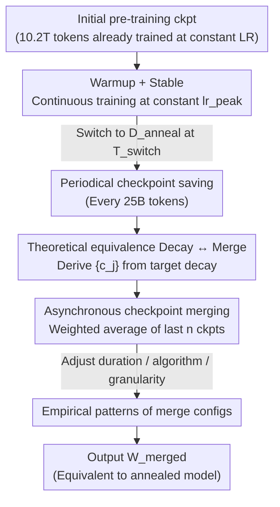

# WSM: Decay-free Learning Rate Schedule via Checkpoint Merging for LLM Pre-training

**Conference**: ICLR 2026  
**Paper**: [OpenReview](https://openreview.net/) (ICLR 2026 Accepted, no arXiv ID yet, link subject to original)  
**Code**: None (not public)  
**Area**: LLM Efficiency / Pre-training Optimization  
**Keywords**: LR schedule, checkpoint merging, model averaging, decay-free, pre-training annealing

## TL;DR
WSM theoretically equates "learning rate decay" with "weighted checkpoint merging"—showing that constant learning rate training followed by merging recent checkpoints with derived weights can simulate any decay curve (cosine, linear, 1-sqrt, etc.). This removes the decay phase from training entirely and consistently outperforms the mainstream WSD scheme on benchmarks like MATH, HumanEval, and MMLU-Pro.

## Background & Motivation

**Background**: Learning rate (LR) scheduling is crucial in LLM pre-training. Traditional cosine decay requires fixing the total steps $T_{max}$ beforehand; any continuation with new data invalidates the curve, requiring a restart. To decouple total steps, WSD (Warmup-Stable-Decay) inserts a constant LR "stable" phase between warmup and decay, a strategy used by DeepSeek-V3 and ERNIE 4.5.

**Limitations of Prior Work**: Although WSD allows starting decay from any point in the stable phase, it shifts the complexity from "fixing total steps" to "defining the decay process"—researchers must manually decide **when to start decay, how many tokens to allocate for decay, and which decay function to use**. Worse, once decay begins, continuing training requires rolling back the model to its pre-decay state, contradicting the goal of "fully automated, continuous training."

**Key Challenge**: The decay phase is essentially for "annealing" (converging to a flatter optimum), but it is hard-coded into the **online training process**. Once decay occurs, the LR and training state are altered, making them non-reversible and non-reusable. Can the benefits of annealing be decoupled from online training?

**Key Insight**: Prior works observed that constant LR + weight averaging (e.g., Exponential Weighted Average, EWA) can approximate WSD. The authors ask: Is there an **exact mathematical correspondence** between weight averaging and LR decay, rather than just an empirical similarity?

**Core Idea**: By expanding gradients, the authors map checkpoint merging weights $\{c_j\}$ to "effective decay coefficients for each step's gradient" $\{w_i\}$, proving a one-to-one correspondence. Consequently, choosing a decay curve is equivalent to choosing merging weights. Constant LR training followed by offline merging allows simulating any decay in an optimizer-agnostic manner.

## Method

### Overall Architecture

WSM (Warmup-Stable and Merge) reduces the traditional "warmup → stable → decay" three-stage process to two stages: **warmup → stable (constant LR, no decay)**. The LR remains at $lr_{peak}$ after the peak. Checkpoints are saved periodically during training. The actual "annealing" is performed by an **asynchronous merging process** that takes the $n$ most recent checkpoints and calculates a weighted average $W_{merged}$ based on the target decay curve. The **online learning rate is never modified**.

In the late stable phase (at step $T_{switch}$), the data can switch from a general pre-training set $D$ to a small, high-quality annealing dataset $D_{anneal}$, focusing the "annealing" on refined data—this step is a key driver for WSM outperforming WSD.

### Key Designs

**1. Theoretical Equivalence: Translating Annealing into Weighted Averaging**

This is the foundation of the paper, addressing the pain point that prior weight averaging was empirical and non-customizable. Starting from a general merge form where the merged model is a weighted sum of checkpoints $\hat{\theta}_{n+k} = \sum_{j=0}^{k} c_j \theta_{n+j}$ (where $c_j \ge 0$ and $\sum c_j = 1$), each intermediate checkpoint is expanded as the starting point $\theta_n$ plus subsequent gradient updates: $\theta_{n+j} = \theta_n - \sum_{l=1}^{j} g_{n+l-1}$ (where $g_i$ is the $i$-th gradient update including LR). Substituting this into the merge formula and reordering the double summation yields:

$$\hat{\theta}_{n+k} = \theta_n - \sum_{i=1}^{k} \Big(\sum_{j=i}^{k} c_j\Big) g_{n+i-1} = \theta_n - \sum_{i=1}^{k} w_i \cdot g_{n+i-1}$$

Thus, the effective coefficient for the gradient at step $i$ is $w_i = \sum_{j=i}^{k} c_j$. This $w_i$ acts exactly as the "synthetic LR decay curve." Conversely, **Theorem 3.1** provides the unique formula to solve for merge weights from target decay coefficients: given monotonically non-increasing $1\ge w_1\ge\cdots\ge w_k\ge 0$, then $c_k = w_k$, $c_j = w_j - w_{j+1}$ for $j\in[1,k-1]$, and $c_0 = 1 - w_1$. Simulating cosine, linear, or 1-sqrt decay simply requires calculating $\{w_i\}$ and converting it to $\{c_j\}$. This elevates model merging from a heuristic to a principled tool for customizable decay, independent of specific optimizers (optimizer-agnostic).

**2. WSM Two-stage Pipeline: Constant LR Training + Asynchronous Merge Annealing**

With the theoretical equivalence, the implementation of WSM is clean (Algorithm 1): the LR linearly increases to $lr_{peak}$ during warmup and then **stays at $lr_{peak}$ forever**. The decay segment is entirely eliminated. During the stable phase, checkpoints are saved every fixed number of tokens (25B in experiments). At $T_{switch}$, training data switches to the high-quality annealing set $D_{anneal}$. Simultaneously, an **asynchronous merging process** pulls the $n$ most recent checkpoints from storage and synthesizes $W_{merged}$ based on weights from Design 1.

This decouples "annealing" from online training: because the online LR is never changed, training can **seamlessly continue** (gray area in Fig. 1). An "annealed model" can be obtained instantly via merging at any time. In contrast, WSD alters the LR and state once decay begins, requiring a rollback to continue. The paper notes an additional value: as WSM merging high-fidelity approximates real decay, it serves as a **cheap oracle** to estimate potential performance if annealed at any moment during pre-training.

**3. Empirical Patterns of Merge Configurations**

While theory suggests "it can simulate," empirical testing defines optimal configurations. The authors analyzed merge algorithms, frequency, duration, and granularity. The key discovery is that **merge duration (the training window covered by merged checkpoints) is the primary factor affecting performance**, significantly outweighing checkpoint intervals or the absolute number of checkpoints. Larger windows are better, albeit with diminishing returns. Furthermore, the **rank of merging algorithms matches the rank of decay curves**: 1-sqrt (concave) > Mean (linear) > EMA (convex). This confirms that checkpoint merging is a principled simulation of decay. Fine-grained saving (smaller intervals) improves the approximation of the decay curve but increases storage overhead. The authors also found that merge and decay are **not complementary but alternative paths** to the same optimization goal.

### Loss & Training
WSM introduces no new training losses or regularization; it is a scheduling-level method. Training uses AdamW ($\beta_1=0.9$, $\beta_2=0.95$, weight decay 0.1) with a peak LR of 4.78e-4 and batch size 2048. The primary model is a MoE with 16.3B total / 1.4B active parameters, starting from a checkpoint pre-trained on 10.2T tokens at constant LR. It is then compared across 400B tokens of high-quality annealing data: the WSD branch uses standard decay (including re-warmup), while the WSM branch maintains constant LR and merges checkpoints (defaulting to 25B interval, Mean average, equivalent to linear decay).

## Key Experimental Results

### Main Results

Base Model (using checkpoints with the highest average score): WSM outperforms WSD across the board, with the largest gains in Professional Knowledge and Math.

| Capability Category | WSD | WSM | Gain |
|---------------------|-------|-------|--------|
| General Knowledge   | 69.06 | 70.22 | +1.68% |
| Language Modeling   | 67.78 | 68.67 | +1.31% |
| Math                | 57.49 | 58.81 | +2.30% |
| Code                | 64.88 | 65.58 | +1.08% |
| Professional Knowledge | 53.46 | 56.04 | +4.83% |
| **Overall Average** | **62.67** | **63.95** | **+2.04%** |

> Note: The abstract reports gains of +3.5% MATH, +2.9% HumanEval, and +5.5% MMLU-Pro using different checkpoint selection/comparison criteria. The table above uses category-average metrics. Refer to the original text for specific metric definitions.

Instruct Model (after SFT for 5 epochs, best epoch): Advantages persist into post-training, with only a slight decrease in Code.

| Capability Category | WSD | WSM | Gain |
|---------------------|-------|-------|--------|
| Language            | 81.12 | 84.78 | +4.51% |
| Knowledge           | 60.00 | 61.73 | +2.88% |
| Math                | 61.43 | 62.28 | +1.38% |
| Code                | 58.23 | 57.95 | -0.48% |
| Reason              | 63.21 | 64.94 | +2.74% |
| Agent               | 68.16 | 69.33 | +1.72% |
| **Overall Average** | **62.90** | **64.07** | **+1.86%** |

### Ablation Study

Comparison of Merging Algorithms (Table 3, vs. 1-sqrt decay baseline): Merging generally outperforms decay, and the order 1-sqrt > Mean > EMA aligns with decay curve performance.

| Config | Overall Avg | Description |
|--------|-------------|-------------|
| Decay (1-sqrt) | 62.67 | WSD Baseline |
| Merge - EMA | 63.01 | Convex decay, weakest |
| Merge - Mean | 63.95 | Linear decay |
| Merge - 1-sqrt | **64.06** | Concave decay, best |

Comparison of Merging Granularity (Table 4, fixed 80B token window; (Interval, Count)): Finer granularity yields better results; (80B, 1) degrades significantly.

| Granularity (Interval, Count) | Overall Avg | Description |
|-------------------------------|-------------|-------------|
| (5B, 16) | 63.63 | Finest granularity |
| (10B, 8) | **63.78** | Best performance |
| (20B, 4) | 63.36 | |
| (40B, 2) | 62.77 | |
| (80B, 1) | 60.33 | Degenerates to single ckpt |

### Key Findings
- **Merge duration is the primary factor**: Its impact is significantly larger than checkpoint intervals or the number of checkpoints; larger windows are better but saturate.
- **High-quality annealing data is crucial**: In the constant LR phase without data switching, WSM merging acts as a high-fidelity proxy for real decay but provides limited gain. The advantage over WSD becomes significant only after introducing high-quality annealing data.
- **EMA is suboptimal**: Its convex decay property makes it significantly weaker and insensitive to merge duration.
- **Merge and decay are not complementary**: Combinations like Decay-then-Merge do not yield additional gains.
- **MoE Load Balancing** (Table 5): WSM improves expert utilization (lower load balancing violation) at the cost of slightly higher language modeling loss.

## Highlights & Insights
- **Shifting Scheduling to Merging**: The most elegant contribution is the reordering of the double summation in Eq.3→Eq.4, proving the exact correspondence between $c_j$ and $w_i$.
- **Formulaic Recipe in Theorem 3.1**: Any desired monotonic decay curve can be converted into merge weights $\{c_j\}$, providing an optimizer-agnostic and ready-to-use formula for engineering.
- **Cheap Annealing Oracle**: WSM allows for low-cost prediction of performance levels after potential annealing, saving compute by avoiding expensive trial decay runs.
- **Transferability**: The constant LR + offline merge paradigm is naturally suited for continual pre-training and long-term iteration—no rollbacks or schedule resets are required.

## Limitations & Future Work
- **Reliance on Data Quality**: Significant gains depend on high-quality annealing data; without it, WSM's advantage over WSD is less pronounced.
- **Storage Overhead**: Fine-grained merging is effective but creates significant storage pressure. The paper notes the trade-off but provides no systematic mitigation.
- **Theoretical Assumptions**: The derivation assumes independent updates and ignores optimizer states (like Adam's momentum). Actual training under Adam only satisfies the equivalence approximately.
- **Scope of Validation**: Primary experiments are focused on a single 16.3B MoE model; generalizability across scales and dense architectures requires further verification.

## Related Work & Insights
- **vs. WSD (Hu et al., 2024)**: WSD uses online decay for annealing, requiring manual tuning of parameters and rollbacks for continued training. WSM replaces online decay with offline merging, simplifying scheduling and enabling seamless continuation.
- **vs. EWA / Simple Weight Averaging (Li et al., 2025)**: Previous works analyzed specific strategies (like EWA) empirically. WSM provides a general equivalence theorem, allows for custom decay curves, and reveals the duration dominance law.
- **vs. Cosine Decay (Loshchilov & Hutter, 2016)**: Cosine decay fixes total steps; WSM completely decouples steps from the annealing strategy.

## Rating
- Novelty: ⭐⭐⭐⭐⭐ Establishes a precise mathematical equivalence between LR decay and checkpoint merging with an inverse solution theorem.
- Experimental Thoroughness: ⭐⭐⭐⭐ Systematically explores algorithms/duration/granularity on a 16.3B MoE, though model diversity is somewhat limited.
- Writing Quality: ⭐⭐⭐⭐ Clear derivations and intuitive diagrams; minor manual alignment needed for some abstract vs. table figures.
- Value: ⭐⭐⭐⭐⭐ Provides a practical, optimizer-agnostic decay-free scheme for continuous pre-training and process monitoring.

<!-- RELATED:START -->

## Related Papers

- [\[ICLR 2026\] Weight Decay May Matter More Than µP for Learning Rate Transfer in Practice](weight_decay_may_matter_more_than_µp_for_learning_rate_transfer_in_practice.md)
- [\[ICLR 2026\] Seesaw: Accelerating Training by Balancing Learning Rate and Batch Size Scheduling](seesaw_accelerating_training_by_balancing_batch_size_and_learning_rate_schedulin.md)
- [\[ICLR 2026\] Convex Dominance in Deep Learning I: A Scaling Law of Loss and Learning Rate](convex_dominance_in_deep_learning_i_a_scaling_law_of_loss_and_learning_rate.md)
- [\[ICLR 2026\] Cutting the Skip: Training Residual-Free Transformers](cutting_the_skip_training_residual-free_transformers.md)
- [\[CVPR 2026\] ACE-Merging: Data-Free Model Merging with Adaptive Covariance Estimation](../../CVPR2026/optimization/ace-merging_data-free_model_merging_with_adaptive_covariance_estimation.md)

<!-- RELATED:END -->
