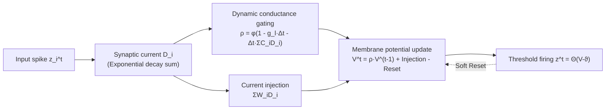

# A Brain-Inspired Gating Mechanism Unlocks Robust Computation in Spiking Neural Networks

**Conference**: ICLR 2026  
**OpenReview**: [https://openreview.net/forum?id=5h741EyfQM](https://openreview.net/forum?id=5h741EyfQM)  
**Code**: To be confirmed  
**Area**: Spiking Neural Networks / Brain-inspired Computing  
**Keywords**: Spiking Neural Networks, Dynamic Conductance, Gating Mechanism, Robustness, LIF Neuron, Temporal Modeling  

## TL;DR
This paper reintroduces "activity-dependent membrane conductance" from biological neurons into the LIF model to construct a Spiking Gated Neuron (DGN) that adaptively gates information flow. It theoretically proves its superior noise suppression capabilities and experimentally demonstrates high accuracy and noise resistance on speech/neuromorphic temporal tasks.

## Background & Motivation
**Background**: Spiking Neural Networks (SNNs) claim to be biologically inspired with low energy consumption. However, mainstream implementations almost exclusively use the simplified Leaky Integrate-and-Fire (LIF) neuron—characterized by fixed leak conductance $g_l$, a constant decay rate, and linear synaptic summation. These "Gateless SNNs" lack any internal gating mechanism to regulate neuronal dynamics.

**Limitations of Prior Work**: Biological studies have long established that ion channel conductances are **not static**. Sustained neural activity dynamically regulates potassium and calcium conductances through mechanisms such as calcium signaling and gene expression (e.g., fos/ras). LIF models discard these dynamic conductances, leading to poor robustness against noise and temporal perturbations, and failing to express the true dynamic advantages of biological neurons. Existing improvements (ALIF for adaptive thresholds, GLIF for static channel gating, or Heterogeneous LIF for learnable time constants) are either engineering-driven parameter stacking or rely on static gating, neither of which qualifies as "biologically plausible dynamic gating."

**Key Challenge**: There exists a gap between the natural gating and robustness achieved by biological neurons through dynamic conductance and the current SNN practice of discarding these mechanisms for computational speed. The field lacks a spiking neuron model that is both **biologically grounded and dynamically gated**.

**Goal**: To re-examine dynamic conductance from a functional perspective, reintegrating it into the LIF model as a gating mechanism to "regulate information flow," and to theoretically prove its superior noise resistance.

**Core Idea**: **Dynamic conductance is gating.** By allowing membrane conductance to evolve in real-time based on input activity, the neuron adaptively decides "how much past information to retain vs. decay." This is functionally equivalent to the forget gate in an LSTM but originates from neuro-physical principles rather than artificial design.

## Method

### Overall Architecture
The Dynamic Gated Neuron (DGN) introduces a "dynamic conductance path" atop the LIF model: the membrane potential decay rate is no longer fixed but modulated in real-time by current synaptic activity $D_i$, forming a gating term $g_l + \sum_i C_i D_i$. Meanwhile, the traditional current injection path $\sum_i W_i D_i$ is retained. This dual-path structure enables gating capabilities within a single neuron without requiring complex network architectures. The paper further uses Stochastic Differential Equations (SDE) to theoretically prove that this dynamic conductance suppresses noise and points out its structural homology with LSTM.

### Key Designs
**1. Dynamic Conductance Gating: Real-time adaptation of decay rates.** In traditional LIF models, the membrane potential decay coefficient $\rho_m = e^{-g_l \Delta t}$ is a constant, meaning information leaks at a fixed rate. DGN transforms this decay coefficient into a dynamic variable dependent on synaptic activity: $\rho^t = \phi(1 - g_l \cdot \Delta t - \Delta t \sum_i C_i D_i^t)$, where $D_i^t = e^{-\Delta t/\tau_s} D_i^{t-1} + z_i^t$ represents the exponentially decaying integrated current of the $i$-th synapse, and $\phi$ is a truncation function (e.g., Sigmoid). Intuitively, stronger inputs result in larger $\sum C_i D_i$, higher effective conductance, and faster membrane potential decay. The neuron thus dynamically decides what to "remember" or "forget" based on context, which is the essence of gating. The membrane potential update is expressed as $V^t = \rho^t V^{t-1} + \Delta t \sum_i W_i D_i^t - \vartheta z^{t-1}$, unifying dynamic gating, current injection, and soft reset in a single iterative equation.

**2. Homology with LSTM: A biological explanation for the universality of gating.** Ours does not stop at engineering efficiency but points out that DGN and LSTM are topologically isomorphic in structure: the adaptive decay coefficient $\rho^t$ corresponds to the LSTM forget gate $f^t$ (determining state retention), and dynamic synaptic current accumulation corresponds to the input gate $I^t$, while the spike soft reset corresponds to the cell state update. The critical difference is that LSTM gating was **manually designed** to solve vanishing gradients in RNNs, whereas DGN gating emerges from the dynamic conductance behavior of biological neurons (e.g., calcium modulation). This mapping elevates gating from an empirical engineering principle to a unified perspective across artificial and biological systems.

**3. Stochastic Stability Theory: Proving dynamic conductance as a noise suppression mechanism.** This is the core theoretical contribution. Input perturbations are modeled as Gaussian white noise superimposed on a deterministic signal $\hat{I}_i(t) = \mu_i + \sigma_i \xi(t)$. Using linear noise approximation ($V = V_{steady} + \delta V$) to linearize nonlinear conductance dynamics and applying Ito calculus, a closed-form solution for steady-state membrane potential variance is derived. The variance for DGN is $\langle V^2 \rangle_{DGN} = \frac{\sum_i \sigma_i (W_i - \frac{C_i \sum_j W_j \mu_j}{G_0})^2}{2 G_0}$, whereas for LIF it is $\langle V^2 \rangle_{LIF} = \frac{(\sum_i W_i \sigma_i)^2}{2 g_l}$, where $G_0 = g_l + \sum C_i \mu_i$. Comparing the two reveals two synergistic noise reduction mechanisms: the denominator $G_0$ implements **input-dependent leak conductance scaling** (stronger inputs lead to higher effective conductance, suppressing voltage fluctuations); the compensation term $\frac{C_i \sum W_j \mu_j}{G_0}$ in the numerator provides **negative feedback**, which cancels synaptic noise propagation when $W_i$ and $C_i$ are positively correlated. LIF, with its fixed leak and lack of compensation, can only perform static noise scaling.

**4. S-DGN Parameter-Efficient Variant: Gains from mechanism rather than capacity.** To address concerns regarding increased parameter counts, Ours introduces S-DGN, where all synapses connecting to the same neuron share a single equilibrium potential $E$ (rather than independent $C_i$). The dynamics simplify to $\frac{dV}{dt} = -V(g_l + \sum_i C_i D_i) + E \sum_i C_i D_i$. This reduces learnable parameters to LIF levels while retaining the core dynamic conductance mechanism, proving that performance improvements stem from the efficiency of the neuron design itself.

## Key Experimental Results

### Main Results (Classification Accuracy %, Rec=Y for Recurrent)

| Dataset | Method | Rec | Hidden Layers | Acc(%) |
|---|---|---|---|---|
| TIDIGITS | LIF+BPTEI | N | 400-11 | 98.10 |
| TIDIGITS | **DGN(Ours)** | N | 100 | **98.59** |
| TIDIGITS | LSTM* | Y | 100 | 97.88 |
| TIDIGITS | **DGN(Ours)** | Y | 100 | **99.10** |
| SHD | TC-LIF | N | 128-128 | 83.08 |
| SHD | **DGN(Ours)** | N | 128 | **85.18** |
| SHD | **DGN(Ours)** | Y | 128-128 | **88.98** |
| SSC | TC-LIF | N | 128-128 | 63.46 |
| SSC | **DGN(Ours)** | N | 128-128 | **67.54** |
| SSC | LSTM | Y | 128-128 | 73.10 |
| SSC | **DGN(Ours)** | Y | 128-128 | **75.63** |

DGN achieves or exceeds Prev. SOTA with fewer neurons and simpler structures (e.g., single hidden layer of 100 nodes). On TIDIGITS, recurrent DGN reaches 99.10%; on SSC, a two-layer recurrent DGN hits 75.63%, outperforming LSTM.

### Noise/Adversarial Robustness (TIDIGITS, Accuracy %)

| Model | Clean | Additive | Mixed | FGSM | PGD | BIM |
|---|---|---|---|---|---|---|
| LIF (FF) | 97.02 | 46.83 | 44.20 | 39.53 | 15.39 | 15.95 |
| HeterLIF (FF) | 96.52 | 77.49 | 72.78 | 52.48 | 43.94 | 43.68 |
| **DGN (FF)** | **98.59** | **95.34** | **78.12** | **90.35** | **86.76** | **86.88** |
| LSTM (Rec) | 97.88 | 65.12 | 64.77 | 64.97 | 60.66 | 61.01 |
| **DGN (Rec)** | **99.10** | **94.84** | **93.86** | **89.40** | **87.52** | **87.68** |

All models were trained only on clean data and tested on unseen noise patterns. Feedforward (FF) DGN maintains 95.34% under additive noise, a 48.51% Gain over LIF. Under adversarial attacks like FGSM/PGD/BIM, DGN degradation is significantly lower than LIF, ALIF, HeterLIF, or even LSTM.

### Ablation Study (SHD, Parameters vs. Robustness)

| FF Model | Param(K) | Clean Acc(%) | Overall Robustness(%) |
|---|---|---|---|
| LIF | 92.16 | 77.30 | 44.17 ± 9.96 |
| ALIF | 92.16 | 78.02 | 48.53 ± 6.24 |
| DLIF (250 step) | 92.66 | 79.96 | 49.93 ± 5.91 |
| **s-DGN (ours)** | 92.31 | **84.30** | **58.28 ± 2.33** |
| **DGN (ours)** | 184.32 | **85.18** | **61.54 ± 1.95** |

### Key Findings
- s-DGN, with **nearly identical parameter counts** to LIF (92.31K vs. 92.16K), increases clean accuracy from 77.30% to 84.30% and robustness from 44.17% to 58.28% with lower variance—proving the Gain comes from the dynamic gating mechanism itself.
- Gating architectures are inherently more robust: under PGD attacks on SHD, LSTM is 20.08% higher than vanilla RNN, while recurrent DGN is 35.54% higher than recurrent LIF, reinforcing the argument that "gating brings robustness."

## Highlights & Insights
- **Mapping Engineering Experience back to Biological Principles**: Instead of inventing a new gate, Ours argues that LSTM-style gating was already implemented in biological neurons via dynamic conductance, providing a neuroscience explanation for the universality of gating.
- **Solid Theory**: The use of SDE and Ito calculus to provide closed-form steady-state variance comparisons clarifies "why" noise resistance occurs—attributing it to adaptive leak scaling and negative feedback compensation rather than just empirical numbers.
- **Single-Neuron Gating**: By embedding gating within the neuron rather than the network topology, SOTA results are achieved with fewer parameters and simpler architectures, favoring neuromorphic hardware deployment.
- **Rigorous Robustness Evaluation**: Training on clean data and testing on unseen noise prevents overestimation caused by models "memorizing" noise patterns during training.

## Limitations & Future Work
- **Narrow Task Scope**: Experiments are concentrated on speech/neuromorphic temporal classification (TIDIGITS, SHD, SSC, Ti46). High-scale vision or longer temporal tasks have not been verified, leaving generalization an open question.
- **Strong Theoretical Assumptions**: The stability analysis relies on small-perturbation linearization and Gaussian white noise assumptions. Real-world adversarial perturbations (FGSM/PGD) do not satisfy these, creating an explanatory gap between theory and adversarial experiments.
- **Sensitivity to Truncation & Hyperparameters**: The impact of the choice of $\phi$ (e.g., Sigmoid), $C_i$, and $\tau_s$ on dynamic gating lacks systematic analysis.
- **Computational Overhead**: Dynamic conductance requires recalculating $\sum C_i D_i$ at each step. Compared to LIF with a fixed $\rho$, there is additional overhead. The paper lacks quantitative comparisons of energy/latency, which is a missed opportunity for a "low-energy" SNN claim.

## Related Work & Insights
- **Parameterized Spiking Neurons**: ALIF (activity-dependent threshold), GLIF (static channel gating), Heterogeneous LIF (learnable time constants), FS-neuron (fully trainable parameters), and HetSyn (temporal integration in synaptic current). DGN differentiates itself by deriving gating from biological dynamics rather than pure engineering parameterization.
- **SNN Robustness**: Structural modeling (threshold/window adjustment), training strategies (adversarial training, Lipschitz regularization), and biological inspiration (stochastic gating, rate-coding attention). DGN follows the biological inspiration path but adds theoretical guarantees.
- **Insight**: The route of "interpreting/replacing engineering modules with biological mechanisms" is worth further exploration—e.g., re-interpreting attention or normalization from a neuroscience perspective. The negative feedback noise reduction in dynamic conductance could also inspire robust network designs.

## Rating
- **Novelty**: ⭐⭐⭐⭐ — Reframing dynamic conductance as a gating mechanism and establishing homology with LSTM is novel and deep; however, dynamic conductance itself is not a brand-new concept in computational neuroscience.
- **Experimental Thoroughness**: ⭐⭐⭐⭐ — Includes 4 datasets, 6 noise/attack types, and parameter-aligned ablations with rigorous robustness settings; however, tasks are limited to audio-temporal, lacking large-scale vision or energy-consumption comparisons.
- **Writing Quality**: ⭐⭐⭐⭐ — Logic from motivation to mechanism, theory, and experiments is clear. Theoretical derivations are complete, though dense (some moved to appendix).
- **Value**: ⭐⭐⭐⭐ — Provides a theoretically and empirically sound gating paradigm for robust, biologically plausible SNNs, with practical implications for neuromorphic computing.

<!-- RELATED:START -->

## Related Papers

- [\[ICLR 2026\] Breaking Gradient Temporal Collinearity for Robust Spiking Neural Networks](breaking_gradient_temporal_collinearity_for_robust_spiking_neural_networks.md)
- [\[ICLR 2026\] Fractional-Order Spiking Neural Network](fractional-order_spiking_neural_network.md)
- [\[ICLR 2026\] Online Pseudo-Zeroth-Order Training of Neuromorphic Spiking Neural Networks](online_pseudo-zeroth-order_training_of_neuromorphic_spiking_neural_networks.md)
- [\[ICLR 2026\] Beyond Linear Processing: Dendritic Bilinear Integration in Spiking Neural Networks](beyond_linear_processing_dendritic_bilinear_integration_in_spiking_neural_networ.md)
- [\[ICLR 2026\] On the Lipschitz Continuity of Set Aggregation Functions and Neural Networks for Sets](on_the_lipschitz_continuity_of_set_aggregation_functions_and_neural_networks_for.md)

<!-- RELATED:END -->
