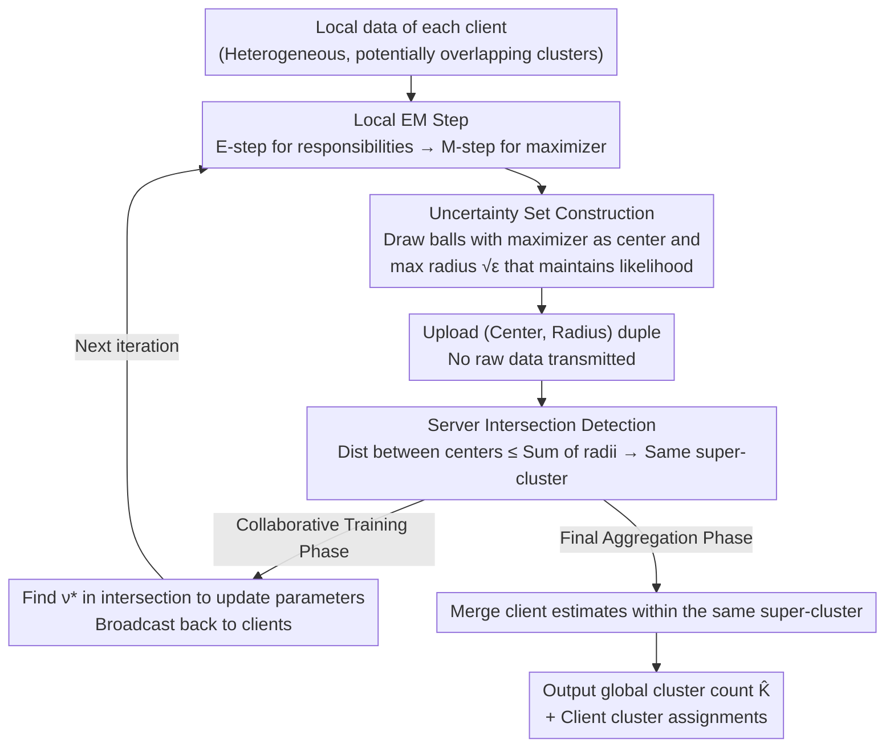

# A Federated Generalized Expectation-Maximization Algorithm for Mixture Models with an Unknown Number of Components

**Conference**: ICLR 2026  
**arXiv**: [2601.21160](https://arxiv.org/abs/2601.21160)  
**Code**: None  
**Area**: Others  
**Keywords**: Federated Clustering, Generalized EM Algorithm, Mixture Models, Unknown Cluster Number, Uncertainty Sets  

## TL;DR
The proposed FedGEM algorithm constructs uncertainty sets after local EM steps on clients, allowing the server to detect cluster overlaps via set intersections and infer the global cluster count. This marks the first federated clustering approach that operates without a predefined number of clusters while providing probabilistic convergence guarantees.

## Background & Motivation

**Background**: Clustering tasks in federated learning typically assume that all clients share the same set of clusters and that the global number of clusters $K$ is known.

**Limitations of Prior Work**: In practical scenarios (e.g., fault diagnosis for OEM equipment), clients have heterogeneous but potentially overlapping sets of clusters, and the global number of fault categories is unknown. Existing federated clustering methods (k-FED, FFCM, FedKmeans) all require prior knowledge of $K$. The only method that does not require $K$, AFCL, suffers from severe privacy issues where client data can be reconstructed by the server through simple arithmetic operations.

**Key Challenge**: Clients cannot share raw data (privacy constraints), lack unified label standards (label heterogeneity), and the global cluster count is unknown—traditional centralized training and existing federated methods fail to satisfy these constraints simultaneously.

**Goal**: Design a privacy-preserving federated clustering algorithm that can infer $K$ and train mixture models under the condition of an unknown global cluster count.

**Key Insight**: Combine the EM algorithm with uncertainty sets—each client calculates a maximum perturbation range (uncertainty radius) after the M-step that guarantees no decrease in likelihood, and the server detects cluster overlaps through intersections of these uncertainty sets.

**Core Idea**: Discover cluster overlaps across clients using the intersection of non-decreasing likelihood uncertainty sets around EM maximizers, thereby achieving federated clustering without knowing the global $K$.

## Method

### Overall Architecture
FedGEM addresses a difficult federated clustering scenario: data held by different clients comes from distinct but potentially overlapping clusters, the global cluster count $K$ is unknown, and raw data cannot be shared due to privacy constraints. The approach enables each client to run local EM initially. Instead of direct data sharing, clients upload a set of "uncertainty sets"—essentially balls centered around the parameters of each local cluster component. Upon receiving these balls from all clients, the server determines that clusters are identical if their balls intersect, thereby stitching together scattered clusters and inferring the global $K$. The process consists of two stages: first, an iterative collaborative training stage (local EM + uncertainty set calculation on clients, parameter updates by the server finding a vector $\nu^*$ within the intersection, and broadcasting back); second, after convergence, a final aggregation stage where the server merges estimates from the same super-cluster, determines the global $K$, and assigns cluster memberships to each client.

### Key Designs

**1. Client Uncertainty Sets: Transforming "Imprecise M-steps" into Uploadable Balls**

The M-step in EM traditionally seeks parameters that maximize the expected complete-data log-likelihood, but GEM allows for a non-exhaustive M-step—as long as the likelihood does not decrease. This paper quantifies this relaxation into a concrete geometric object. For each cluster component, the client constructs a Euclidean ball $\mathcal{U}_{k_g}$ centered at the maximizer $M_{k_g}$ obtained from the M-step, with a radius $\sqrt{\varepsilon_{k_g}}$ determined by an optimization problem: any parameter value within the ball must not cause the expected complete-data log-likelihood to decrease. In other words, this ball characterizes the range within which parameters can fluctuate without algorithm degradation; smaller balls indicate more precise local estimates. For isotropic GMMs, the radius problem can be reformulated as a bi-convex two-dimensional problem with a closed-form solution, resulting in low computational overhead. Crucially, the client only needs to upload the (center, radius) pair, which is significantly smaller than the raw data and inherently protects privacy.

**2. Server Intersection Detection: Judging Cluster Identity via Sphere Intersections**

The server must correspond local clusters named independently by different clients—without seeing the data, only the spheres. The criterion provided is purely geometric: if the distance between two component centers does not exceed the sum of their radii, i.e., $\|M_{k_g} - M_{k_{g'}}\|_2 \leq \sqrt{\varepsilon_{k_g}} + \sqrt{\varepsilon_{k_{g'}}}$, the spheres intersect, and these components are assigned to the same "super-cluster." During the collaborative training phase, the server calculates an optimal vector $\nu^*$ within the intersection to update parameters. In the final aggregation phase, it merges estimates from all clients within the same super-cluster into a global estimate. This approach is beneficial as it is entirely closed-form, requiring only distance comparisons and linear operations, avoiding iterative optimization and the sharing of raw data or large arrays for cross-client cluster matching.

**3. Convergence Guarantee: Probabilistic Convergence and $K$ Identifiability from General Mixture Models to GMM**

The paper also proves that the algorithm converges with high probability to a neighborhood of the true parameters and correctly counts $K$ under standard assumptions. Using First-Order Stability (FOS) conditions, the authors prove that GEM iterations converge to a $\frac{1}{1-\beta/\lambda}\epsilon^{\text{unif}}$ neighborhood of the true parameters $\theta^*$. Furthermore, it is shown that if the final aggregation radius is set to $\epsilon^{\text{unif}}$ and does not exceed $R_{\min}/4$ (where $R_{\min}$ is the minimum separation between true clusters), intersection detection correctly infers the global cluster count $K$. This proof chain, tightening from general mixture models to isotropic GMMs, ensures that FedGEM is not just a heuristic but an algorithm with explicit convergence rates and $K$ identifiability conditions.

### Loss & Training
The overall framework still optimizes the log-likelihood using the EM structure without introducing additional training objectives. The uncertainty set radius is solved separately as a constrained optimization problem. Under the isotropic GMM setting, the closed-form solution for the radius allows the entire process to maintain low complexity and practical feasibility.

## Key Experimental Results

### Main Results

| Dataset | FedGEM (ARI) | AFCL (ARI) | DP-GMM (ARI) | GMM (Known K) | Estimated K (True K) |
|--------|-------------|-----------|-------------|------------|-------------|
| MNIST | 0.355±.064 | 0.137±.055 | 0.326±.080 | 0.287±.067 | 14.7 (10) |
| FMNIST | 0.415±.022 | 0.143±.019 | 0.332±.069 | 0.385±.023 | 12.3 (10) |
| CIFAR-10 | 0.058±.008 | 0.022±.007 | 0.032±.017 | 0.402±.022 | 33.7 (10) |
| Abalone | 0.128±.030 | 0.091±.022 | 0.061±.018 | 0.096±.028 | 4.5 (3) |

### Ablation Study

| Configuration | ARI (Synthetic Data) | Description |
|------|-------------|------|
| Centralized EM | ~0.95 | Upper bound |
| FedGEM | ~0.90 | Close to centralized |
| AFCL | ~0.50 | Significant lag |
| k-FED (Known K) | ~0.85 | Requires K |

### Key Findings
- FedGEM consistently outperforms AFCL, the only competitor not requiring $K$, across all datasets, and even exceeds methods requiring known $K$ in some cases.
- On non-Gaussian datasets like CIFAR-10, the cluster count is overestimated (33.7 vs 10), indicating limitations of the isotropic GMM assumption on complex data.
- The algorithm exhibits good scalability, with performance degradation significantly lower than competitors as problem size increases.
- Reasonable performance is maintained even on real-world datasets that violate Gaussian assumptions.

## Highlights & Insights
- **Clever Design of Uncertainty Sets**: Converts the "imprecision tolerance" of GEM's M-step into a tool for cross-client cluster matching. It is theoretically elegant and practically efficient. The radius naturally reflects estimation precision—higher precision leads to a smaller radius.
- **Closed-form Aggregation**: The server-side requires only simple distance comparisons and linear operations without iterative optimization, ensuring high computational efficiency.
- **Theoretical Integrity**: A complete proof chain for convergence is provided, progressing from general mixture models to isotropic GMMs.

## Limitations & Future Work
- The isotropic GMM assumption limits performance on complex high-dimensional data (e.g., CIFAR-10); extending to full-covariance GMMs or more complex mixture models is a natural next step.
- There is still a noticeable bias in cluster count estimation (specifically overestimation); practical deployment requires better strategies for selecting final aggregation radii.
- Convergence guarantees rely on the assumption of sufficiently separated clusters; guarantees may fail when clusters overlap significantly.
- Differential privacy discussions are preliminary, and formal privacy guarantees need to be strengthened.

## Related Work & Insights
- **vs k-FED/FFCM**: These methods require prior knowledge of the global $K$, limiting practical utility; FedGEM automatically infers $K$.
- **vs AFCL**: The only comparable method without known $K$, but AFCL has severe privacy vulnerabilities; FedGEM transmits only parameters and radii.
- **vs DP-GMM (Centralized)**: Under the federated setting, FedGEM approaches the performance of centralized DP-GMM and even slightly exceeds it in terms of ARI.

## Rating
- Novelty: ⭐⭐⭐⭐ Uncertainty set-driven federated clustering is a novel idea with original theory and algorithm design.
- Experimental Thoroughness: ⭐⭐⭐⭐ Relatively comprehensive with 8 datasets, 7 baselines, and scalability analysis.
- Writing Quality: ⭐⭐⭐⭐ Theoretical derivations are rigorous, though heavy on notation, impacting readability.
- Value: ⭐⭐⭐⭐ Fills a theoretical and methodological gap in federated clustering with an unknown number of components.

<!-- RELATED:START -->

## Related Papers

- [\[ICLR 2026\] Federated ADMM from Bayesian Duality](federated_admm_from_bayesian_duality.md)
- [\[ACL 2025\] RMoA: Optimizing Mixture-of-Agents through Diversity Maximization and Residual Compensation](../../ACL2025/others/rmoa_optimizing_mixture-of-agents_through_diversity_maximization_and_residual_co.md)
- [\[ICLR 2026\] Layerwise Federated Learning for Heterogeneous Quantum Clients using Quorus](layerwise_federated_learning_for_heterogeneous_quantum_clients_using_quorus.md)
- [\[ICLR 2026\] Exposing Mixture and Annotating Confusion for Active Universal Test-Time Adaptation](exposing_mixture_and_annotating_confusion_for_active_universal_test-time_adaptat.md)
- [\[ICLR 2026\] Neural Force Field: Few-shot Learning of Generalized Physical Reasoning](neural_force_field_few-shot_learning_of_generalized_physical_reasoning.md)

<!-- RELATED:END -->
