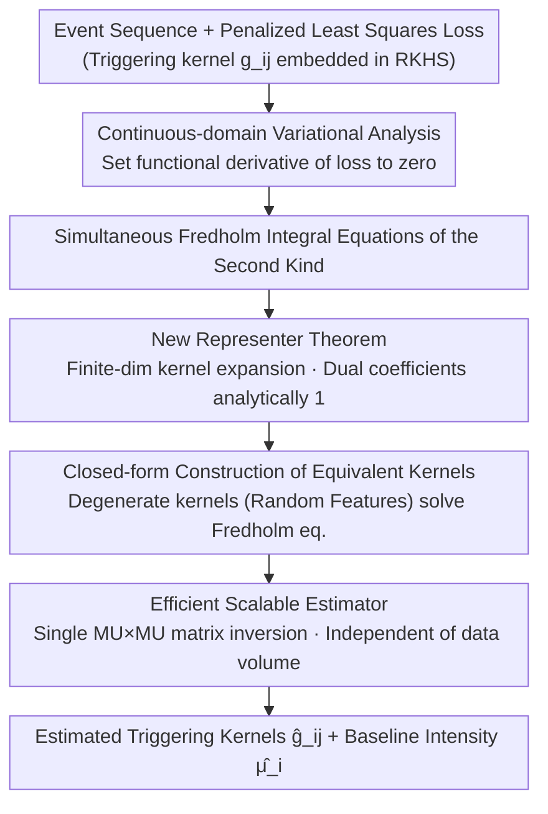

**A Representer Theorem for Hawkes Processes via Penalized Least Squares Minimization**

**Conference**: ICLR 2026  
**arXiv**: [2510.08916](https://arxiv.org/abs/2510.08916)  
**Code**: None  
**Area**: Point Processes / Kernel Methods  
**Keywords**: Hawkes Processes, Representer Theorem, RKHS, Fredholm Integral Equations, Non-parametric Estimation  

## TL;DR
A new representer theorem is established for estimating triggering kernels in linear multivariate Hawkes processes within an RKHS framework. It proves that the optimal estimator is represented as a linear combination of equivalent kernels at data points with dual coefficients analytically equal to 1, eliminating the need for dual optimization and enabling scalable non-parametric estimation.

## Background & Motivation

**Background**: Kernel methods implement non-parametric function estimation via RKHS, with representer theorems transforming infinite-dimensional optimization into finite-dimensional problems. Recently, these methods have been extended to intensity function estimation of point processes, with Bonnet & Sangnier (2025) deriving a representer theorem for Hawkes processes based on discretization approximations.

**Limitations of Prior Work**: Bonnet & Sangnier's method requires solving a non-linear optimization problem to obtain dual coefficients, where the dimensionality scales with the data volume, making it computationally infeasible for large-scale data. Moreover, it relies on discretization approximations of the likelihood or least-squares loss.

**Key Challenge**: The loss function of a Hawkes process involves the integral of the intensity function over the observation domain and violates independence assumptions, rendering classical representer theorems inapplicable. Precise variational analysis faces complex systems of simultaneous integral equations.

**Goal**: Establish a representer theorem for a non-approximate penalized least-squares formulation of linear Hawkes processes to achieve scalable non-parametric triggering kernel estimation.

**Key Insight**: By utilizing path integral representations and variational analysis, exact variational equations are derived directly in the continuous domain. The quadratic structure of the least-squares loss causes the dual coefficients to automatically equal 1.

**Core Idea**: The quadratic structure of the least-squares loss in RKHS ensures that the dual coefficients in the representer theorem for Hawkes processes are analytically fixed to 1, removing the need for dual optimization.

## Method

### Overall Architecture
The objective is to estimate triggering kernels for linear multivariate Hawkes processes, where the intensity function is $\lambda_i(t) = \mu_i + \sum_j \int_0^t g_{ij}(t-s) dN_j(s)$. Here $\mu_i$ is the baseline intensity and $g_{ij}$ characterizes the excitation of type $i$ events by type $j$. Each $g_{ij}$ is embedded in a Reproducing Kernel Hilbert Space (RKHS), and infinite-dimensional optimization is performed on the penalized least-squares loss. The pipeline consists of three steps: exact continuous-domain variational analysis of the loss to derive a representer theorem (discovering dual coefficients are identically 1); using Random Feature mappings to solve the resulting Fredholm integral equations in closed form; and reduction to a single matrix inversion whose size is independent of the data volume.

### Key Designs

**1. New Representer Theorem: Reducing infinite-dimensional optimization to finite dimensions with dual coefficients analytically fixed to 1**

Hawkes processes fail standard representer theorems due to the integral of the intensity function and the violation of independence. This paper avoids the discretization-then-optimization route. By taking the functional derivative of the penalized least-squares objective in the continuous domain, the authors obtain simultaneous Fredholm integral equations of the second kind. The optimal estimator takes the form:

$$\hat{g}_{ij}(s) = \sum_{n \in \mathcal{N}_i} h_j(s, t_n) - \hat{\mu}_i \int h_j(s,t)\, dt,$$

where $h_j$ is the equivalent kernel. The core insight is that the quadratic nature of the least-squares loss linearizes the variational equations, causing dual coefficients—which usually require optimization—to be analytically fixed to 1. This allows coefficients to be "calculated" rather than "optimized," serving as the source of efficiency.

**2. Closed-form construction of equivalent kernels: Solving Fredholm integral equations via Random Feature mapping**

Equivalent kernels $h_j$ are implicitly defined by integral equations. To avoid discretization errors, degenerate kernels (Random Feature mapping) approximate the RKHS kernel: $k(s,s') = \phi(s)^\top \phi(s')$. The equivalent kernel is then derived in closed form:

$$h_j(s,s') = \phi(s)^\top \Big[\big(\tfrac{1}{\gamma}I_{MU} + \Xi\big)^{-1} \tilde{\phi}(s')\Big].$$

This allows all integrals in the representer theorem to be calculated analytically, circumventing grid discretization and error accumulation. The computational cost is reduced to inverting an $MU \times MU$ matrix, where $M$ is feature dimension and $U$ is event types, independent of data volume.

**3. Efficient Scalable Estimator: Decoupling core computation from data volume**

The estimation process is reduced to additive matrix operations and a single matrix inversion. The matrix $\Xi$ is constructed via incremental additions over the data, while the inversion dimension is always $MU \times MU$, which is independent of the total number of events $N(T)$. Unlike prior work which scales $O(N(T))$, this method decouples computation from data volume, providing a significant advantage for large datasets.

### Loss & Training
The objective is the penalized least-squares loss plus an RKHS regularization term $\frac{1}{\gamma}\sum \|g_{ij}\|_{\mathcal{H}_k}^2$. The baseline intensity $\mu_i$ is also given as a closed-form solution via variational analysis. Random Fourier Features are utilized for kernel approximation.

## Key Experimental Results

### Main Results

**Prediction accuracy and computational efficiency on synthetic data:**

| Method | Prediction Error ↓ | Compute Time ↓ | Scalability |
|------|---------|---------|---------|
| Ours (RFF) | Competitive | **Significantly Faster** | $O(M^3 U^3 + NM^2U)$ |
| Bonnet & Sangnier | Competitive | Slow (Requires Dual Opt) | $O(N^3)$ |

### Ablation Study

| Configuration | Description |
|------|------|
| Increase M (Feature dim) | Accuracy improves, computation increases |
| Increase $\gamma$ (Regularization) | Bias-variance trade-off |
| Increase N (Data volume) | Efficiency advantage of Ours becomes more pronounced |

### Key Findings
- Theoretical results for dual coefficients equaling 1 were verified, significantly reducing compute time by removing dual optimization.
- Random features allow closed-form integration, avoiding discretization errors.
- On large datasets, the method is several orders of magnitude faster than prior work while maintaining accuracy.
- Matrix inversion size is $MU \times MU$, independent of data volume.

## Highlights & Insights
- **Hidden Structure of Least Squares**: The quadratic nature of the loss—unlike non-linear log-likelihood—linearizes the variational equations, making dual coefficients automatically 1.
- **Double Dimensionality Reduction**: The theorem reduces function space to kernel expansion, and random features reduce that to finite-dimensional vectors.
- **Integral Equation Theory**: Degenerate kernel methods for Fredholm equations of the second kind are uniquely applied to point processes.

## Limitations & Future Work
- Restricted to linear Hawkes processes; cannot handle inhibitory interactions.
- Estimated kernels are not guaranteed to be non-negative.
- Approximation quality is dependent on the random feature dimension $M$.
- Theoretical analysis is restricted to 1D time domains.

## Related Work & Insights
- **vs Bonnet & Sangnier 2025**: They require dual optimization for discretized least-squares; this work uses exact variational analysis to prove dual coefficients are 1.
- **vs Flaxman et al. 2017**: Flaxman handled univariate intensities; this work addresses multivariate triggering kernels and simultaneous integral equations.
- **vs Classical Representer Theorem**: While classical coefficients require optimization, this version proves they can be fixed analytically under specific losses.

## Rating
- Novelty: ⭐⭐⭐⭐⭐ The analytical discovery of dual coefficients being 1 is an elegant contribution.
- Experimental Thoroughness: ⭐⭐⭐ Validated on synthetic data but lacks real-world evaluation.
- Writing Quality: ⭐⭐⭐⭐ Rigorous derivation, though symbol density is high.
- Value: ⭐⭐⭐⭐ Provides a scalable foundation for non-parametric Hawkes process estimation.

## Related Papers

<!-- RELATED:START -->

## Related Papers

- [\[ICLR 2026\] IC-Custom: Diverse Image Customization via In-Context Learning](ic-custom_diverse_image_customization_via_in-context_learning.md)
- [\[CVPR 2025\] PLeaS: Merging Models with Permutations and Least Squares](../../CVPR2025/others/pleas_-_merging_models_with_permutations_and_least_squares.md)
- [\[CVPR 2026\] Neural Mixture Density Processes](../../CVPR2026/others/neural_mixture_density_processes.md)
- [\[ACL 2026\] Neural Induction of Finite-State Transducers](../../ACL2026/others/neural_induction_of_finite-state_transducers.md)
- [\[ICLR 2026\] PriorGuide: Test-Time Prior Adaptation for Simulation-Based Inference](priorguide_test-time_prior_adaptation_for_simulation-based_inference.md)

<!-- RELATED:END -->
## Related Papers

- [\[CVPR 2025\] PLeaS: Merging Models with Permutations and Least Squares](../../CVPR2025/others/pleas_-_merging_models_with_permutations_and_least_squares.md)
- [\[ICLR 2026\] Revisiting Sharpness-Aware Minimization: A More Faithful and Effective Implementation](revisiting_sharpness-aware_minimization_a_more_faithful_and_effective_implementa.md)
- [\[CVPR 2026\] Neural Mixture Density Processes](../../CVPR2026/others/neural_mixture_density_processes.md)
- [\[ICML 2025\] Discrepancy Minimization in Input-Sparsity Time](../../ICML2025/others/discrepancy_minimization_in_input-sparsity_time.md)
- [\[ICLR 2026\] PriorGuide: Test-Time Prior Adaptation for Simulation-Based Inference](priorguide_test-time_prior_adaptation_for_simulation-based_inference.md)

<!-- RELATED:END -->
