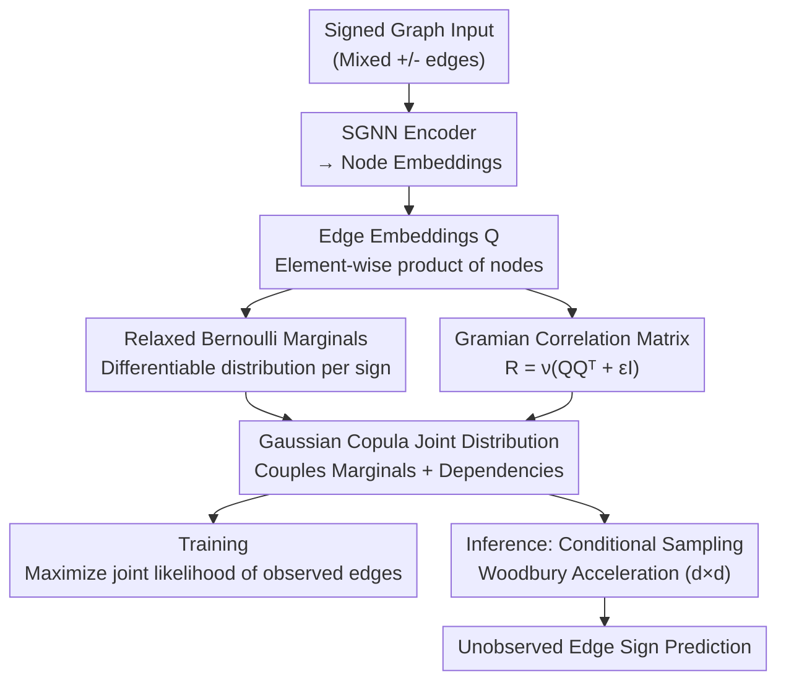

# A Scalable Inter-edge Correlation Modeling in CopulaGNN for Link Sign Prediction

**Conference**: ICLR 2026  
**arXiv**: [2601.19175](https://arxiv.org/abs/2601.19175)  
**Code**: None  
**Area**: Others  
**Keywords**: Signed graphs, Link sign prediction, Gaussian Copula, Inter-edge correlation, Gramian matrix  

## TL;DR
CopulaGNN is extended from the node level to the edge level by constructing the correlation matrix as a Gramian matrix of edge embeddings and utilizing the Woodbury identity to reconstruct conditional probability distributions. This approach achieves scalable modeling of statistical dependencies between edges for link sign prediction tasks in signed graphs.

## Background & Motivation

**Background**: Link sign prediction (determining whether an edge reflects a positive or negative relationship) is a fundamental graph learning task in signed graphs. Existing SGNN methods handle negative edges, which violate the homophily assumption, through auxiliary structures such as structural balance theory or separate processing of positive and negative edges.

**Limitations of Prior Work**: Auxiliary structures increase architectural complexity, leading to slow convergence, and some methods suffer from memory inefficiency. While CopulaGNN can model statistical dependencies between nodes, its extension to the edge level faces bottlenecks in memory ($O(|V|^4)$) and computation ($O(n^3)$ for matrix inversion) regarding the correlation matrix.

**Key Challenge**: Directly modeling an edge-edge correlation matrix ($n \times n$, where $n$ is the number of edges) is infeasible in terms of parameters and computation, yet ignoring inter-edge dependencies results in the loss of critical structural information.

**Goal**: Efficiently model inter-edge correlations for link sign prediction in signed graphs.

**Key Insight**: (a) Use a low-rank Gramian structure instead of an explicit correlation matrix to reduce parameters; (b) use the Woodbury identity to transform large-scale matrix inversion into small-scale inversion to reduce computation.

**Core Idea**: Decompose the correlation matrix into an edge embedding Gramian $\mathbf{R} = \nu(\mathbf{QQ}^\top + \epsilon \mathbf{I})$, reducing memory from $O(n^2)$ to $O(nd)$ and matrix inversion in inference from $O(n^3)$ to $O(d^3)$.

## Method

### Overall Architecture
The paper addresses link sign prediction in signed graphs—given a graph with mixed positive and negative edges, the task is to predict the sign of each edge. The core mechanism shifts from assuming shared similarity between adjacent nodes (which negative edges naturally violate) to modeling the statistical dependencies between edges, integrating these dependencies into a scalable Gaussian Copula framework.

The pipeline operates as follows: First, an SGNN encoder encodes the signed graph into node embeddings. Edge embeddings $\mathbf{Q}$ are generated by taking the element-wise product of the embeddings of the two nodes connected by each edge. From $\mathbf{Q}$, two branches emerge: one assigns a relaxed Bernoulli distribution to each edge sign to characterize its marginal distribution, while the other uses the Gramian of $\mathbf{Q}$ to construct the inter-edge correlation matrix directly. These branches converge at a Gaussian Copula to couple all edge signs into a joint distribution. During training, the joint likelihood of observed edges is maximized. During inference, signs of unobserved edges are sampled from the conditional distribution. The main difficulty lies in the $n \times n$ scale of the correlation matrix; three designs address this: enabling discrete signs to enter the Copula (Relaxed Bernoulli), compressing the $O(n^2)$ matrix into a low-rank form (Gramian), and replacing large matrix inversion with small matrix inversion (Woodbury).

### Key Designs

**1. Relaxed Bernoulli Marginal Distributions: Enabling discrete edge signs in a differentiable Copula framework**

Copula requires continuous marginal distributions for each variable, but edge signs are inherently binary and discrete. This paper assigns a relaxed (continuously relaxed) Bernoulli distribution to each edge sign. The location parameter $a_i$ and temperature parameter $t_i$ are calculated from edge embeddings $\mathbf{Q}$ via two learnable linear projections $\mathbf{w}_1, \mathbf{w}_2 \in \mathbb{R}^d$. Its CDF has a closed-form solution:

$$F(x;a,t) = \frac{x^t}{a(1-x)^t + x^t},$$

which can be directly substituted into the Gaussian Copula to achieve the "marginal-to-joint" coupling. This preserves the semantics of binary classification (approximating 0/1 after relaxation) while making the entire likelihood differentiable, enabling end-to-end training.

**2. Gramian Correlation Matrix: Replacing the $O(n^2)$ explicit correlation matrix with a low-rank structure**

Assigning a parameter to every element in the edge-edge correlation matrix requires $O(n^2)$ space, which is unscalable. Instead of explicit storage, the matrix is "grown" from edge embeddings: taking the covariance $\Sigma = \mathbf{QQ}^\top + \epsilon \mathbf{I}_n$, and normalizing it into a correlation matrix $\mathbf{R} = \mathbf{D}^{-1}\Sigma\mathbf{D}^{-1}$ (where $\mathbf{D}_{ii}=\sqrt{\Sigma_{ii}}$ is the diagonal standard deviation). Since the edge embedding dimension $d \ll n$, $\Sigma$ is compressed into a structure with rank at most $d$. Only the encoder parameters are learned, reducing memory from $O(n^2)$ to $O(nd)$. Furthermore, the Gramian is naturally positive semi-definite; adding $\epsilon \mathbf{I}_n$ ensures strict positive definiteness, satisfying the mathematical requirements of Gaussian Copula.

**3. Woodbury Conditional Distribution Reconstruction: Converting large matrix inversion to $d \times d$ inversion**

Inference requires calculating the conditional distribution of unobserved edges given $m$ observed edges. This requires inverting the correlation sub-block $\mathbf{R}_{00}$ of the observed edges ($m \times m$), which is $O(m^3)$ naively. By leveraging the "low-rank + diagonal" structure of $\Sigma_{00} = \mathbf{Q}_0\mathbf{Q}_0^\top + \epsilon\mathbf{I}_m$, the Woodbury identity transforms the $m \times m$ inversion into a $d \times d$ inversion. The conditional distribution simplifies to a low-rank multivariate Gaussian. As $d \ll m$, the computational cost depends on the hyperparameter $d$ rather than the graph size $n$. The Gramian form in Design 2 is the prerequisite for using Woodbury here.

### Loss & Training
The training objective is to maximize the joint log-likelihood of observed edge signs:

$$\log \mathcal{H}'(x_{1:m}) = \log c(u_{1:m}; \mathbf{R}_{00}) + \sum_i \log f_i(x_i),$$

where $c(\cdot)$ is the Gaussian Copula density and $f_i$ is the relaxed Bernoulli marginal density of the $i$-th edge. Both have closed-form expressions, making the likelihood differentiable. Inference is performed by sampling from the constructed conditional Gaussian distribution.

## Key Experimental Results

### Main Results

| Dataset | CopulaLSP AUC↑ | SGCN AUC | SiGAT AUC | Convergence Speed↑ |
|--------|---------------|----------|-----------|---------|
| Bitcoin-Alpha | Competitive | Baseline | Baseline | **Significantly Faster** |
| Bitcoin-OTC | Competitive | Baseline | Baseline | **Significantly Faster** |
| Wiki-RfA | Competitive | Baseline | Baseline | **Significantly Faster** |

### Ablation Study

| Configuration | Performance | Description |
|------|------|------|
| Full Model | Best | Gramian + Woodbury |
| W/O Copula (Marginals Only) | Decrease | Validates the value of inter-edge correlation |
| Variable $d$ | Accuracy scales with $d$ | Embedding dimension controls precision-efficiency trade-off |

### Key Findings
- CopulaLSP converges significantly faster than all baseline methods, with a theoretical proof of linear convergence.
- Prediction accuracy is competitive with SOTA signed graph methods while drastically improving training and inference efficiency.
- The low-rank correlation matrix of the Gramian structure possesses sufficient expressiveness to capture inter-edge dependencies.
- Explicit modeling of inter-edge correlation is the primary driver for accelerated convergence.

## Highlights & Insights
- **From Node Homophily to Edge Dependency**: Rather than assuming adjacent nodes are similar (invalid in signed graphs), this method assumes that adjacent edges connected via a common node are not independent—a natural relaxation of GNN assumptions.
- **Dual Benefits of Structured Correlation**: The Gramian form reduces parameter count and accelerates matrix inversion via the Woodbury identity, addressing two bottlenecks with one design choice.
- **Theoretical Guarantee of Linear Convergence**: Beyond empirical speed, the method provides theoretical proofs, enhancing its reliability.

## Limitations & Future Work
- The choice of edge embedding dimension $d$ requires manual tuning; excessive values increase computation, while low values may lead to under-performance.
- The temperature parameter of the Relaxed Bernoulli distribution is sensitive.
- Experiments were confined to link sign prediction; other edge-level tasks remain unexplored.
- The low-rank assumption of the Gramian may not capture all types of inter-edge correlation structures.

## Related Work & Insights
- **vs. CopulaGNN (Ma et al. 2021)**: Original CopulaGNN handles node-level tasks using Laplacian parameterization; this work extends it to the edge level, handling larger correlation matrices and signed relations.
- **vs. SGCN/SiGAT**: These SGNNs use auxiliary structures for negative edges; CopulaLSP handles edge relations more directly via statistical dependency modeling.
- **vs. Structural Balance Theory**: Sociological theory-driven methods are discrete and rule-based; the Copula framework is continuous and data-driven.

## Rating
- Novelty: ⭐⭐⭐⭐ Extension of CopulaGNN to the edge level is innovative; Gramian+Woodbury integration is elegant.
- Experimental Thoroughness: ⭐⭐⭐⭐ Validated on multiple datasets with convergence analysis and ablation studies.
- Writing Quality: ⭐⭐⭐⭐ Clear mathematical derivation and problem statement.
- Value: ⭐⭐⭐⭐ Provides a new statistical modeling perspective for signed graph learning.

<!-- RELATED:START -->

## Related Papers

- [\[ICLR 2026\] Stable and Scalable Deep Predictive Coding Networks with Meta-Prediction Errors](stable_and_scalable_deep_predictive_coding_networks_with_meta-prediction_errors.md)
- [\[ICLR 2026\] Learning on a Razor's Edge: Identifiability and Singularity of Polynomial Neural Networks](learning_on_a_razors_edge_identifiability_and_singularity_of_polynomial_neural_n.md)
- [\[ICCV 2025\] Intra-view and Inter-view Correlation Guided Multi-view Novel Class Discovery](../../ICCV2025/others/intra-view_and_inter-view_correlation_guided_multi-view_novel_class_discovery.md)
- [\[ICLR 2026\] Spurious Correlation-Aware Embedding Regularization for Worst-Group Robustness](spurious_correlation-aware_embedding_regularization_for_worst-group_robustness.md)
- [\[ICLR 2026\] Mitigating Spurious Correlation via Distributionally Robust Learning with Hierarchical Ambiguity Sets](mitigating_spurious_correlation_via_distributionally_robust_learning_with_hierar.md)

<!-- RELATED:END -->
