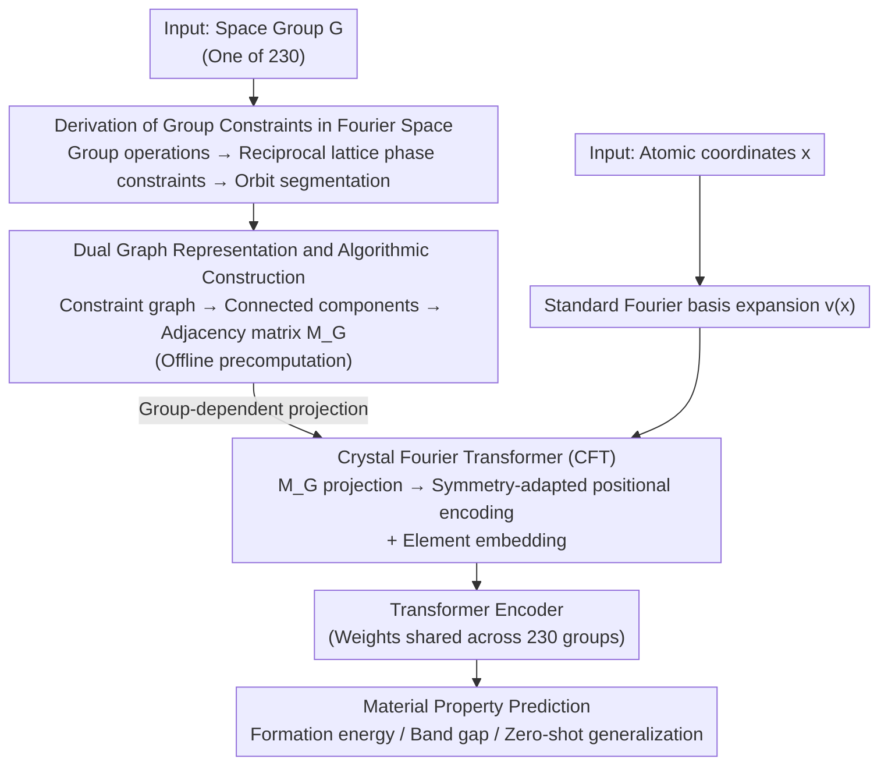

# A Single Architecture for Representing Invariance Under Any Space Group

**Conference**: ICLR 2026  
**arXiv**: [2512.13989](https://arxiv.org/abs/2512.13989)  
**Code**: None  
**Area**: Geometric Deep Learning / Materials Science  
**Keywords**: Space groups, symmetry invariance, Fourier basis, crystal structure, zero-shot generalization  

## TL;DR
Designed a single architecture (Crystal Fourier Transformer) adaptable to any space group invariance. It constructs symmetry-adapted Fourier bases by analytically deriving constraints on Fourier coefficients from group operations, achieving parameter sharing and zero-shot generalization across 230 space groups via a dual graph representation of constraints.

## Background & Motivation

**Background**: Encoding known symmetries into ML models improves accuracy and generalization, but achieving exact invariance for specific symmetries usually requires custom architectures for each group.

**Limitations of Prior Work**: There are 230 space groups (crystal symmetries) in 3D space; designing dedicated architectures for each is non-scalable. More critically, data is scarce—the largest benchmark dataset (Materials Project) has only ~200k entries, averaging fewer than 1000 samples per group, with many groups having almost no data.

**Key Challenge**: Exact group invariance is needed to respect physical constraints, while parameter sharing across groups is required to overcome data scarcity.

**Goal**: Develop a single architecture capable of automatically adjusting its weights to enforce the corresponding invariance based on the input space group.

**Key Insight**: Analyze constraints of group symmetries in Fourier space—group operations introduce phase constraints on reciprocal lattice points, which are encoded as adjacency matrices of constraint graphs embedded into neural network layers.

**Core Idea**: Invariance under a space group is equivalent to constraint relationships of Fourier coefficients on the reciprocal lattice. These constraints can be represented as graph structures and encoded into the neural network, enabling parameter sharing across groups.

## Method

### Overall Architecture
The problem addressed is how to enforce exact invariance for any of the 230 3D crystal space groups using a **single** network, rather than manual per-group architectures. The approach shifts "group invariance" entirely to Fourier space—the Fourier coefficients of a $G$-invariant function are constrained by group operations into several interconnected orbits. Thus, invariance is equivalent to a set of linear constraints on the reciprocal lattice. The pipeline has two parts: **Offline**, deriving phase constraints of Fourier coefficients for a given space group $G$, followed by constructing a dual graph and running connected component analysis to compute a group-dependent adjacency matrix $M_G$; **Online**, representing atomic positions as frequency coefficients using a standard Fourier basis, then multiplying by $M_G$ to project onto the constrained invariant subspace to obtain symmetry-adapted positional encodings, finally fed into a Transformer for property prediction. Crucial to this is that only the adjacency matrix changes when switching space groups; network weights remain static, allowing one set of parameters to serve all 230 groups.

### Key Designs

**1. Group Constraint Derivation in Fourier Space: Converting infinite-dimensional invariant function spaces into computable discrete constraints on the reciprocal lattice.**

Enforcing group invariance directly in continuous function space is an infinite-dimensional problem and difficult to realize exactly. The paper instead analyzes constraints on Fourier coefficients (Proposition 3.1 + Theorem 3.2): for a $G$-invariant function $f$ and group operation $\phi(x) = Ax + t$, its Fourier coefficients must satisfy

$$F(\omega) = e^{i2\pi\omega^\top A^\top t} F(A\omega).$$

This equation partitions the reciprocal lattice into disjoint **orbits** $\mathcal{O}$—frequencies within the same orbit are linked by group operations $\omega \to A\omega$, with their phases locked. Each orbit corresponds exactly to one invariant basis function

$$e_\mathcal{O}(x) = \sum_{\omega \in \mathcal{O}} w_{\xi \to \omega}\, e^{i2\pi\omega^\top x}.$$

Thus, the infinite-dimensional problem is discretized into a computable enumeration of basis functions per orbit, ensuring exact constraints rather than approximations. The paper further proves these bases span all continuous $G$-invariant functions in $L^2(\Pi)$, guaranteeing expressive completeness.

**2. Dual Graph Representation and Algorithmic Construction: Converting abstract group-theoretic constraints into universal graph algorithms using a directed weighted graph.**

To provide a unified construction process for any space group, the paper maps constraints to a directed weighted graph on the reciprocal lattice (Algorithm 1): nodes are frequencies $\omega$, and each group operation $\phi$ connects $\omega$ and $A\omega$ with a directed edge weighted by the phase factor $e^{i2\pi\omega^\top A^\top t}$. After removing phase-inconsistent self-loops, each connected component of the graph represents a phase-consistent orbit. Coefficients of the orbit’s basis function are obtained by multiplying weights along edges. Consequently, abstract group-theoretic judgments—such as which frequencies are allowed and how they couple—are reduced to graph algorithms (connected components + edge weight products) that execute automatically for all 230 groups.

**3. Crystal Fourier Transformer (CFT): Using symmetry-adapted Fourier bases as positional encodings to share a single set of weights across all space groups.**

Finally, products from previous steps are integrated into a Transformer. Atomic positions are expanded in a standard Fourier basis, then projected onto the invariant subspace via the group-dependent adjacency matrix—the precomputed orbit structure. Since all constraint information resides in the adjacency matrix, the network architecture and weights are entirely shared across all space groups: switching groups only requires changing the matrix, not the parameters. This enables zero-shot generalization—predicting for a space group never seen during training as long as its adjacency matrix is precomputed. Positional encodings thus carry geometric meaning: points within the same orbit have low distance, and points in different orbits have high distance, accurately reflecting the orbital structure on the reciprocal lattice.

### Loss & Training
Standard material property regression/classification losses are used. During training, data from different space groups can be mixed and fed into the same network; the model automatically adapts to corresponding symmetry constraints via respective adjacency matrices, without needing architectural changes for different groups.

## Key Experimental Results

### Main Results

| Task | CFT | Standard PE | CGCNN | Description |
|------|-----|-------------|-------|-------------|
| Formation Energy Prediction | Competitive | Inferior | Baseline | CFT improves using exact symmetries |
| Band Gap Prediction | Competitive | Inferior | Baseline | Same as above |
| Zero-shot Generalization | ✓ Success | ✗ Failure | ✗ N/A | Predicts for unseen space groups |

### Ablation Study

| Configuration | Performance | Description |
|------|------|------|
| CFT (Full) | Best | Symmetry-adapted Fourier encoding |
| Standard Fourier PE | Inferior | No group constraints |
| No PE | Worst | No positional information |

### Key Findings
- Symmetry-adapted Fourier positional encodings significantly outperform standard encodings in material property prediction.
- Zero-shot generalization is the core highlight: the model makes reasonable predictions for space groups never encountered during training.
- Positional encodings accurately reflect orbital distances (low distance within orbits, high distance between them).
- Precomputation cost for adjacency matrices is low; it can be done offline once per group.

## Highlights & Insights
- **From Invariant Bases to Adaptive Architectures**: The core insight is that group invariance can be expressed through linear constraints on the reciprocal lattice, naturally represented as graph adjacency matrices embedded directly into neural network matrix multiplication layers.
- **Unified Architecture for 230 Groups**: Instead of per-group networks, a shared network is used with group-specific precomputed projection matrices. This design enables cross-group knowledge transfer and zero-shot generalization.
- **Theoretical Completeness**: Demonstrated that the constructed basis functions span all continuous $G$-invariant functions in $L^2(\Pi)$, providing exact rather than approximate representation.

## Limitations & Future Work
- Only approximate bases with finite frequency truncation are used in practice; the choice of truncation frequency affects expressive power.
- Validation currently limited to scalar property prediction; extension to equivariant properties (tensor properties) requires moving from invariance to equivariance.
- Performance comparison with GNN baselines (CGCNN, ALIGNN) shows "competitiveness" rather than "significant superiority."
- Traversal of the reciprocal lattice in Algorithm 1 might generate many basis functions under high-frequency truncation.

## Related Work & Insights
- **vs Adams & Orbanz 2023**: They proved the existence of $G$-invariant Fourier bases but solved for Laplace eigenfunctions numerically; this paper provides an analytical construction algorithm.
- **vs CGCNN/ALIGNN**: These GNNs encode periodicity by augmenting graph structures; this paper encodes space group invariance directly in positional encodings.
- **vs Thomas et al. (SE(3)-Transformers)**: SE(3) equivariant networks handle continuous rotation groups; this paper addresses discrete crystallographic groups, involving different technical challenges.

## Rating
- Novelty: ⭐⭐⭐⭐⭐ Proposes the first single architecture adaptable to any space group; the dual graph representation of Fourier constraints is novel and elegant.
- Experimental Thoroughness: ⭐⭐⭐⭐ Zero-shot experiments are compelling, but quantitative leads over SOTA are not vastly superior.
- Writing Quality: ⭐⭐⭐⭐⭐ Mathematical derivations progress logically, with excellent narrative flow from 1D intuition to high-dimensional theory.
- Value: ⭐⭐⭐⭐⭐ Provides a principled framework for symmetry handling in materials science ML; zero-shot capabilities have significant practical utility.

<!-- RELATED:START -->

### Related Papers
- Adams & Orbanz, "Invariant Fourier Features for General Group Actions", 2023.
- Xie & Grossman, "Crystal Graph Convolutional Neural Networks for an Accurate Prediction of Material Properties", 2018.

<!-- RELATED:END -->

## Related Papers

- [\[ICLR 2026\] From atom to space：面向材料空间性质的区域化读出函数 SpatialRead](from_atom_to_space_a_region-based_readout_function_for_spatial_properties_of_mat.md)
- [\[AAAI 2026\] Learning Compact Latent Space for Representing Neural Signed Distance Functions with High-fidelity Geometry Details](../../AAAI2026/others/learning_compact_latent_space_for_representing_neural_signed_distance_functions_.md)
- [\[ICLR 2026\] Spurious Correlation-Aware Embedding Regularization for Worst-Group Robustness](spurious_correlation-aware_embedding_regularization_for_worst-group_robustness.md)
- [\[ICLR 2026\] Adaptive Conformal Guidance for Learning under Uncertainty](adaptive_conformal_guidance_for_learning_under_uncertainty.md)
- [\[ICLR 2026\] Out of the Shadows: Exploring a Latent Space for Neural Network Verification](out_of_the_shadows_exploring_a_latent_space_for_neural_network_verification.md)

<!-- RELATED:END -->
