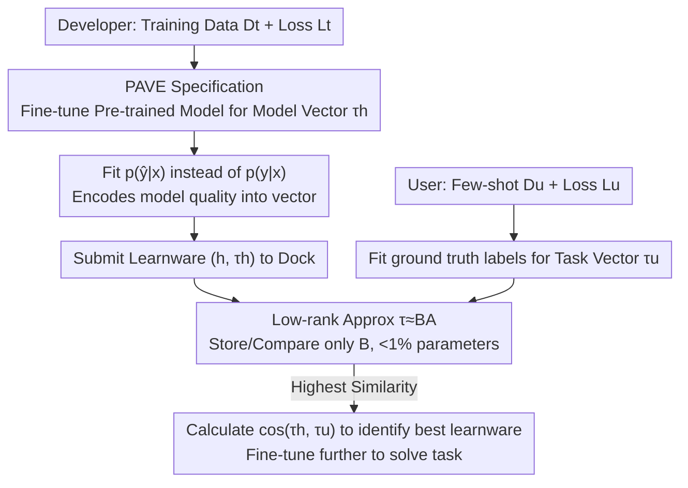

# A Study on PAVE Specification for Learnware

**Conference**: ICLR 2026  
**OpenReview**: [https://openreview.net/forum?id=JkKkquv5lw](https://openreview.net/forum?id=JkKkquv5lw)  
**Code**: TBD  
**Area**: Learnware / Model Selection  
**Keywords**: Learnware, parameter vector specification, model identification, Neural Tangent Kernel (NTK), low-rank approximation

## TL;DR
Addressing the challenge of identifying useful models from a massive repository without accessing training data in the "Learnware = Model + Specification" paradigm, this paper systematically investigates the PArameter VEctor specification (PAVE). By encoding model capabilities and task requirements via parameter updates induced by fine-tuning, the authors prove its homology with the classic RKME specification from an NTK perspective. Leveraging LoRA-style low-rank approximation, storage and computation are compressed to under 1% of the original model parameters. Identified learnwares can outperform user-fine-tuned pre-trained models in few-shot scenarios.

## Background & Motivation
**Background**: The Learnware paradigm envisions a "Learnware Dock System" (LDS), where developers submit trained models along with a **specification** that characterizes model capabilities without leaking training data. Users can then submit their own task specifications for the system to match and reuse existing models, eliminating the need for training from scratch or expensive individual evaluations of every model in the repository.

**Limitations of Prior Work**: Early specification methods like RKME (Reduced Kernel Mean Embedding) were successful on tabular data by using explicit kernels to generate privacy-preserving reduced datasets that characterize the "data distribution the model excels at." However, for high-dimensional unstructured data like images or text, the sample complexity required by standard general-purpose kernels becomes prohibitively high.

**Key Challenge**: In open-world scenarios, identifying useful learnwares is difficult for two reasons. First, **diverse task semantics**: the meaning of outputs $y$ varies and is hard to encode uniformly—a model trained on a face dataset might perform age prediction or emotion classification, making it nearly impossible to determine its suitability for "hair color recognition." Second, **unassured model quality**: repositories contain poorly trained models, and task diversity combined with privacy concerns prevents evaluating quality using a unified test set.

**Goal**: To find a specification that aligns heterogeneous task semantics between models and tasks while intrinsically encoding "model quality," all within affordable computational and storage constraints.

**Key Insight**: The authors observe that when fine-tuning a shared pre-trained model with task-defined losses, the **parameter change** (Parameter Vector) naturally encodes $p(\hat y|x)$ information "only and entirely" into these increments—since information about the conditional distribution during fine-tuning is ultimately reflected only as parameter shifts. Thus, models and tasks can be unified in the same vector space.

**Core Idea**: Both "model capability" and "user task requirements" are specified as Parameter Vectors (PAVE). The match is measured by the **cosine similarity** between the two. The authors further prove its homology with RKME from an NTK perspective and use low-rank approximation to ensure scalability for large-scale repositories.

## Method

### Overall Architecture
The workflow revolves around "projecting both models and tasks into the same parameter vector space and comparing similarity," performed in three steps (corresponding to Figure 1 in the original paper): Developers submit the parameter increments from fine-tuning as the **model vector** $\tau_h$ alongside the learnware. Users fine-tune with a few samples to generate a **task vector** $\tau_u$. The system calculates $\cos(\tau_h,\tau_u)$ in the parameter vector space; the highest similarity identifies the best learnware, which can then be fine-tuned on the user’s limited data. Crucially, the developer's model vector fits the model's own predictions $p(\hat y|x)$ (encoding model quality), while the user's task vector fits the ground-truth labels $p(y|x)$ (expressing requirements). To handle models with billions of parameters, a LoRA-style low-rank approximation is applied to minimize overhead.

### Key Designs

**1. PAVE: Unifying Model and Task Characterization via Parameter Increments**

To address the heterogeneous semantics of output $y$, PAVE avoids the output space entirely and maps both "model capability" and "task demand" to the same entity—the parameter shift generated by fine-tuning a shared pre-trained model $f$. For a model $h$ on training task $(L_t, D_t)$, the model vector is constructed as:

$$\tau_h = \arg\min_{\tau} \sum_{(x,y)\in D_t} L_t\big(g_t \circ f(x, \theta_0 + \tau),\, h(x)\big)$$

where $g$ is a mapping bridging the feature space $Z$ to the output space $Y$ (often obtained via training-free Prompt-Tuning). The task vector $\tau_u$ uses the same formula but replaces model predictions $h(x)$ with ground-truth labels $y$. Identification is performed via $\cos(\tau_h,\tau_u)=\mathrm{Similarity}(p(h(x)|x), p_u(y|x))$. This bypasses the "semantic alignment" bottleneck by projecting all tasks into a unified parameter increment space.

**2. Fitting $p(\hat y|x)$ instead of $p(y|x)$: Intrinsically Encoding Model Quality**

Methods like RKME fail to filter low-quality models because they only match data distributions. This paper makes a critical choice: the model vector fits the **model's own predictions** $p(\hat y|x)$ rather than the ground-truth distribution $p(y|x)$ of the training data. This step automatically injects "model quality" into the vector: if a model is poorly trained, its capability $p(\hat y|x)$ will deviate significantly from the true task semantics $p(y|x)$. Thus, even if its training set matches the user's task, its model vector will not align with the task vector. Ablation studies (PAVE♣ fitting $p(y|x)$) confirm that performance drops significantly on repositories containing corrupted models when reverting to fitting data distributions.

**3. Theoretical Unity of PAVE and RKME: Parameter Vectors as Kernel Mean Embeddings**

To ground PAVE theoretically, the authors establish its equivalence with RKME from a Neural Tangent Kernel (NTK) perspective. In the NTK regime, the gradient function is approximately fixed during fine-tuning, and parameter updates can be written as an accumulation of gradients:

$$\nabla_\tau L_t(y'_i,\hat y_i) = \nabla_{y'_i}L_t\,\nabla_z g_t\,\nabla_\theta f(x_i,\theta_0) \in \mathbb{R}^{|\theta|}$$

The inner product of two parameter vectors corresponds to an implicit kernel $\tilde k_{f,L,g}$ over the sample space. This kernel is formed by the element-wise product of the empirical NTK $\tilde K_f$ and a "consistency weight matrix" $\tilde K_{L,g}$ induced by the loss and mapping. Consequently, the normalized parameter vector $\tau=\frac1Z\sum_i \tilde k_{f,L,g}(z_i,\cdot)$ is an empirical Kernel Mean Embedding (KME). Theorem 3 proves that under NTK, the PAVE similarity is **order-consistent** with the Maximum Mean Discrepancy (MMD) used by RKME—meaning both provide the same preference ordering for model matching.

**4. Low-Rank Approximation: Reducing Overhead to <1%**

Directly constructing and comparing parameter vectors for large pre-trained models is impractical. PAVE approximates the parameter vector in a low-rank LoRA-style form:

$$\tau \approx \tilde\tau \triangleq [\,(B_1A_1)\ (B_2A_2)\ \dots\ (B_LA_L)\,] \triangleq BA$$

where $A$ is randomly initialized (following a Kaiming-style uniform distribution $A\sim U(-\sqrt{3s/n},+\sqrt{3s/n})$) and $B$ is zero-initialized. Since $\mathbb{E}[A_l A_l^\top]=sI$, the authors prove $\mathbb{E}[\langle\tilde\tau_1,\tilde\tau_2\rangle]=s\langle B_1,B_2\rangle$, and thus $\cos(\tilde\tau_1,\tilde\tau_2)\approx\cos(B_1,B_2)$. Consequently, **only the low-rank $B$ needs to be stored and compared** (the shared random $A$ does not need to be saved per model), reducing the specification size to less than 1% of the pre-trained model parameters.

## Key Experimental Results

The evaluation covers 15 NLP datasets (mostly GLUE), 12 CV datasets (including heterogeneous semantics like EuroSAT, GTSRB, and SUN397), and 9 medical LLM benchmarks. Baselines include user-fine-tuned pre-trained models (BERT, RoBERTa, ResNet, ViT, CLIP), the previous generation RKME, Random selection, and Oracle (post-hoc optimal). Repositories consist of both **high-quality** and **corrupted** (poorly trained) learnwares.

### Main Results: Beyond Original Functions (NLP, Table 1)

In this setup, learnwares trained on the same dataset as the user task are removed, forcing the system to identify "repurposeable" learnwares. PAVE♦ denotes results after identification and subsequent fine-tuning.

| Method | Avg Score (↑) | Avg Rank (↓) |
|------|-----------|-------------|
| BERT-B | 0.572 | 6.389 |
| RoBERTa-B | 0.682 | 3.333 |
| RoBERTa-L | 0.699 | 2.444 |
| Random | 0.668 | 4.056 |
| RKME | 0.659 | 3.389 |
| **PAVE♦** | **0.709** | **2.111** |
| Oracle | 0.739 | — |

PAVE♦ achieves an average score of 0.709 and an average rank of 2.111, outperforming all fine-tuning baselines and RKME, with a **7.59%** improvement over RKME.

### Ablation Study: Model Quality Filtering (CV + Corrupted Repos, Table 2)

| Method | Avg Score (↑) | Avg Rank (↓) |
|------|-----------|-------------|
| ViT-L-14 (Fine-tune) | 0.733 | 2.167 |
| Random | 0.580 | 4.750 |
| PAVE♣ (Fit p(y\|x)) | 0.745 | 2.583 |
| **PAVE (Fit p(ŷ\|x))** | **0.887** | **1.500** |
| Oracle | 0.894 | — |

On tasks like GTSRB, PAVE closely tracks the Oracle (0.987 vs 0.894), while PAVE♣, which fits labels instead of model predictions, lags significantly behind (0.656). This validates that fitting $p(\hat y|x)$ is essential for filtering out degraded learnwares.

### Key Findings
- **Fitting $p(\hat y|x)$ is the linchpin for quality filtering**: Removing this design (PAVE♣) caused the average score to drop from 0.887 to 0.745 in corrupted repositories.
- **Learnware Pool > Single Pre-trained Model**: Identified learnwares after fine-tuning surpassed directly fine-tuned RoBERTa-L, suggesting that a diverse pool of learnwares covers a broader capability range than a single pre-trained model.
- **Low-rank approximation is nearly lossless**: Similarity heatmaps show high consistency between full-parameter, $BA$ expanded, and $B$-only comparisons, while drastically reducing costs.

## Highlights & Insights
- **Translating "Model Selection" to Vector Similarity in Parameter Increment Space**: Projecting heterogeneous tasks into a shared parameter space (via a shared pre-trained base) is the most elegant solution to the output semantic alignment problem.
- **"Free" Encoding of Quality Signals**: Simply choosing to fit the model's own predictions rather than ground truth allows the specification to filter low-quality models without extra evaluation modules or test sets.
- **Theory-Backed Engineering**: The derivation from NTK to KME bridges this new method with existing learnware theory, explaining why parameter space similarity represents capability matching.
- **Transferable Insight**: The trick of using $\mathbb{E}[AA^\top]=sI$ to reduce low-rank product similarity to comparing only $B$ is applicable to any scenario requiring large-scale similarity search in LoRA/low-rank spaces.

## Limitations & Future Work
- **Strong Dependence on NTK Assumptions**: Theoretical conclusions rely on the NTK regime where gradients remain approximately fixed. The robustness boundaries in real-world large models, which often deviate from linear dynamics, are not fully characterized.
- **Requirement for a Shared Pre-trained Base**: Both model and task vectors must utilize the same base $f$. The paper does not address how to unify specifications for learnwares from heterogeneous architectures or different pre-trained models.
- **Medical LLM Caveats**: Due to degradation (repetitive output) during destructive fine-tuning, medical LLM experiments reverted to fitting ground-truth labels, indicating that the $p(\hat y|x)$ quality filtering mechanism might not yet be directly applicable to generative LLMs.

## Related Work & Insights
- **vs. RKME**: RKME matches data distributions $p(y|x)$ leading to sample complexity issues in high dimensions and lacks quality awareness. PAVE matches $p(\hat y|x)$ in parameter space, saving samples and embedding quality signals.
- **vs. Transferability Metrics (LEEP, LogME, etc.)**: These metrics estimate transferability but typically require direct access to user data and involve expensive per-model forward passes. PAVE enables identification via privacy-preserving specification comparison.
- **vs. Task Arithmetic / Model Merging**: While both use parameter increments, merging aims to combine multiple capabilities. PAVE aims for the opposite—**identifying** the single best model for a specific task.

## Rating
- Novelty: ⭐⭐⭐⭐ Systematizing parameter similarity as a learnware specification and unifying it with RKME is a solid intra-paradigm innovation.
- Experimental Thoroughness: ⭐⭐⭐⭐ Extensive coverage across NLP/CV/Medicine with corrupted repository settings; however, empirical checking of NTK assumption boundaries is relatively light.
- Writing Quality: ⭐⭐⭐⭐ Clear motivation-method-theory-experiment chain.
- Value: ⭐⭐⭐⭐ Provides a practical, privacy-preserving, and compute-efficient identification solution for model markets.

<!-- RELATED:START -->

## Related Papers

- [\[ICML 2026\] Functional Equivalence in Attention: A Comprehensive Study with Applications to Linear Mode Connectivity](../../ICML2026/others/functional_equivalence_in_attention_a_comprehensive_study_with_applications_to_l.md)
- [\[ACL 2025\] Anything Goes? A Crosslinguistic Study of (Im)possible Language Learning in LMs](../../ACL2025/others/anything_goes_a_crosslinguistic_study_of_impossible_language_learning_in_lms.md)
- [\[ACL 2025\] What Matters in Evaluating Book-Length Stories? A Systematic Study of Long Story Evaluation](../../ACL2025/others/what_matters_in_evaluating_book-length_stories_a_systematic_study_of_long_story_.md)
- [\[ACL 2025\] Understanding Common Ground Misalignment in Goal-Oriented Dialog: A Case-Study with Ubuntu Chat Logs](../../ACL2025/others/understanding_common_ground_misalignment_in_goal-oriented_dialog_a_case-study_wi.md)
- [\[ICLR 2026\] IC-Custom: Diverse Image Customization via In-Context Learning](ic-custom_diverse_image_customization_via_in-context_learning.md)

<!-- RELATED:END -->
