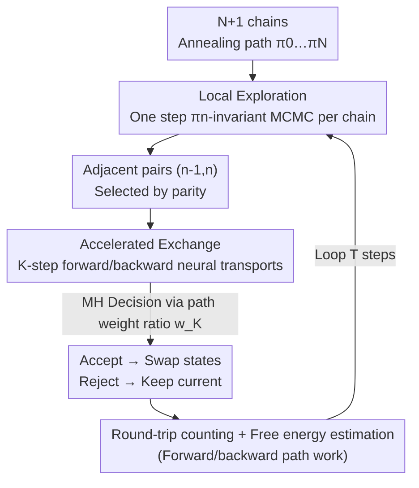

# Accelerated Parallel Tempering via Neural Transports

**Conference**: ICLR2026  
**OpenReview**: [https://openreview.net/forum?id=CODnlyYUli](https://openreview.net/forum?id=CODnlyYUli)  
**Code**: TBD  
**Area**: Sampling / MCMC / Probabilistic Methods  
**Keywords**: Parallel Tempering, Neural Transport, MCMC Sampling, Free Energy Estimation, Multimodal Sampling

## TL;DR
The rigid "direct state swap" in Parallel Tempering (PT) is replaced with an "accelerated swap": neural transports (Normalizing Flows / Controlled Diffusion / Diffusion Models) are used to push the two states towards each other before performing a Metropolis acceptance check. This enables high-probability exchanges even when adjacent annealed distributions have minimal overlap, significantly increasing the round-trip count between the reference and target distributions while maintaining the asymptotic unbiasedness of MCMC and providing low-variance free energy estimates.

## Background & Motivation
**Background**: Sampling from unnormalized distributions $\pi(x)=\exp(-U(x))/Z$ is a fundamental task in statistics and scientific computing. MCMC constructs ergodic chains using local moves, which theoretically converge asymptotically; however, if the target is high-dimensional and multimodal with energy barriers separating the modes, local moves become trapped. Parallel Tempering (PT) is a classic solution for multimodality: it arranges an annealing path $\pi_0, \dots, \pi_N$ between a reference $\pi_0=\eta$ (e.g., standard Gaussian) and the target $\pi_N=\pi$ (often using geometric paths $\pi_\beta \propto \eta^{1-\beta}\pi^{\beta}$), running $N+1$ chains in parallel. It passes easily-mixed samples from the reference end to the target end through exchanges between adjacent chains.

**Limitations of Prior Work**: The exchange mechanism in PT depends solely on the likelihood ratio of two adjacent distributions, with an acceptance rate $\alpha_n = \min\{1, w_n(x')/w_n(x)\}$, where $w_n(x) = \tilde\pi_n(x)/\tilde\pi_{n-1}(x)$. When $\pi_{n-1}$ and $\pi_n$ have **poor overlap** (common in difficult problems), this ratio fluctuates wildly, the acceptance rate collapses toward 0, and exchanges rarely occur, stalling the "round trip" from reference to target. The only remedy is increasing the number of chains $N$ to bring adjacent distributions closer, but $N$ is limited by computational resources.

**Key Challenge**: The bottleneck of PT lies in the **rigidity of the exchange mechanism itself**—it only allows "identity swaps," success for which is strictly locked to the overlap of adjacent distributions. Conversely, "neural samplers" (Flows or Diffusion mapping Gaussian to Target in one step) are flexible but generally **biased, lack MCMC theoretical guarantees, and suffer from mode collapse**, with the authors' cited work showing they can even be outperformed by standard PT. Thus, the question is: can we have both the asymptotic consistency of PT and the flexibility of neural samplers?

**Key Insight**: The authors leverage the "replica exchange with non-equilibrium switching" idea from physics (Ballard & Jarzynski, 2009/2012)—before an exchange, states evolve along a non-equilibrium path, and acceptance is determined by the "work" performed. Formalizing this with modern neural transports yields **Accelerated Parallel Tempering (APT)**.

**Core Idea**: Replace PT's direct exchange with "neural transport-driven accelerated exchange." Before swapping, states at both ends are pushed toward their counterparts via forward/backward transports to maximize distribution overlap. This decouples the acceptance rate from "the overlap of $\pi_{n-1}$ and $\pi_n$" and makes it "dependent on the overlap of forward/backward path measures," which can be trained to approach 1. These transports are executed **pair-wise and in parallel**, bypassing the expensive serial cost typical of neural samplers.

## Method

### Overall Architecture
APT reuses the two-stage cycle of PT—**local exploration** (each chain takes one step using a $\pi_n$-invariant MCMC kernel $K_n$) and **non-reversible communication** (adjacent exchanges are proposed on odd/even steps $n \equiv t \bmod 2$). The only modification is replacing the "swap action in the communication stage" with **accelerated exchange**.

Direct exchange fails because it requires samples from $\pi_{n-1}$ to be accepted "as-is" by $\pi_n$. In APT, a "bridge" is built for each state before the check. For the $n$-th exchange, states $X^{n-1}_t$ and $X^n_t$ after local exploration are pushed forward by $K$ steps using a family of **forward accelerators** $P^{n-1}_k$ and backward by $K$ steps using **backward accelerators** $Q^n_k$, resulting in two paths $\overrightarrow{X}^{n-1}_{t,0:K}$ and $\overleftarrow{X}^n_{t,0:K}$. A Metropolis check is then performed using the **path weight ratio** (if accepted, states are replaced by the endpoints of the opponent's path). For $K=0$, this degrades to original PT; when the forward path measure $\mathsf P^{n-1}_K$ and backward path measure $\mathsf Q^n_K$ overlap perfectly, the acceptance rate reaches 1 even if $\pi_{n-1} \neq \pi_n$. The process remains an ergodic, $\boldsymbol\pi$-invariant Markov chain (Theorem 1), preserving asymptotic consistency.

### Key Designs

**1. Accelerated Exchange: Maximizing "Overlap" via Forward/Backward Neural Transports**

PT's bottleneck is the acceptance rate being locked by adjacent distribution overlap. Accelerated exchange breaks this by comparing the "path measure $\mathsf P^{n-1}_K$ evolved forward from $\pi_{n-1}$" and the "path measure $\mathsf Q^n_K$ evolved backward from $\pi_n$." These are defined as:

$$\mathsf P^{n-1}_K(dx_{0:K})=\pi_{n-1}(dx_0)\prod_{k=1}^{K}P^{n-1}_k(x_{k-1},dx_k),\quad \mathsf Q^{n}_K(dx_{0:K})=\pi_{n}(dx_K)\prod_{k=1}^{K}Q^{n}_{k-1}(x_k,dx_{k-1}).$$

The path incremental weight $w^n_K(x_{0:K})=\frac{Z_n}{Z_{n-1}}\frac{d\mathsf Q^n_K}{d\mathsf P^{n-1}_K}(x_{0:K})$ generalizes the scalar weight $w_n$. The acceptance probability is $\min\{1, w^n_K(x'_{0:K})/w^n_K(x_{0:K})\}$. A key insight from Theorem 1: **the rejection probability of this swap at equilibrium equals the Total Variation (TV) distance between the two path measures** $r(\mathsf P^{n-1}_K,\mathsf Q^n_K)=\|\mathsf P^{n-1}_K\otimes\mathsf Q^n_K-\mathsf Q^n_K\otimes\mathsf P^{n-1}_K\|_{TV}$, bounded by the symmetric KL divergence (Pinsker's inequality):

$$r(\mathsf P^{n-1}_K,\mathsf Q^n_K)^2\le \tfrac12\mathsf P^{n-1}_K[-\log w^n_K]+\tfrac12\mathsf Q^n_K[\log w^n_K]=:\mathrm{SKL}(\mathsf P^{n-1}_K,\mathsf Q^n_K).$$

This translates "improving exchange success" into a **trainable objective**: by training accelerators to minimize SKL, the rejection rate tends toward 0, **independent** of the original overlap of $\pi_{n-1}$ and $\pi_n$.

**2. Pairwise Parallel Neural Transport: Bypassing Serial Costs and Preserving Consistency**

The reason neural samplers are expensive and biased when used alone is that they require serial integration from reference to target without Metropolis correction. APT slices neural transport into "small segments per adjacent chain pair": the $n$-th accelerator only bridges $\pi_{n-1}$ and $\pi_n$, and all $N$ bridges execute **in parallel** during the communication stage. Since PT already uses parallelism to offset the cost of $N$ chains, APT simply adds $K$ steps of transport per chain pair. Under maximum parallelization, the computational cost is roughly "$K$ integration steps" rather than the "full annealing path integration." Crucially, regardless of training quality, the outer Metropolis check ensures the chain remains $\boldsymbol\pi$-invariant; poor transport only results in lower acceptance and slower round trips, **never introducing bias**.

**3. Three Neural Transport Instantiations: NF / CMCD / Diffusion**

**NF-APT** ($K=1$) uses an invertible mapping $T^n$. The weight includes the Jacobian determinant $w^n_1 = \frac{\tilde\pi_n(x_1)}{\tilde\pi_{n-1}(x_0)}|\det J_{T^n}(x_0)|$; like annealed flow transport in SMC, but APT uses **symmetric KL** training since samples from both ends are available, mitigating mode dropping. **CMCD-APT** uses Controlled Monte Carlo Diffusion: forward/backward kernels are Gaussian transitions with learned drift $b^n_s$, diffusion $\sigma^n_s$, and interpolating potentials $U^n_s$, discretized into $K$ steps. **Diff-APT** uses Variance Preserving (VP) Diffusion with an energy model $\pi^\theta_s$ satisfying boundaries $\pi^\theta_0 = \mathcal{N}(0,I), \pi^\theta_1 = \pi$. These cover "deterministic vs. stochastic bridges" and "single vs. multi-step" scenarios.

**4. Round-trip Rate—Global Barrier Theory and Free Energy Estimation**

APT is accompanied by a theory for practical guidance. Under the "efficient local exploration" assumption, the round-trip rate $\tau$ is a function of all adjacent rejection rates $r_n$ (Proposition 2). Increasing $K$ for a fixed $N$ reduces $r_n$ to nearly zero for difficult problems. For large $N$ (Theorem 2), the round-trip rate is controlled by the **global barrier** $\Lambda_K = \int_0^1\frac12\mathbb E|\dot w^\beta_K(\overleftarrow X)-\dot w^\beta_K(\overrightarrow X)|\,d\beta$. The value $\Lambda_K$ can be estimated from rejection rates, allowing the **reuse of PT's automatic annealing schedule algorithms**. Additionally, forward/backward path work $\overrightarrow w_{K,t}$ and $\overleftarrow w_{K,t}$ provide consistent estimates for $Z$, unified by Bennett's acceptance ratio to further reduce variance.

### Loss & Training
All three instantiations use **symmetric KL** as the training objective: $\mathcal L=\sum_{n=1}^{N}\mathrm{SKL}(\mathsf P^{n-1}_K, \mathsf Q^n_K)$, directly minimizing the bound for the rejection rate in Theorem 1. NF-APT learns the mapping $T^n$; CMCD-APT learns drift $b^n_s$, schedule $\phi^n_s$, and $\sigma^n_s$; Diff-APT uses iterative score matching with samples collected from Diff-APT itself.

## Key Experimental Results

### Main Results
Comparison on 10D, 40-mode GMM (GMM-10) with $T=100,000$ steps (Round-trips R↑, Comp-normalized CN-R↑, Global barrier $\hat\Lambda_K$↓):

| Method | Neural Calls | $\hat\Lambda_K$ | R (N=6) | R (N=10) | R (N=30) |
|------|---------|------|---------|----------|----------|
| PT | 0 | 8.346 | 17 | 681 | 1888 |
| Diff-PT (K=0) | 2 | 8.932 | 204 | 734 | 1586 |
| NF-APT | 1 | 7.198 | 194 | 1655 | 2441 |
| CMCD-APT (K=2) | 3 | 5.932 | 526 | 3287 | 4767 |
| CMCD-APT (K=5) | 6 | **4.822** | **1743** | 5525 | **6231** |
| Diff-APT (K=5) | 6 | 5.795 | 1565 | 3080 | 4334 |

When chains are limited (N=6), APT achieves **10×–100×** round-trip gains over PT. CMCD-APT even exceeds the classic PT theoretical upper bound $T/(2+2\Lambda)$. Even factoring in neural computation (CN-R), APT remains dominant.

### Ablation Study
- **Increasing $K$ (0→5)**: Round-trip counts increase monotonically while $\hat\Lambda_K$ decreases, verifying Proposition 3.
- **Dimensionality $d=2 \to 100$**: The advantage of accelerated exchange over direct exchange becomes more pronounced in higher dimensions.
- **Removing MH Correction**: Performance collapses and mode weights are misallocated, confirming that Metropolis correction is the key to unbiasedness.

### Key Findings
- **$K$ is more efficient than $N$**: For difficult problems, making a single exchange "thicker" (more steps) is more efficient than stacking parallel chains.
- **Unbiasedness from correction, not quality**: Using the learned kernels directly as samplers results in mode collapse; putting them inside APT restores correct weights.
- **Free Energy**: CMCD/Diff-APT show significantly lower variance and bias in $\Delta F$ estimates compared to PT, especially on ManyWell-32.
- **Real-world Molecules**: On Alanine Dipeptide (66D), CMCD-APT increases round-trips from 199 to 465–627.

## Highlights & Insights
- **Rejection Rate as a Differentiable Objective**: Theorem 1 equates the rejection rate to TV distance, and Pinsker's bound provides a differentiable SKL loss—linking theory to training.
- **Shift in Neural Sampler Usage**: Instead of end-to-end sampling, neural networks act as local bridges with MCMC correction. This transforms "flexible but biased" tools into "flexible and unbiased" mechanisms.
- **PT and SMC Duality**: PT is the "parallel/temporal swap" dual of SMC. APT completes this duality by integrating neural transports into PT.

## Limitations & Future Work
- **Dependency on Neural Training**: Poorly trained transports slow down round trips (though they don't introduce bias). Robustness criteria for when to use APT over PT are still needed.
- **Computational Overhead**: APT adds $K$ neural calls per step. For $N \gg \Lambda$, where PT is already near-optimal, this might not be cost-effective.
- **Experimental Scale**: Mostly validated on synthetic multi-mode distributions and small molecules; large-scale scientific applications (e.g., lattice QCD) remain for future work.

## Related Work & Insights
- **vs. Classic PT**: Existing works optimize schedules or communication orders while keeping the "direct swap"; APT replaces the swap itself to lower the global barrier.
- **vs. Pure Neural Samplers**: These suffer from mode collapse and bias; APT uses them as local bridges with Metropolis correction to restore consistency.
- **vs. NF for Lattice QCD**: APT is more general, accommodating any learnable transport between adjacent distributions rather than a single end-to-end mapping.

## Rating
- Novelty: ⭐⭐⭐⭐⭐ Formalizes non-equilibrium switching with modern neural transport; a systemic upgrade for PT.
- Experimental Thoroughness: ⭐⭐⭐⭐ Broad coverage of synthetic/molecular data; solid ablations, though lacks large-scale massive stress tests.
- Writing Quality: ⭐⭐⭐⭐⭐ Clear theoretical framework; well-integrated round-trip/barrier/free-energy analysis.
- Value: ⭐⭐⭐⭐⭐ Significant acceleration of multimodal sampling while maintaining unbiasedness; highly valuable for statistical computing and molecular simulation.

## Related Papers

- [\[AAAI 2026\] ParaRevSNN: A Parallel Reversible Spiking Neural Network for Efficient Training and Inference](../../AAAI2026/others/pararevsnn_a_parallel_reversible_spiking_neural_network_for_efficient_training_a.md)
- [\[ICML 2026\] Inference of Online Newton Methods with Nesterov's Accelerated Sketching](../../ICML2026/others/inference_of_online_newton_methods_with_nesterovs_accelerated_sketching.md)
- [\[ICML 2026\] ParalESN: Enabling Parallel Information Processing in Reservoir Computing](../../ICML2026/others/paralesn_enabling_parallel_information_processing_in_reservoir_computing.md)
- [\[ICLR 2026\] Breaking Gradient Temporal Collinearity for Robust Spiking Neural Networks](breaking_gradient_temporal_collinearity_for_robust_spiking_neural_networks.md)
- [\[ICLR 2026\] Beyond Linear Processing: Dendritic Bilinear Integration in Spiking Neural Networks](beyond_linear_processing_dendritic_bilinear_integration_in_spiking_neural_networ.md)

<!-- RELATED:END -->

<!-- RELATED:START -->

## Related Papers

- [\[ICLR 2026\] Fractional-Order Spiking Neural Network](fractional-order_spiking_neural_network.md)
- [\[ICLR 2026\] SONIC: Spectral Oriented Neural Invariant Convolutions](sonic_spectral_oriented_neural_invariant_convolutions.md)
- [\[ICLR 2026\] Breaking Gradient Temporal Collinearity for Robust Spiking Neural Networks](breaking_gradient_temporal_collinearity_for_robust_spiking_neural_networks.md)
- [\[ICLR 2026\] Learning on a Razor's Edge: Identifiability and Singularity of Polynomial Neural Networks](learning_on_a_razors_edge_identifiability_and_singularity_of_polynomial_neural_n.md)
- [\[ICLR 2026\] On the Lipschitz Continuity of Set Aggregation Functions and Neural Networks for Sets](on_the_lipschitz_continuity_of_set_aggregation_functions_and_neural_networks_for.md)

<!-- RELATED:END -->
