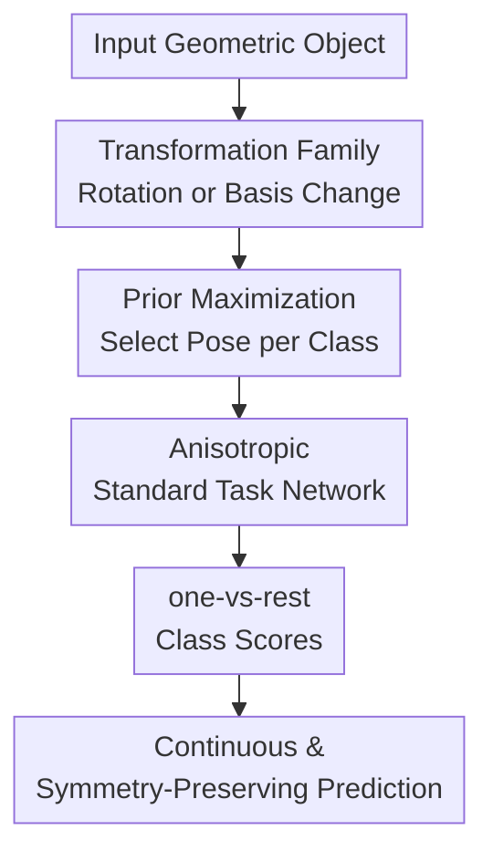

# Adaptive Canonicalization with Application to Invariant Anisotropic Geometric Networks

**Conference**: ICLR 2026  
**OpenReview**: [https://openreview.net/forum?id=j2DHdrsRXI](https://openreview.net/forum?id=j2DHdrsRXI)  
**Code**: https://github.com/ywelld/_ac  
**Area**: Geometric Deep Learning / Equivariant Learning  
**Keywords**: Adaptive Canonicalization, Geometric Deep Learning, Symmetry, Spectral Graph Neural Networks, Point Cloud Classification

## TL;DR

This paper proposes adaptive canonicalization: instead of the input alone determining a canonical pose, the input and the current task network jointly select the transformation with the highest confidence. This maintains symmetry invariance while alleviating discretization issues in traditional canonicalization. It achieves results superior to equivariant architectures, data augmentation, and fixed canonicalization in spectral graph networks, molecular/protein graph classification, and rotated point cloud classification.

## Background & Motivation

**Background**: Geometric deep learning often deals with symmetries in data, such as node permutations in graphs, eigenvector sign/basis selection in spectral decomposition, rotations of 3D point clouds, and pose variations in molecular structures. Three main approaches exist: designing equivariant/invariant networks where group actions are built into layers; using data augmentation to expose the model to various transformations; or mapping the input to a canonical form before processing it with a standard neural network.

**Limitations of Prior Work**: While canonicalization is elegant, finding a continuous unique representative for every orbit in common symmetry groups is often impossible. Small perturbations in the input can cause the selected "canonical pose" to suddenly jump to another branch, leading to discontinuities in end-to-end models. This instability harms training, hurts generalization during testing, and theoretically complicates the approximation of continuous symmetric functions using continuous networks.

**Key Challenge**: Traditional canonicalization places all pressure on an input-dependent mapping $\beta_x$: inputs in the same equivalence class must be mapped to the same canonical form, yet this form must not jump drastically with inputs. The observation in this paper is that classification networks themselves have different preferences for different poses. A non-equivariant network might more easily recognize a "horse," a molecular spectral pattern, or local point cloud geometry in a specific orientation; ignoring the network's internal bias misses exploitable directional information.

**Goal**: The authors aim to construct a new canonicalization framework that allows models to use standard non-equivariant backbones while avoiding the discontinuities of fixed canonicalization. The framework requires rigorous symmetry preservation, proofs of continuity and universal approximation, and practical implementations for geometric models like spectral GNNs and 3D point cloud networks.

**Key Insight**: The paper redefines the "canonical form" from an inherent property of the input to a joint property of the input and the network. For each input, the network searches the space of allowed transformations to select the one where a specific output channel or class head is most confident. Intuitively, this resembles a human rotating a paper to their preferred viewing angle rather than forcing all objects to follow a pre-fixed geometric rule.

**Core Idea**: Replace fixed input canonicalization with adaptive canonicalization that maximizes the current network's output prior. This allows standard anisotropic networks to perform inference on the poses they handle best, while the maximization operation ensures the final prediction remains invariant to original symmetry transformations.

## Method

### Overall Architecture

The method consists of a theoretical framework and two instantiated applications. Theoretically, given a continuous function or network $f$, the canonicalization mapping is no longer written as $\rho(g)$ (dependent only on input $g$), but as $\rho_f(g)$ (dependent on both network and input), with the end-to-end model being $f(\rho_f(g))$. In practice, prior maximization is used: searching a family of transformations $\kappa_u$ to find the one that maximizes an output channel $f_d$.

In classification, a one-vs-rest approach is adopted. For $D$ classes, each class head $\Psi_d$ selects its own optimal transformation for the same input. Consequently, the score for class $d$ comes from $\max_u \Psi_d(\kappa_u(g))$, where different classes can correspond to different "class-representative" canonical poses. This mechanism handles the multi-class flow and directly applies to spectral graph and point cloud networks.

For practical models, the spectral graph version projects signals into the Laplacian spectral space, treating eigenvector bases within each frequency band as variable orthonormal bases. It then selects an intra-band orthogonal transformation for each class to maximize the head output. The point cloud version utilizes SO(3) rotations as the transformation space, searching for the most favorable rotation for permutation-invariant but non-rotation-invariant backbones like PointNet or DGCNN. Both share a commonality: the backbone retains directional sensitivity, while the overall model gains invariance through external maximization.

### Key Designs

**1. Adaptive Canonicalization: Changing the canonical form from an "input attribute" to an "input-network attribute"**

Traditional canonicalization attempts to pick a fixed representative for each input orbit (e.g., PCA pose for point clouds, specific signs for eigenvectors). The problem is that continuous unique choices do not exist everywhere in many symmetry spaces: near degenerate points, repeated eigenvalues, or symmetric objects, the canonical form flips. This paper defines $\rho_f(g)$, making canonicalization dependent on the function itself. This shifts the mathematical structure; the canonicalizer may be discontinuous, but as long as the final value is the "maximum output," the model output remains continuous.

The paper proves that if the mapping $f \mapsto f \circ \rho_f(g)$ is equicontinuous with respect to $f$, then $\rho$ is an adaptive canonicalization. This implies that small changes in the network $f$ do not cause drastic changes in the output. Consequently, if a family of standard networks can approximate continuous functions in $C_0(K, \mathbb{R}^D)$, then the adaptive canonicalized networks can approximate corresponding canonicalized continuous functions.

**2. Prior Maximization: Continuous symmetry-preserving prediction via "most confident transformation"**

Prior maximization is the primary implementation. Given a family of transformations $\kappa_u(g)$ and a monotonic prior $h_d$, the $d$-th output channel selects:

$$\rho^d_{f_d}(g) \in \arg\max_{u \in U} h_d(f_d(\kappa_u(g))).$$

In classification, $h_d(x)=x$ is typically used to maximize the logit or probability. The score for the $d$-th class is effectively $\max_u f_d(\kappa_u(g))$. Crucially, the maximum operator is 1-Lipschitz with respect to the function being maximized: if the infinity norm difference between $f$ and $y$ is under $\epsilon$, their maximum values over the same set also differ by at most $\epsilon$. Thus, even if the argmax transformation jumps, the maximum value remains stable.

Regarding symmetry, if the transformation family comes from a group action (e.g., $\kappa_u=P \circ \pi(u)$), then applying an initial group transformation simply re-parameterizes the search space, leaving the maximum unchanged. Therefore, $f \circ \rho_f$ is symmetry preserving. The paper further proves that prior maximization can represent all continuous symmetry-preserving functions, inheriting the universal approximation capabilities of standard networks.

**3. Anisotropic Nonlinear Spectral Filters: Exploiting intra-band directions while eliminating basis ambiguity**

Spectral GNNs use eigenvectors of the graph Laplacian $L$ as frequency coordinates, but eigenvectors are not unique (sign flips, arbitrary rotations in eigenspaces of repeated eigenvalues). To solve this, A-NLSF partitions the spectrum into $B$ bands. It computes spectral coefficients $C_k(V_k,S)=V_k^\top S$ for signal $S$ on basis $V_k$, then feeds padded/truncated versions into a task network $\Psi$. Adaptation happens within each band: for class $d$, an orthogonal matrix $U_k^{(d)}$ is searched to maximize the output. Since $\Psi$ is not forced to be isotropic in spectral space, it can distinguish directions within an eigenspace; since the outer layer maximizes over all valid basis transformations, the prediction remains invariant to the initial basis choice.

**4. Rotated Point Cloud Adaptive Canonicalization: Retaining directional sensitivity of PointNet/DGCNN via SO(3) search**

In point cloud classification, PointNet and DGCNN are permutation-invariant but not rotation-invariant. This method keeps the original backbone $\Psi$ and, for each class $d$, searches for a rotation $R_d^\star \in SO(3)$ that maximizes $\Psi_d(XR^\top)$. The subtlety is that different classes do not need to share the same "best" rotation; the "chair" head and "table" head can each choose their most evident pose. This is used during both training and testing, ensuring the backbone learns to recognize local geometry from its preferred canonical perspectives. Implementation involves sampling rotation candidates followed by local gradient optimization.

### Mechanism Example

Considering an arbitrarily rotated chair from ModelNet40, the input $X \in \mathbb{R}^{N \times 3}$ is initially processed through a set of random SO(3) rotation candidates. For the "chair" head, AC-DGCNN evaluates $\Psi_{chair}(XR_1^\top), \ldots, \Psi_{chair}(XR_{50}^\top)$ in parallel, selecting $R_{chair}^\star$ that maximizes the chair logit. The "table" head independently searches for $R_{table}^\star$.

The model obtains a set of one-vs-rest scores. The chair head might see a clear relationship between the backrest and legs in its canonical view, yielding a high score, whereas the table head yields a low score even in its best view. If the input cloud is rotated again, the search space shifts, but the maximum score remains identical.

### Loss & Training

Training uses one-vs-rest binary cross-entropy. For $D$ classes, the model outputs scores $s_d$ via adaptive canonicalization, and sigmoid yields $\hat{y}_d=\sigma(s_d)$. For the ground truth class $d^\star$, the label is $y_{d^\star}=1$ (0 otherwise), and the loss is:

$$\sum_{d=1}^{D} -y_d \log \hat{y}_d - (1-y_d)\log(1-\hat{y}_d).$$

Prior maximization is approximated using $K$ sampled candidates. After selecting the best candidate $u_i$, a few steps of gradient-based or manifold optimization are performed to refine the transformation.

## Key Experimental Results

### Main Results

Experimental results are categorized into three groups: toy + TUDataset for spectral networks, OGB for molecular/protein graphs, and ModelNet40 for point clouds. Notably, A-NLSF improved accuracy from near-random to 99.38% on a grid signal orientation toy task, proving that fixed equivariant or isotropic spectral filters lose essential directional information.

| Task / Dataset | Metric | Ours | Prev. SOTA / Strong Baseline | Gain |
|--------|------|------|----------|------|
| Grid signal orientation | Accuracy | 99.38±0.2 | ChebNet 50.12±0.1 | +49.26 |
| TUDataset MUTAG | Accuracy | 87.94±0.9 | OAP+GIN 84.95±2.0 | +2.99 |
| TUDataset PTC | Accuracy | 73.16±1.2 | NLSF 68.17±1.0 | +4.99 |
| TUDataset ENZYMES | Accuracy | 73.01±0.8 | NLSF 65.94±1.6 | +7.07 |
| TUDataset PROTEINS | Accuracy | 85.47±0.6 | OAP+GIN 83.41±1.4 | +2.06 |
| TUDataset NCI1 | Accuracy | 82.01±0.9 | OAP+GIN 80.97±1.1 | +1.04 |

On OGB, A-NLSF consistently outperformed GNNs and Graph Transformer baselines. Specifically, ogbg-ppa improved from GPS's 0.8015 to 0.8149, showing that adaptive basis selection is effective for large-scale protein graphs.

| Dataset | Metric | Ours (A-NLSF) | Strong Baseline | Gain |
|--------|------|------|----------|------|
| ogbg-molhiv | AUROC | 0.8019±0.0152 | PNA 0.7905±0.0132 | +0.0114 |
| ogbg-molpcba | Avg. Precision | 0.2968±0.0022 | GPS 0.2907±0.0028 | +0.0061 |
| ogbg-ppa | Accuracy | 0.8149±0.0067 | GPS 0.8015±0.0033 | +0.0134 |
| ModelNet40 / PointNet | Accuracy | AC-PointNet 81.1±0.7 | CN-PointNet 79.7±1.3 | +1.4 |
| ModelNet40 / DGCNN | Accuracy | AC-DGCNN 91.6±0.6 | VN-DGCNN 90.2 | +1.4 |

### Ablation Study

| Configuration | Metric | Description |
|------|---------|------|
| Standard MLP/GCN/ChebNet | Grid task ~50% | Fails to resolve spectral/directional ambiguity. |
| FA+GIN / OAP+GIN | ENZYMES 52.64 / 58.40 | Frame averaging and fixed canonicalization help but are limited by fixed forms. |
| NLSF / S2GNN | ENZYMES 65.94 / 63.26 | Spectral methods are closer to the problem but lack adaptive basis selection. |
| A-NLSF | ENZYMES 73.01 | Best among TUDataset baselines; proves utility of anisotropic representation. |
| PointNet-Aug / DGCNN-Aug | ModelNet40 75.8 / 89.0 | Augmentation encourages robustness but doesn't select optimal reps. |
| CN-PointNet / CN-DGCNN | ModelNet40 79.7 / 90.0 | Fixed canonicalization is better than augmentation but inferior to AC. |
| AC-PointNet / AC-DGCNN | ModelNet40 81.1 / 91.6 | One-vs-rest search combines directional features and rotation invariance. |

### Key Findings

- A-NLSF achieves 99.38% on the grid signal orientation task, whereas baselines hover near 50%, highlighting that isotropic or fixed-basis filters lose directional variance necessary for some tasks.
- On real-world graph classification, A-NLSF is the best in all TUDataset comparisons, especially ENZYMES.
- OGB experiments show the method scales to molecular/protein graphs, maintaining consistent gains over Transformers like GPS.
- AC is a plug-in for PointNet and DGCNN, improving DGCNN from 90.0 to 91.6 on ModelNet40.
- Efficiency is a trade-off: reasoning costs scale with the number of classes $D$ due to independent searches.

## Highlights & Insights

- The distinction between the discontinuity of the "argmax transformation" and the continuity of the "max value" effectively bypasses the classical impossibility of continuous canonical representative selection.
- Adaptive canonicalization justifies using standard non-equivariant backbones. Instead of enforcing layer-wise equivariance, the backbone remains direction-sensitive, and invariance is recovered at the output.
- The spectral application provides a solution to eigenvector ambiguity without fixed rules, letting task signals determine the optimal spectral coordinates.
- One-vs-rest independent transformation selection is counter-intuitive but effective. It doesn't force a single "global best view" but allows each head to find the strongest evidence for its respective class.

## Limitations & Future Work

- Currently focused on classification, specifically one-vs-rest. Regression tasks (e.g., molecular property regression, force fields) are not fully addressed.
- High inference cost for datasets with many classes $D$, as each class requires a search/optimization.
- Stochastic maximization is only an approximation, relying on sampling quality and the smoothness of the prior landscape.
- Independent transformations per class might conflict with tasks requiring physical consistency or unified alignments.

## Related Work & Insights

- **vs Equivariant Architectures**: While equivariant networks provide structural guarantees, they are complex and might restrict non-linear or directional expressiveness. This framework externalizes symmetry handling.
- **vs Data Augmentation**: Augmentation encourages stability but doesn't guarantee invariance and potentially wastes model capacity on multiple poses.
- **vs Fixed Canonicalization**: Fixed methods often suffer from jump discontinuities. Adaptive canonicalization maintains continuity through the max operator.
- **vs Frame Averaging**: Frame averaging can blur directional features; prioritization (max) preserves the "strongest evidence" logic.

## Rating

- Novelty: ⭐⭐⭐⭐⭐ Extending canonicalization from input-dependent to input-network-dependent with rigorous proofs is a strong theoretical contribution.
- Experimental Thoroughness: ⭐⭐⭐⭐ Covers various domains; further ablation on efficiency and higher-dimensional transformation spaces could be beneficial.
- Writing Quality: ⭐⭐⭐⭐ Concepts are abstract but well-connected to practical applications.
- Value: ⭐⭐⭐⭐⭐ Highly insightful for geometric deep learning where standard backbones are preferred but symmetry issues persist.

<!-- RELATED:START -->

## Related Papers

- [\[ICLR 2026\] SONIC: Spectral Oriented Neural Invariant Convolutions](sonic_spectral_oriented_neural_invariant_convolutions.md)
- [\[CVPR 2026\] Adaptive Bayesian Early-Exit Networks for Efficient Non-Transferable Learning](../../CVPR2026/others/adaptive_bayesian_early-exit_networks_for_efficient_non-transferable_learning.md)
- [\[ICLR 2026\] Buckingham $\pi$-Invariant Test-Time Projection for Robust PDE Surrogate Modeling](buckingham_pi-invariant_testtime_projection_for_robust_pde_surrogate_modeling.md)
- [\[ICLR 2026\] Adaptive Conformal Guidance for Learning under Uncertainty](adaptive_conformal_guidance_for_learning_under_uncertainty.md)
- [\[ICML 2025\] GLGENN: A Novel Parameter-Light Equivariant Neural Networks Architecture Based on Clifford Geometric Algebras](../../ICML2025/others/glgenn_a_novel_parameter-light_equivariant_neural_networks_architecture_based_on.md)

<!-- RELATED:END -->
