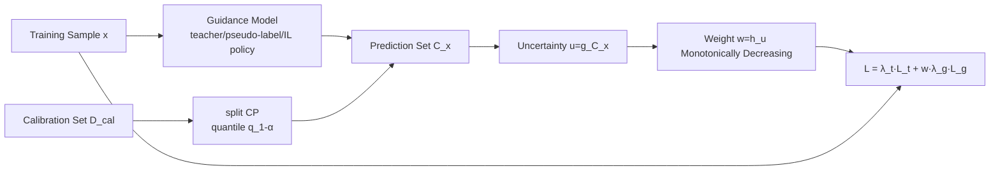

# Adaptive Conformal Guidance for Learning under Uncertainty

**Conference**: ICLR 2026  
**OpenReview**: [https://openreview.net/forum?id=1gxP0WtOoO](https://openreview.net/forum?id=1gxP0WtOoO)  
**Code**: To be confirmed  
**Area**: Uncertainty Quantification / Conformal Prediction / General Learning Framework  
**Keywords**: Conformal Prediction, Uncertainty Weighting, Knowledge Distillation, Semi-Supervised Learning, Imitation-Guided Reinforcement Learning  

## TL;DR
The paper embeds split conformal prediction (split CP) directly into the training loop, using the "prediction set size" to quantify the uncertainty of guidance signals (teacher soft labels / pseudo-labels / expert policies), and then adaptively downweights unreliable guidance—a unified framework covering supervised, semi-supervised, and imitation-guided RL.

## Background & Motivation
**Background**: Many machine learning systems rely on "guidance signals" to improve performance or accelerate learning—supervised learning uses soft labels from a pre-trained teacher for knowledge distillation (KD), semi-supervised learning (SSL) uses self-generated pseudo-labels to bootstrap small labeled sets, and reinforcement learning (RL) uses imitation learning (IL) policies as priors for exploration. These signals are typically assumed to be trustworthy.

**Limitations of Prior Work**: Guidance signals can become noisy or even misleading under domain shift, label scarcity, or out-of-distribution (OOD) generalization. A teacher might perform worse than a student in the target domain; pseudo-labels can lead to self-reinforcement of early errors; IL policies might provide incorrect actions once outside the demonstration distribution. Blindly trusting noisy guidance leads to overfitting to incorrect information, while discarding guidance entirely wastes useful knowledge.

**Key Challenge**: How to dynamically weigh guidance without "blind trust" or "wasting knowledge"? Existing uncertainty-aware methods either use heuristic estimates (entropy, maximum softmax probability, MC dropout), which are often overconfident and poorly calibrated under domain shift, or are tailored to narrow domains (e.g., medical imaging). While conformal prediction (CP) provides rigorous distribution-free and model-agnostic uncertainty, it has been almost exclusively used for post-hoc calibration after training, rather than being integrated into real-time training dynamics.

**Goal**: Propose the first unified framework to embed split CP into the training loop for adaptive guidance weighting across supervised, semi-supervised, and imitation-guided RL scenarios.

**Core Idea**: **[Uncertainty as Weight]** Measure the guidance uncertainty $u$ of a sample using the guidance model's conformal prediction set size $|C(x)|$ on a calibration set, then map $u$ to a weight $w$ for the guidance loss via a monotonically decreasing function—larger prediction sets (higher uncertainty) result in lower weights, allowing the model to explore autonomously where guidance is untrustworthy and absorb guidance where it is reliable.

## Method

### Overall Architecture
AdaConG (Adaptive Conformal Guidance) performs three actions at each training step: first, it "conformalizes" the heuristic output of the guidance model using a held-out calibration set $D_{cal}$ to calculate the quantile threshold $q_{1-\alpha}$; second, it constructs a prediction set $C(x)$ for the training samples, converting the set size into uncertainty $u(x)$ and then into a weight $w(x)$; finally, it scales the guidance loss $L_g$ by $w(x)$ and adds it to the task loss $L_t$ to update the model. This skeleton is shared across three learning scenarios, with differences only in the "nature of the guidance signal, the source of the calibration set, and the weighting combination."

### Key Designs

**1. Conformalizing Guidance Signals → Prediction Set Size as Uncertainty**: The foundation of AdaConG is converting any "heuristic uncertainty" into a rigorous metric with coverage guarantees via split CP. Given a calibration set $D_{cal}$ and a non-conformity score $s'$ (residuals $|\bar y-\hat y|$ for regression, $s'=1-p_{\bar y}$ for classification), the quantile $q_{1-\alpha}=\text{Quantile}_{1-\alpha}(s'_1,\dots,s'_{|D_{cal}|})$ is computed. For a test input, a prediction set $C(x)=\{y:s'(x,y)\le q_{1-\alpha}\}$ is constructed, which, under the exchangeability assumption, satisfies the coverage guarantee $P(y\in C(x))\ge 1-\alpha$. The key insight: **a larger prediction set indicates the model is more uncertain**. Guidance uncertainty is defined as $u(x)=g(|C(x)|)$, where $g$ normalizes the set size to $[0, 1]$ (e.g., $g(n)=\frac{n-1}{K-1}$ for $K$-class problems). Unlike entropy or MSP, which rely directly on softmax (often overconfident under domain shift), CP provides reliable distribution-free estimates that hold even under distribution drift.

**2. Monotonically Decreasing Weights Translate Uncertainty to Guidance Strength**: Once $u(x)$ is obtained, it is converted to a weight $w(x)=h(u(x))$ using a monotonically decreasing function $h$. The paper uses exponential decay $h(u)=\exp(-\kappa u)$ by default, where the temperature $\kappa>0$ controls the steepness (e.g., $\gamma=10$ for KD, $\gamma=8$ for SSL). High uncertainty → low weight → suppressed guidance, causing the model to learn autonomously via the task loss; low uncertainty → weight near 1 → full guidance absorption. In supervised distillation, the total loss is $L=\lambda_{task}L_t+w(x)\cdot\lambda_{guide}L_g$. The paper also presents a "hard" variant where $w=1$ if $u=0$ and $w=0$ otherwise, which performs competitively. This step implements "Adaptation" by grounding abstract uncertainty into differentiable loss reweighting.

**3. Adaptation Across Scenarios — Differences in Calibration Sets and Weights**: The framework adapts to the specific guidance structures of different scenarios. In *supervised distillation*, target domain data is split into train/calibration/test sets to conformalize a pre-trained teacher, ensuring the calibration set represents the input distribution where guidance is applied. In *semi-supervised learning*, the calibration set consists of "labeled data + weak augmentations" identical to those used for unlabeled data; prediction sets for pseudo-labels are calculated on weak views, and the unsupervised consistency loss $L_u=\frac{1}{|D_u|}\sum_{x}w(x)\,\ell(f(x_{strong}),\tilde y)$ is weighted by pseudo-label confidence. *Imitation-guided RL* is unique: the non-conformity score is $s(s,a)=-\log\pi(a|s)$. While the IL policy uses a fixed calibration set for the quantile $\hat q_I$, the RL policy evolves during training, requiring **adaptive CP**—maintaining a sliding window calibration set and updating the quantile via EMA $\hat q_R^{(t)}\leftarrow(1-\rho)\hat q_R^{(t-1)}+\rho\,\tilde q_R^{(t)}$, warm-started by $\hat q_I$. The final weight $w(s)=\frac{\exp(-u_I(s))}{\exp(-u_I(s))+\exp(-u_R(s))}$ manages relative uncertainty competition, driving both loss weighting and data collection.

## Key Experimental Results

### Main Results

**Knowledge Distillation (CIFAR-100, teacher underfit due to 0.05 Gaussian noise domain shift)** — Top-1 Accuracy, ∆ represents the Gain after integrating AdaConG:

| Method (homogeneous) | ResNet110→20 | ResNet32×4→8×4 | WRN40-2→16-2 |
|---|---|---|---|
| Student (from scratch) | 66.51 | 69.14 | 70.34 |
| KD | 57.23 | 58.90 | 59.40 |
| KD + AdaConG | 66.53 (**+9.30**) | 68.45 (**+9.45**) | 70.29 (**+10.89**) |
| LS-KD | 63.38 | 63.49 | 66.58 |
| LS-KD + AdaConG | 67.17 (+3.79) | 70.33 (+6.84) | 71.48 (+4.90) |

A key contrast: Original KD performs worse than "from scratch" when the teacher is underfit. AdaConG restores performance above the from-scratch baseline, with gains up to +10.89%.

**Semi-supervised Classification (Cross-entropy guidance)** — Top-1 Accuracy, ∆ represents average Gain:

| Method | CIFAR-10 (40 lab) | CIFAR-100 (400 lab) | STL-10 (40 lab) |
|---|---|---|---|
| FixMatch | 64.18 | 40.36 | 58.03 |
| FixMatch + AdaConG | 70.16 (**+5.98**) | 41.98 (+1.62) | 62.70 (+4.67) |
| FlexMatch | 73.24 | 51.25 | 62.55 |
| FlexMatch + AdaConG | 76.98 (+3.74) | 55.63 (**+4.38**) | 65.98 (+3.43) |

**Gridworld Navigation (IL-guided RL)**: Across Lava 1/Lava 2/Door environments, AdaConG and its Hard variant converge faster and achieve higher rewards than SAC, IBRL, and Soft IBRL; the abstract reports rewards up to 6× higher than the strongest baseline. In the shifted environment Lava 2 (unseen by IL demos), AdaConG still breaks through, whereas IBRL/Soft IBRL converge to limited IL levels due to uncertainty blindness.

### Ablation Study

| Ablation Dimension | Setting | Conclusion |
|---|---|---|
| Teacher-Student Architecture | heterogeneous (ResNet↔ShuffleNet) | Gain persists for all KD methods with AdaConG |
| Weight Function | Hard version $w\in\{0,1\}$ | Comparable performance to soft exponential decay |
| SSL Guidance Loss | CE → MSE | Consistent improvements with MSE (e.g., FlexMatch+AdaConG on CIFAR-100 2500 lab +2.77) |
| RL Weight Combination | Soft probability vs hard argmax | Performance of both is similar |

### Key Findings
- Using CP prediction set size as uncertainty is more robust to domain shift than heuristics like entropy, MSP, or MC dropout, without requiring multiple forward passes (lower overhead).
- The value of the framework is concentrated in scenarios where "guidance itself is unreliable": gains are greatest when the teacher is underfit, pseudo-labels are noisy, or IL policy generalization fails.
- In RL, the CP set measures the "self-consistency" of the policy rather than action correctness, but it serves as an effective proxy for uncertainty-driven weighting.

## Highlights & Insights
- **Pulling post-hoc CP into the training loop**: This is the core conceptual shift—CP has traditionally been a post-training calibration tool. This paper proves it can drive training dynamics as a differentiable guidance weighting module.
- **One mechanism for three scenarios**: By sharing the "Conformalization → Prediction Set → Weight → Reweighted Loss" backbone, the framework demonstrates high generality across KD, SSL, and IL-guided RL.
- **Adaptive CP for non-stationary guidance**: The use of sliding windows, EMA quantiles, and IL warm-starts elegantly solves the challenge of calibrating a target that drifts (the RL policy).
- **Plug-and-play simplicity**: It essentially adds a weight term to any existing guidance-based loss, making migration costs extremely low while salvaging failing baselines.

## Limitations & Future Work
- **Dependence on calibration set representativity**: Coverage guarantees rely on the calibration set representing the guidance-applied input distribution and satisfying exchangeability; it may fail under severe OOD or extremely low label budgets.
- **Set size $\neq$ guidance correctness**: As noted in the RL section, set size measures consistency. Theoretically, it could fail if the guidance is "confident but wrong."
- **Hyperparameter sensitivity**: Parameters like $\kappa/\gamma$, $\alpha$, and EMA $\rho$ need task-specific tuning, lacking an automated adaptive setting.
- **Scale of tasks**: Experiments are focused on CIFAR/STL-10/gridworld and steering prediction; validation on large-scale LLM distillation or complex continuous control is pending.

## Related Work & Insights
- **Learning with Guidance**: Knowledge Distillation (soft labels, intermediate features), Semi-supervised (pseudo-labels), and Imitation-guided RL (IBRL)—all share the flaw of assuming static reliability of guidance.
- **Conformal Prediction**: RAPS (Angelopoulos 2020) and others focus on post-processing for prediction sets; adaptive CP (Gibbs & Candès 2021) handles distribution drift. This work moves these concepts from "evaluation time" to "training time."
- **Uncertainty-aware Learning**: Compared to MC dropout or MSP-based reweighting, AdaConG overcomes the limitations of overconfidence under domain shift.
- **Insight**: Any training pipeline where "signals may be noisy but valuable" (e.g., RLHF reward models, self-distillation, weak supervision) can benefit from using CP set size as an immediate credibility gate.

## Rating
- **Novelty**: ⭐⭐⭐⭐ — First to embed split CP into the training loop as a unified adaptive weighting mechanism; adaptive CP for RL is a strong detail, though the underlying components already existed.
- **Experimental Thoroughness**: ⭐⭐⭐⭐ — Covers four task types, multiple backbones, and various baselines; however, the scale of tasks remains relatively small.
- **Writing Quality**: ⭐⭐⭐⭐ — Clear motivation, unified formulation for three scenarios, and effective visualizations.
- **Value**: ⭐⭐⭐⭐ — Low migration cost and high effectiveness in addressing "unreliable guidance," making it practically useful for KD/SSL/IL communities.

<!-- RELATED:START -->

## Related Papers

- [\[ICLR 2026\] Robust Equation Structure Learning with Adaptive Refinement (RESTART)](robust_equation_structure_learning_with_adaptive_refinement.md)
- [\[ICLR 2026\] Regulating Internal Alignment Flows for Robust Learning Under Spurious Correlations](regulating_internal_alignment_flows_for_robust_learning_under_spurious_correlati.md)
- [\[ICLR 2026\] Measuring Uncertainty Calibration](measuring_uncertainty_calibration.md)
- [\[ICLR 2026\] Harpoon: Generalised Manifold Guidance for Conditional Tabular Diffusion](harpoon_generalised_manifold_guidance_for_conditional_tabular_diffusion.md)
- [\[ICLR 2026\] Learning Adaptive Distribution Alignment with Neural Characteristic Function for Graph Domain Adaptation](learning_adaptive_distribution_alignment_with_neural_characteristic_function_for.md)

<!-- RELATED:END -->
