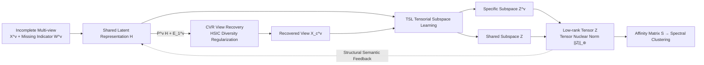

# Aligning Collaborative View Recovery and Tensorial Subspace Learning via Latent Representation for Incomplete Multi-View Clustering

**Conference**: ICLR 2026  
**OpenReview**: [https://openreview.net/forum?id=a5aRjldX9l](https://openreview.net/forum?id=a5aRjldX9l)  
**Code**: [https://github.com/caoyu110/ARSL-IMVC](https://github.com/caoyu110/ARSL-IMVC)  
**Area**: Incomplete Multi-View Clustering / Tensorial Subspace Learning  
**Keywords**: incomplete multi-view clustering, view recovery, tensor subspace, low-rank tensor, HSIC, latent representation  

## TL;DR
ARSL-IMVC utilizes a shared latent representation $H$ as a "bridge" to explicitly align missing view recovery (CVR) and tensorial subspace learning (TSL) within a unified framework for mutual promotion, thereby achieving more robust multi-view clustering in scenarios with significantly missing views.

## Background & Motivation
**Background**: Multi-view clustering (MVC) partitions unlabeled samples by leveraging cross-view consistency and complementarity. Among various approaches, multi-view subspace clustering has gained significant attention due to its robustness and performance. However, in open-world scenarios, sensor failures, missing annotations, or data corruption can lead to missing samples in certain views, making **incomplete multi-view clustering (IMVC)** a research hotspot. This field is generally divided into two categories: imputation-based (recovering missing views before clustering) and imputation-free (using only observed views).

**Limitations of Prior Work**: Imputation-free methods are simple but have limited discriminative power, especially at high missing rates. While imputation-based methods provide a more complete data foundation—and many modern approaches jointly optimize view recovery and representation learning—they suffer from two major drawbacks. First, the structural fidelity of recovered views is limited, failing to sufficiently reshape consistency and diversity. Second and more crucially, **there is a lack of explicit alignment and collaborative interaction between view recovery and subspace representation learning**. These two components are only "weakly coupled" when mining complementary and consistent information, lacking a clear bridge to align their semantics.

**Key Challenge**: The recovery module aims to fill in "high-quality, information-rich" views, while the subspace module aims to learn "discriminative" clustering structures. Operating independently, the recovered views might not serve clustering semantics, and the structural semantics learned by the subspace module cannot flow back to guide the recovery process.

**Goal**: To allow view recovery and tensorial subspace learning to undergo **explicit alignment and bidirectional negotiation** during cross-view consistency and complementarity modeling.

**Core Idea**:
- **Latent Representation as a Bridge**: Introduce a shared latent representation $H$ across all views. It serves both as a "virtual basis" for recovering missing views and as a global semantic anchor participating directly in subspace learning, stitching the two modules together.
- **Feature-level Consistency + Diversity**: Reshape cross-view consistency via the projection $P^v H$ and ensure inter-view diversity via view-specific estimators $E_1^v$ with HSIC regularization.
- **Tensor Low-Rank Modeling of High-Order Correlation**: Stack view-shared and view-specific subspace representations into a unified low-rank tensor to capture global and local multi-level high-order cross-view correlations.

## Method

### Overall Architecture
ARSL-IMVC consists of two main modules aligned by a shared latent representation $H$: **Collaborative View Recovery (CVR)**, which linearly infers each view from $H$ and ensures diversity via HSIC; and **Tensorial Subspace Learning (TSL)**, which performs self-representation learning on $H$ and recovered views, compressing shared/specific subspace representations into a low-rank tensor. The two modules bidirectionally transmit semantics through $H$—recovery quality aids subspace discrimination, while subspace structural semantics flow back to improve imputation fidelity. The unified objective is solved iteratively via ADMM.

### Key Designs

**1. Collaborative View Recovery (CVR): Linear Reconstruction from Latent Representation + HSIC-driven Diversity.** A classic assumption in MVC is that multi-view data is embedded in a shared latent space. The authors invert this assumption—allowing each view to be linearly inferred from a "virtual" latent representation $H \in \mathbb{R}^{k\times n}$ via a reconstruction operator $P^v \in \mathbb{R}^{d_v \times k}$, with a view-specific estimator $E_1^v$ providing flexibility, denoted as $P^v H + E_1^v$. To prevent recovered views from being overly redundant and losing complementary information, the Hilbert-Schmidt Independence Criterion (HSIC) is introduced as a diversity regularizer to penalize dependence between any two estimators $E_1^v$ and $E_1^w$: $$\mathrm{HSIC}(E_1^v, E_1^w) = \frac{\mathrm{Tr}(K^v \tilde{H} K^w \tilde{H})}{(n-1)^2}$$, where $K^v$ is the inner-product kernel of $E_1^v$ and $\tilde H$ is the centering matrix. CVR minimizes the HSIC across all view pairs under the equality constraint $X^v W^v = (P^v H + E_1^v)W^v$ (ensuring observed samples are reconstructed accurately) and the orthogonality constraint $(P^v)^T P^v = I$, thereby compacting consistency and expanding diversity at the feature level.

**2. Tensorial Subspace Learning (TSL): Stacking Shared and Specific Representations into a Low-Rank Tensor.** Once the shared latent $H$ and recovered views $P^v H + E_1^v$ are obtained, TSL performs self-representation learning: $H = HZ + E_H$ for the shared subspace $Z$, and $P^v H + E_1^v = (P^v H + E_1^v)Z^v + E_2^v$ for each view-specific subspace $Z^v$, where $E_H$ and $E_2^v$ are noise terms. Crucially, these representations are stacked via a tensor construction function $\Phi(\cdot)$ and rotated into a subspace representation tensor $\mathcal{Z} \in \mathbb{R}^{n\times(V+1)\times n}$, upon which the tensor nuclear norm $\|\mathcal{Z}\|_\circledast$ is applied to enforce low-rankness. Within the low-rank tensor space, high-order cross-view correlations at different levels (global shared vs. local specific) are captured, facilitating collaborative interaction between global and local structural information. Noise terms are constrained with the $\ell_{2,1}$ norm for robustness against outliers.

**3. Unified Objective + ADMM Iterative Optimization.** The CVR and TSL modules are integrated into a single objective: $$\min_\Upsilon \|\mathcal{Z}\|_\circledast + \lambda_1(\|E_H\|_{2,1} + \sum_v \|E_2^v\|_{2,1}) + \lambda_2 \sum_{w\neq v}\mathrm{HSIC}(E_1^v, E_1^w)$$, subject to observed reconstruction, self-representation, orthogonality, and tensor construction constraints. Here, $H$ acts as both the coupling hub and the semantic anchor, allowing information to flow bidirectionally between recovery and subspace learning. Due to the multiplicity of variables ($\{H, P^v, E_1^v, Z, E_H, Z^v, E_2^v\}$), optimization is performed using ADMM: $P^v$ has a closed-form SVD solution, $H$ is solved via a Sylvester equation, the tensor nuclear norm subproblem is solved via tensor singular value thresholding (t-SVT), and $\ell_{2,1}$ terms use the column-wise soft-thresholding operator. After convergence, the affinity matrix $S = (|Z| + |Z^T| + \sum_v |Z^v| + \sum_v |(Z^v)^T|)/(V+1)$ is used for spectral clustering.

## Key Experimental Results

### Main Results
Tested on 7 datasets (BBCSport, HW, BDGP, Yale, NGs, 100leaves, Scene-15) against 9 representative methods, with means over 10 runs. Selected ACC results at 0.1 missing rate:

| Dataset | Metric | IMSC-AGL | HCP-IMSC | BWIC-TIMC | RMoGL | **Ours** |
|--------|------|----------|----------|-----------|-------|----------|
| BBCSport | ACC | 84.30 | 91.91 | 90.75 | 89.19 | **96.51** |
| BBCSport | NMI | 72.63 | 79.84 | 82.10 | 83.18 | **89.77** |
| HW | ACC | 88.59 | 79.80 | 81.85 | 76.73 | **96.90** |
| HW | NMI | 87.21 | 75.73 | 82.87 | 74.61 | **92.77** |
| BDGP | ACC | 41.67 | 21.08 | 29.88 | 45.94 | **56.07** |

At 0.1 missing rate, ACC improved over the second-best method by approximately **4.60% / 8.31% / 5.41%** on BBCSport / HW / BDGP respectively. As the missing rate increases, most methods degrade significantly, while ARSL-IMVC maintains higher stability.

### Ablation Study
Variant ARSL-IMVC-1 (removing subspace learning on $H$, i.e., removing latent representation alignment) at 0.1 missing rate:

| Dataset | Metric | ARSL-IMVC-1 | ARSL-IMVC |
|--------|------|-------------|-----------|
| BBCSport | ACC | 84.03 | **96.51** |
| HW | ACC | 70.15 | **96.90** |
| Yale | ACC | 76.55 | **86.06** |
| NGs | ACC | 89.96 | **96.20** |
| 100leaves | ACC | 78.61 | **89.24** |

Removing the latent representation alignment resulted in ACC drops of 12.48% / 26.75% / 9.51% / 6.24% / 10.63% across the five datasets, proving that "aligning view recovery and subspace learning via $H$" is the core performance driver.

### Key Findings
- **Alignment is Key**: Compared to imputation-free methods, CVR's feature-level consistency and diversity reshaping provide more reliable view recovery. Compared to imputation-based methods, $H$ serving as both a recovery basis and a semantic anchor enables deep interaction.
- **Scalability**: Achieved an ACC of 99.00% on the HDigit dataset (10,000 samples), which is approximately 0.7% higher than the second-best HCLS-IMSC, validating scalability.
- **Efficiency and Convergence**: Runtime is comparable to other IMVC methods. Convergence curves show local optima are reached within finite iterations with numerical stability. Parameters $\lambda_1$ and $\lambda_2$ are insensitive within reasonable ranges.

## Highlights & Insights
- **Clean "Bridge" Concept**: Using a shared latent representation to simultaneously act as the virtual basis for reconstruction and the global semantic anchor for subspace learning transforms the traditionally "weakly coupled" recovery and clustering into a bidirectional negotiation loop. The 26% ablation improvement directly validates this alignment.
- **Clever Use of HSIC**: Explicitly expanding view diversity at the feature level during the recovery stage prevents the generation of "consistent but redundant" views, addressing the often-overlooked dimension of complementarity.
- **Multi-level Tensor Modeling**: Incorporating $V$ specific subspaces and 1 shared subspace into a low-rank tensor allows the tensor nuclear norm to capture global/local high-order correlations more effectively than view-by-view graph construction.

## Limitations & Future Work
- **Traditional Optimization Paradigm**: The method follows the classic self-representation + tensor low-rank + ADMM route. Spectral clustering and $n\times n$ representation matrices still face $O(n^2)$ or higher storage/computation pressures on ultra-large-scale data. While validated on 10,000 samples, a gap remains compared to the end-to-end scalability of deep IMVC.
- **Linear Recovery Assumption**: Linear reconstruction of views from $H$ ($P^v H + E_1^v$) may lack expressiveness for highly nonlinear cross-view relationships. Future work could consider kernelized or deep reconstruction operators.
- **Hyperparameter Search**: $\lambda_1, \lambda_2$ were grid-searched in $\{1,...,50\}$ and $k$ in $10–20$. Though reported as insensitive, tuning is still required; adaptive determination of latent dimension $k$ is a potential improvement.

## Related Work & Insights
- **Imputation-free IMVC** (DAIMC, IMSC-AGL, HCLS-CGL): Learns consensus representations or adaptive graphs from observed views; simple but limited at high missing rates. This work's baselines highlight the value of recovery.
- **Imputation-based IMVC** (UEAF, HCP-IMSC, BWIC-TIMC, RMoGL): Recovers then clusters. UEAF uses unified embeddings to align inferred missing samples; HCP-IMSC/BWIC-TIMC use low-rank tensors for high-order correlations. This paper identifies the weak coupling and lack of an explicit alignment bridge in these approaches.
- **HSIC Diversity Regularization**: Utilizing kernel independence criteria to encourage inter-view complementarity is a strategy applicable to any multi-view/multi-modal representation learning task requiring both consistency and diversity.
- **Insight**: The strategy of explicitly aligning "recovery" and "task representation" via a shared latent variable with bidirectional feedback can be transferred to broader incomplete data modeling scenarios, such as missing modality completion and multi-modal fusion.

## Rating
- Novelty: ⭐⭐⭐⭐ — The framework design using shared latent representation as a bridge to align view recovery and tensorial subspace learning is clean and targeted. The combination of HSIC feature-level diversity and multi-level low-rank tensors is rational, though individual components rely on existing techniques.
- Experimental Thoroughness: ⭐⭐⭐⭐ — 7 datasets + multiple missing rates + 9 baselines + ablation + large-scale + runtime/convergence analysis is comprehensive. The ablation gains are highly convincing. Lack of comparison with deep IMVC methods is a slight omission.
- Writing Quality: ⭐⭐⭐⭐ — Logic from motivation to method and experiment is clear. Figure 1 is intuitive. Some high symbol density and minor typos (e.g., "exapmle").
- Value: ⭐⭐⭐⭐ — Solidifies the "recovery-clustering alignment" in the traditional tensor IMVC pipeline. Open-source code, stability, and scalability make it a valuable reference for missing data clustering practices.

<!-- RELATED:START -->

## Related Papers

- [\[CVPR 2026\] Scalable Multi-View Subspace Clustering with Tensorized Anchor Guidance](../../CVPR2026/others/scalable_multi-view_subspace_clustering_with_tensorized_anchor_guidance.md)
- [\[AAAI 2026\] Deep Incomplete Multi-View Clustering via Hierarchical Imputation and Alignment](../../AAAI2026/others/deep_incomplete_multi-view_clustering_via_hierarchical_imputation_and_alignment.md)
- [\[ICLR 2026\] Permutation-Consistent Variational Encoding for Incomplete Multi-View Multi-Label Classification](permutation-consistent_variational_encoding_for_incomplete_multi-view_multi-labe.md)
- [\[CVPR 2026\] Plug-and-Play Incomplete Multi-View Clustering via Janus-Faced Affinity Learning with Topology Harmonization](../../CVPR2026/others/plug-and-play_incomplete_multi-view_clustering_via_janus-faced_affinity_learning.md)
- [\[NeurIPS 2025\] Incomplete Multi-view Clustering via Hierarchical Semantic Alignment and Cooperative Completion](../../NeurIPS2025/others/incomplete_multi-view_clustering_via_hierarchical_semantic_alignment_and_coopera.md)

<!-- RELATED:END -->
