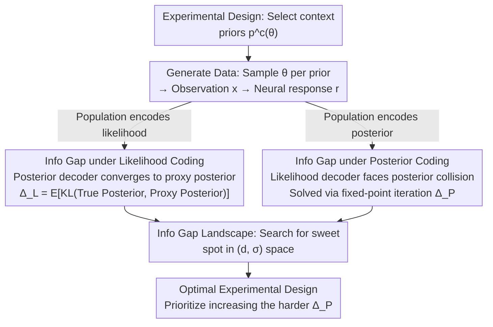

# An Information-Theoretic Framework For Optimizing Experimental Design To Distinguish Probabilistic Neural Codes

**Conference**: ICLR 2026  
**arXiv**: [2603.01387](https://arxiv.org/abs/2603.01387)  
**Code**: [https://github.com/walkerlab/information-gap-probabilistic-neural-codes](https://github.com/walkerlab/information-gap-probabilistic-neural-codes)  
**Authors**: Po-Chen Kuo, Edgar Y. Walker (University of Washington)  
**Area**: Computational Neuroscience — Probabilistic neural coding, Bayesian perception, experimental design optimization  
**Keywords**: Information Gap, Probabilistic coding hypothesis, Likelihood coding, Posterior coding, Optimal experimental design

## TL;DR

Ours proposes **information gap**, an information-theoretic metric that quantitatively evaluates the ability of a given experimental design to distinguish between two probabilistic neural coding hypotheses. This is achieved by deriving analytical expressions for the cross-entropy performance difference of decoders under likelihood and posterior coding hypotheses (essentially the KL divergence between the true posterior and a task-marginalized proxy posterior) and optimizing stimulus prior distributions by maximizing this metric to achieve theory-driven optimal experimental design.

## Background & Motivation

**Background**: The Bayesian brain hypothesis is the dominant theoretical framework for understanding perceptual decision-making under uncertainty. Extensive psychophysical evidence suggests that the brain performs approximately Bayesian optimal computations in tasks such as multisensory integration, motion perception, and sensorimotor learning. However, the core implementation question—exactly how probability distributions are encoded within sensory neural populations—remains unresolved.

**Limitations of Prior Work**: Two competing hypotheses currently exist: the **likelihood coding hypothesis** (represented by Probabilistic Population Codes, PPC, suggesting primary sensory areas encode the likelihood function $p(x|\theta)$) and the **posterior coding hypothesis** (represented by neural sampling, suggesting primary sensory areas integrate priors via feedback connections to directly encode the posterior distribution $p(\theta|x)$). The key distinction lies in whether the stimulus prior $p(\theta)$ modulates the neural responses of early sensory populations. However, most existing electrophysiological experiments employ a single fixed stimulus context (uniform prior), making the predictions of the two hypotheses indistinguishable.

**Key Challenge**: Distinguishing the two hypotheses requires manipulating stimulus prior distributions across different contexts. However, the choice of prior distributions involves a non-trivial trade-off: if the priors are too different, there is insufficient stimulus overlap across contexts (preventing comparisons of responses to the same stimulus); if the priors are too similar, the predicted differences between the two hypotheses are negligible. This trade-off cannot be resolved by intuition alone.

**Goal**: ① How to quantitatively measure the ability of a given experimental design (i.e., the choice of stimulus prior distributions) to distinguish between the two coding hypotheses? ② How to systematically optimize experimental parameters to maximize this discriminative power?

**Key Insight**: Ours approaches this from a decoding framework—if a neural population encodes the likelihood function, a likelihood decoder should outperform a posterior decoder, and vice versa. By deriving the cross-entropy performance difference of optimal decoders at their theoretical limits, the discriminative power of an experimental design can be analytically quantified.

**Core Idea**: The experimental design optimization problem is transformed into maximizing the information gap (the performance difference of an optimal decoder when decoding matched vs. mismatched probabilistic content), providing a computable and optimizable theoretical framework for distinguishing probabilistic neural coding hypotheses from an information-theoretic perspective.

## Method

### Overall Architecture

The framework is based on an experimental paradigm involving two contexts $c \in \{A, B\}$: each context has a specific stimulus prior distribution $p^c(\theta)$. A latent variable $\theta$ (e.g., orientation) is sampled according to the prior and produces a sensory observation $x$ through a generative model $p(x|\theta)$, to which the neural population generates a response $\boldsymbol{r}$. The core output is the **information gap** $\Delta^{\text{info}}$—the expected cross-entropy performance difference between an optimal likelihood decoder and an optimal posterior decoder under a given experimental design $(p(c), p^c(\theta))$. The entire pipeline functions as a branching and merging process: first, a set of experimental designs is fixed to generate data; then, assuming either "likelihood coding" or "posterior coding," analytical information gaps $\Delta_L^{\text{info}}$ and $\Delta_P^{\text{info}}$ are derived; finally, these quantities are mapped onto a two-dimensional landscape to search for the optimal experimental design that makes both sufficiently large.

### Key Designs

**1. Info Gap under Likelihood Coding: Quantifying the loss of decoding an "incorrect" posterior**

The first hypothesis is that the neural population encodes the likelihood function. Here, context information is absent from the population response $\boldsymbol{r}_L \sim p(x|\theta)$, so the posterior decoder cannot determine the current context or recover the true posterior. The key observation is that the optimal posterior decoder does not degrade into random guessing but converges to a **task-marginalized proxy posterior**—it substitutes the true context prior with a mixture prior $\sum_c p(c)p^c(\theta)$:

$$q_{P,i}^*(\theta) = \frac{\left[\sum_c p(c)\, p^c(\theta)\right] \cdot p(x_i|\theta)}{\sum_{\theta'} \left[\sum_c p(c)\, p^c(\theta')\right] \cdot p(x_i|\theta')}.$$

The information gap under likelihood coding is then the expected KL divergence between the true posterior $p^c(\theta|x_i)$ and this proxy posterior: $\Delta_L^{\text{info}} = \mathbb{E}_{p(x_i,c)}\big[D_{\text{KL}}(p^c(\theta|x_i)\,\|\,q_{P,i}^*(\theta))\big]$. As long as the priors of the two contexts differ, each observation $x_i$ contributes a non-zero gap, making $\Delta_L^{\text{info}}$ typically large and relatively easy to distinguish experimentally.

**2. Info Gap under Posterior Coding: Contribution only from "posterior collision" pairs**

The second hypothesis is that the neural population directly encodes the posterior. Here, the problem is reversed: the likelihood decoder must recover the "clean" likelihood from responses already modulated by the prior. The difficulty arises because different contexts may produce **identical posteriors** $p^A(\theta|x_j)=p^B(\theta|x_k)$ even though their underlying likelihoods differ ($p(x_j|\theta)\neq p(x_k|\theta)$). The optimal likelihood decoder can only output a compromised Bayes-optimal likelihood estimate $\ell_{jk}^*(\theta)$ for such "posterior collision" pairs, solved via fixed-point iteration. Consequently, $\Delta_P^{\text{info}}$ is only contributed by observation pairs $(x_j, x_k)$ satisfying the posterior matching condition. Since such pairs are rare, the magnitude of $\Delta_P^{\text{info}}$ is often an order of magnitude smaller than $\Delta_L^{\text{info}}$—indicating that "whether the population encodes the posterior" is the true challenge for experimental design.

**3. Info Gap Landscape: Turning prior selection into an optimizable 2D search**

With the two analytical information gaps, experimental design reduces to finding a "sweet spot" in the task parameter space where both are sufficiently large. For Gaussian context priors $p^c(\theta)=\mathcal{N}(\mu^c,\sigma^2)$, the parameter space is spanned by the mean separation $d=|\mu^A-\mu^B|$ and the shared standard deviation $\sigma$. By traversing the $(d, \sigma)$ grid, the 2D landscape visualizes the discriminability of the two hypotheses. Since $\Delta_P^{\text{info}}$ is smaller and harder to increase, the optimization strategy uses it as the bottleneck—prioritizing the maximization of $\Delta_P^{\text{info}}$ while ensuring $\Delta_L^{\text{info}}$ remains sufficiently large (e.g., $d\approx 30°$, $\sigma\approx 20°$ for low-contrast stimuli). This landscape also excludes heavy-tailed distributions (Student's t, Cauchy), which produce almost zero info gap under posterior coding because posterior matching pairs are nearly non-existent.

### Loss & Training

Decoders are implemented using Deep Neural Networks (MLP) with cross-entropy loss. The likelihood decoder $g_L(\boldsymbol{r})$ outputs a discretized estimate of the likelihood function, while the posterior decoder $g_P(\boldsymbol{r})$ outputs a discretized estimate of the posterior distribution. Training utilizes standard supervised learning with $(\boldsymbol{r}, \text{target})$ pairs generated from simulated likelihood or posterior coding populations, where targets are the true discretized likelihood or posterior. Theoretical info gap values serve as the reference upper bound for convergence.

## Key Experimental Results

### Main Results: Theoretical Prediction vs. Simulation Validation

Predictions were validated across multiple task parameters and stimulus contrasts using Poisson and gain-modulated Poisson neuron models.

| Validation Dimension | Likelihood Gap $\Delta_L^{\text{info}}$ | Posterior Gap $\Delta_P^{\text{info}}$ | Key Findings |
|----------|--------------------------------|--------------------------------|---------|
| High Contrast | High theory-empirical agreement | High theory-empirical agreement | $\Delta_L$ is an order of magnitude larger than $\Delta_P$ |
| Mid Contrast | Increased info gap | Increased info gap | Lower contrast increases prior influence |
| Low Contrast | Maximum info gap | Maximum info gap | Widest region of effective parameters |
| Gain-modulated Poisson | Accurate prediction | Accurate prediction | Framework remains effective in biologically realistic models |
| Convergence (Trials) | Converges at 30K trials | Converges at 30K trials | Decoder difference reaches theoretical bound |
| Convergence (Neurons) | Converges at 500 neurons | Converges at 500 neurons | Sufficient for population scale |

### Allen Brain Observatory Validation

| Dataset | Decoder Performance Difference | Theoretical Prediction | $p$-value | Conclusion |
|--------|--------------|---------|-----------|------|
| Allen Visual Coding (169 sessions, >300 trials each) | $0.0024 \pm 0.064$ | 0 | $p = 0.63$ | Not significant |

In a single context (uniform prior), the theoretical info gap is predicted to be 0. Empirical results perfectly match this, validating the necessity of multi-context prior manipulation.

### Key Findings

- **Asymmetry in Magnitude**: The info gap under likelihood coding is up to an order of magnitude larger than under posterior coding because every observation contributes to $\Delta_L$, whereas only matched posterior pairs contribute to $\Delta_P$. This makes the posterior coding hypothesis significantly harder to verify experimentally.
- **Contrast Affects Discriminability**: Low-contrast stimuli (high sensory uncertainty) expand the region of effective parameters because the relative influence of the prior on the posterior is greater.
- **Heavy-tailed Priors are Ineffective**: Student's t and Cauchy distributions result in nearly zero info gap for posterior coding across the parameter space due to the lack of posterior matching pairs.
- **Parameter Trade-offs**: The optimal parameter regions for the two hypotheses do not perfectly overlap. The strategy should prioritize the "bottleneck" $\Delta_P$ while ensuring $\Delta_L$ is sufficiently detectable.

## Highlights & Insights

1. **Unifying Experimental Design as an Optimization Framework**: The core contribution is not a new neural model but the establishment of a paradigm where "design discriminability" is analytically computable. This elevates experimental design from empirical trial-and-error to a theory-grounded optimization problem.

2. **Elegant Proxy Posterior Derivation**: When a decoder is forced to extract mismatched probabilistic information, the optimal output converges to a task-marginalized Bayes-optimal estimate. This result is both intuitive and mathematically rigorous.

3. **Magnitude Asymmetry Insight**: The finding that $\Delta_L^{\text{info}} \gg \Delta_P^{\text{info}}$ directly informs strategy—experiments should be optimized for the detectability of posterior coding rather than simply maximizing likelihood discriminability.

4. **Value of Theoretical Negative Results**: Proving that heavy-tailed priors or single-context designs cannot distinguish between hypotheses provides definitive theoretical constraints on what *not* to do in experimental neurobiology.

## Limitations & Future Work

1. **Ideal Decoder Assumption**: Derivations assume optimal theoretical limits. Real-world decoders might underfit, though this is mitigated by large-scale simulation and deep learning.

2. **Reliance on Generative Model Knowledge**: Calculating the info gap requires an assumed generative model $p(x|\theta)$. Model misspecification in real experiments could lead to sub-optimal designs.

3. **Binary Hypothesis Limitation**: While Ours discusses hybrid coding, the core framework is likelihood vs. posterior. Real neural systems might employ intermediate strategies.

4. **Lack of Prospective Empirical Validation**: Real-world data analysis was limited to confirming the "single context is insufficient" conclusion. The proactive use of optimized designs in new neural recordings remains to be demonstrated.

## Related Work & Insights

| Method/Work | Mechanism | Relation to Ours |
|----------|---------|-----------|
| PPC (Ma et al., 2006) | Poisson populations naturally represent likelihoods | Representative model for one end of the framework |
| Neural Sampling (Hoyer & Hyvärinen, 2002) | Variability reflects sampling from posterior | Representative model for the other end of the framework |
| Walker et al. (2020) | Decoding likelihoods from V1 to predict behavior | Direct precursor, but lacked design to distinguish hypotheses |
| STRING (Lange et al., 2023) | Coding and decoding as distinct perspectives | Theoretically complementary; STRING focuses on concepts, Ours on experimental distinction |
| Optimal stimulus design (Lewi et al., 2006/2011) | Optimizing stimuli via information theory | Methodological inspiration for population-level hypothesis testing |

## Rating

- Novelty: ⭐⭐⭐⭐ Analytical info gap and proxy posterior concepts are highly original.
- Experimental Thoroughness: ⭐⭐⭐⭐ Extensive simulations, but lacks prospective real-world validation.
- Writing Quality: ⭐⭐⭐⭐⭐ Extremely clear logic from intuition to theory to experiment.
- Value: ⭐⭐⭐⭐ Provides an actionable theoretical tool for a fundamental debate in neuroscience.

<!-- RELATED:START -->

## Related Papers

- [\[ACL 2025\] Entropy-UID: A Method for Optimizing Information Density](../../ACL2025/others/entropy-uid_a_method_for_optimizing_information_density.md)
- [\[ICLR 2026\] Homeostatic Adaptation of Optimal Population Codes under Metabolic Stress](homeostatic_adaptation_of_optimal_population_codes_under_metabolic_stress.md)
- [\[ICLR 2026\] Probabilistic Kernel Function for Fast Angle Testing](probabilistic_kernel_function_for_fast_angle_testing.md)
- [\[ICLR 2026\] OSIRIS: Bridging Analog Circuit Design and Machine Learning with Scalable Dataset Generation](osiris_bridging_analog_circuit_design_and_machine_learning_with_scalable_dataset.md)
- [\[ICLR 2026\] Scaling Atomistic Protein Binder Design with Generative Pretraining and Test-Time Compute](scaling_atomistic_protein_binder_design_with_generative_pretraining_and_test-tim.md)

<!-- RELATED:END -->
