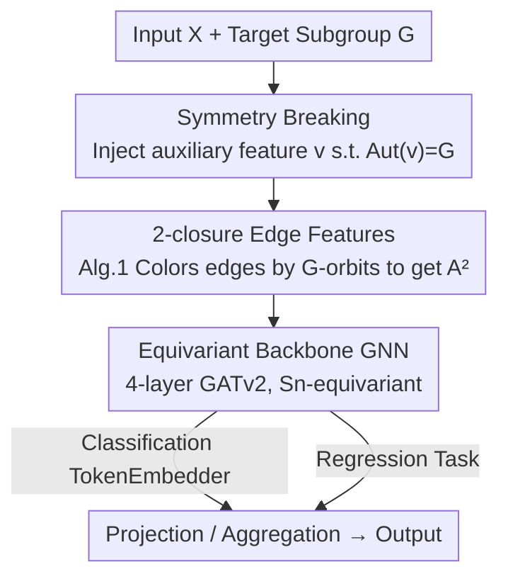

# Any-Subgroup Equivariant Networks via Symmetry Breaking

**Conference**: ICLR 2026  
**OpenReview**: [https://openreview.net/forum?id=jz3d7nvtGz](https://openreview.net/forum?id=jz3d7nvtGz)  
**Code**: https://github.com/amgoel21/perm_equivariance_graph_formulation  
**Area**: Equivariant Networks / Geometric Deep Learning  
**Keywords**: Equivariant Networks, Symmetry Breaking, Permutation Subgroups, 2-closure, Graph Neural Networks

## TL;DR
This paper proposes ASEN (Any-Subgroup Equivariant Network), which utilizes an equivariant backbone network for a large group combined with a "breaking input" whose automorphism group exactly matches the target subgroup. This allows a **single network** to become equivariant to any permutation subgroup by simply switching the auxiliary input. Utilizing the 2-closure for an efficient approximation algorithm, the model outperforms discrete equivariant models and non-equivariant baselines in symmetry selection for graphs and images, as well as in sequential multi-task and transfer learning.

## Background & Motivation

**Background**: Treating symmetry as an inductive bias (i.e., "equivariance") is a classic approach to improving generalization on geometric data—GNNs/DeepSets are equivariant to permutations, CNNs to translations, and atomic potential models to Euclidean groups. Each type of symmetry typically requires specifically designed equivariant layers.

**Limitations of Prior Work**: Existing equivariant architectures suffer from two fundamental rigidities: (I) For every new symmetry, a specific set of equivariant layers must be re-derived and implemented, incurring high engineering and research costs; (II) An equivariant model is usually restricted to **one** specific group. The architectural differences between symmetries prevent knowledge transfer across "symmetry-distinct" domains, which hinders the application of the foundation model paradigm in equivariant learning—it is currently difficult to build a multi-modal foundation model that flexibly handles various symmetric data.

**Key Challenge**: There is a conflict between "constraint strength" and "flexibility" in equivariant architectures. The stricter the constraints (larger symmetry groups, specialized layers), the less the model can express functions that are only equivariant to a specific **subgroup** and non-equivariant to its complement. To gain flexibility, constraints must be relaxed, but there is no unified method to do so.

**Goal**: To create a **single** model that can switch its equivariance among multiple permutation subgroups simply by "tuning an auxiliary input feature," while maintaining theoretically grounded equivariance and expressivity.

**Key Insight**: Instead of designing equivariant layers from scratch for each subgroup $G$, the authors start with a backbone network that is **equivariant to a larger group $\mathcal{G}$** (which is over-constrained). They then **inject a breaking feature $v$** into the input to break the symmetries in $\mathcal{G}\setminus G$, leaving only $G$. A common but often overlooked example is the positional encoding in Transformers: if each component of a sinusoidal positional encoding is distinct, its automorphism group is the trivial group, thereby **completely** breaking permutation symmetry. By giving $v$ a non-trivial automorphism group, one can **preserve a specific part** of the symmetry.

**Core Idea**: Ensure the automorphism group of the breaking input $v$ exactly equals the target subgroup, i.e., $\mathrm{Aut}(v)=G$, making $f_\theta(x)=h_\theta(x,v)$ automatically equivariant to $G$. Since constructing $v$ precisely is computationally infeasible, the **2-closure** is used as an efficient approximation, implemented via a GNN on $K=2$ edge features.

## Method

### Overall Architecture

ASEN addresses the problem of making "a single network equivariant to any subgroup." The pipeline operates as follows: Take a backbone GNN that is **equivariant to the large group $\mathcal{G}=S_n$** (all permutations)—this backbone is over-constrained and can only express functions equivariant to all permutations. Then, feed an additional breaking input $v$ (implemented here as graph positional/edge features), where $v$ is constructed such that its automorphism group is the target subgroup $G$. Consequently, the composite model $f_\theta(x)=h_\theta(x,v)$ becomes equivariant only to $G$. To switch subgroups, one only needs to change $v$ without modifying the backbone network.

How is the breaking input generated? Theoretically, to make $\mathrm{Aut}(v)=G$ hold exactly, one might need hypergraphs of order up to $K\le n$, which is computationally prohibitive. This paper fixes $K=2$ (standard weighted graph edges) and uses **Algorithm 1** to color node pairs according to $G$-orbits: node pairs in the same $G$-orbit are assigned the same edge feature. The resulting edge features $A^{(2)}$ have an automorphism group exactly equal to the **2-closure** $G^{(2)}$ (where $G\le G^{(2)}$, and for many groups $G=G^{(2)}$). The implementation architecture (Figure 2) is simple: an `EdgeEmbedder` calls Algorithm 1 to compute edge orbits and learn their embeddings, a `TokenEmbedder` maps discrete node features to tokens (for classification), followed by four layers of GATv2 message passing, and finally projection/pooling.

### Key Designs

**1. Symmetry Breaking: Contracting "Large Group Equivariance" to "Subgroup Equivariance"**

This design eliminates the need to rebuild architectures for every symmetry (Limitation I): one only needs to provide a new input $v$ without changing the backbone. Formally, let $h_\theta:\mathcal{X}\times\mathcal{V}\to\mathcal{Y}$ be a "lifting" function equivariant to the large group $\mathcal{G}$, satisfying $h_\theta(gx,gv)=g\,h_\theta(x,v),\ \forall g\in\mathcal{G}$. A breaking input $v$ is chosen such that its automorphism group $\mathrm{Aut}(v)=\{g\in\mathcal{G}:gv=v\}=G$. Defining $f_\theta(x)=h_\theta(x,v)$, it is equivariant to $G$ because for any $g\in G$:

$$f_\theta(gx)=h_\theta(gx,v)=h_\theta(gx,gv)=g\,h_\theta(x,v)=g\,f_\theta(x),$$

where the second equality uses $g\in\mathrm{Aut}(v)\Rightarrow gv=v$, and the third uses the $\mathcal{G}$-equivariance of $h_\theta$. Conversely, if $g\in\mathcal{G}\setminus G$ and $h_\theta$ is injective w.r.t. $v$, then $gv\neq v$ causes the equality to fail, meaning $f_\theta$ is **exactly** equivariant to $G$ and not to its complement (Prop. 1). This is cleaner than "approximate/soft equivariance" methods that treat symmetry as a prior, as it provides precise subgroup equivariance.

**2. 2-closure Approximation: Avoiding NP-Hardness with $K=2$ Edge Features**

While Design 1 is elegant, finding an input whose automorphism group is exactly $G$ is computationally difficult. The key engineering breakthrough here is the **fallback to the 2-closure**: the breaking object is constructed as a hypergraph $H=(A^{(1)},\dots,A^{(K)})$, where its automorphism group is $\mathrm{Aut}(H)=\{P\in S_n: P^{\otimes k}A^{(k)}=A^{(k)}\}$. When $K=2$, this simplifies to the standard graph automorphism group $\{P:PA^{(1)}=A^{(1)},\,PA^{(2)}P^\top=A^{(2)}\}$. Algorithm 1 uses SymPy to lift the generators of $G$ to permutations acting on $n^2$ node pairs, forming the diagonal subgroup $\Delta(G)$, and computes its orbits to color edges ($A^{(2)}_{ij}=A^{(2)}_{mn}\iff (i,j)\sim_G(m,n)$). The resulting $\mathrm{Aut}(A^{(2)})$ is exactly the **2-closure** $G^{(2)}$, which satisfies $G\le G^{(2)}$. For "2-closed" groups, $G=G^{(2)}$ holds exactly. The preprocessing cost is only $O(rn^2)$ (where $r$ is the number of generators).

**3. Expressivity and Universality: ASEN is "Strong Enough"**

Correct equivariance is insufficient if expressivity is sacrificed. The paper provides two guarantees. First (Lemma 1), when the backbone is a single-layer MPNN and the edge updates $\psi_e$, node updates $\phi$, and aggregations $\tau$ are injective, $h_\theta$ is **not** equivariant to permutations in $S_n\setminus G$. Second, ASEN can approximate any first-order $G$-equivariant MLP with arbitrary precision (Thm. 1), and **universality is inherited**: if the backbone $f_\theta$ is universal over $\mathcal{G}$-equivariant functions, then $f_\theta(\cdot,H)$ with fixed $H$ is universal over $G$-equivariant functions (Thm. 2). Essentially, the subgroup model is as powerful as the backbone.

**4. Single Backbone Shared Across Tasks: Symmetry as Transferable Structural Knowledge**

Designs 1–3 enable a single network to be equivariant to any subgroup. The paper further employs this as a "prototype for symmetry-aware foundation models." Since the backbone GNN is symmetry-agnostic and only the `EdgeEmbedder`/`TokenEmbedder` are task-specific lightweight modules, the **same backbone weights can be shared across multiple tasks**. During multi-task training, batches are sampled randomly from different tasks; for transfer learning, the model is pre-trained on tasks with different symmetries and then fine-tuned on a new task by lowering the backbone learning rate. Since the `EdgeEmbedder` is learnable, if the specified $G^{(2)}$ is **smaller** than the true target group, the model can **discover** the missing symmetry from the data.

### A Concrete Example

Consider mirror symmetry $G=S_2$ on a 4-node path (Figure 1): for the sequence `[1,2,3,4]`, mirror symmetry requires swapping $1\leftrightarrow4$ and $2\leftrightarrow3$. Algorithm 1 lifts this generator to node pairs and computes orbits, such that in the edge features $A^{(2)}$, pairs $(1,2)$ and $(4,3)$ are assigned the same class. Feeding $(A^{(1)},A^{(2)})$ to an $S_4$-equivariant GNN backbone results in a model equivariant only to mirror $S_2$. To switch to $G=S_{n/2}\times S_{n/2}\times S_2$ (where halves are permutable and overall mirror is allowed), one simply re-runs Algorithm 1—the backbone remains unchanged.

## Key Experimental Results

The experiments address two questions: Q1) Can a single architecture explore different symmetries in a single task? Q2) Can shared structural knowledge be leveraged in multi-task/transfer learning to outperform task-specific models?

### Main Results

**Human Pose Estimation (Human3.6M, P-MPJPE↓)**: A single ASEN reproduces the results for which Huang et al. 2023 required multiple discrete equivariant MLPs. The "Weak Sparse" edge construction often yields the best results, demonstrating the flexibility of a single model carrying multiple symmetry sets.

| Symmetry Group | Fully Connected | Sparse | Weak Sparse |
|----------------|-----------------|--------|-------------|
| $I$ (None)      | 34.71           | **33.39** | 34.75       |
| $S_2$ (Mirror) | 39.48           | 40.52 | 38.80       |
| $S_2^2$        | 43.24           | 42.37 | 40.67       |
| $S_2^6$        | 47.54           | 49.45 | 46.52       |

**Traffic Flow Prediction (METR-LA, MAE↓)**: By encoding different group structures in node positional features, choosing a **smaller suitable subgroup** than full permutation performs better than the $S_n$ baseline (DCRNN, 2.77).

| Model / Group | MAE |
|---------------|-----|
| Fully Connected, $S_{n_1}\cdot S_{n_2}$ | 2.72 |
| Sparse, $S_{n_1}\cdot S_{n_2}$ | **2.69** |
| Fully Connected, $S_{n_1}\cdots S_{n_9}$ | 2.79 |
| Sparse, $S_{n_1}\cdots S_{n_9}$ | 2.77 |
| DCRNN, $S_n$ | 2.77 |

**Pathfinder-64 (Transformer Local Symmetry, Acc↑)**: Sharing positional vectors for pixels within the same $p\times p$ patch essentially preserves permutation symmetry within patches while distinguishing across them. Compared to 1D-PE (0.656) and 2D-PE (0.818), the local symmetry variants $G=(S_4)^{1024}$ (0.824) and $G=(S_9)^{455}$ (0.827) achieve higher accuracy with slightly fewer parameters.

### Ablation Study

**Synthetic Sequence Tasks (Multi-task & Transfer)**: Across tasks like Intersect, Cyclic Sum, and Palindrome (each corresponding to a specific subgroup):

| Configuration | Key Finding |
|---------------|-------------|
| Correct Group vs. Non-equivariant | Equivariant models with the correct symmetry converge faster and achieve lower loss (Fig. 4). |
| Under-specified $(S_{n/2})^2$ vs. True $(S_{n/2})^2\times S_2$ | Edge weights converge to a checkerboard pattern, **automatically discovering** the $S_2$ symmetry from data (Fig. 5). |
| Multi-task $n_{task}=3$ vs. Single-task | Significant gains in Intersect convergence/accuracy in low-data regimes ($r\le1.0$ unit). |
| Incrementing $n_{task}\in\{4,5,6\}$ | More tasks help in low-data regimes, but benefits diminish as training scale increases. |
| Transfer: Pre-train vs. From scratch (0.15 unit) | Pre-trained ASEN generalizes significantly better; pre-training with correct symmetry beats trivial symmetry. |

### Key Findings
- **Symmetry selection is a tunable knob**: Within the same architecture, "choosing the right subgroup" is better than using "maximum symmetry ($S_n$)" or "no symmetry." In traffic prediction, smaller groups won; in pose estimation, weak sparse + mirror groups were optimal.
- **Symmetry acts as transferable knowledge**: Multi-tasking/transfer with shared structural knowledge provides the biggest gains in low-data regimes, though a trade-off exists between training scale and the number of tasks.
- **Learnable edge embeddings can rescue mis-specification**: If the specified group is too small ($G^{(2)}<G$), the model can recover missing symmetries from data. However, if $G^{(2)}$ is significantly larger than $G$, performance degrades.

## Highlights & Insights
- **Unified Perspective on Positional Encoding**: Interpreting Transformer positional encodings as "breaking inputs with trivial automorphism groups" elegantly bridges positional encoding and equivariant design. Preserving partial symmetry simply requires making the automorphism group of $v$ non-trivial.
- **2-closure as a Masterstroke**: Exact symmetry breaking is a combinatorial challenge; the authors use the group-theoretic 2-closure $G^{(2)}$ to reduce this to $O(rn^2)$ orbit calculations, providing a beautiful example of applying abstract algebra tools to deep learning.
- **Decoupling Switchable $v$ from Backbone**: Since symmetry is carried by the auxiliary input and expressivity by the backbone, they are decoupled. This allows for unified foundation models across multiple symmetries, an abstraction that could transfer to non-permutation cases like $O(3)\to O(2)$.

## Limitations & Future Work
- **Global Symmetry Only**: Currently, $v$ acts globally on the input; scenarios requiring **local symmetry** (like molecular subgraphs) are not yet covered.
- **Input-Independent Breaking**: $v$ is fixed for all samples; input-dependent breaking (for graph generation or flexible physical modeling) is not included.
- **Cost of Group Mismatch**: Case where $G<G^{(2)}$ introduces redundant symmetries, and $G^{(2)}\gg G$ leads to failure; robustness to "symmetry mis-specification" requires further study.
- **Focus on $K=2$ / Permutation Subgroups**: High-order hypergraphs ($K>2$) and non-permutation groups (like continuous groups) have theoretical hints but lack extensive empirical validation.

## Related Work & Insights
- **vs. Blum-Smith et al. 2025 / Ashman et al. 2024 / Lim et al. 2024 (Subgroup Equivariance + Auxiliary Input)**: These works also use auxiliary inputs for subgroup equivariance but are limited to **single tasks**. ASEN provides a unified recipe for cross-task reuse and systematizes the 2-closure algorithm and multi-tasking.
- **vs. Smidt et al. 2021 / Lawrence et al. 2024 (Input-Dependent Breaking)**: These focus on input-dependent breaking for single groups. ASEN uses **uniform breaking** across inputs and adapts to different applications via different $v$, aiming for "one model, many symmetries."
- **vs. Approximate/Adaptive Equivariance (Wang 2022 / Huang 2023 / Finzi 2021)**: These soften equivariant constraints into priors or adapt them per task. ASEN follows the "precise subgroup equivariance + 2-closure approximation" route, where equivariance is provable and the approximation is logically analytical.

## Rating
- Novelty: ⭐⭐⭐⭐⭐ Unifying any-subgroup equivariance into a single network via "breaking inputs + 2-closure" is a highly original perspective.
- Experimental Thoroughness: ⭐⭐⭐⭐ Covers graph, image, and sequence settings with multi-task/transfer, though lacks large-scale or high-stakes real-world applications like protein modeling.
- Writing Quality: ⭐⭐⭐⭐⭐ Clear connection between theory (Prop/Lem/Thm), algorithms, and logic; the unified interpretation of positional encoding is well-articulated.
- Value: ⭐⭐⭐⭐ Provides a clean framework and practical algorithm for "flexible, transferable equivariant foundation models."

<!-- RELATED:START -->

## Related Papers

- [\[AAAI 2026\] Faster Certified Symmetry Breaking Using Orders With Auxiliary Variables](../../AAAI2026/others/faster_certified_symmetry_breaking_using_orders_with_auxiliary_variables.md)
- [\[ICML 2026\] Identifiable Equivariant Networks are Layerwise Equivariant](../../ICML2026/others/identifiable_equivariant_networks_are_layerwise_equivariant.md)
- [\[ICLR 2026\] Breaking Gradient Temporal Collinearity for Robust Spiking Neural Networks](breaking_gradient_temporal_collinearity_for_robust_spiking_neural_networks.md)
- [\[ICLR 2026\] A Single Architecture for Representing Invariance Under Any Space Group](a_single_architecture_for_representing_invariance_under_any_space_group.md)
- [\[NeurIPS 2025\] On Universality Classes of Equivariant Networks](../../NeurIPS2025/others/on_universality_classes_of_equivariant_networks.md)

<!-- RELATED:END -->
