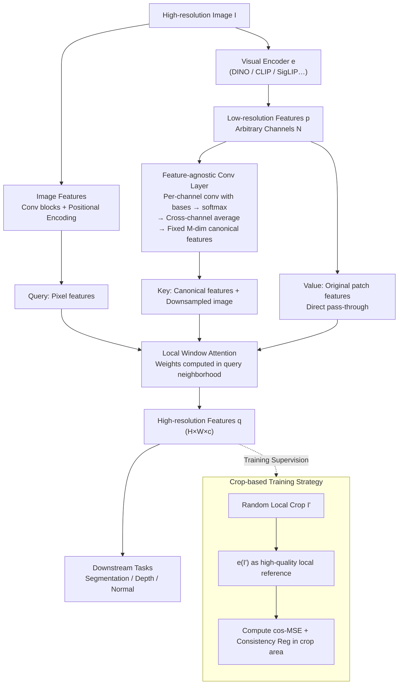

# AnyUp: Universal Feature Upsampling

- **Conference**: ICLR2026
- **arXiv**: [2510.12764](https://arxiv.org/abs/2510.12764)
- **Code**: [GitHub](https://github.com/wimmerth/anyup)
- **Area**: Computer Vision / Feature Upsampling
- **Keywords**: feature upsampling, encoder-agnostic, DINO, CLIP, attention, universal

## TL;DR

AnyUp proposes the first **encoder-agnostic** learnable feature upsampling method. By employing feature-agnostic convolutional layers and a window attention mechanism, it can perform high-quality upsampling for arbitrary visual features across any resolution with only a single training session. It achieves SOTA performance on tasks such as semantic segmentation and depth estimation.

## Background & Motivation

**Background**: The resolution of feature maps output by pretrained visual encoders (DINO, CLIP, SigLIP, etc.) is limited by the number of Transformer tokens, typically $h \times w \ll H \times W$. Recent methods like FeatUp, LoftUp, and JAFAR have proposed learnable upsamplers to obtain high-resolution features.

**Limitations of Prior Work**: Existing learnable upsamplers **lack generalization** across encoders—an upsampler trained for DINOv2 cannot be directly applied to CLIP or SigLIP, necessitating retraining for each new encoder. For large-scale vision models (e.g., DINOv2-G), the computational cost of retraining is extremely high or even prohibitive.

**Key Challenge**: The layers in upsampling networks that process low-resolution features are coupled with the dimensions and distributions of specific encoders, preventing migration to new feature types at inference time.

**Goal**: Design a **"train once, use anywhere"** feature upsampler capable of upsampling features of arbitrary dimensions from any encoder across any resolution.

**Key Insight**: The core bottleneck of existing attention-based upsamplers lies in the dimensional coupling of feature processing layers. Designing a processing layer invariant to the number of input channels would enable encoder-agnostic capability.

**Core Idea**: Design a **feature-agnostic convolutional layer** where each input channel is independently convolved with a set of learned filter bases. After softmax normalization, the results are averaged across all channels, making the output dimension independent of the input channel count.

## Method

### Overall Architecture

AnyUp aims to solve the issue of having to retrain upsamplers when switching visual encoders; thus, the entire network is designed to be independent of specific encoder feature dimensions. It follows the skeleton of attention-based upsampling (inherited from JAFAR): given a high-resolution image $I$ and low-resolution features $p = e(I)$, a Feature-agnostic convolutional layer first compresses $p$ (with arbitrary channels) into "canonical features" of fixed dimension. These are then fed into local window attention along with image features to output high-resolution features $q \in \mathbb{R}^{H \times W \times c}$ that maintain the original semantics. Queries in the attention mechanism are derived from image pixel features, keys are computed from canonical features and downsampled images, while values are directly mapped from the original raw patch features. The upsampler only calculates "weights" and does not "generate feature values," which is the key to cross-encoder reuse. The training phase avoids expensive full-image high-resolution features, using randomly cropped local images as reference signals instead.

### Key Designs

**1. Feature-agnostic Convolutional Layer: Decoupling encoders via channel-invariant processing**

The bottleneck of previous upsamplers was that the layers processing low-resolution features had fixed channel dimensions (e.g., 384 for DINOv2 vs 768 for CLIP). AnyUp learns a set of $M$ filter bases $\{\psi_j \in \mathbb{R}^{k \times k}\}_{j=1}^M$. **Each input channel $p_i$ is convolved independently** with each base, normalized via softmax across the $M$ bases, and then averaged across all $N$ input channels:

$$f_j = \frac{1}{N} \sum_{i=1}^{N} \frac{\exp(p_i * \psi_j)}{\sum_{j'=1}^{M} \exp(p_i * \psi_{j'})}$$

The output is $M$-dimensional, completely independent of the input channel count $N$. This allows the same weights to process features from any encoder. The reason "averaging and discarding channel identity" works is that attention upsampling primarily requires local structural changes (borders, textures), while specific feature values are preserved through the attention values. Per-channel convolution plus cross-channel averaging retains structural information while discarding encoder-specific values.

**2. Local Window Attention: Restoring upsampling as a local operation**

Analyzing the global attention in JAFAR revealed that pixel queries often attend to irrelevant distant regions, introducing noise. Upsampling is inherently local—high-resolution features of a pixel should be determined by coarse features of neighboring patches. AnyUp restricts attention to a window around the query point, which simplifies the optimization objective and reduces the computational overhead of global attention.

**3. Crop-based Training Strategy: Using local crops as reference to avoid full high-resolution features**

Obtaining supervision signals is costly. Instead of computing expensive full-image high-resolution features, AnyUp takes a high-resolution image $I$, randomly crops a local area $I'$, and computes $p = e(I)$ and $\hat{q} = e(I')$. After upsampling $p$, the loss is computed only in the region corresponding to $I'$ against $\hat{q}$. Since $\hat{q}$ is extracted directly from the small cropped image, it serves as a natural high-quality reference. This is more aligned with true high-resolution distributions than JAFAR's low-resolution training and lighter than LoftUp's reliance on segmentation masks.

### Loss & Training

The primary loss is a combination of cosine-MSE loss and consistency regularization:

$$L_{\text{cos-mse}}(q', \hat{q}) = 1 - \cos(q', \hat{q}) + L^2(q', \hat{q})$$

Additional components include self-consistency regularization (enhancing robustness) and input-consistency regularization (computing $L_{\text{cos-mse}}$ between input features and downsampled output features to prevent feature space shift).

## Key Experimental Results

### Main Results: Semantic Segmentation Linear Probing (DINOv2 ViT-S, 448×448 → 14× Upsampling)

| Method | COCO mIoU↑ | COCO Acc↑ | PASCAL mIoU↑ | ADE20k mIoU↑ |
|------|-----------|----------|-------------|-------------|
| Bilinear | 59.48 | 79.32 | 81.43 | 40.54 |
| FeatUp | — | — | 83.37 | — |
| JAFAR | 61.82 | 81.07 | 84.36 | — |
| LoftUp | — | — | — | 42.02 |
| **Ours** | **62.16** | **81.37** | **—** | **42.43** |

> AnyUp achieves SOTA on most datasets despite **training only once** for all encoders—competitors require **separate training per encoder**.

### Ablation Study: Impact of Design Choices (COCO Semantic Segmentation mIoU)

| Configuration | mIoU↑ |
|------|------|
| Global Attention (JAFAR style) | 61.82 |
| + Feature-agnostic Layer | 61.95 |
| + Window Attention | 62.01 |
| + Crop Training + Consistency Reg | **62.16** |

**Depth/Normal Estimation** (NYUv2):

| Method | Normal RMSE↓ | Depth RMSE(abs)↓ | Depth $\delta_1$↑ |
|------|-------------|-----------------|----------|
| Bilinear | 32.70 | 0.4925 | 0.8081 |
| LoftUp | 33.94 | — | 0.9166 |
| **Ours** | **31.17** | **0.4755** | **0.8216** |

### Key Findings

1. **Encoder Generalization**: Trained on DINOv2, AnyUp maintains high-quality upsampling when applied directly to CLIP, SigLIP, or MAE, whereas FeatUp/JAFAR/LoftUp require retraining.
2. **Feature Space Preservation**: Input-consistency regularization effectively prevents feature distribution drift (PCA visualization shows superior semantic consistency).
3. **Window Attention superiority**: Eliminates long-range anomalous attention patterns while improving efficiency.

## Highlights & Insights

- The concept of "train once, universal for all encoders" provides significant practical value, lowering the barrier for using feature upsampling.
- The Feature-agnostic layer design is elegant: achieving dimension independence through simple per-channel convolution, softmax, and averaging.
- The crop-based training strategy balances quality and efficiency by removing the need for high-resolution reference features or external segmentation models.
- Achieves the comprehensive combination of "any encoder × any resolution × any task" for the first time in feature upsampling.

## Limitations & Future Work

- The Feature-agnostic layer loses inter-channel correlation information through the averaging operation, which might limit performance on tasks requiring precise channel interactions.
- Window size in the attention mechanism requires tuning; sizes that are too small may lose necessary non-local information.
- Currently validated primarily on ViT-style encoders; applicability to CNN encoders requires further testing.
- Training still requires ImageNet-scale data and features from multiple encoders, incurring non-zero initial costs.

## Related Work & Insights

- **FeatUp** (Fu et al., 2024): Upsampling training based on multi-view equivariance; however, it is encoder-bound and supports only fixed scales.
- **JAFAR** (Couairon et al., 2025): Attention-based upsampling supporting arbitrary resolutions; AnyUp builds on this by adding encoder-agnosticism.
- **LoftUp** (Huang et al., 2025): Uses stacked attention and segmentation mask training; high quality but expensive to train and requires segmentation models.
- **Insight**: The "independent channel processing + aggregation" paradigm of the Feature-agnostic layer could be extended to other multimodal feature alignment scenarios.

## Rating

⭐⭐⭐⭐ (4/5)

- **Novelty**: ⭐⭐⭐⭐ — Encoder-agnostic upsampling is a new direction; the feature-agnostic layer is simple and effective.
- **Experiments**: ⭐⭐⭐⭐ — Covers segmentation, depth, normals, multiple resolutions, and multiple encoders with thorough ablation.
- **Value**: ⭐⭐⭐⭐⭐ — Directly addresses the engineering pain point of "retraining for new encoders" with plug-and-play weights.
- **Writing Quality**: ⭐⭐⭐⭐ — Clear diagrams and well-organized comparison tables.

<!-- RELATED:START -->

## Related Papers

- [\[CVPR 2026\] NAF: Zero-Shot Feature Upsampling via Neighborhood Attention Filtering](../../CVPR2026/others/naf_zero-shot_feature_upsampling_via_neighborhood_attention_filtering.md)
- [\[CVPR 2026\] Upsample Anything: A Simple and Hard to Beat Baseline for Feature Upsampling](../../CVPR2026/others/upsample_anything_a_simple_and_hard_to_beat_baseline_for_feature_upsampling.md)
- [\[ICLR 2026\] It's All Just Vectorization: einx, a Universal Notation for Tensor Operations](its_all_just_vectorization_einx_a_universal_notation_for_tensor_operations.md)
- [\[ICLR 2026\] Exposing Mixture and Annotating Confusion for Active Universal Test-Time Adaptation](exposing_mixture_and_annotating_confusion_for_active_universal_test-time_adaptat.md)
- [\[CVPR 2026\] UniMERNet: A Universal Network for Real-World Mathematical Expression Recognition](../../CVPR2026/others/unimernet_a_universal_network_for_real-world_mathematical_expression_recognition.md)

<!-- RELATED:END -->
