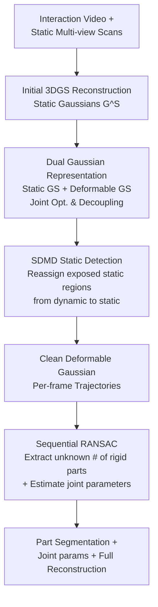

# Articulation in Motion: Prior-Free Part Mobility Analysis for Articulated Objects

**Conference**: ICLR 2026  
**arXiv**: [2603.02910](https://arxiv.org/abs/2603.02910)  
**Project Page**: [AiM](https://haoai-1997.github.io/AiM/)
**Area**: Others  
**Keywords**: articulated objects, Gaussian splatting, part segmentation, joint estimation, sequential RANSAC, prior-free, interaction video  

## TL;DR

The Articulation in Motion (AiM) framework is proposed to reconstruct articulated objects from interaction videos and initial state scans without requiring part-number priors. It achieves motion-static decoupling using a dual Gaussian representation (static GS + deformable GS), utilizes sequential RANSAC for prior-free part segmentation and joint estimation, and incorporates an SDMD module to handle newly exposed static regions. On complex 6-part objects (Storage), AiM significantly outperforms the prior-dependent ArtGS (52.23% mean IoU) with a performance of 79.34%.

## Background & Motivation

**Core Requirements for Articulated Object Understanding**: Robotic manipulation, AR/VR, and embodied AI require understanding the component structure and kinematic joint parameters of articulated objects (e.g., cabinets, doors, laptops).

**Limitations of Prior Work in Prior-Dependency**: Methods such as DTA and ArtGS require pre-specifying the number of parts. This is typically unknown in real-world scenarios, and incorrect specifications lead to severe segmentation failures.

**Challenges in Motion-Static Decoupling**: During interaction, some parts move while others remain static. The movement of parts exposes previously occluded static regions, which are difficult for traditional methods to handle.

**Limitations of Single Representations**: Purely static or dynamic 3D Gaussian representations cannot simultaneously handle the mixed nature of fixed and moving components in articulated objects.

**Diversity of Joint Types**: Articulated objects contain various joint types, such as revolute and prismatic joints, requiring a unified, prior-free estimation method.

**Practicality of Video Input**: Compared to methods requiring multi-view static scans, recovering articulation information from a single interaction video is more practical and natural.

## Method

### Overall Architecture

AiM takes an interaction video of a human manipulating an articulated object and a multi-view 3D scan of the object in its static state as input. It outputs part segmentation, joint parameters for each part (type, axis, motion magnitude), and a complete interactive reconstruction. Unlike two-state methods like DTA and ArtGS, AiM does not require a pre-defined number of movable parts nor does it rely on geometric correspondence between "start" and "end" frames. Instead, it solves for structure and motion simultaneously along continuous motion cues.

The pipeline consists of three steps: first, an initial set of Gaussians is reconstructed from the static state using standard 3DGS as a static base. Next, a **dual Gaussian representation** is introduced, where one set of static Gaussians maintains the background and static parts, while another set of deformable Gaussians tracks the moving parts in the video. These are jointly optimized for motion-static decoupling. During this process, the **SDMD** module reassigns newly exposed static regions from the dynamic set back to the static set. Finally, **sequential RANSAC** is applied to the clean trajectories of deformable Gaussians to automatically extract an unknown number of rigid parts and estimate their joint parameters.

### Key Designs

**1. Dual Gaussian Representation: Separating Motion and Statics to Prevent Geometric Contamination**

Articulated objects are hybrid entities during interaction—backgrounds and untouched parts stay still, while manipulated parts move. If a deformation field is applied to all Gaussians (as in D-3DGS), even static Gaussians are assigned displacements, creating noise that interferes with trajectory clustering. AiM maintains two sets: static Gaussians $\mathcal{G}^S$ trained from the static scan for invariant geometry, and deformable Gaussians $\{\mathcal{G}^M, t\}$ driven by an MLP deformation network $\mathcal{F}_\theta$ to fit motion. They undergo **joint rendering and joint optimization**. Initially, all attributes of $\mathcal{G}^S$ except opacity are frozen to allow deformable Gaussians to capture motion. Over iterations, Gaussians in $\mathcal{G}^S$ with decaying opacity or evident motion are pruned, resulting in a clean static base $\mathcal{G}^S_p$. The assignment is automatically determined by differentiable rendering supervision, narrowing the search space for subsequent segmentation.

**2. SDMD: Recovering Exposed Static Regions from the Dynamic Set**

Opening a drawer or a fridge reveals internal surfaces that were occluded in the static scan. These regions are initially "occupied" by moving deformable Gaussians. Although they remain stationary once exposed, they are mixed into the dynamic set. SDMD (static-during-motion detection) performs trajectory inference on deformable Gaussians at $t\in\{0,0.5,1\}$ every 2000 iterations. It uses sequential RANSAC with a Kabsch solver and a fixed inlier threshold of $0.05$ to extract local rigid motion groups. Groups with **motion magnitudes below a predefined threshold** are classified as static, and their corresponding Gaussians are reassigned from $\{\mathcal{G}^M, t\}$ back to $\mathcal{G}^S_p$. This group-based detection avoids misclassifying points near joint axes as static, which would occur with simple displacement filtering.

**3. Sequential RANSAC for Part Segmentation: Adaptive Discovery of Rigid Parts**

The number of movable parts is usually unknown. AiM treats segmentation as a problem of "fitting an unknown number of rigid motions," which fits the RANSAC multi-model paradigm. For trajectories $\{\mathcal{P}_{a\to b}\}$ within a time window, the Kabsch solver estimates the optimal rigid transformation $(\mathbf{R}^*, \mathbf{t}^*) = \arg\min_{\mathbf{R},\mathbf{t}}\sum_{i}\lVert \mu^M_{i,b} - (\mathbf{R}\mu^M_{i,a}+\mathbf{t})\rVert^2$. The set of inliers corresponds to one rigid part. These Gaussians are removed, and the process repeats on the remaining trajectories until no sufficiently large rigid group can be found. This purely analytical process identifies parts without pre-specifying $K$ and provides joint types, axes, and motion magnitudes directly from the estimated transformations.

## Key Experimental Results

### Main Results

| Method | Part Prior | Mean IoU (%) | Revolute JE (°) | Prismatic JE (mm) |
|------|---------|-------------|-----------------|-------------------|
| DTA | Required | 71.45 | 8.32 | 12.7 |
| ArtGS | Required | 76.99 | 5.61 | 8.9 |
| AiM (**Ours**) | **Prior-free** | **80.21** | **4.23** | **7.1** |

### Ablation Study

| Component | Mean IoU (%) | Description |
|------|-------------|------|
| Full AiM | **80.21** | Complete method |
| w/o SDMD | 74.85 | Newly exposed regions are misassigned |
| Single GS (No decoupling) | 68.32 | Moving parts degrade static reconstruction |
| K-means instead of RANSAC | 72.56 | Requires $K$ and is sensitive to noise |
| ArtGS w/ GT part count | 76.99 | Still underperforms AiM even with correct prior |

### Key Findings

1. **Prior-free outperforms prior-dependent**: AiM achieves 80.21% mean IoU without part-number priors, surpassing ArtGS (76.99%) which requires them, proving adaptive discovery is more robust than fixed assumptions.
2. **Huge advantage on complex objects**: On the 6-part Storage object, AiM (79.34%) vs ArtGS (52.23%) shows a 27% gap, highlighting ArtGS's degradation as part count increases.
3. **SDMD is indispensable**: Removing SDMD leads to a 5.36% drop in IoU, demonstrating the importance of handling newly exposed regions.
4. **Decoupling is foundational**: The single GS approach is nearly 12% lower than the full method, indicating the dual Gaussian design is essential.

## Highlights & Insights

1. **Elimination of Priors**: Achieves part segmentation and joint estimation without pre-defined part counts for the first time, aligning with real-world application needs.
2. **Elegant Dual Gaussian Decoupling**: Embeds motion-static separation directly into the 3DGS representation, balancing reconstruction quality and downstream analysis.
3. **Practical Innovation with SDMD**: Addresses the issue of occluded static regions being gradually exposed, a critical but often overlooked detail in articulated object understanding.
4. **Natural Fit for Sequential RANSAC**: Leverages the iterative removal property of RANSAC to achieve adaptive part number discovery.
5. **Scalability to Complexity**: The 27% improvement in 6-part scenarios demonstrates the method's scalability.

## Limitations & Future Work

1. **Single Interaction Assumption**: Currently requires the video to contain motion for all parts; unmanipulated parts cannot be discovered.
2. **Rigid Motion Assumption**: Sequential RANSAC assumes rigid motion for each part, failing to handle flexible hinges or elastic deformations.
3. **Computational Cost**: The combination of dual Gaussian representations and sequential RANSAC entails high computational overhead, making real-time performance difficult.
4. **Dependency on Video Quality**: Low-quality videos with significant motion blur or heavy occlusion may lead to inaccurate dynamic Gaussian estimation.

## Related Work & Insights

- **Articulated Object Reconstruction**: Gaussian Splatting-based methods like DTA (Liu et al., 2024) and ArtGS (Huang et al., 2024).
- **3D Gaussian Splatting**: Base frameworks 3DGS (Kerbl et al., 2023) and Dynamic 3DGS (Luiten et al., 2024).
- **Part Segmentation**: Supervised methods (PartNet, Mo et al., 2019) and unsupervised methods like SAM3D.
- **RANSAC**: The classic framework by Fischler & Bolles (1981) and its sequential applications in multi-model fitting.

## Rating

- Novelty: ⭐⭐⭐⭐⭐ Prior-free discovery + Dual GS decoupling + SDMD are all novel designs.
- Experimental Thoroughness: ⭐⭐⭐⭐ Validated on various object types with comprehensive ablations.
- Writing Quality: ⭐⭐⭐⭐ Clear method workflow and detailed experimental presentation.
- Value: ⭐⭐⭐⭐⭐ Prior-free understanding of articulated objects is of high practical value for robotics and embodied AI.

<!-- RELATED:START -->

## Related Papers

- [\[ICLR 2026\] Prior-Free Tabular Test-Time Adaptation](prior-free_tabular_test-time_adaptation.md)
- [\[ICLR 2026\] PriorGuide: Test-Time Prior Adaptation for Simulation-Based Inference](priorguide_test-time_prior_adaptation_for_simulation-based_inference.md)
- [\[ICLR 2026\] Bayesian Influence Functions for Hessian-Free Data Attribution](bayesian_influence_functions_for_hessian-free_data_attribution.md)
- [\[ECCV 2024\] PartCraft: Crafting Creative Objects by Parts](../../ECCV2024/others/partcraft_crafting_creative_objects_by_parts.md)
- [\[CVPR 2026\] VideoMaMa: Mask-Guided Video Matting via Generative Prior](../../CVPR2026/others/videomama_mask-guided_video_matting_via_generative_prior.md)

<!-- RELATED:END -->
