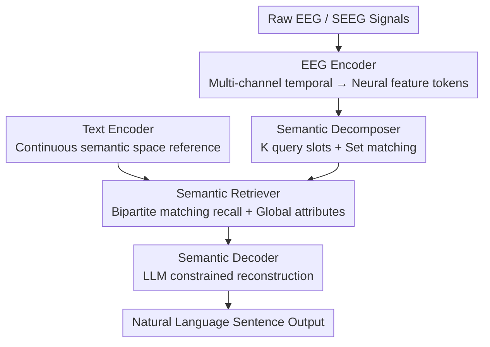

# Assembling the Mind's Mosaic: Towards EEG Semantic Intent Decoding

**Conference**: ICLR2026  
**OpenReview**: [https://openreview.net/forum?id=8OgJ2uhiu8](https://openreview.net/forum?id=8OgJ2uhiu8)  
**Code**: TBD  
**Area**: Brain-Computer Interface / EEG Decoding / Neuroscience Applications  
**Keywords**: EEG Semantic Decoding, Brain-Computer Interface, Set Matching, Continuous Semantic Space, LLM Reconstruction

## TL;DR
This paper proposes SID, a semantic intent decoding framework that redefines "brain signal-to-language" as a process of first deconstructing EEG/SEEG into a set of unordered semantic units, then retrieving them in a continuous semantic space, and finally reconstructing sentences using an LLM. Its implementation, BrainMosaic, significantly outperforms classification-based and end-to-end generative baselines on multilingual EEG and clinical SEEG data across concept-level and sentence-level metrics.

## Background & Motivation
**Background**: Brain-Computer Interfaces (BCIs) aim to assist patients with aphasia or locked-in syndrome by bypassing damaged vocal/writing pathways to directly translate brain activity into language. Existing approaches generally follow two routes: (1) **Speech Decoding**, which reconstructs spoken or imagined speech from motor-related cortices, but only covers a small motor portion of the brain's language network and relies on phoneme-level reconstruction, leading to poor cross-lingual capability; (2) **Concept Decoding**, which directly extracts the intended "meaning" from distributed neural activity.

**Limitations of Prior Work**: Concept decoding itself is split into two suboptimal practices. The first treats it as **fixed-category classification**, defining a set of concept/topic labels. While simple, it is extremely rigid, as discrete labels cannot capture the continuous and overlapping nature of meaning, often failing to align with real communication intent. The second maps neural signals directly into the latent space of Large Language Models (LLMs) for **end-to-end generation**. While expressive, this requires massive paired "neural-language" data and acts as a black box, lacking interpretability, scientific transparency, and controllable output.

**Key Challenge**: There exists a trade-off between interpretability and expressiveness—classification is interpretable but weak in expression, while end-to-end generation is expressive but uninterpretable. The root problem is that neither representation captures how "meaning" is actually organized in the brain: meaning is neither a single discrete label nor an indivisible latent vector.

**Goal**: To find a concept decoding representation that is both interpretable and possesses open-vocabulary expressiveness, and to implement it as a system capable of decoding coherent sentences from EEG.

**Key Insight**: The authors define "Semantic Intent" as a **flexible set of core semantic units**. For example, "I eat apples every day" can be represented as the set $\{I, eat, apple, every\ day\}$. This perspective aligns with three pieces of evidence from linguistics and cognitive neuroscience: meaning is compositional (Compositionality), the semantic space is continuous and expandable (Continuity & Expandability), and reconstruction must be faithful (Fidelity).

**Core Idea**: Replace "fixed classification" or "unconstrained generation" with a tripartite pipeline—deconstructing brain signals into a set of unordered semantic units, retrieving in a continuous semantic space, and finally performing constrained sentence reconstruction via an LLM—to achieve both transparency and open-vocabulary expression.

## Method

### Overall Architecture
BrainMosaic is the specific implementation of the SID framework, designed to transform EEG/SEEG signals into natural language that is faithful to the original intent and grammatically correct. Following the three SID principles, it integrates five components into a three-stage pipeline: the **EEG Encoder** encodes multi-channel temporal signals into neural feature tokens; the **Semantic Decomposer** uses learnable queries to produce $K$ candidate slots, each representing a potential semantic unit; the **Text Encoder** provides a reference continuous semantic space (unit-level embeddings + sentence-level targets); the **Semantic Retriever** aligns each slot to real semantic units in that space via bipartite matching while predicting global intent attributes; and the **Semantic Decoder** organizes the retrieved units into a structured prompt for the LLM to reconstruct the sentence. The entire network is trained end-to-end with a composite loss; during inference, information flows from the EEG through the five components to output coherent and semantically faithful sentences.

### Key Designs

**1. Semantic Decomposer: Deconstructing brain signals into unordered, variable-length semantic units via set matching**

Addressing the pain point that "fixed categories cannot hold meaning and word order should not be forced," this paper models intent as an unordered, non-repeating, variable-size set $S=\{u_1,\dots,u_n\}$ based on the principle of compositionality (Principle 1). Psycholinguistic evidence supports this: reading is not strictly serial, as readers prioritize semantic gist over exact word order, and working memory only maintains limited "chunks." Thus, BrainMosaic decodes EEG features into a fixed $K$ query slots (where $K$ is the upper bound of semantic units per sentence in the dataset), with the actual number of active units $1\le n\le K$ varying freely. Borrowing from DETR's set-based object detection, it uses **bipartite (Hungarian) matching** to handle variable-length, unordered targets: during training, each ground-truth unit is uniquely matched to at most one predicted slot, and unmatched slots are assigned a special "no-object" class. The optimal matching and training loss are defined as:

$$\hat{\sigma}=\arg\min_{\sigma\in S_K}\sum_{i=1}^{K}\mathcal{L}_{\text{match}}(y_i,\hat{y}_{\sigma(i)}),\qquad \mathcal{L}_{\text{Hungarian}}(y,\hat{y})=\sum_{i=1}^{K}\mathcal{L}_{\text{match}}(y_i,\hat{y}_{\hat{\sigma}(i)})$$

This ensures stable supervision regardless of the order and quantity of semantic units, achieving permutation invariance and bounded cardinality—features that neither classification (single label) nor sequential modeling (enforced order) can provide.

**2. Semantic Retriever: Alignment and recall in continuous semantic space for open-vocabulary generalization**

To address the limitation that "discrete labels cannot express continuous, expandable semantics," the principle of continuity (Principle 2) is applied by decoding semantic units into an open continuous space $V\subset\mathbb{R}^d$. This ensures proximal concepts are close in space, supporting similarity-based retrieval and smooth generalization to new concepts. The space is instantiated using the embedding space of a large-scale pre-trained LLM (default: doubao-embedding-large). The retriever calculates a matching loss $\mathcal{L}_{\text{match}}$ for each slot within the bipartite matching framework, consisting of a **semantic alignment term** to pull predicted embeddings $\hat{y}$ toward target word embeddings $E(u)$ via cosine similarity, and a **slot activity classification term** to distinguish active units from "no-object" labels:

$$\mathcal{L}_{\text{match}}\big(E(u),\hat{y},t,\hat{p}\big)=t\big(1-\text{sim}(E(u),\hat{y})\big)+\lambda_{\text{cls}}\big(-t\log\hat{p}-(1-t)\log(1-\hat{p})\big)$$

where $t\in\{0,1\}$ is the matching indicator and $\hat{p}$ is the predicted probability of activity. Simultaneously, the retriever predicts a global embedding $\hat{s}$ to align with the ground-truth sentence embedding $E(s)$ and uses multiple classification heads to predict global attributes (e.g., tone, subjectivity). The global loss $\mathcal{L}_{\text{global}}$ integrates token-level and sentence-level high-level attributes:

$$\mathcal{L}_{\text{global}}(E(s),\hat{s},Z,\hat{Z})=\big(1-\text{sim}(E(s),\hat{s})\big)+\lambda_{\text{attr}}\sum_{c=1}^{C}\text{CE}(z^{(c)},\hat{z}^{(c)})$$

The total retriever loss is $\mathcal{L}_{\text{retriever}}=\mathcal{L}_{\text{Hungarian}}+\lambda_{\text{global}}\cdot\mathcal{L}_{\text{global}}$. Because retrieval occurs in a continuous space, the model can recall semantically similar substitutes even when an exact match is missing, providing scalability that discrete classification lacks.

**3. Semantic Decoder: Constraints on LLM for faithful reconstruction of recalled units**

Following the principle of faithfulness (Principle 3), the decoder ensures outputs are semantically grounded (constrained by decoded units) and grammatically fluent. The retriever searches the entire semantic space for each slot, returning candidate units with probabilities. These are gathered into a final recall set $S_{\text{retrieved}}=\{u_{1'},\dots,u_{m'}\}$ and combined with global sentence attributes $Z$ into a structured prompt for the LLM $G$:

$$\text{Prompt}=P(S_{\text{retrieved}},Z),\qquad T=G(\text{Prompt})$$

The LLM acts as an "inverse semantic deconstructor," stitching discrete units into a fluent sentence. Because the generation is anchored by decoded semantic units, the output is more robust to recall noise and more interpretable than unconstrained generation.

### Loss & Training
The entire network is optimized end-to-end. On the decomposer/retriever side, deterministic bipartite matching provides stable supervision through $\mathcal{L}_{\text{Hungarian}}$ and $\mathcal{L}_{\text{global}}$. The text encoder provides the reference semantic space where neural features, semantic slots, and linguistic targets are jointly shaped. The LLM decoding stage operates during inference (default: GPT-4o-mini), generating 5 candidate sentences per sample and reporting the average SRS. All experiments utilize in-subject evaluation.

## Key Experimental Results

### Main Results
Evaluation was conducted on three public multilingual EEG datasets (Chisco - Daily Chinese; ChineseEEG-2 - Chinese Literature; ZuCo - English reading) and one private clinical SEEG dataset. Since n-gram metrics like BLEU/ROUGE are unsuitable for continuous open-vocabulary spaces, three embedding-based metrics were designed: **UMA** (Unit Matching Accuracy, hard concept accuracy where similarity must exceed threshold $\tau$), **MUS** (Mean Unit Similarity, soft alignment of unit similarity), and **SRS** (Sentence Reconstruction Similarity, cosine similarity between generated and reference sentence embeddings), alongside BERTScore-F1.

| Dataset | Metric | BrainMosaic | Strongest Baseline | Description |
|--------|------|------------|----------|------|
| Clinical | UMA | **0.6596** | 0.1786 (Seq-Decode) | Concept-level accuracy (~3.7×) |
| Clinical | MUS | **0.8124** | 0.6739 (Multi-Cls) | Concept-level soft alignment |
| Clinical | SRS | **0.6651** | 0.5976 (Cls-Align) | Sentence-level faithfulness |
| Chisco | UMA | **0.5617** | 0.0301 (Seq-Decode) | ~18× improvement |
| Chisco | SRS | **0.6206** | 0.5439 (Seq-Decode) | — |
| ZuCoSR | UMA | **0.7506** | 0.0451 (Seq-Decode) | English reading (~16×) |
| ZuCoSR | SRS | **0.6982** | 0.5211 (Neuro2Semantic) | — |

BrainMosaic leads in all four metrics across all datasets, with two-sided t-tests against the strongest baselines yielding $p\le 0.001$. The improvement in concept-level UMA is the most significant—baselines like Multi-Cls often show UMA near-random (0.01~0.04), highlighting the importance of modeling intent as an unordered set.

### Ablation Study

| Configuration | UMA (Clinical) | MUS (Clinical) | SRS (Clinical) | Description |
|------|---------------|----------------|----------------|------|
| Full Model | 0.6596 | 0.8124 | 0.6651 | Complete model |
| w/o Set | 0.0792 | 0.7052 | 0.5721 | Without Deconstructor: Direct sentence alignment; UMA collapses |
| w/o ContSpace | 0.0137 | 0.6393 | 0.4604 | Without Continuous Space: Degenerates to multi-label classification; worst performance |
| w/o LLM | 0.6596 | 0.8124 | 0.5456 | Without LLM Reconstruction: Units remain but SRS drops significantly |

### Key Findings
- **Continuous Space is the Foundation**: Removing the continuous semantic space (w/o ContSpace) causes the model to degenerate into a multi-label classifier, with UMA dropping from 0.66 to 0.01. This is the most significant drop, proving that retrieval in continuous space is the source of open-vocabulary expressiveness.
- **Set Deconstruction Drives Concept Accuracy**: Removing the set decomposer (w/o Set) drops UMA from 0.66 to 0.08. When aligned only at the sentence level, entangled meanings lack the structured organization of semantic units.
- **LLM Primarily Manages Sentence Faithfulness**: Without LLM (w/o LLM), semantic units (UMA/MUS) remain unchanged while SRS drops, indicating that the decoded units are informative but fragmented; the LLM's role is to sew these fragments into a coherent sentence.
- **Open-Vocabulary and Scalability**: Expanding the retrieval vocabulary with 30,000 unseen high-frequency words resulted in only a slight decrease in UMA, while MUS/SRS remained stable or increased (recalling semantic neighbors when exact matches are missing).

## Highlights & Insights
- **Redefining "Meaning" as an Unordered Set and implementing via DETR**: This is the most impactful cross-domain application—using the bipartite matching from object detection (where order and quantity of objects are flexible) to align perfectly with the "order-flexible" nature of semantic intent decoding from brain signals.
- **Interpretability via Transparent Intermediate Units**: Unlike end-to-end black boxes, the semantic unit sets are readable, verifiable, and controllable, resolving the trade-off between interpretability and expressiveness.
- **Using LLM Embedding Spaces as Decoding Targets**: Leveraging pre-trained LLM manifolds directly avoids the need to build a custom space and naturally supports similarity-based retrieval for open vocabularies.

## Limitations & Future Work
- **In-subject Evaluation**: All experiments were conducted within-subject; cross-subject generalization (crucial for clinical settings) has not been fully tested.
- **Single Clinical SEEG Subject**: The private invasive data consists of only one participant and 515 sentences, limiting statistical representativeness.
- **Boundaries of "Set Approximation" for Complex Sentences**: Treating sentences as sets of units works for short sentences, but maintaining precise grammatical relations in long, complex sentences still relies heavily on the LLM, posing a risk of drift.
- **Dependency on External LLMs**: Both the space and reconstruction are tied to specific LLMs (doubao for embeddings, GPT-4o-mini for generation), introducing external dependencies.

## Related Work & Insights
- **vs. Fixed Classification (Cls-Align / Multi-Cls)**: These assign a single predefined topic or predict top-k discrete labels. This paper replaces them with a continuous space retrieval of unordered units. Discrete labels cannot capture overlapping meanings, and this work's UMA is orders of magnitude higher.
- **vs. End-to-End Generation (Neuro2Semantic)**: These map EEG directly into LLM latent spaces for unconstrained generation. BrainMosaic first decodes transparent semantic units. The advantage is interpretability and robustness; the disadvantage is increased pipeline complexity.
- **vs. Sequential Decoding (Seq-Decode)**: These use LSTMs to predict ordered sequences. Forced word ordering actually constrains the semantic intent expressible by EEG, leading to lower UMA/MUS and less coherent output.

## Rating
- Novelty: ⭐⭐⭐⭐⭐ Reframes brain decoding as "unordered set + continuous retrieval + constrained reconstruction"—a paradigm shift.
- Experimental Thoroughness: ⭐⭐⭐⭐ Covers multilingual EEG and clinical SEEG with specifically designed metrics and robust ablations; penalized slightly for in-subject constraints.
- Writing Quality: ⭐⭐⭐⭐⭐ Clear correspondence between principles, stages, and components.
- Value: ⭐⭐⭐⭐ Provides a practical paradigm for interpretable, open-vocabulary BCI language decoding with high clinical relevance.

<!-- RELATED:START -->

## Related Papers

- [\[ICLR 2026\] Learning Structure-Semantic Evolution Trajectories for Graph Domain Adaptation](learning_structure-semantic_evolution_trajectories_for_graph_domain_adaptation.md)
- [\[AAAI 2026\] CAE: Hierarchical Semantic Alignment for Image Clustering](../../AAAI2026/others/hierarchical_semantic_alignment_for_image_clustering.md)
- [\[ACL 2025\] S3 - Semantic Signal Separation](../../ACL2025/others/s3_-_semantic_signal_separation.md)
- [\[ACL 2025\] Decoding Reading Goals from Eye Movements](../../ACL2025/others/decoding_reading_goals_from_eye_movements.md)
- [\[ACL 2025\] Theoretical Guarantees for Minimum Bayes Risk Decoding](../../ACL2025/others/theoretical_guarantees_for_minimum_bayes_risk_decoding.md)

<!-- RELATED:END -->
