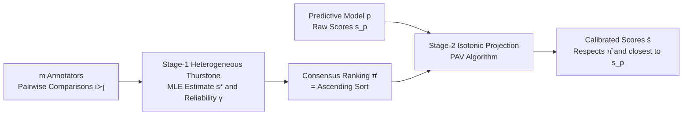

# AtC: Aggregate-then-Calibrate for Human-centered Assessment

**Conference**: ICLR 2026  
**OpenReview**: [https://openreview.net/forum?id=XNbVoi9mfr](https://openreview.net/forum?id=XNbVoi9mfr)  
**Code**: To be confirmed  
**Area**: Human-centered Assessment / Score Aggregation and Calibration  
**Keywords**: Human-centered assessment, rank aggregation, isotonic regression, annotator heterogeneity, monotonic projection  

## TL;DR
AtC proposes a two-stage "Aggregate-then-Calibrate" framework: first, it aggregates human pairwise comparisons into a consensus ranking using a heterogeneous Thurstone model that accounts for annotator reliability; then, it aligns scores from any predictive model to this ranking via isotonic projection. This approach simultaneously achieves "reliable human-provided ordering" and "consistent model-provided scale" in the absence of verifiable ground truth.

## Background & Motivation
**Background**: In human-centered assessment tasks such as estimating food delivery workloads or reviewing conference paper quality, ground truths are either costly to obtain or manifest only years later. During decision-making, ground truth is unavailable, necessitating reliance on human judgment or model predictions.

**Limitations of Prior Work**: Both existing categories of methods have fatal flaws. Aggregation algorithms using only human judgment, though capable of weighting annotators by expertise, are contaminated by inconsistent scoring scales—a lenient expert and a strict novice might agree on relative quality but differ significantly in absolute scores. Methods relying solely on model predictions face a "supervision crisis": ground truth is often related to latent factors (e.g., cognitive load) that are difficult to measure at scale, forcing models to learn from noisy proxy labels and propagating systemic biases into assessments.

**Key Challenge**: Human judgments are easy to obtain but lack a unified scale, while model predictions have consistent scales but require supervision signals—the strengths of the two are complementary but have long been used in isolation.

**Goal**: To combine "human structure (order)" and "model scale (magnitude)" when ground truth is unobservable, providing a final score that respects the human consensus ranking while preserving quantitative information from the model.

**Key Insight**: The authors leverage the Weber–Fechner law from psychophysics—**humans are adept at comparison but poor at absolute scoring**. Therefore, only **ordinal information** (ranking) is extracted from noisy human inputs, while raw scores are distrusted. This ranking is then used to **constrain** the monotonicity of model scores, performing "model-agnostic calibration."

## Method

### Overall Architecture
AtC decomposes the problem into two sequential steps. Stage-1 takes pairwise comparisons of $n$ items from $m$ annotators and uses a reliability-aware rank aggregation model to produce a consensus ranking $\hat\pi$. Stage-2 takes raw scores $s_p$ from any predictive model and applies an isotonic projection onto a monotonic set consistent with $\hat\pi$, yielding calibrated scores $\hat s$. The final output respects the human consensus order and remains closest to the original model scores in terms of Euclidean distance.

### Key Designs

**1. Heterogeneous Thurstone Model for Rank Aggregation: Treating "Annotator Inconsistency" as a signal.** Disagreements among annotators represent differences in expertise rather than subjective preference. AtC learns a precision parameter $\gamma_u$ for each annotator. Under the HTM, the probability that annotator $u$ prefers item $i$ over $j$ is modeled as $\Pr\{u: i\succ j\}=F(\gamma_u(s_i-s_j))$, where $F$ is a symmetric CDF and larger $\gamma_u$ indicates higher reliability. Maximum Likelihood Estimation (MLE) is performed on the log-likelihood $\ell(s,\gamma)=\sum_u\sum_{i\succ j\in D_u}\log F(\gamma_u(s_i-s_j))$ with constraints (e.g., $\frac1n\sum_i s_i=0$) for identifiability. Theorem 3.3 proves that when annotator reliabilities are unequal, the HTM estimator is strictly superior to estimators assuming homogeneity under the Loewner order, signifying higher statistical efficiency through heterogeneity modeling.

**2. Isotonic Regression for Model-agnostic Calibration: Minimally invasive alignment of model scores.** After obtaining $\hat\pi$, AtC projects the model scores $s_p$ onto the set $\widehat{\mathcal M}=\{y: y_{\hat\pi(1)}\le\cdots\le y_{\hat\pi(n)}\}$, which is monotonically non-decreasing according to $\hat\pi$: $\hat s=\Pi_{\widehat{\mathcal M}}(s_p)=\arg\min_{y\in\widehat{\mathcal M}}\|y-s_p\|_2^2$. This is solved efficiently using the Pool-Adjacent-Violators (PAV) algorithm, which iterates through the order $\hat\pi$ and averages adjacent pairs that violate monotonicity. This "calibration" enforces ordinal consistency, merging the model's scale with the human order.

**3. Theoretical Guarantees: Error control and strict dominance.** The authors provide a robustness bound (Theorem 3.5), decomposing the total expected squared error into three terms: projection error from Stage-1 ranking inversions $E[\mathrm{Inv}(\hat\pi,\tilde\pi)]$, statistical error from zero-mean noise (decaying at approximately $(\ln n)/n$), and bias error from systemic bias $\nu$ (decaying at $1/n$). Theorem 3.9 (Optimality Guarantee) proves that with probability at least $1-\delta_1-\delta_2$, $\|\hat s-s\|_2^2<\|s_p-s\|_2^2$, meaning the calibrated output is strictly closer to the truth than the uncalibrated model.

## Key Experimental Results

### Main Results (Semi-synthetic Reading-Level Dataset, 490 documents / 624 annotators / 12,728 comparisons)

| Stage-1 Method | Kendall τ↑ (s\*/s_p/ŝ) | Wasserstein↓ (s\*/s_p/ŝ) | KS↓ (s\*/s_p/ŝ) | MSE↓ (s\*/s_p/ŝ) |
|---|---|---|---|---|
| HRA-G | 0.375 / 0.399 / **0.410** | 2.250 / 2.831 / **0.839** | 0.500 / 0.300 / **0.163** | 8.658 / 29.00 / **8.122** |
| HRA-E | 0.375 / 0.399 / **0.403** | 2.243 / 2.831 / **0.827** | 0.498 / 0.300 / **0.163** | 8.658 / 29.00 / **8.191** |
| HRA-N | 0.368 / 0.399 / 0.399 | 2.351 / 2.831 / **0.738** | 0.563 / 0.300 / **0.192** | 8.985 / 29.00 / **7.919** |
| CrowdBT | 0.354 / 0.399 / 0.399 | 2.150 / 2.831 / **0.843** | 0.455 / 0.300 / 0.269 | 8.301 / 29.00 / **7.555** |
| BTL (Homog) | 0.340 / 0.399 / 0.373 | 2.186 / 2.831 / **0.894** | 0.461 / 0.300 / 0.300 | 7.764 / 29.00 / 8.097 |

The calibrated scores $\hat s$ outperform both human consensus $s^*$ and model scores $s_p$ across almost all methods and metrics. Notably, $\hat s$ significantly reduces the Wasserstein/KS distance of $s_p$ (from 2.8/0.30 to 0.7-0.9/0.16) (RQ1). Heterogeneous models (HRA, CrowdBT) yield better calibration results than homogeneous models (BTL), validating the design choice to prioritize ordinal information from $s^*$ (RQ2).

### Main Results (Dots-activity Dataset, 300 participants / 30 images / 8,700 comparisons)

| Stage-1 Method | Kendall τ↑ (ŝ) | Wasserstein↓ (ŝ) | MSE↓ (ŝ) |
|---|---|---|---|
| HRA-G | **0.940** | **2.53** | **9.61** |
| HRA-E | **0.943** | **2.53** | **9.59** |
| GPPL | 0.931 | 64.50 | 4220.36 |
| Rank-SVM | 0.923 | 61.20 | 3814.49 |
| BARCW | 0.940 | 64.62 | 4236.16 |

AtC further calibrates model scores (HRA-E) to an MSE of 9.59, far lower than the thousand-level MSE of GPPL/Rank-SVM/BARCW.

### Key Findings
- **Robustness**: When injecting artificial pairwise inversions, AtC degrades gracefully up to 400 inversions before collapsing, still producing meaningful results via the model signal (RQ3, RQ4).
- **Ranking vs. Rating**: Across four types of image corruption, calibration using rankings $\hat s$(Rank) consistently outperforms calibration using scores $\hat s$(Rate), empirically supporting the core assumption that rankings are more reliable (RQ5).
- Using OpenCV contour detection as a noisy predictor, AtC maintains high accuracy even under severe image corruption, proving that anchoring model scores to human consensus effectively resists noise (RQ6).

## Highlights & Insights
- **Theoretically Sound**: Three theorems establish the efficiency of heterogeneous aggregation, error decomposability, and strict dominance of calibration. Theorem 3.5 extends isotonic regression theory to scenarios involving "projection onto random cones + biased effective noise."
- **Model Agnostic**: Stage-2 is plug-and-play for any off-the-shelf predictive model without retraining, decoupling "human judgment" and "arbitrary models."
- **Clear Intuition**: Leveraging the psychophysical Weber–Fechner law leads to a robust design: "use order, not values."

## Limitations & Future Work
- **Dependency on Pairwise Comparisons**: Stage-1 requires a sufficient amount of pairwise judgments; calibration fails if inversions exceed a critical threshold (approx. 500 in experiments).
- **Ceiling of Monotonic Constraints**: Isotonic projection only corrects order violations. If model scores are correctly ordered but systematically misscaled, the room for improvement is limited.
- **Evaluation without Observable Ground Truth**: Semi-synthetic experiments rely on simulated ground truth. In real-world tasks, verifying "correctness" remains inherently difficult.

## Related Work & Insights
- **Score Aggregation**: Heterogeneous rank aggregation (HTM, CrowdBT) forms the basis for Stage-1. AtC's contribution lies in proving its efficiency advantage and integrating it into calibration.
- **Isotonic Regression**: Utilizes Bellec's (2018) oracle inequalities and the PAV algorithm but redefines calibration as "ordinal consistency projection."
- **Inspiration**: When ground truth is scarce, "using humans for order and models for scale" is a universal recipe applicable to crowdsourcing, LLM-as-judge preference aggregation, and recommendation systems.

## Rating
- **Novelty**: ⭐⭐⭐⭐ — The combination is simple yet fresh, systematically bridging judgment aggregation and model-agnostic calibration with new theory.
- **Experimental Thoroughness**: ⭐⭐⭐⭐ — Full coverage across semi-synthetic and real datasets with 6 RQs; however, dataset sizes are relatively small (30-490 items).
- **Writing Quality**: ⭐⭐⭐⭐ — Logical flow from motivation to theory and experiments; notation is clear and ties directly to research questions.
- **Value**: ⭐⭐⭐⭐ — Provides a plug-and-play calibration paradigm with theoretical guarantees for human-centered assessment where ground truth is unavailable.

<!-- RELATED:START -->

## Related Papers

- [\[AAAI 2026\] Align When They Want, Complement When They Need! Human-Centered Ensembles for Adaptive Human-AI Collaboration](../../AAAI2026/others/align_when_they_want_complement_when_they_need_human-centere.md)
- [\[CVPR 2026\] Modeling the Visual Ambiguity of Human Sketches](../../CVPR2026/others/modeling_the_visual_ambiguity_of_human_sketches.md)
- [\[ACL 2025\] FRACTAL: Fine-Grained Scoring from Aggregate Text Labels](../../ACL2025/others/fractal_fine-grained_scoring_from_aggregate_text_labels.md)
- [\[ICML 2026\] Position: Evaluation of ML Resource Utilization Requires Model Life Cycle Assessment](../../ICML2026/others/evaluation_of_ml_resource_utilization_requires_model_life_cycle_assessment.md)
- [\[ACL 2025\] A Multi-Persona Framework for Argument Quality Assessment](../../ACL2025/others/a_multi-persona_framework_for_argument_quality_assessment.md)

<!-- RELATED:END -->
