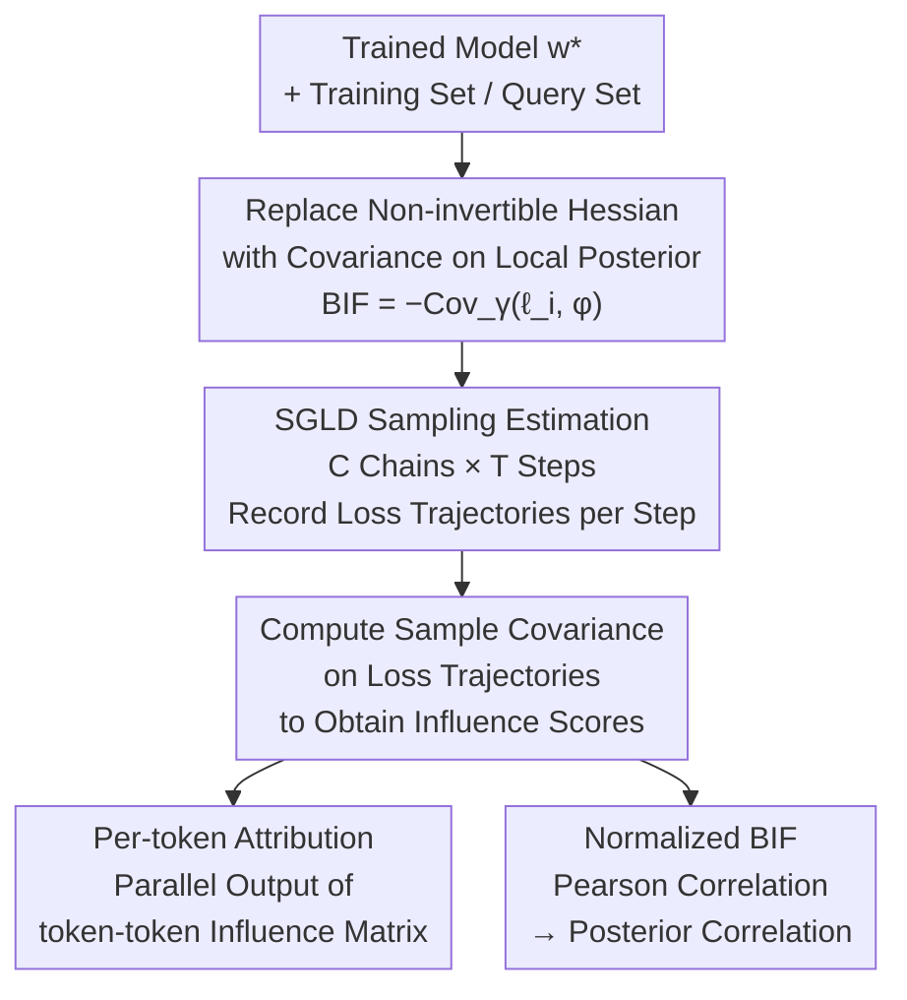

# Bayesian Influence Functions for Hessian-Free Data Attribution

**Conference**: ICLR 2026  
**arXiv**: [2509.26544](https://arxiv.org/abs/2509.26544)  
**Code**: None  
**Area**: Others  
**Keywords**: influence functions, training data attribution, Bayesian inference, SGMCMC, Hessian-free, data valuation  

## TL;DR
Propose the Local Bayesian Influence Function (BIF), which replaces the infeasible Hessian inverse in classical influence functions with covariance estimated via SGLD sampling. This achieves architecture-agnostic data attribution for models with billions of parameters and reaches SOTA in retraining experiments.

## Background & Motivation
**Background**: Training Data Attribution (TDA) investigates how training data shapes model behavior and is a fundamental problem in AI interpretability and safety. Classical Influence Functions (IF) measure the impact of a data point via the Hessian inverse.

**Limitations of Prior Work**: (a) The Hessian of deep neural networks is typically degenerate (non-invertible), invalidating the theoretical premises of classical IF; (b) Direct computation of the Hessian for large models is infeasible, while approximation methods like EK-FAC introduce structural biases and only support Linear/Conv2D layers; (c) Fine-grained per-token attribution requires serial computation per token in classical methods, which is non-scalable.

**Key Challenge**: The need for a data attribution method that is both theoretically sound (independent of Hessian invertibility) and computationally feasible (scaling to billions of parameters).

**Goal**: Can a Bayesian inference framework completely bypass the Hessian while maintaining or exceeding the attribution quality of classical IF?

**Key Insight**: Replace the Hessian inverse in classical IF with an estimation of covariance over a local posterior distribution, implemented using SGLD sampling.

**Core Idea**: $\text{BIF}(z_i, \phi) = -\text{Cov}_\gamma(\ell_i(\boldsymbol{w}), \phi(\boldsymbol{w}))$—influence is defined as the negative covariance between training loss and the target observable under the local posterior.

## Method

### Overall Architecture
This paper refines classical Influence Functions (IF) from a "point estimation" problem into a "distributional" problem. Instead of computing gradients and Hessian inverses at a unique optimal parameter $\boldsymbol{w}^*$, it estimates covariance over a local posterior distribution centered at $\boldsymbol{w}^*$. The workflow involves taking a trained model $\boldsymbol{w}^*$, constructing a local posterior around it, and running several SGLD chains to sample from this posterior. Each sampling step requires only a forward pass to record the training sample loss $\ell_i$ and the target observable value $\phi$. Finally, the sample covariance is computed over these loss trajectories, defining the attribution result as the negative covariance $-\text{Cov}_\gamma(\ell_i, \phi)$. This process involves no Hessian and requires no backpropagation, which is the key to its scalability to billions of parameters.

### Key Designs

**1. Replacing Invertible Hessian with Covariance on Local Posterior**

Classical IF is written as $\text{IF}(z_i, \phi) = -\nabla\phi(\boldsymbol{w}^*)^\top \boldsymbol{H}^{-1} \nabla\ell_i(\boldsymbol{w}^*)$. The bottleneck lies in the Hessian inverse $\boldsymbol{H}^{-1}$, which requires the model to be non-degenerate (deep networks often have singular loss landscapes) and is computationally prohibitive for large models. BIF adopts standard results from statistical physics to redefine influence as the negative covariance between loss and observable under the Bayesian posterior: $\text{BIF}(z_i, \phi) = -\text{Cov}(\ell_i(\boldsymbol{w}), \phi(\boldsymbol{w}))$. This formula contains no Hessian. Rather than just being an approximation, the paper proves that a first-order Taylor expansion of BIF on non-degenerate models returns exactly to classical IF (Appendix A). Thus, BIF is a higher-order generalization of IF that remains valid for degenerate cases.

Computing covariance on the global posterior introduces noise from sampling points far from $\boldsymbol{w}^*$. To address this, an isotropic Gaussian prior centered at $\boldsymbol{w}^*$ is introduced to define the local posterior (Local BIF):

$$p_\gamma(\boldsymbol{w}) \propto \exp\!\Big(-\textstyle\sum_i \ell_i(\boldsymbol{w}) - \tfrac{\gamma}{2}\|\boldsymbol{w}-\boldsymbol{w}^*\|^2\Big).$$

The precision parameter $\gamma$ controls the degree to which sampling is constrained near $\boldsymbol{w}^*$, functionally corresponding to the dampening term $(\boldsymbol{H} + \gamma\boldsymbol{I})$ in classical IF. Thus, $\gamma$ serves as both a numerical regularizer and an analytical knob for the scale of influence.

**2. SGLD Sampling: Converting Covariance into Forward-only Statistics**

With the formula defined, the remaining challenge is computing the covariance over the local posterior. This paper uses Stochastic Gradient Langevin Dynamics (SGLD) sampling. Starting from $\boldsymbol{w}^*$, parameters are updated using noisy gradients of the training loss plus the localized potential $\gamma(\boldsymbol{w}-\boldsymbol{w}^*)$. $C$ independent chains are run in parallel for $T$ steps each to improve posterior coverage, resulting in total samples $N_{\text{draws}} = C \times T$ (e.g., $C{=}4,\,T{=}500$). Crucially, each sampling point requires only one forward pass for the training and query sets to record loss values $\ell_i(\boldsymbol{w})$ and $\phi(\boldsymbol{w})$. Attribution is then computed as the sample covariance over these loss trajectories. This requires no backpropagation for parameter gradients and no storage of Hessian factors, allowing it to bypass the expensive fitting phase of EK-FAC.

**3. Per-token Attribution: Parallel Computation of Influence Matrices**

Losses in autoregressive models naturally decompose by token as $\ell_i = \sum_s \ell_{i,s}$. Since covariance is linear over sums, token-level influence can be written directly as $\text{BIF}(z_{i,s}, z_{j,s'}) = -\text{Cov}_\gamma(\ell_{i,s}, \ell_{j,s'})$. Because all per-position losses are recorded during the same sampling run, the entire $S|\mathcal{D}_{\text{train}}| \times S|\mathcal{D}_{\text{query}}|$ token-token influence matrix can be computed in parallel. This addresses a major weakness of classical methods: using EK-FAC for such granular attribution would require backpropagating gradient contributions for every training token, leading to linear memory growth with sequence length and requiring serial scoring.

**4. Normalized BIF (Posterior Correlation): Suppressing High-Variance Dominance**

The absolute value of raw covariance can be inflated by data points with high loss variance, distorting rankings—a "sensitive" but unrelated sample might rank highly. Normalizing the covariance into a Pearson correlation coefficient (dividing by the product of their standard deviations) bounds values within $[-1, 1]$. This decouples "relationship strength" from "single-point sensitivity," making scores more comparable across data points and improving estimation stability. This metric, called posterior correlation, is used for qualitative analysis and visualization of semantic associations like translation, synonyms, and digit-spelling.

## Key Experimental Results

### Table 1: Complexity Comparison: BIF vs. EK-FAC

| Dimension | Local BIF | EK-FAC |
|-----------|-----------|--------|
| Time Complexity | $O(N_{\text{draws}}(n+q)d)$, no fit phase | Fit: $O(N_{\text{fit}}d + \sum d_\ell^3)$; Score: $O(nqd)$ |
| Extra Storage | $O(N_{\text{draws}}(n+q))$ loss trajectories | $O(\sum(d_{\text{in},l}^2 + d_{\text{out},l}^2))$ factors |
| Error Source | Finite sampling + SGLD bias | Finite sampling + structural bias (Kronecker/Fisher) |
| Arch Support | Any differentiable model | Limited to Linear and Conv2D layers |

### Table 2: LDS Scores for CIFAR-10 Retraining Experiments

| Data Scale $\alpha$ | BIF | EK-FAC | TRAK | GradSim |
|-------------------|-----|--------|------|---------|
| Small Set (High Var) | **Slightly better than EK-FAC** | SOTA baseline | Significantly lower | Lowest |
| Large Set | Comparable to EK-FAC | SOTA | Lower than both | Lowest |
| Pythia-14M Finetune | Lower than EK-FAC | Better | — | — |

> On ResNet-9/CIFAR-10, both BIF and EK-FAC achieve LDS scores significantly better than TRAK and GradSim. BIF performs slightly better in the small-data, high-variance regime.

### Scalability Analysis (Pythia Model Suite)
- On Pythia-2.8B, BIF evaluation is approximately **2 orders of magnitude faster** than EK-FAC.
- EK-FAC incurs a massive upfront fit cost (Kronecker factors storage + eigendecomposition), which BIF avoids.
- GPU memory consumption is comparable for both (4×A100 nodes).
- The advantages of BIF become more pronounced as model scale increases.

## Highlights & Insights
- **Conceptual Elegance**: It transforms the Hessian inverse problem into a covariance estimation problem. The formula $-\text{Cov}(\ell_i, \phi)$ unifies the approach—theoretically concise and intuitively implemented.
- **Practical Breakthrough for Per-token Attribution**: While classical methods are infeasible for per-token calculations, BIF's batch covariance is naturally parallel, making token-level attribution for LLMs a reality.
- **Semantic Quality**: Figure 2 demonstrates that posterior correlation on Pythia-2.8B captures semantic relationships such as translations, synonyms, and digit-to-spelling mappings.
- **Statistical Physics Perspective**: BIF has deep links with susceptibilities and the local learning coefficient in SLT, representing an important contribution to the developmental interpretability research agenda.
- **Universal Applicability**: It is independent of specific layer types and applies to any differentiable architecture (including attention and normalization layers not supported by EK-FAC).

## Limitations & Future Work
1. **Sampling Quality Dependency**: BIF accuracy depends on the quality of SGLD sampling of the local posterior. The singular loss landscapes of DNNs mean standard SGLD convergence guarantees may not hold.
2. **Hyperparameter Sensitivity**: There is currently no theoretical guidance for the optimal selection of step size $\epsilon$, localization strength $\gamma$, and inverse temperature $\beta$, especially in LLM settings.
3. **Sequence-level Attribution Accuracy**: In Pythia-14M finetuning scenarios, BIF's LDS is lower than EK-FAC, reflecting the difficulty of posterior sampling in LLMs.
4. **Computational Cost Scaling**: While there is no fit phase, each SGLD draw requires a forward pass of the entire training and query sets; overhead remains significant for extremely large attribution datasets.
5. **No Theoretical Convergence Rate**: A rigorous theoretical analysis of how sampling error in BIF decays with $N_{\text{draws}}$ is still lacking.

## Related Work & Insights
- **Classical Influence Functions**: Proposed by Cook (1977), introduced to deep learning by Koh & Liang (2020), and approximated via EK-FAC by Grosse et al. (2023).
- **Gradient Similarity Methods**: TRAK (Park et al., 2023b) approximates attribution via similarity in representation space; GradSim uses gradient dot products.
- **Distributional TDA**: Mlodozeniec et al. (2025) proposed the d-TDA framework; BIF can be viewed as its mean-shift special case.
- **Bayesian Infinitesimal Jackknife**: Giordano & Broderick (2024) proposed similar ideas for Bayesian multi-model analysis, though not localized or scaled to large LLMs.
- **Singular Learning Theory**: Lau et al. (2025) proposed SGMCMC methods for estimating the local learning coefficient; this paper utilizes the same localization mechanism.

## Rating
- **Novelty**: ★★★★★ — The theoretical insight of replacing the Hessian inverse with covariance is elegant and profound; the definition of local BIF is natural and widely applicable.
- **Value**: ★★★★☆ — No architecture restrictions for large models and high practical value for per-token attribution, though hyperparameter tuning remains empirical.
- **Experimental Thoroughness**: ★★★★☆ — Covers vision (CIFAR-10, ImageNet) and language (Pythia) models with qualitative and quantitative evaluations, though retraining experiments are small-scale.
- **Writing Quality**: ★★★★★ — The derivation from IF to BIF is logically clear, visualizations in Figures 1-2 are intuitive, and the complexity comparison (Table 1) is highly informative.

<!-- RELATED:START -->

## Related Papers

- [\[NeurIPS 2025\] Position: There Is No Free Bayesian Uncertainty Quantification](../../NeurIPS2025/others/position_there_is_no_free_bayesian_uncertainty_quantification.md)
- [\[ICLR 2026\] Federated ADMM from Bayesian Duality](federated_admm_from_bayesian_duality.md)
- [\[ICLR 2026\] On the Lipschitz Continuity of Set Aggregation Functions and Neural Networks for Sets](on_the_lipschitz_continuity_of_set_aggregation_functions_and_neural_networks_for.md)
- [\[CVPR 2026\] Spectral Conformal Risk Control: Distribution-Free Tail Guarantees via Bayesian Quadrature](../../CVPR2026/others/spectral_conformal_risk_control_distribution-free_tail_guarantees_via_bayesian_q.md)
- [\[ICLR 2026\] On the Impact of the Utility in Semivalue-based Data Valuation](on_the_impact_of_the_utility_in_semivalue-based_data_valuation.md)

<!-- RELATED:END -->
