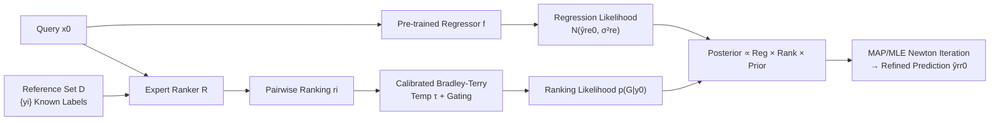

# Bayesian Post Training Enhancement of Regression Models with Calibrated Rankings

**Conference**: ICLR 2026  
**OpenReview**: [https://openreview.net/forum?id=b2tBRLic4V](https://openreview.net/forum?id=b2tBRLic4V)  
**Code**: [https://github.com/ktirta/regref](https://github.com/ktirta/regref)  
**Area**: Regression Enhancement / Bayesian Inference / Learning to Rank  
**Keywords**: Bradley-Terry, Bayesian Post-processing, Pairwise Ranking, Temperature Calibration, Molecular Property Prediction  

## TL;DR
RANKREFINE++ fuses "regressor predictions" and "expert pairwise rankings" into a strictly log-concave posterior via Bayesian inference. It addresses scale mismatch and curvature dominance in the Bradley-Terry model under large reference sets using temperature calibration and accuracy gating, significantly improving prediction accuracy without retraining the regressor.

## Background & Motivation
**Background**: Regression models serve as critical surrogates for expensive experiments or simulations in fields like materials science and drug discovery. However, acquiring precise absolute numerical labels (e.g., "molecule x has a toxicity of 1 nM") is slow and costly, leading to data scarcity and limited model accuracy. In contrast, pairwise rankings ("is x more toxic than y?") are easier to obtain at low cost from human experts or LLM judges, reducing cognitive burden for humans and alleviating scale interpretation bias, while LLMs demonstrate strong pairwise comparison capabilities in technical domains.

**Limitations of Prior Work**: Existing "ranking-enhanced regression" methods have various deficiencies. Projection (Yan et al. 2024) constrains regression predictions to feasible intervals implied by non-contradictory rankings. RankRefine (Wijaya et al. 2025) fuses regression outputs with "pure ranking estimates" using inverse-variance weighting. These methods are either heuristic constraints or lack a unified probabilistic framework for modeling ranking information, and none diagnose when ranking likelihoods might actually degrade performance.

**Key Challenge**: Incorporating Bradley-Terry ranking likelihood seems like a "free lunch," but **as the reference set size $k$ and ranker accuracy increase, the curvature (Fisher information) of the ranking likelihood "dominates" the regression likelihood**. If the Bradley-Terry model mismatches the true ranker behavior, this dominance pulls predictions toward a biased "pseudo-ground truth," causing performance to drop rather than rise.

**Goal**: Establish a query-wise post-processing enhancement method with theoretical guarantees that adapts to ranker quality, using minimal absolute labels and inexpensive pairwise rankings without retraining the regressor.

**Core Idea**: **[Bayesian Fusion + Calibration]** Treat the regressor and the ranker as two likelihoods for an unknown scalar $y_0$, multiplying them via Bayesian rules to obtain a 1D posterior. Introduce "temperature calibration" to align sigmoid slope with label scales and "accuracy gating" to adjust ranker influence based on its credibility.

## Method

### Overall Architecture
Given a pre-trained regressor $f$ (providing a prediction $\hat{y}^{re}_0$ for query $x_0$) and an expert ranker $R$ that performs pairwise comparisons between $x_0$ and $k$ reference items with known labels, RANKREFINE++ multiplies the "Gaussian regression likelihood" and "Bradley-Terry ranking likelihood" to form a posterior. Refined predictions $\hat{y}^{rr}_0$ are obtained through MAP/MLE (Newton's method) without altering regressor parameters.

### Key Designs

**1. Bayesian 1D Posterior: Reformulating fusion as probabilistic inference rather than heuristic constraints.** Assuming the regressor and ranker are conditionally independent given the true value $y_0$, Bayesian rules yield $p(y_0\mid\hat{y}^{re}_0,G)\propto p(\hat{y}^{re}_0\mid y_0)\,p(G\mid y_0)\,p(y_0)$. The regression likelihood follows a Gaussian $\mathcal{N}(\hat{y}^{re}_0;y_0,\sigma^2_{re})$. The ranking likelihood is the Bradley-Terry product: $p(G\mid y_0)=\prod_{i=1}^k s(y_0-y_i)^{r_i}(1-s(y_0-y_i))^{1-r_i}$, where $s$ is the sigmoid function. The resulting log-posterior objective $L(y)=-\frac{1}{2\sigma^2_{re}}(\hat{y}^{re}_0-y)^2+\sum_i[r_i\log s(y-y_i)+(1-r_i)\log(1-s(y-y_i))]+\log p(y)$ is proved to be **strictly log-concave** (Lemma 3.1), ensuring a unique solution (Corollary 3.2) solvable via fast Newton steps. This framework unifies prior SOTA: a second-order expansion of the Bradley-Terry likelihood at the pure ranking MLE $\hat{y}^{ra}_0$ yields a Gaussian approximation $\mathcal{N}(y;\hat{y}^{ra}_0,\sigma^2_{ra})$. Multiplying two Gaussians recovers the inverse-variance weighted estimate of RankRefine (Proposition 3.3), proving RankRefine is a special case of this framework under "Gaussianized ranking likelihood."

**2. Failure Mode Diagnosis: Scale mismatch and curvature dominance pull predictions toward pseudo-truth.** The authors decompose degradation into two provable mechanisms. First is **Soft-Hard Count Mismatch** (Lemma 3.4): the pure ranking MLE satisfies $\sum_i s(\hat{y}^{ra}_0-y_i)=m$, where $m=\sum_i r_i$ is the number of references ranked below $y_0$ (hard count). The left side is the sigmoid soft count. The solution $\tilde{y}_0$ may fall outside the true feasible interval $(y_m,y_{m+1})$ even with a perfect ranker, creating a biased "pseudo-truth." Second is **Curvature Dominance**: the Fisher information of the ranking likelihood $I_{rank}(y)=\sum_i u_i(y)(1-u_i(y))$ grows linearly with $k$ (Lemma 3.5). The Newton step is essentially an information-weighted average: $y\leftarrow\frac{I_{reg}\hat{y}^{re}_0+I_{rank}(y)\tilde{y}^{ra}(y)}{I_{reg}+I_{rank}(y)}$ (Lemma 3.6). Since $I_{reg}=1/\sigma^2_{re}$ is constant, the ranking term dominates as $k$ increases, and the accuracy threshold $a_{thr}(y)$ required for dominance decreases at a rate of $1/k$ (Lemma 3.7). Combined (Corollary 3.8): when $k$ and $a$ are sufficiently large, the biased pseudo-truth is amplified, making the base version perform worse than the pure regressor.

**3. Temperature Calibration: Aligning sigmoid slope with label scales to eliminate soft-hard count mismatch.** The root cause of degradation is biased ranking objectives when pairwise differences $(y_a-y_b)$ fall in the sigmoid transition zone rather than the saturated tails—a unit/scale issue. The authors introduce temperature $\tau$ to replace $u_i(y)=s(y-y_i)$ with $v_i(y;\tau)=s((y-y_i)/\tau)$, allowing the temperature-aware soft count $\sum_i v_i$ to match the hard count $m$ and controlling ranking curvature $I_{rank}(y;\tau)=\tau^{-2}\sum_i v_i(1-v_i)$ under large $k$. $\tau$ **requires no extra labels**: it is fitted via single-parameter logistic regression $\Pr(r=1\mid y_a,y_b;\hat\omega)=s(\hat\omega(y_a-y_b))$ on known reference pairs, setting $\tau=\hat\tau_{cal}=1/\hat\omega$. $\tau<1$ increases ranking curvature, pushing updates toward the ranking goal—permitting "unbiased ranking dominance" when the ranker is accurate.

**4. Accuracy Gating: Smooth interpolation based on ranker credibility to avoid noise backfire.** Temperature calibration works when the ranker is accurate, but excessive curvature from an inaccurate ranker allows noise to dominate. The authors add an accuracy-aware soft gate $\tau(a)=1+(\hat\tau_{cal}-1)(w(a))^\gamma$, where $w(a)=\max(0,2a-1)\in[0,1]$ and $\gamma\ge1$. Thus, when $a\approx0.5$ (ranker is uninformative), $\tau(a)\approx1$ (reverts to uncalibrated, no amplification); as $a\to1$, $\tau(a)\to\hat\tau_{cal}$ (full calibration). The final algorithm (MLE-GatedTemp) estimates temperature and accuracy to calculate $\tau$, replaces $s$ with $s(\cdot/\tau)$, and runs Newton iterations, providing posterior uncertainty $\sigma^2_{post}\approx(I_{reg}+I_{rank}(\hat{y}^{rr}_0;\tau))^{-1}$.

## Key Experimental Results

### Main Results (Oracle Ranker, 9 TDC ADMET Datasets, $k=30$)
Metrics: $\beta\equiv\text{MAE}_{post}/\text{MAE}_{base}$ (lower is better).

| Method | Performance Summary (Lower $\beta$ is better) |
|------|------|
| Regressor-only | $\beta=1$ (Baseline) |
| Projection (Yan 2024) | Often $>1$ in mid-accuracy (degradation); converges only at perfect accuracy |
| Bradley-Terry / Thurstone (Pure Rank) | Significant degradation under large $k$ |
| RankRefine (Wijaya 2025, Prev. SOTA) | Performance **saturates** and stops improving at high accuracy |
| **RANKREFINE++ (MLE-GatedTemp)** | **$\beta<1$ across all accuracy zones; maximum gain in mid-accuracy (65%–90%), continuous improvement at high accuracy** |

**Core Numbers**: In a realistic setting with 30 reference samples and a 65% accuracy ranker, RANKREFINE++ achieves a **median MAE reduction of 19.33%**, which is a **97.65% relative Gain** over RankRefine's 9.78% reduction. It runs efficiently on consumer-grade CPUs across 12 datasets.

### Ablation Study (Clearance Hepatocyte, Four Variants × $k\in\{3,10,20,30,50,100\}$)

| Variant | Behavior |
|------|------|
| MAP (Gaussian Prior) | Degrades at large $k$, but **prior acts as regularizer**, performing better than MLE |
| MLE | Most prone to degradation under large $k$ due to curvature dominance and count mismatch |
| MLE-Temp | Fixed scale mismatch, mitigated high-accuracy degradation, but **performed worse at low accuracy** |
| **MLE-GatedTemp (Full)** | Eliminated trade-offs, robust across accuracy zones, **effective even at $k=3$** |

### Key Findings
- **Degradation Source Validated**: Pure Bradley-Terry/Thurstone also degrades with $k$, confirming degradation stems from the ranking likelihood (Corollary 3.8); accuracy thresholds for degradation shift down as $k$ grows, confirming Lemma 3.7.
- **Cross-Domain/Model Generalization**: $\beta<1$ achieved on 3 non-molecular tabular datasets (agriculture, student grades, study costs) for both Random Forest and MLP regressors.
- **LLM Ranker Viability**: Using ChatGPT-5 and Claude-4 for SMILES pairwise comparisons (Pairwise Ranking Accuracy PRA ~52%–72%), RANKREFINE++ still outperforms RankRefine and Projection on most datasets (e.g., $\beta\approx0.85$ on VDss).

## Highlights & Insights
- **Heuristic Fusion to Theoretical Probabilistic Inference**: Strict log-concavity implies unique solutions + fast Newton, and the proof that RankRefine is a Gaussian special case provides strong framework unity.
- **Diagnosis and Solution Loop**: The paper doesn't just propose a method; it first rigorously characterizes when the ranking likelihood backfires (Fisher info/count mismatch) and then targets these with temperature and gating.
- **Zero-Extra-Label Calibration**: Temperature fits on the reference set, and gating only requires ranker accuracy estimates. It is low-cost and runs on consumer CPUs.
- **Alignment with LLM-as-a-judge**: Pairwise ranking is an LLM strength; this method converts cheap LLM signals into quantifiable, calibrated regression gains.

## Limitations & Future Work
- **Dependence on Reference Set**: Temperature calibration relies on references representing the scale distribution near the query. Bias or insufficient coverage may lead to miscalibration.
- **Accuracy Estimation**: Gating requires a prior or validation estimate of ranker accuracy $a$. Sensitivity to estimation errors of $a$ in real-world scenarios is not deeply explored.
- **Scalar-Focus**: Core derivations target 1D scalar labels. Multi-target regression is discussed in the appendix, but extension to high-dimensional/structured outputs remains to be validated.
- **Conditional Independence Assumption**: The assumption of independence between regressor and ranker might fail if they share features or origins (e.g., the same LLM performing both scoring and ranking).

## Related Work & Insights
- **Regression + Ranking Enhancement**: Projection (Yan 2024) and RankRefine (Wijaya 2025) are direct precursors; this work proves the latter is a special case.
- **Pairwise Models**: Bradley-Terry (logistic link) and Thurstone-Mosteller (Gaussian link) are classical sources for 1D comparison likelihoods.
- **LLM-as-a-judge**: LLMs excel at pairwise comparisons over direct scoring (Zheng 2023, etc.), providing the source for cheap ranking signals.
- **Distinction from RLHF**: RLHF uses Bradley-Terry to model preferences for global reward model training and parameter fine-tuning; this is **query-wise post-processing without parameter changes**, producing a 1D posterior.
- **Insight**: Modeling "any two heterogeneous prediction sources" as respective likelihoods, diagnosing dominance via Fisher information, and applying cheap calibration is a generalizable paradigm for multi-modal/multi-expert fusion.

## Rating
- **Novelty** ⭐⭐⭐⭐: Unified Bayesian framework + rigorous failure diagnosis + targeted calibration. Original, though built on the trajectory of works like RankRefine.
- **Experimental Thoroughness** ⭐⭐⭐⭐: 12 datasets, oracle and LLM rankers, four-variant ablation, $k$-scanning, multiple regressor types. Comprehensive, though main tables focus on $\beta$ curves over raw numerical tables.
- **Writing Quality** ⭐⭐⭐⭐⭐: Logical progression from motivation to failure diagnosis (Lemma chain) to solutions. Formulas and diagrams (Fig.1 counts, Fig.2 flow) are clear.
- **Value** ⭐⭐⭐⭐: Plug-and-play for data-scarce sciences, zero retraining, CPU-efficient, fits LLM trends. Practicality limited by reference set and accuracy estimation requirements.

<!-- RELATED:START -->

## Related Papers

- [\[ICLR 2026\] Learning Distributions over Permutations and Rankings with Factorized Representations](learning_distributions_over_permutations_and_rankings_with_factorized_representa.md)
- [\[ICML 2025\] Regression for the Mean: Auto-Evaluation and Inference with Few Labels through Post-hoc Regression](../../ICML2025/others/regression_for_the_mean_auto-evaluation_and_inference_with_few_labels_through_po.md)
- [\[ICLR 2026\] Federated ADMM from Bayesian Duality](federated_admm_from_bayesian_duality.md)
- [\[ICLR 2026\] Learning Survival Distributions with Individually Calibrated Asymmetric Laplace Distribution](learning_survival_distributions_with_individually_calibrated_asymmetric_laplace_.md)
- [\[AAAI 2026\] TaylorPODA: A Taylor Expansion-Based Method to Improve Post-Hoc Attributions for Opaque Models](../../AAAI2026/others/taylorpoda_a_taylor_expansion-based_method_to_improve_post-hoc_attributions_for_.md)

<!-- RELATED:END -->
