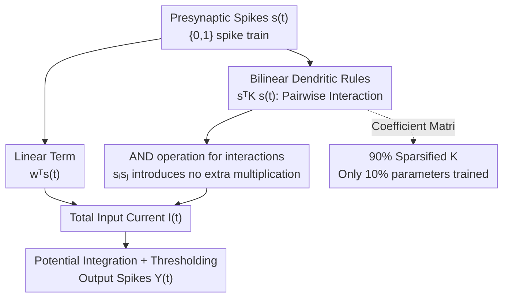

# Beyond Linear Processing: Dendritic Bilinear Integration in Spiking Neural Networks

**Conference**: ICLR2026  
**OpenReview**: [https://openreview.net/forum?id=5MB5vakrhB](https://openreview.net/forum?id=5MB5vakrhB)  
**Code**: https://github.com/majingyang0119/DLIF  
**Area**: Spiking Neural Networks / Neuromorphic Computing / Neuron Models  
**Keywords**: Spiking Neural Networks, Dendritic Nonlinearity, Bilinear Integration, LIF Model, Neuromorphic Computing

## TL;DR
This paper introduces a biologically inspired "bilinear dendritic integration" term to the commonly used LIF neuron in Spiking Neural Networks (SNNs). In addition to the linear summation of synaptic inputs, it incorporates an interaction term $s^T K s$ between pairs of inputs, enabling a single neuron to perform non-linear computations like XOR. Theoretically, it is proven to exploit and propagate input correlation structures across layers. Experimentally, it consistently outperforms LIF and various enhanced neurons across ResNet, VGG, and Transformer architectures on both static and neuromorphic datasets, improving average accuracy from 83.95% to 85.18% with only an approximate 3% increase in energy consumption.

## Background & Motivation
**Background**: Spiking Neural Networks (SNNs) are regarded as the next generation of brain-inspired networks, utilizing discrete spikes for event-driven computation, which is more energy-efficient than traditional ANNs. The vast majority of SNNs employ the Leaky Integrate-and-Fire (LIF) neuron—a minimalist model that omitted dendritic processing and performs only linear summation of synaptic currents.

**Limitations of Prior Work**: Biological neurons exhibit **non-linear** integration of inputs on their dendrites. This nonlinearity allows a single neuron to perform complex computations such as direction selectivity, coincidence detection, and logical operations (e.g., XOR). A purely linear LIF neuron cannot solve XOR, necessitating increased depth and width to approximate nonlinearity, which sacrifices biological plausibility and limits SNN expressivity.

**Key Challenge**: There exists a fundamental gap between the "linear summation" assumption of LIF, $I(t)=\sum_i w_i s_i(t)$, and the reality of "non-linear integration" in biological dendrites. Existing improved neurons (e.g., PLIF learning time constants, GLIF adding gating, QIF/EIF introducing non-linear dynamics, and multi-compartment DH-LIF) either focus on membrane potential dynamics or multi-compartment structures. **None modify the source of "how dendrites integrate multiple inputs,"** nor do they utilize the "bilinear" form observed in neurophysiological experiments.

**Goal**: To find a non-linear integration mechanism that is biologically grounded, can be directly integrated into large-scale SNN training, adds negligible computational overhead, and provides a theoretical explanation for its advantages.

**Key Insight**: The authors leverage a specific neurophysiological finding—when a dendrite receives two synaptic inputs $a$ and $b$ simultaneously, the integration result is not $a+b$, but $a+b+kab$, where a **bilinear interaction term** $kab$ is present. The coefficient $k$ depends only on the relative spatial positions of the two synapses and is independent of input intensity. This provides a clean, mathematically representable non-linear form.

**Core Idea**: The bilinear integration rule is incorporated into the LIF input current to derive the Dendritic LIF (DLIF) model. It explicitly models pairwise interactions between inputs using a quadratic form $s^T K s$, naturally enabling the neuron to capture correlations and perform non-linear classification.

## Method

### Overall Architecture
The concept of DLIF is straightforward: while the membrane potential of a standard LIF neuron is driven by input current (originally a linear weighted sum of spikes), DLIF **adds a quadratic term** to this current to account for the simultaneous firing of any two presynaptic neurons. The method consists of three components: (1) defining the DLIF current formula and membrane potential dynamics; (2) theoretically proving that this quadratic term allows neurons to use input correlations for classification and propagate these correlations layer-by-layer; (3) applying 90% sparsification to the coefficient matrix to prevent parameter explosion and align with biological facts. It can seamlessly replace LIF neurons in any SNN architecture.

The following diagram illustrates the computational flow of a single DLIF neuron at one time step:

### Key Designs

**1. Bilinear Dendritic Integration Rule: Adding $s^T K s$ to LIF Input Current**

The fundamental limitation of LIF is its assumption that input current is a linear sum $I(t)=\sum_i w_i s_i(t)=w^T s(t)$, implying that dendrites treat inputs independently. DLIF adopts the bilinear rule from neurophysiology: the integration of two inputs $a,b$ is $a+b+kab$. For $n$ inputs, every pair $(i,j)$ contributes an interaction term $s_i(t)s_j(t)$ with a symmetric coefficient matrix $K=(K_{ij})$ (zero diagonal), resulting in the input current:

$$I(t)=\sum_{i=1}^{n} w_i s_i(t) + \sum_{i=1}^{n}\sum_{j>i} 2K_{ij}\,s_i(t)s_j(t) = w^T s(t) + s^T(t)\,K\,s(t).$$

The membrane potential dynamics are defined as $\tau\,\frac{dV(t)}{dt} = -(V(t)-V_{rest}) + R\,[\,w^T s(t) + s^T(t)Ks(t)\,]$. The quadratic form $s^T K s$ provides the nonlinearity by explicitly encoding second-order statistical information (which inputs fired together), while $K$ is learnable.

**2. AND Operation for Interaction Terms: Nonlinearity without Extra Multiplications**

A natural concern is whether the quadratic term $s_i(t)s_j(t)$ destroys the "addition-only" energy efficiency of SNNs. The authors point out that since $s_i(t),s_j(t)\in\{0,1\}$ are binary spikes, their product is exactly equivalent to a **logical AND operation**. Thus, the interaction term introduces no additional floating-point multiplications, relying instead on additions and bitwise operations. This ensures that DLIF gains non-linear expressivity while maintaining a per-step computational cost nearly identical to LIF (measured energy consumption increases by only ~3%).

**3. Theoretical Guarantees: Capturing and Propagating Correlations**

**Theorem 1** proves that even if two input spike distributions $D_1,D_2$ have identical mean firing rates but different correlation structures ($C_1\neq C_2$), there exists a bilinear matrix $K$ such that DLIF can distinguish them. Under the constraint $\|K\|_F\le 1$, the optimal solution is $K^*=\pm\frac{C_1-C_2}{\|C_1-C_2\|_F}$, meaning $K$ learns the direction of the difference between correlation matrices. **Theorem 2** extends this to multi-layer networks, showing that DLIF can amplify and propagate correlation differences to the readout layer more effectively than LIF.

**4. 90% Sparsification of $K$: Bio-inspired Parameter Efficiency**

To prevent parameter explosion in large networks (where $K$ is $n\times n$), the authors utilize biological evidence that dendritic bilinear interactions are **naturally sparse (~90%)**. DLIF makes only 10% of the coefficients in $K$ trainable. This choice is validated by ablation studies on CIFAR-100/ResNet-18, where the ACC/FLOPs ratio peaks at 90% sparsity, balanceing efficiency and accuracy.

## Key Experimental Results

### Main Results
DLIF was evaluated by replacing LIF in various architectures (ResNet/VGG/Transformer) across static and neuromorphic datasets:

| Dataset | Framework / Network | LIF | DLIF | Energy (LIF→DLIF, mJ) |
|--------|--------------|------|------|------|
| CIFAR-10 | SLTT / ResNet-18 | 94.44 | **95.51** | 1.77 → 1.78 |
| CIFAR-100 | OTTT / VGG-11 | 71.05 | **74.71** | 7.42 → 7.91 |
| ImageNet | TET / ResNet-34 | 64.79 | **67.32** | 3.56 → 3.74 |
| DVS-Gesture | STBP-tdBN / ResNet-17 | 96.87 | **98.05** | 1.67 → 1.68 |
| DVS-CIFAR10 | STBP-tdBN / ResNet-19 | 67.8 | **70.88** | 1.88 → 1.89 |

Average accuracy improved from 83.95% to 85.18% (+1.23%), while average energy consumption increased only by approximately 2.6%–3.2%. Comparison with existing advanced spiking neurons:

| Neuron | CIFAR-10 | CIFAR-100 | ImageNet | DVS-CIFAR10 | DVS-Gesture |
|--------|----------|-----------|----------|-------------|-------------|
| PLIF | 93.50 | - | 69.26 | 74.80 | 97.92 |
| GLIF | 95.03 | 77.35 | 69.09 | 78.10 | - |
| QIF | 92.98 | 75.91 | 67.49 | 73.27 | 96.18 |
| EIF | 93.08 | 76.18 | 67.14 | 76.27 | 97.01 |
| **DLIF** | **95.78** | **78.27** | **71.27** | **80.46** | **98.61** |

### Ablation Study

| Configuration | Key Metrics | Note |
|------|---------|------|
| Sparsity 90% (Default) | ACC 76.89 / ACC-FLOPs 42.02 | Peak ACC/FLOPs ratio on CIFAR-100 |
| Sparsity 0% (Full $K$) | ACC 78.67 / ACC-FLOPs 40.97 | Slightly higher accuracy but less efficient |
| Sparsity 100% (No $K$) | ACC 74.38 | Performance drops significantly |
| Low-rank Param. of $K$ | Significantly weaker | Loss of expressivity compared to random sparsity |

### Key Findings
- **$K$ is the source of performance**: Setting $K$ to zero before or after training leads to a consistent performance drop.
- **90% Sparsity is the Sweet Spot**: This aligns with biological evidence and provides the optimal balance of accuracy and computational cost.
- **Higher Gains on Temporal Data**: Gains on neuromorphic datasets (up to +3.08%) are more pronounced, confirming that DLIF is particularly effective at capturing spatio-temporal patterns.
- **Controlled Overhead**: Using AND for interactions keeps energy increases to ~3% and training time/memory increases to ~10%.

## Highlights & Insights
- **Innovation at the "Dendritic Source"**: Unlike prior work modifying membrane dynamics, DLIF targets the upstream "input integration" process using clean bilinear rules.
- **"Free" Interaction via Binary Spikes**: The use of logical AND for $s_i s_j$ is a clever exploitation of the binary nature of SNNs.
- **Theoretical-Experimental Alignment**: Theorem 1's prediction of $K^* \propto C_1-C_2$ was directly verified in numerical experiments.
- **"Correlation" as a Unified View**: Explaining DLIF's advantage through the "propagation of second-order correlation structures" provides a concrete theoretical framework.

## Limitations & Future Work
- **Domain Scope**: Primary validation is on vision datasets; behavior in NLP or Large Language Models is yet to be explored.
- **Heuristic Sparsity**: The 90% sparsity is empirically chosen; whether structured or adaptive sparsity is superior remains an open question.
- **Hardware Deployment**: Performance gains are estimated via algorithmic FLOPs; actual low-power benefits on neuromorphic chips require further verification.

## Related Work & Insights
- **vs. LIF/PLIF/GLIF/QIF/EIF**: These are "point neurons" modifying dynamics; DLIF modifies input integration with explicit pairwise interactions $s^T K s$.
- **vs. DH-LIF (Multi-compartment)**: DH-LIF is more complex; DLIF achieves better results (e.g., 92.71 vs 92.10 on SHD) with a simpler quadratic form.
- **vs. ANN Bilinear Networks**: Previous ANN bilinear work focused on feature fusion; this work introduces it to the spiking framework with a unique theoretical focus on correlation propagation.

## Rating
- Novelty: ⭐⭐⭐⭐⭐ 
- Experimental Thoroughness: ⭐⭐⭐⭐⭐ 
- Writing Quality: ⭐⭐⭐⭐ 
- Value: ⭐⭐⭐⭐⭐ 

<!-- RELATED:START -->

## Related Papers

- [\[ICLR 2026\] Breaking Gradient Temporal Collinearity for Robust Spiking Neural Networks](breaking_gradient_temporal_collinearity_for_robust_spiking_neural_networks.md)
- [\[ICLR 2026\] Online Pseudo-Zeroth-Order Training of Neuromorphic Spiking Neural Networks](online_pseudo-zeroth-order_training_of_neuromorphic_spiking_neural_networks.md)
- [\[ICLR 2026\] A Brain-Inspired Gating Mechanism Unlocks Robust Computation in Spiking Neural Networks](a_brain-inspired_gating_mechanism_unlocks_robust_computation_in_spiking_neural_n.md)
- [\[ICLR 2026\] Fractional-Order Spiking Neural Network](fractional-order_spiking_neural_network.md)
- [\[ICLR 2026\] Training Deep Normalization-Free Spiking Neural Networks with Lateral Inhibition](training_deep_normalization-free_spiking_neural_networks_with_lateral_inhibition.md)

<!-- RELATED:END -->
