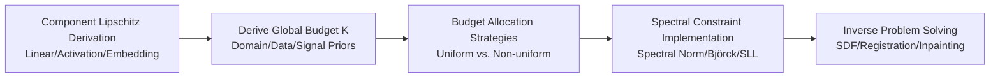

# Beyond Uniformity: Regularizing Implicit Neural Representations through a Lipschitz Lens

**Conference**: ICLR 2026  
**OpenReview**: [https://openreview.net/forum?id=REEdaR0zqj](https://openreview.net/forum?id=REEdaR0zqj)  
**Code**: [https://lipschitz-inrs.github.io](https://lipschitz-inrs.github.io)  
**Area**: Implicit Neural Representation / Spectral Regularization / Inverse Problems  
**Keywords**: Implicit Neural Representation, Lipschitz Regularization, Spectral Normalization, Deformable Registration, Image Inpainting  

## TL;DR
This work reframes Lipschitz regularization for INRs from a "rigid uniform 1-Lipschitz constraint" into a framework of "estimable, non-uniformly distributable Lipschitz budgets." By deriving a global budget $K$ from task priors and intelligently allocating it across layers, the method achieves a superior balance between smoothness and expressivity.

## Background & Motivation
**Background**: Implicit Neural Representations (INRs) model signals as continuous functions mapping coordinates to values and have been widely applied in compression, novel view synthesis, and inverse problems like registration or MRI reconstruction. However, INRs lack intrinsic regularization, leading to an inherent trade-off between expressivity and smoothness—the more a network fits high-frequency details, the more prone it is to overfitting and generating non-smooth solutions.

**Limitations of Prior Work**: A principled approach for implicit regularization is Lipschitz continuity: constraining the network's Lipschitz constant limits its sensitivity to input perturbations. However, existing methods almost exclusively enforce a **1-Lipschitz** constraint and distribute this "1-unit" budget **uniformly** across every layer, activation, and embedding. This leaves two long-standing open questions: (1) What is the appropriate total Lipschitz budget $K$ for a specific task? (2) How should this budget be allocated among network components?

**Key Challenge**: Uniform 1-Lipschitz constraints lack task-specificity (different tasks have vastly different smoothness requirements) and structural flexibility (early layers for feature extraction should be "looser," while later layers should be "tighter"). Consequently, expressivity is unnecessarily suppressed.

**Goal**: To reformulate Lipschitz regularization as a **flexible Lipschitz budget framework** that answers the two questions above—providing methods to derive $K$ from task/data/signal priors and strategies to allocate $K$ non-uniformly across components.

**Core Idea**: **Budgeting + Non-uniform Allocation**—leveraging the Lipschitz product composition property $K \le \prod_i \mathrm{Lip}(\phi_i)\mathrm{Lip}(W_i)$, the "global budget $K$" is treated as a total sum that can be freely partitioned in log-space, determined by interpretable domain knowledge or signal priors.

## Method

### Overall Architecture
The method consists of three steps: first, decomposing the overall network Lipschitz constant into the product of each component's Lipschitz (linear weights, activations, coordinate embeddings); second, deriving a meaningful global budget $K$ using task priors (e.g., tissue compressibility for medical registration, signal bandwidth oracles for inpainting); finally, allocating $K$ across components in log-space using various strategies (uniform vs. non-uniform) and enforcing these via spectral normalization or Björck orthogonalization.

### Key Designs

**1. Component-level Lipschitz Derivation: Decomposing "1-Lipschitz" into Billable Parts**
The foundation is calculating closed-form Lipschitz constants for each INR component so the budget can be precisely split. The Lipschitz of linear layers is given by the weight spectral norm (maximum singular value) $\mathrm{Lip}(W_i)=\sigma_{\max}(W_i)$. Coordinate embeddings also have analytical values, e.g., Positional Encoding $\mathrm{Lip}(\gamma_p)=\pi\sqrt{(4^L-1)/3}$ and Random Fourier Features $\mathrm{Lip}(\gamma_f)=2\pi\sqrt{\lambda_{\max}(\sum_j b_j b_j^\top)}$. Activations are categorized into two types: naturally 1-Lipschitz (ReLU, GroupSort, MaxMin) and those varying with hyperparameters, such as $\sin(\omega x)$ with Lipschitz $\omega$, or Gaussian activations $e^{-x^2/2a^2}$ with Lipschitz $1/(a\sqrt{e})$. Labeling these "costs" turns the composition formula $K=\mathrm{Lip}(f_\theta)\le \prod_{i=1}^{L}\mathrm{Lip}(\phi_i)\mathrm{Lip}(W_i)$ into an actionable budget ledger.

**2. Task-driven Budget Estimation: Linking $K$ to Interpretable Physics/Signal Priors**
Instead of blindly choosing $K=1$, the paper proposes three routes to estimate $K$ by translating domain knowledge into Lipschitz upper bounds. **Domain-driven**: In lung deformable registration, clinical evidence suggests tissue strain near 2.0 is a failure threshold; thus setting $K_B=2$ ensures the displacement field remains anatomically plausible without folding or tearing. CT reconstruction can use the maximum reasonable gradient between voxels (e.g., air to tissue) to set $K$. **Data-driven**: When a representative reference exists (e.g., CelebA for inpainting), an oracle based on L2 norm gradients estimates the local signal variation to provide Lipschitz bounds. **Signal Theory-driven**: Lacking priors, bandwidth/sampling rates (Audio 44.1 kHz, ECG $\approx 150$ Hz) can calculate conservative upper bounds. All three routes turn "how smooth it should be" from guesswork into an interpretable quantity.

**3. Non-uniform Budget Allocation: Re-partitioning $K$ in Log-space**
Given a total budget $K_B$, the allocation is formulated as $\prod_{i=1}^M K_i = K_B$ (equivalent to $\sum_i \log K_i = \log K_B$). Five strategies are compared: (A) **Uniform**, where $K_i=\sqrt[M]{K_B}$; (B) **First-layer-heavy**, $K_1=K_B$ and others are 1, reflecting that first-layer weights significantly impact sensitivity; and three monotonic parameterized strategies— (C) **Linear** decreasing from $s_0$ to $K_{\min}$; (D) **Exponential** logs-space ramp $u_i=\log K_{\min}+\frac{\log K_B-M\log K_{\min}}{\sum_j(1-t_j)}(1-t_i)$; (E) **Cosine Annealing** $K_i=K_{\min}(1+\alpha g(t_i))$ where $g(t_i)=\tfrac{1+\cos(\pi t_i)}{2}$. These non-uniform strategies allow early layers to be "flexible" for rich features while later layers stay "tight" to ensure smoothness, reallocating expressivity under a fixed budget.

**4. Implementation Toolbox for Spectral Constraints**
To strictly enforce the allocated values, the paper compares several implementations: standard Spectral Normalization (power iteration) is relatively loose, whereas Björck Orthogonalization (iterative approximation of $W^\top W=I$) and SLL (Araujo et al. 2023) provide tighter bounds. For activations, gradient-norm-preserving types (MaxMin, Householder) are used instead of ReLU to approach the network's Lipschitz capacity. A key observation is that the closer a network gets to "using up" its allocated budget (measured by empirical Lipschitz $K_m$), the better the perceived quality.

## Key Experimental Results

### Main Results: Three Task Categories

| Task | Data/Setup | Key Findings |
|------|-----------|----------|
| 1-Lipschitz SDF | Stanford bunny, Chamfer distance | Björck/SLL are sharper than standard Spectral Norm; MaxMin/Householder activations outperform ReLU; utility increases as the budget is fully utilized. |
| Deformable Registration | Lung CT (Castillo), $K_B=2$, TRE / Folding Rate | Non-uniform (e.g., Exponential) allocation reduces TRE while maintaining comparable folding rates; Spectral ReLU FFN and Björck/SLL SIREN are recommended. |
| Image Inpainting | CelebA, FFN + SLL | Non-uniform allocation yields statistically significant gains; performance peaks near the oracle-estimated budget. |

### Ablation Study

| Ablation Dimension | Phenomenon |
|----------|------|
| Allocation under 1-Lipschitz (SDF) | Non-uniform provides negligible gains over uniform—the unit budget is too restrictive for allocation to matter. |
| Budget Deviation from Oracle (Inpainting) | Performance drops when the budget deviates from the oracle estimate, especially for high-budget (FFN) settings, proving the oracle provides a meaningful bound. |
| Self-tuning across Architectures (Inpainting) | SIREN/FFN/Gauss show different decay curves when deviating from the oracle, reflecting their distinct "induced Lipschitz tuning biases." |
| Normalization $\times$ Architecture Stability (Registration) | FFN+Spectral Norm and SIREN+Standard Spectral Norm can be unstable; Björck/SLL are significantly more robust. |

### Key Findings
- **The Unit Budget is a Ceiling**: Under a 1-Lipschitz ($K=1$) constraint, non-uniform allocation shows almost no gain; the constraint must be relaxed to $K$-Lipschitz for allocation strategies to be effective.
- **Optimal Budget Exists and is Estimable**: Inpainting performance peaks near the oracle budget, indicating that the "optimal $K$" is a real, estimable value.
- **Non-uniform Allocation as a Control Knob**: In registration, allocation strategies offer continuous control for the trade-off between TRE (expressivity) and folding rate (smoothness).

## Highlights & Insights
- **Clarity of Paradigm Shift**: Translating the widely accepted "1-Lipschitz" constraint into two adjustable dimensions—budget and allocation—explicitly addresses two long-ignored questions ($K$ and distribution) with actionable answers.
- **Interpretability as a Feature**: $K$ is no longer a "black-box" hyperparameter but a value with physical or signal meaning (e.g., tissue strain, bandwidth), making regularization strength explainable and transferable.
- **Unified Perspective Value**: The authors note that empirical tricks like "weight-scale initialization" (Yeom et al. 2024) essentially scale linear layer Lipschitz bounds, providing a complementary Lipschitz interpretation to Fourier and NTK theories.

## Limitations & Future Work
- **Allocation remains a Search**: The optimal way to allocate a global budget remains an open question; current practice still suggests grid-searching the allocation strategy as a hyperparameter.
- **Priors Dependency**: Domain-driven estimation requires reliable physical priors, and data-driven methods require reference samples. Lacking both, one must revert to conservative signal theory estimates, which may be loose.
- **Task Coverage**: Experiments focus on SDF, registration, and inpainting. Generalization to more complex INR scenarios like NeRF or large-scale generation remains to be validated.
- **Sensitivity to Implementation**: Certain combinations (e.g., FFN + Spectral Norm) can lead to training instability; the framework is sensitive to the choice of implementation.

## Related Work & Insights
- **Spectral Constraints / 1-Lipschitz Networks**: This work builds on 1-Lipschitz Neural Distance Fields, Spectral Normalization, Björck Orthogonalization, and SLL layers, extending them from "Uniform 1-Lipschitz" to "Task-specific $K$ + Non-uniform Allocation."
- **INR Expressivity-Smoothness Trade-off**: While previous works like Ramasinghe et al. noted the lack of implicit regularization in INRs, this work systematically addresses it through the Lipschitz lens.
- **Complementary to NTK/Fourier**: Explaining the success of empirical weight-scaling through Lipschitz bounds provides a third complementary perspective to existing INR theoretical frameworks.

## Rating
- Novelty: ⭐⭐⭐⭐ Reframing rigid 1-Lipschitz as an estimable, non-uniformly distributable budget framework linked to interpretable priors is highly original.
- Experimental Thoroughness: ⭐⭐⭐⭐ Covers SDF, medical registration, and inpainting with multi-dimensional ablations on allocation, budget deviance, and architecture stability.
- Writing Quality: ⭐⭐⭐⭐ Rigorous derivations for component Lipschitz and allocation strategies; provides a clear practical guide for researchers.
- Value: ⭐⭐⭐⭐ Offers actionable and interpretable regularization design principles for INR inverse problems, directly benefiting applications like registration and reconstruction.

<!-- RELATED:START -->

## Related Papers

- [\[ICLR 2026\] On the Lipschitz Continuity of Set Aggregation Functions and Neural Networks for Sets](on_the_lipschitz_continuity_of_set_aggregation_functions_and_neural_networks_for.md)
- [\[ICLR 2026\] Exploring State-Space Models for Data-Specific Neural Representations](exploring_state-space_models_for_data-specific_neural_representations.md)
- [\[ICLR 2026\] Refine Now, Query Fast: A Decoupled Refinement Paradigm for Implicit Neural Fields](refine_now_query_fast_a_decoupled_refinement_paradigm_for_implicit_neural_fields.md)
- [\[NeurIPS 2025\] Improving Decision Trees through the Lens of Parameterized Local Search](../../NeurIPS2025/others/improving_decision_trees_through_the_lens_of_parameterized_local_search.md)
- [\[ACL 2025\] Implicit Reasoning in Transformers is Reasoning through Shortcuts](../../ACL2025/others/implicit_reasoning_in_transformers_is_reasoning_through_shortcuts.md)

<!-- RELATED:END -->
