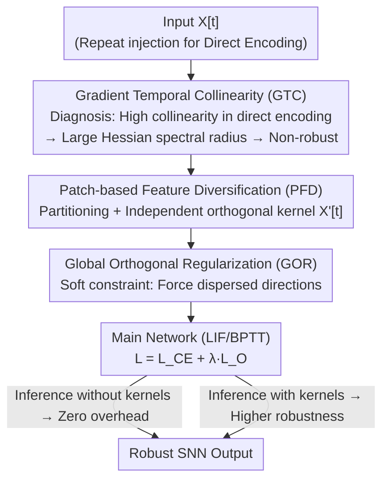

# Breaking Gradient Temporal Collinearity for Robust Spiking Neural Networks

**Conference**: ICLR2026  
**OpenReview**: [https://openreview.net/forum?id=udTDFAshNM](https://openreview.net/forum?id=udTDFAshNM)  
**Code**: https://github.com/Apple26419/SNN_STOD  
**Area**: Spiking Neural Networks / Adversarial Robustness  
**Keywords**: Spiking Neural Networks, Direct Encoding, Adversarial Robustness, Gradient Temporal Collinearity, Orthogonal Kernels

## TL;DR
Addressing the poor robustness of direct encoding Spiking Neural Networks (SNNs), this paper proposes "Gradient Temporal Collinearity" (GTC) as a quantifiable metric to explain why they are less resilient than rate encoding. The authors design STOD—inserting parameterized orthogonal kernels at the input layer for each timestep combined with global orthogonal regularization—to structurally decorrelate gradient directions across timesteps. This achieves significantly higher accuracy under FGSM and PGD attacks on CIFAR/ImageNet/DVS compared to existing SOTA, with nearly zero extra inference overhead.

## Background & Motivation
**Background**: SNNs use binary pulses to transmit information over time, offering low power consumption suitable for neuromorphic hardware in autonomous driving, robotics, and edge computing. Performance is largely determined by the "input encoding method." Rate encoding, which represents inputs via spike frequency, requires long sequences for fidelity, leading to explosive BPTT (Backpropagation Through Time) costs. To improve efficiency, direct encoding has become the mainstream, where the same raw data is **repeatedly injected** over a few timesteps, achieving high accuracy with short sequences and minimal feature loss.

**Limitations of Prior Work**: While fast and accurate, direct encoding is significantly less robust than rate encoding. Because the same input is fed at each timestep, membrane potentials accumulate highly correlated signals, causing the network to degenerate into an "amplified static feature extractor" that fails to utilize temporal dynamics for complementary information. Consequently, small perturbations accumulate and amplify across timesteps, leading to fragile representations. In contrast, rate encoding naturally provides "feature decorrelation" through stochastic spikes, where independent pulse patterns across timesteps prevent consistent error accumulation.

**Key Challenge**: A trade-off exists between efficiency/accuracy (favoring direct encoding) and robustness (favoring rate encoding). The challenge is whether the decorrelation mechanism of rate encoding can be integrated into direct encoding without sacrificing efficiency. Furthermore, an analytically grounded metric is needed to characterize this robustness gap beyond empirical comparisons.

**Key Insight**: The authors analyze **training dynamics**. Robustness is closely related to the spectral radius of the Hessian of parameters, which is dominated by the temporal structure of gradients. When the total gradient $\nabla_\theta L$ is decomposed into components $G[t]$ for each timestep, direct encoding results in highly collinear directions. This collinearity increases the Hessian spectral radius, undermining robustness.

**Core Idea**: Define and quantify "Gradient Temporal Collinearity" (GTC) as a diagnostic metric. Use a set of **parameterized orthogonal kernels + structural constraints** at the input layer to structurally disperse feature directions across timesteps, reducing GTC and enhancing SNN robustness without increasing inference overhead.

## Method

### Overall Architecture
The method consists of two parts: a new metric **GTC** to explain the lack of robustness in direct encoding (analysis), and **STOD (Structured Temporal Orthogonal Decorrelation)** to fix it (methodology).

GTC measures the directional consistency between any two timestep gradient components $G[i]$ and $G[j]$, defined as their normalized Frobenius inner product:

$$C(G[i],G[j])=\frac{\langle G[i],G[j]\rangle_F}{\|G[i]\|_F\cdot\|G[j]\|_F}\in[-1,1].$$

$C\to1$ indicates higher collinearity. Experiments show that the epoch-averaged GTC for direct encoding remains high (0.8–0.9), while rate encoding stays low (0.2–0.3). The authors derive a structured upper bound for the Hessian spectral radius: $\lambda_{\max}(\hat H_\theta)\lesssim T\cdot(\max_t\|G[t]\|_F^2)\cdot[1+(T-1)\max_{i\ne j}C(G[i],G[j])]$, demonstrating that higher GTC leads to a larger spectral radius and weaker robustness.

STOD modifies the input layer of direct encoding: Input $X[t]$ is partitioned, and an independent parameterized orthogonal kernel (PFD) is applied to each timestep to "expand" feature directions. A soft regularization (GOR) forces these directions to be more dispersed. During training, orthogonal kernels are updated as learnable parameters on the Stiefel manifold. During inference, kernels can be removed (robustness is "baked into" weights with zero overhead) or retained for higher robustness.

### Key Designs

**1. Gradient Temporal Collinearity (GTC): Quantifying the vulnerability of direct encoding**

The authors decompose the parameter gradient by timestep $\nabla_\theta L=\sum_{t=1}^T G[t]$ and define the collinearity $C(G[i],G[j])$. They use batch-averaged and epoch-averaged GTC $\bar C_b=\frac{2}{T(T-1)}\sum_{i<j}C(G_b[i],G_b[j])$ and $\bar C=\frac1B\sum_b\bar C_b$ for stable characterization. This links GTC to the **optimization nature of robustness**: by proving the Hessian spectral radius upper bound, they show that higher GTC leads to sharper loss landscapes. Reducing GTC thus becomes a theoretically supported optimization goal.

**2. Patch-based Feature Diversification (PFD): Structured orthogonal transforms for temporal diversity**

Unlike adding random noise, which lacks mechanical awareness and may cause gradient obfuscation, PFD applies an **independent parameterized orthogonal kernel** at each timestep. To manage complexity, the input $X[t]\in\mathbb R^{C\times H\times W}$ is divided into $N=\frac Hp\cdot\frac Wp$ non-overlapping patches (size $p$), flattened to $d=C\times p^2$ dimensions, and transformed via Kronecker product with an orthogonal kernel $O[t]\in\mathbb R^{d\times d}$: $X'[t]=\mathrm{vec}(P^{-1}(P(X[t])\otimes O[t]))$. The kernels follow three constraints: ① $t=1$ is initialized as identity for stability; ② Kernels are **mutually orthogonal** at initialization via Householder reflections to maximize early diversity; ③ Kernels maintain **self-orthogonality** $O[t]O[t]^\top=I_d$ to preserve energy ($\|X'[t]\|_2=\|X\|_2$), preventing pixel intensity drift.

**3. Global Orthogonal Regularization (GOR): Soft constraints for mutual orthogonality**

To prevent kernels from converging during training, GOR acts as a soft constraint punishing directional similarity between transformed inputs:

$$L_O=\sum_{1\le i<j\le T}\cos^2(\hat X'[i],\hat X'[j]),$$

where $\hat X'$ is the normalized transformed input. The final objective is $L=L_{CE}+\lambda_O L_O$. This maintains flexibility in parameter updates while avoiding the extreme computational cost of hard mutual-orthogonality constraints on the $d^2T$-dimensional Stiefel manifold.

### Loss & Training
The total loss is $L=L_{CE}+\lambda_O L_O$. Orthogonal kernels are constrained to the Stiefel manifold and optimized using RiemannianSGD. Training utilizes BPTT with surrogate gradients. Primary hyperparameters include timesteps $T$, patch size $p$, and regularization strength $\lambda_O$. Inference can be performed as "STOD w/o OK" (zero overhead) or "STOD" (retaining kernels, ~+0.15M parameters).

## Key Experimental Results

### Main Results
Testing on CIFAR-10/100, ImageNet, and DVS datasets (DVS-CIFAR10, DVS-Gesture) against FGSM and PGD ($\varepsilon=8/255$) attacks:

| Dataset | Attack | Standard SNN | Best Baseline | STOD w.o. OK |
|--------|------|---------|--------------|--------------|
| CIFAR-10 | FGSM | 8.19 | 54.76 (HoSNN) | **55.80** |
| CIFAR-10 | PGD | 0.03 | 28.35 (FEEL) | **32.97** |
| CIFAR-100 | FGSM | 4.55 | 16.31 (AT) | **26.26** |
| CIFAR-100 | PGD | 0.19 | 8.49 (AT) | **13.13** |
| ImageNet | FGSM | 4.99 | 15.74 (AT) | **19.08** |
| ImageNet | PGD | 0.01 | 6.39 (AT) | **6.44** |

STOD is more balanced across attack types compared to baselines like HoSNN (strong FGSM, weak PGD) or FEEL (strong PGD, weak FGSM). The clean accuracy is slightly lower (e.g., 91.43% vs ~93% on CIFAR-10), but the robustness gain significantly outweighs this.

### Ablation Study

| Configuration | CIFAR-10 FGSM/PGD | Note |
|------|-------------------|------|
| STOD w.o. OK | 55.80 / 32.97 | Zero overhead, exceeds SOTA |
| STOD (w/ OK) | 59.16 / 36.72 | Retaining kernels adds +3.4/+3.8 gain |
| patch $p=8$ | Peak | Optimal balance between structure and detail |
| Increase $\lambda_O$ | Lower GTC | Stronger regularization reduces GTC, trade-off with clean acc |

### Key Findings
- **GTC as a Causal Knob**: Increasing $\lambda_O$ directly lowers GTC and raises robustness, validating the mechanism.
- **Detachable Kernels**: "STOD w.o. OK" proves robustness is successfully "baked" into the network weights during training.
- **No Gradient Obfuscation**: Robustness holds under black-box and RGA attacks; visualization shows distinct, meaningful gradient structures rather than noise.

## Highlights & Insights
- **Quantifiable Metric**: GTC turns qualitative intuition into an optimizable target via the Hessian spectral radius bound.
- **Orthogonal Kernels vs. Noise**: Uses energy-preserving transforms instead of random noise, preventing gradient obfuscation while allowing learnable diversity via Stiefel manifolds.
- **Engineering Trade-offs**: Hard constraints for self-orthogonality and soft constraints for mutual orthogonality balance flexibility and computational cost.
- **Training Shaping, Inference Dropping**: Enables robust deployment on neuromorphic hardware with zero additional runtime cost.

## Limitations & Future Work
- **Clean Accuracy Loss**: Decorrelation comes at a slight cost to clean sample performance (0.x–1.0%).
- **ImageNet Scaling**: ImageNet's higher resolution and deeper backbones naturally have lower redundancy, resulting in smaller relative gains compared to AT.
- **Task Specificity**: Evaluation is primarily on static/DVS visual classification; detection or sequence control tasks remain to be explored.
- **Hyperparameter Sensitivity**: The optimal patch size $p$ may vary with input resolution and requires tuning.

## Related Work & Insights
- **vs. Rate Encoding**: STOD achieves similar decorrelation benefits without the latency and high sequence cost of rate encoding.
- **vs. Neuron/Regularization Methods**: Unlike DLIF or HoSNN which focus on neuron dynamics (Lipschitz constraints, membrane stability), STOD targets the **temporal structure of input encoding** and can be combined with AT for further gains.
- **vs. Noise Injection**: STOD provides interpretable, stable temporal diversity compared to stochastic noise methods that risk gradient obfuscation.

## Rating
- Novelty: ⭐⭐⭐⭐⭐ GTC metric + Hessian bound provides a strong mechanistic explanation.
- Experimental Thoroughness: ⭐⭐⭐⭐ Extensive datasets and attacks, including checks for fake robustness.
- Writing Quality: ⭐⭐⭐⭐ Logical flow from motivation to mechanism to empirical validation.
- Value: ⭐⭐⭐⭐ Practical for SNN deployment in safety-critical edge environments due to zero inference overhead.

## Related Papers

- [\[ICLR 2026\] A Brain-Inspired Gating Mechanism Unlocks Robust Computation in Spiking Neural Networks](a_brain-inspired_gating_mechanism_unlocks_robust_computation_in_spiking_neural_n.md)
- [\[ICLR 2026\] Beyond Linear Processing: Dendritic Bilinear Integration in Spiking Neural Networks](beyond_linear_processing_dendritic_bilinear_integration_in_spiking_neural_networ.md)
- [\[ICLR 2026\] Online Pseudo-Zeroth-Order Training of Neuromorphic Spiking Neural Networks](online_pseudo-zeroth-order_training_of_neuromorphic_spiking_neural_networks.md)
- [\[AAAI 2026\] DS-ATGO: Dual-Stage Synergistic Learning via Forward Adaptive Threshold and Backward Gradient Optimization for Spiking Neural Networks](../../AAAI2026/others/ds-atgo_dual-stage_synergistic_learning_via_forward_adaptive_threshold_and_backw.md)
- [\[ICLR 2026\] Fractional-Order Spiking Neural Network](fractional-order_spiking_neural_network.md)

<!-- RELATED:END -->

<!-- RELATED:START -->

## Related Papers

- [\[ICLR 2026\] A Brain-Inspired Gating Mechanism Unlocks Robust Computation in Spiking Neural Networks](a_brain-inspired_gating_mechanism_unlocks_robust_computation_in_spiking_neural_n.md)
- [\[ICLR 2026\] Beyond Linear Processing: Dendritic Bilinear Integration in Spiking Neural Networks](beyond_linear_processing_dendritic_bilinear_integration_in_spiking_neural_networ.md)
- [\[ICLR 2026\] Online Pseudo-Zeroth-Order Training of Neuromorphic Spiking Neural Networks](online_pseudo-zeroth-order_training_of_neuromorphic_spiking_neural_networks.md)
- [\[AAAI 2026\] DS-ATGO: Dual-Stage Synergistic Learning via Forward Adaptive Threshold and Backward Gradient Optimization for Spiking Neural Networks](../../AAAI2026/others/ds-atgo_dual-stage_synergistic_learning_via_forward_adaptive_threshold_and_backw.md)
- [\[ICLR 2026\] Fractional-Order Spiking Neural Network](fractional-order_spiking_neural_network.md)

<!-- RELATED:END -->
