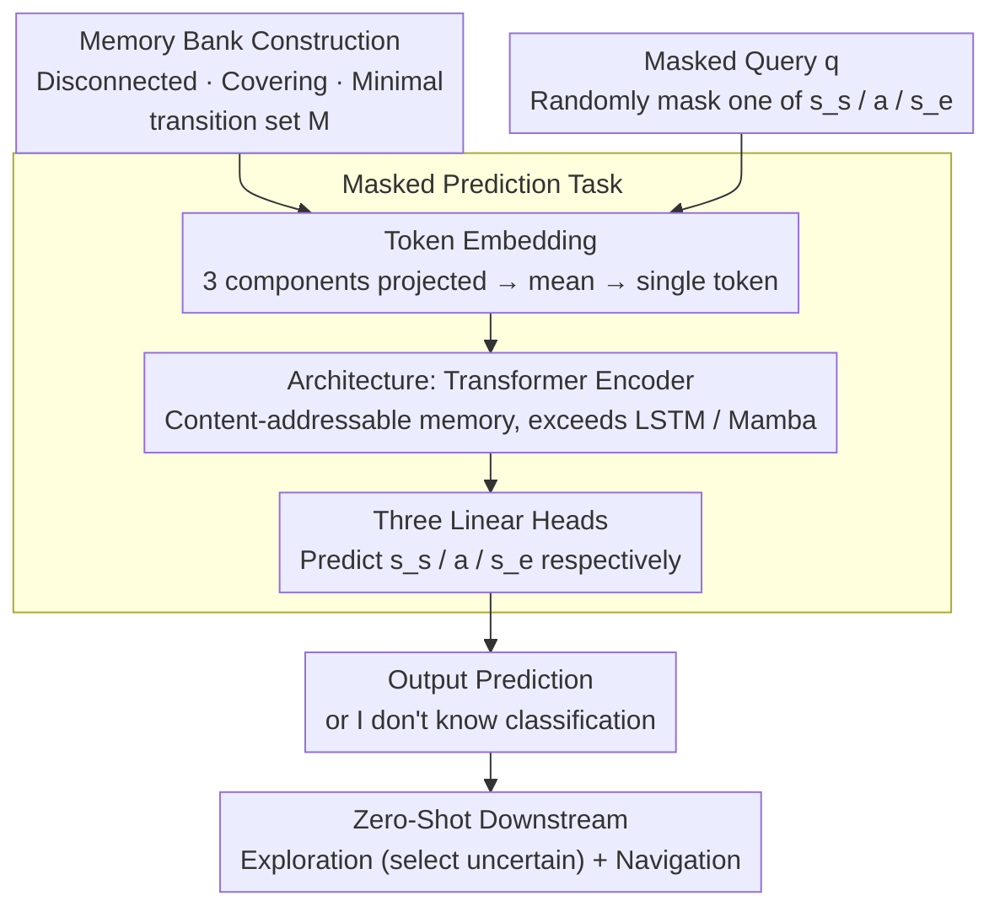

# Building Spatial World Models from Sparse Transitional Episodic Memories

**Conference**: ICLR2026  
**arXiv**: [2505.13696](https://arxiv.org/abs/2505.13696)  
**Code**: To be confirmed  
**Area**: Robotics  
**Keywords**: world model, episodic memory, spatial reasoning, cognitive map, navigation

## TL;DR
The paper proposes the Episodic Spatial World Model (ESWM), which builds spatial world models from sparse, disconnected episodic memories (one-step transitions). Its latent space spontaneously develops cognitive maps aligned with environmental topology and supports zero-shot exploration and navigation.

## Background & Motivation

**Background**: Existing World Models typically require long continuous trajectories for training, encoding environmental knowledge into model weights. Representative methods such as TEM and GTM-SM rely on continuous observation sequences and assume a fixed structure shared across environments.

**Limitations of Prior Work**: (1) Observations of agents in real-world scenarios are often fragmented—visiting different parts of an environment at different times, making it impossible to obtain long continuous trajectories; (2) Environments may undergo structural changes (e.g., adding obstacles), and weight-coded models require retraining to adapt; (3) Sequential models incur massive computational overhead when processing large environments.

**Key Challenge**: Existing models encode environmental structure knowledge in weights, resulting in: (a) an inability to rapidly build maps from fragmented experiences, and (b) an inability to dynamically adapt to environmental changes.

**Goal**: Whether a consistent spatial world model can be rapidly constructed solely from sparse, disconnected episodic memories?

**Key Insight**: Inspired by neuroscience—the medial temporal lobe (MTL) is responsible for both spatial representation and episodic memory, constructing relational networks by integrating overlapping episodic memories. The authors hypothesize that a model does not need continuous trajectories but only a set of independent one-step transitions to infer the complete spatial structure.

**Core Idea**: Transform world modeling from sequential learning into set-based reasoning—using a Transformer to infer spatial relationships from an unordered set of disconnected episodic memories.

## Method

### Overall Architecture
The core question ESWM addresses is whether the complete spatial structure of an environment can be inferred from a collection of fragmented episodic memories without relying on continuous trajectories. Its input consists of a **memory bank $M$** (an unordered set of multiple disconnected one-step transitions $(s_s, a, s_e)$) and a **partially masked query transition $q$** (randomly masking one of the start state, action, or end state). The goal is to complete the masked component in $q$. The pipeline is straightforward: the three components of each transition in the memory bank are projected and averaged into a single token; all memory tokens, along with the query token, are fed into a Transformer encoder, and finally, three linear heads read out the predictions. When a query falls into an area not covered by the memory bank, the model outputs "I don't know." This essentially reformulates world modeling from sequential learning into **set-to-value reasoning**—inferring unobserved spatial relationships from fragmented memories. The trained model can be directly applied to zero-shot exploration and navigation tasks.

Training follows a **meta-learning** strategy: each sample involves a randomly sampled environment, memory bank, query, and masking mode. This prevents the model from memorizing specific environments and forces it to learn generalized spatial reasoning capabilities.

### Key Designs

**1. Memory Bank Construction: Forcing Multi-step Reasoning via Minimal Covering Sets**

The memory bank generated for each environment is not just a random collection of transitions; it must satisfy three properties: **disconnected** (transitions do not form a continuous path), **coverage** (the transitions, viewed as edges, cover every location and form a connected graph), and **minimality** (removing any transition disconnects the graph). Minimality is the critical constraint—it ensures no redundant edges for "direct lookup." To answer any cross-fragment query, the model must integrate multiple disconnected fragments and infer spatial relationships never directly observed. In other words, the structure of the memory bank forces the model to perform multi-step reasoning.

**2. Masked Prediction Task: A Unified Set-to-Value Interface for Spatial Reasoning**

The model solves $q^* = f(M, q)$, where $f$ is the Transformer encoder. Regarding specific encoding, the three components $(s_s, a, s_e)$ of each transition are projected into a shared high-dimensional space and averaged into a single token. Masking different components tests different abilities: masking $s_e$ is **forward prediction** (predicting next state), masking $a$ is **action reasoning** (inferring action between states), and masking $s_s$ is **inverse reasoning** (inferring start state). Sharing parameters across three masking types forces Ours to learn bidirectional, composable spatial relationships rather than a unidirectional transition function.

**3. "I don't know" Uncertainty Classification: Explicitly Modeling Unknowns as Exploration Signals**

When the memory bank lacks data for a specific region, some queries are unsolvable. During training, parts of the memory are randomly removed to create unobserved areas; for queries involving these areas, the correct label is an additional "I don't know" category. This is the foundation for zero-shot exploration: the agent can monitor the "I don't know" probability for candidate actions and prioritize directions with high uncertainty and information gain.

**4. Architectural Choice: Attention as a Prerequisite for Fragmented Memory Generalization**

The authors compared three backbones: Transformer (ESWM-T), LSTM (ESWM-LSTM), and Mamba (ESWM-MAMBA). Only the Transformer succeeded in the Open Arena task requiring compositional generalization; LSTM and Mamba overfit to training environments. This suggests that the attention mechanism acts as a content-addressable memory, capable of retrieving and associating relevant fragments from an unordered set—exactly what is needed for spatial reasoning from episodic memory.

### Loss & Training
The model uses cross-entropy loss with equal weights for the $s_s, a, s_e$ prediction heads. It is trained for 460K iterations with a batch size of 128 and a cosine learning rate schedule. The meta-learning setup ensures that the environment, memory bank, and query are randomly generated for each sample.

## Key Experimental Results

### Main Results

| Environment | Model | State Prediction Acc | Action Prediction Acc | vs TEM-T |
|------|------|---------------|---------------|-----------|
| Open Arena | ESWM-T-2L | ~85% ($s_s$), ~85% ($s_e$) | ~95% ($a$) | TEM-T significantly lower than ESWM-T |
| Random Wall | ESWM-T-14L | High accuracy | High accuracy | TEM-T completely fails (cannot handle variable structures) |
| MiniGrid 9×9 | ESWM-T-12L | Successful | Successful | — |
| ProcThor 3D | ESWM-T-12L | High cosine similarity | Accurate $\Delta xy$, $\Delta\theta$ | — |

### Downstream Task Performance

| Task | Metric | Ours | EPN (baseline) | Best Oracle |
|------|------|------|---------------|------------|
| Exploration (15 steps) | Unique States Visited | 16.8% more than EPN | — | Ours reaches 96.48% of Oracle |
| Navigation (Success Rate) | Success Rate | 96.8% | 78.8% (+18%) | — |
| Navigation (Path Optimality) | Path Optimality | 99.2% | 78.2% (+21%) | — |
| Adaptability (Nav w/ Obstacles) | Success Rate | 93% | 72% | Baseline drops to 56% |

### Key Findings
- The Transformer's attention mechanism is key to learning spatial reasoning from episodic sets; LSTM and Mamba fail in tasks requiring compositional generalization.
- A spatial map consistent with environment topology spontaneously emerges in the latent space of Ours (ISOMAP projections show smooth manifolds, with obstacles corresponding to local discontinuities).
- Path lengths in latent space and physical space are highly correlated ($R^2 = 0.89$).
- Prediction uncertainty (output entropy) increases monotonically with the path length required for memory integration, proving the model performs multi-step reasoning.
- High sample efficiency: Ours achieves superior navigation with only 1/4 of the memory required by EPN.

## Highlights & Insights
- **From Set Reasoning to Spatial Maps**: The core innovation is transforming world modeling from sequential processing into set-based reasoning. The model requires only independent transition memories rather than continuous trajectories, reducing data requirements and naturally supporting dynamic environments.
- **Decoupling Memory and Reasoning**: Environmental knowledge is stored in an external memory bank rather than model weights, enabling true "plug-and-play" adaptation—modifying a few memories allows adaptation to environmental changes without retraining.
- **Spontaneous Emergence of Cognitive Maps**: The model is not explicitly taught spatial structure, yet the latent space naturally forms geometric maps consistent with topology. This aligns closely with findings regarding hippocampal place cells in neuroscience.
- **Zero-Shot Downstream Capability**: Exploration and navigation do not require additional training; they are achieved by directly utilizing the world model's predictions and uncertainty estimates to implement near-optimal policies.

## Limitations & Future Work
- Experimental environments are primarily controlled discrete or simple continuous settings; validation in real-world robotic scenarios is still needed.
- ProcThor experiments only demonstrate feasibility without comparison against strong baselines.
- The minimality constraint for memory banks is difficult to satisfy in reality, where memory often contains redundancy and noise.
- Currently only processes spatial structure; does not model semantic information (e.g., object categories, functional attributes).
- Meta-learning training costs are high (460K iterations), and the distribution of pre-training environments may limit generalization.

## Related Work & Insights
- **vs TEM (Whittington et al.)**: TEM assumes all environments share a unified structural template encoded into RNN weights; Ours makes no such assumption and dynamically reasons from external memory, handling variable structures. TEM fails completely on the Random Wall task.
- **vs GTM-SM (Fraccaro et al.)**: GTM-SM also relies on sequential trajectories and assumes shared structures; Ours operates on disconnected episodic memories and is more sample-efficient.
- **vs Ha & Schmidhuber (2018) World Models**: Traditional world models encode knowledge in weights and cannot adapt quickly; the external memory mechanism of Ours enables instant adaptation.
- This work provides a new paradigm for embodied AI: instead of extensive training in target environments, a functional spatial model can be established using a small amount of exploratory memory.

## Rating
- Novelty: ⭐⭐⭐⭐⭐ Conceptually breakthrough by transforming world modeling into set reasoning.
- Experimental Thoroughness: ⭐⭐⭐⭐ Sufficient analysis from grid worlds to 3D environments, though real-world validation is lacking.
- Writing Quality: ⭐⭐⭐⭐⭐ Clear logic, excellent visualizations, and a natural fusion of neuroscience motivation and computational methods.
- Value: ⭐⭐⭐⭐⭐ Proposes an influential new paradigm and contributes significantly at the intersection of cognitive science and AI.

<!-- RELATED:START -->

## Related Papers

- [\[ICLR 2026\] LPWM: Latent Particle World Models for Object-Centric Stochastic Dynamics](latent_particle_world_models_self-supervised_object-centric_stochastic_dynamics_.md)
- [\[AAAI 2026\] Beyond World Models: Rethinking Understanding in AI Models](../../AAAI2026/others/beyond_world_models_rethinking_understanding_in_ai_models.md)
- [\[ICLR 2026\] Hippoformer: Integrating Hippocampus-inspired Spatial Memory with Transformers](hippoformer_integrating_hippocampus-inspired_spatial_memory_with_transformers.md)
- [\[ICML 2025\] General Agents Contain World Models](../../ICML2025/others/general_agents_contain_world_models.md)
- [\[ICLR 2026\] Characterizing and Optimizing the Spatial Kernel of Multi Resolution Hash Encodings](characterizing_and_optimizing_the_spatial_kernel_of_multi_resolution_hash_encodi.md)

<!-- RELATED:END -->
