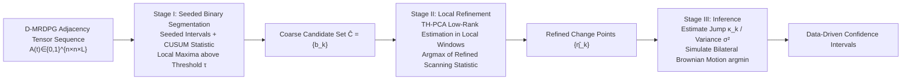

# Change Point Localization and Inference in Dynamic Multilayer Networks

**Conference**: ICLR 2026  
**OpenReview**: [https://openreview.net/forum?id=bwtiK0yjuK](https://openreview.net/forum?id=bwtiK0yjuK)  
**Code**: To be confirmed  
**Area**: Statistical Learning / Change Point Detection / Dynamic Networks  
**Keywords**: change point detection, dynamic multilayer networks, D-MRDPG, seeded binary segmentation, low-rank tensor estimation, limiting distribution, confidence interval  

## TL;DR
Addressing the Dynamic Multilayer Random Dot Product Graph (D-MRDPG) where shared latent positions are fixed but connection weights of layers change abruptly over time, this paper proposes a two-stage offline change point localization algorithm combining "Seeded Binary Segmentation + Low-Rank Tensor Refinement." It provides the first consistency guarantee for the number and locations of change points, establishes the limiting distribution of the refined estimator, and constructs data-driven confidence intervals.

## Background & Motivation

**Background**: Network change point analysis is a mature field in statistics, with existing offline/online methods for inhomogeneous Bernoulli networks, Stochastic Block Models (SBM), and single-layer Random Dot Product Graphs (RDPG). However, real-world systems are often **multilayer networks**—where multiple types of interactions exist between the same set of nodes (e.g., trade of different agricultural products, airline routes), where layers are heterogeneous but share underlying node attributes.

**Limitations of Prior Work**: Change point detection in multilayer dynamic networks was previously a near-void. The most relevant work, Wang et al. (2025), only addressed **online** detection for D-MRDPG, with a localization rate of $\kappa^{-2}(d^2 m_{\max}+nd+Lm_{\max})\log(\Delta/\alpha)$. In an offline setting, there were neither localization algorithms nor results regarding **inference** (limiting distribution, confidence intervals). General graph change point methods (gSeg, kerSeg) compress multilayer networks into a single similarity graph or use Frobenius norms, discarding layer structures and low-rank signals, leading to poor sensitivity under dense, small-magnitude changes.

**Key Challenge**: Multilayer tensor data is high-dimensional ($n\times n\times L$) and heavily noisy. Direct CUSUM scanning is both slow and inaccurate. However, leveraging the structure of "shared latent positions + low-rank layer weight matrices" should theoretically yield a sharper localization rate than single-layer methods. The core difficulty lies in translating these structural priors into algorithms and asymptotic theory.

**Goal**: In an offline setting, simultaneously solve **localization** (estimating the number of change points $K$ and positions $\eta_k$) and **inference** (providing limiting distributions and confidence intervals for $\hat\eta_k$) for D-MRDPG.

**Key Insight**: Use **Seeded Binary Segmentation** to efficiently identify candidate change points (coarse localization), followed by **Tensor Heteroscedastic PCA (TH-PCA) low-rank estimation** to refine the scanning statistic within a local window (fine localization). Theoretically, it is proven that the refined estimator under a vanishing jump converges to the argmin of a **bilateral Brownian motion + drift** random walk, allowing for the construction of confidence intervals via quantile simulation.

## Method

### Overall Architecture

The model is defined as D-MRDPG: at each time $t$, an $L$-layer adjacency tensor $A(t)\in\{0,1\}^{n\times n\times L}$ is observed. The connection probabilities for each layer are determined by $P_{i,j,l}(t)=X_i^\top W^{(l)}(t)X_j$, where latent positions $\{X_i\}$ are fixed and shared, and only the layer weight matrices $\{W^{(l)}(t)\}$ vary over time; jumps occur if and only if $t$ is a change point. The algorithm (Algorithm 1) consists of three stages: Stage I uses CUSUM statistics on seeded intervals for Seeded Binary Segmentation (SBS) to produce coarse candidates. Stage II uses TH-PCA in local windows around each coarse candidate to project the noisy CUSUM tensor into a low-rank subspace, obtaining a refined scanning statistic whose maximum point is the final change point. Stage III (Inference) estimates the jump variance at the refined points and simulates the limiting distribution to obtain confidence intervals.

### Key Designs

**1. Seeded Binary Segmentation + CUSUM Coarse Localization: Replacing random sampling with logarithmic interval coverage.** Stage I follows the seeded interval idea of Kovács et al. (2023): deterministically placing a family of intervals $\mathcal{J}=\bigcup_j \mathcal{J}_j$ across $J=\lceil C_J\log_2 T\rceil$ scales. For each interval $(s,e]$, the CUSUM tensor $\widetilde{B}_{s,e}(t)=\sum_{u=s+1}^{e}\omega^t_{s,e}(u)B(u)$ is calculated with weights $\omega^t_{s,e}(u)=\sqrt{(e-t)/[(e-s)(t-s)]}$ ($u\le t$) and $-\sqrt{(t-s)/[(e-s)(e-t)]}$ ($u>t$). Points that maximize the inner product statistic $\langle\widetilde{A}_{\alpha,\beta}(t),\widetilde{B}_{\alpha,\beta}(t)\rangle$ above threshold $\tau$ are taken as candidates. Using two independent split sequences $A,B$ eliminates self-correlation (parity splitting is used in practice).

**2. TH-PCA Low-Rank Tensor Refinement: Compressing noise into the signal subspace for a sharper localization rate.** Key to Stage II is that the expected CUSUM tensor $\widetilde{P}_{s,e}(t)=\mathcal{S}\times_1 X\times_2 X\times_3 \widetilde{Q}_{s,e}(t)$ possesses a Tucker low-rank structure (mode-1,2 ranks $\le d$; mode-3 rank $m$ controlled by weights $Q(u)$). Within a local window $(s_k,e_k]$ around each coarse candidate $b_k$, TH-PCA (Han et al. 2022) projects the noisy CUSUM tensor into a $(d,d,m)$ low-rank subspace to obtain $\widehat{P}_{s_k,e_k}(b_k)$. The refined scanning statistic is $\widehat{D}^{s_k,e_k}_{b_k}(t)=\langle \widehat{P}_{s_k,e_k}(b_k)/\|\cdot\|_F,\ \widetilde{A}'_{s_k,e_k}(t)\rangle$. This projection reduces noise from $O(n^2L)$ to the effective degrees of freedom $O(nL^{1/2}+d^2m+nd+Lm)$, tightening the localization error from $\epsilon_k=C_\epsilon\log(T)/\kappa_k^2$ in Theorem 1 to $O_p(\kappa_k^{-2})$ in Theorem 2.

**3. Limiting Distribution and Confidence Intervals under Double Jumps: Characterizing estimators as random walk argmin.** Theorem 2 establishes that under a vanishing jump ($\kappa_k\to 0$), the refined estimator satisfies $\kappa_k^2(\hat\eta_k-\eta_k)\xrightarrow{D}\arg\min_{r}P_k(r)$, where the drift-noise process is:

$$
P_k(r)=\begin{cases} r+2\sigma_{k,k}\,\mathbb{B}_1(r), & r<0,\\ 0, & r=0,\\ r+2\sigma_{k,k+1}\,\mathbb{B}_2(r), & r>0,\end{cases}
$$

$\mathbb{B}_1, \mathbb{B}_2$ are independent standard Brownian motions. Using distinct variances $\sigma_{k,k}^2, \sigma_{k,k+1}^2$ reflects the asymmetric noise before and after the change point. This is the first result for the limiting distribution of change point estimators in network data. CIs are constructed by estimating $\hat\kappa_k$, the normalized jump tensor $\hat\Psi_k$, and variances $\hat\sigma^2$, then simulating the empirical quantiles.

## Key Experimental Results

### Main Results (Simulation, Four Scenarios)

CPDmrdpg was compared against gSeg (Chen & Zhang 2015) and kerSeg (Song & Chen 2024). Metrics: Error in number of change points $|\widehat{K}-K|$, Hausdorff distance $d$, and interval coverage $\mathcal{C}$.

| Method | $\lvert\widehat{K}-K\rvert$ ($n{=}50$) | $\mathcal{C}$ ($n{=}50$) | $\lvert\widehat{K}-K\rvert$ ($n{=}100$) | $\mathcal{C}$ ($n{=}100$) |
|---|---|---|---|---|
| **CPDmrdpg** | **0.01** | **99.86%** | **0.00** | **100%** |
| gSeg (nets.) | 1.09 | 52.82% | 1.12 | 52.62% |
| kerSeg (nets.) | 0.10 | 99.13% | 0.12 | 99.17% |
| gSeg (frob.) | 0.52 | 90.12% | 0.47 | 88.71% |
| kerSeg (frob.) | 0.26 | 98.35% | 0.30 | 98.11% |

(Scenario 1, $n=50/100$) CPDmrdpg achieved near-perfect estimation. gSeg underperformed significantly with network inputs due to high false positives/negatives.

### Confidence Interval Evaluation

The 95% CIs constructed in Section 3.1 showed strong coverage and reasonable lengths across most scenarios. Coverage slightly decreased in Scenario 3 (violating Model 1), consistent with theoretical expectations when assumptions are breached.

### Real Data (Global Agricultural Trade Network)

FAO data (1986–2020, $T=35$) with $n=75$ countries and $L=4$ major agricultural products. CPDmrdpg detected change points in **1991, 1999, 2005, and 2013**, corresponding to the German reunification/USSR collapse, the 3rd WTO Ministerial Conference, the WTO agreement on agricultural export subsidies, and the WTO Bali Package. gSeg failed after 2010.

### Key Findings
- Low-rank tensor refinement is the performance watershed: it removes the logarithmic factor from the localization rate and allows for "free" multi-layer expansion.
- Compressing multilayer networks into scalar norms (frob.) loses signals but remains superior to compressing them into single graphs (nets.).
- Data-driven CIs are reliable when the model holds and expose method boundaries when assumptions are violated.

## Highlights & Insights
- **First Offline Multilayer Network Change Point Framework**: Integrates localization and inference (limiting distribution + CI), filling the gap in offline D-MRDPG.
- **"Cheap Coarse Localization + Low-Rank Fine Localization" Paradigm**: Discouples recall and precision, keeping total cost at $O(Tn^2Lr\log^2(T\vee n))$.
- **Sophisticated Bilateral Brownian Motion**: Recognizes asymmetric noise variances on both sides of a change point, providing a more accurate characterization than single-sided settings.
- **Strong Interpretability**: Trade network change points align with WTO policies and geopolitical events with narrow CIs.

## Limitations & Future Work
- **Change point density**: The $\Delta=\Theta(T)$ assumption precludes frequent change points; authors suggest using narrowest-over-threshold strategies for relaxation.
- **Inference requires vanishing jumps**: Limiting distributions for non-vanishing jumps ($\kappa_k\to\kappa>0$) are discussed in the appendix, but practical CI construction (possibly via bootstrap) remains future work.
- **Temporal independence**: Assumes independent adjacency tensors over time. Extensions to temporal dependence are discussed in Appendix B but not in the main results.
- **Fixed latent positions**: The main model assumes fixed $X_i$; more general latent position drifts are only discussed in Appendix C.

## Related Work & Insights
- **Network Change Point Lineage**: Online methods include Yu et al. (2021) and Wang et al. (2025). Offline methods include Wang et al. (2021) for single layers. This work is the first for offline × multilayer settings.
- **Mechanism**: Combines SBS (Kovács et al. 2023), CUSUM (Page 1954), and TH-PCA (Han et al. 2022) into a "Recall-Refine-Infer" pipeline with unified asymptotic theory.
- **Insight**: For high-dimensional structured data, "coarse screening with cheap statistics followed by local refinement using spectral/low-rank methods" is a universally superior route. The bilateral Brownian motion template provides a roadmap for inference in other tensor/graph sequences.

## Rating
- **Novelty**: ⭐⭐⭐⭐⭐ First localization + inference framework for offline multilayer networks.
- **Experimental Thoroughness**: ⭐⭐⭐⭐ Comprehensive simulations and real-world validation; lack of extremely large-scale comparisons.
- **Writing Quality**: ⭐⭐⭐⭐ Clear structure and theory; notation-heavy but well-organized.
- **Value**: ⭐⭐⭐⭐ Practical tool for multi-layer dynamic systems like transportation/trade networks.

<!-- RELATED:START -->

## Related Papers

- [\[ECCV 2024\] Improving Point-based Crowd Counting and Localization Based on Auxiliary Point Guidance](../../ECCV2024/others/improving_point-based_crowd_counting_and_localization_based_on_auxiliary_point_g.md)
- [\[ICML 2025\] Fixed-Confidence Multiple Change Point Identification under Bandit Feedback](../../ICML2025/others/fixed-confidence_multiple_change_point_identification_under_bandit_feedback.md)
- [\[ICLR 2026\] PriorGuide: Test-Time Prior Adaptation for Simulation-Based Inference](priorguide_test-time_prior_adaptation_for_simulation-based_inference.md)
- [\[AAAI 2026\] Model Change for Description Logic Concepts](../../AAAI2026/others/model_change_for_description_logic_concepts.md)
- [\[ICLR 2026\] Any-Subgroup Equivariant Networks via Symmetry Breaking](any-subgroup_equivariant_networks_via_symmetry_breaking.md)

<!-- RELATED:END -->
