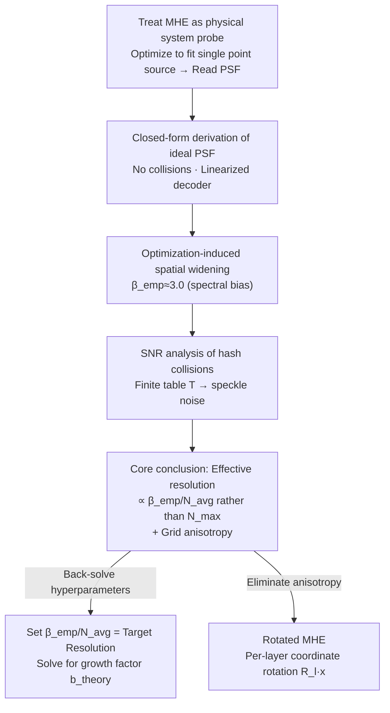

# Characterizing and Optimizing the Spatial Kernel of Multi Resolution Hash Encodings

**Conference**: ICLR2026  
**arXiv**: [2602.10495](https://arxiv.org/abs/2602.10495)  
**Code**: To be confirmed  
**Area**: Others  
**Keywords**: multi-resolution hash encoding, neural radiance field, point spread function, spatial anisotropy, Instant-NGP

## TL;DR
Analyzes the Multi-Resolution Hash Encoding (MHE) of Instant-NGP from a physical system perspective, deriving a closed-form approximation of its Point Spread Function (PSF). It reveals that the effective resolution is determined by the average resolution $N_{\text{avg}}$ rather than the finest resolution $N_{\max}$, identifies grid-induced anisotropy, and proposes a zero-overhead Rotated MHE (R-MHE) to eliminate anisotropy by rotating input coordinates per layer.

## Background & Motivation

**Background**: Multi-Resolution Hash Encoding (MHE) is the core innovation of Instant-NGP, providing efficient spatial parameterization for NeRF and SDF. However, its behavior is highly dependent on hyperparameters (number of layers $L$, growth factor $b$, resolution $N_{\max}/N_{\min}$, and hash table size $T$), which are typically selected through heuristics.

**Limitations of Prior Work**: MHE lacks rigorous analysis from a physical system perspective. No prior work has addressed: What is the shape of the equivalent spatial kernel of MHE? What is its true resolution limit? How do hash collisions quantitatively affect quality?

**Key Challenge**: Intuitively, it was believed that MHE resolution is determined by the finest layer $N_{\max}$. In practice, however, optimization dynamics lead to significant spatial widening, causing the real resolution to be far below $N_{\max}$.

**Goal**: Establish a rigorous physical analysis framework to understand the spatial behavior of MHE and guide hyperparameter selection and architectural improvements.

**Key Insight**: Characterize the spatial properties—resolution, anisotropy, and collision noise—of MHE by measuring its response to a point source constraint (PSF), analogous to the Green's function in physical systems.

**Core Idea**: The effective resolution of MHE is jointly determined by $N_{\text{avg}}$ and an empirical optimization widening factor $\beta_{\text{emp}}$, rather than $N_{\max}$ alone; grid anisotropy can be eliminated through per-layer rotation.

## Method

### Overall Architecture
This paper does not propose a new model but instead answers a long-ignored question: what does the equivalent spatial kernel of Instant-NGP's Multi-Resolution Hash Encoding (MHE) look like, how high is the real resolution, and how do hash collisions degrade quality. The authors treat MHE as a physical system probe—measuring its response to a single point source constraint, i.e., the Point Spread Function (PSF), much like using a Green's function in optics or physics to characterize a system. The analysis progresses in three steps: first, a closed-form PSF approximation is derived under an ideal collision-free setting; second, the extent to which optimization widens this kernel is measured; third, collision noise from finite hash capacity is incorporated into an SNR framework. The final conclusion yields a counter-intuitive judgment—resolution is determined by the average resolution $N_{\text{avg}}$ rather than the finest layer $N_{\max}$—which informs the proposal of the zero-overhead Rotated MHE (R-MHE).

### Key Designs

**1. Closed-form derivation of ideal PSF: Clarifying the spatial response of MHE without hash collisions**

To determine the "shape of the equivalent spatial kernel," the problem is simplified by assuming a linearized decoder and no collisions in the hash table. In this case, the response of MHE after optimization for a single point source is equivalent to the average superposition of normalized B-spline kernels across $L$ layers: $P_{\text{Ideal}}(\mathbf{x}) = \frac{1}{L}\sum_{l} \hat{B}_l(\mathbf{x})$. By replacing the summation with an integral approximation and applying a Taylor expansion to the B-splines, a closed-form is obtained:

$$P \approx \frac{1}{L\ln b}\left[-\ln\|\mathbf{v}\| + C_D - A_D(\mathbf{v})\right]$$

where $A_D(\mathbf{v})$ represents the anisotropy term inherent to the B-spline. This closed-form reveals two properties: the PSF exhibits **logarithmic radial decay** (neither Gaussian nor exponential) and is **narrower along the coordinate axes than along diagonals**—indicating that grid-encoded kernels are naturally anisotropic.

**2. Optimization-induced spatial widening: Real trained PSF is much wider than the ideal**

The ideal PSF represents only a lower bound; the kernel after actual training is significantly widened. This is a primary counter-intuitive finding. The total widening factor is split into two components $\beta_{\text{emp}} = \beta_{\text{ideal}} \cdot \beta_{\text{opt}}$: where $\beta_{\text{ideal}} \approx 1.18$ is inherent to the B-spline, and $\beta_{\text{opt}} > 1$ arises from the optimization process. Empirically, with the Adam optimizer, $\beta_{\text{emp}} \approx 3.0$, meaning the effective FWHM is approximately 2.5 times the ideal value. The root cause is spectral bias—the preference for low-frequency learning causes coarse layers (low $N_l$) to be over-weighted, widening the spatial kernel. The direct consequence is that the critical distance $d_{\text{crit}} \propto \beta_{\text{emp}}/N_{\text{avg}}$ for resolving two points is controlled by the average resolution $N_{\text{avg}}$, not $N_{\max}$. This explains why simply increasing $N_{\max}$ yields diminishing returns in practice.

**3. SNR analysis for hash collisions: Finite hash tables mix distant vertices**

The first two steps assume an infinite hash table, but real scenarios use a finite size $T$. Collisions cause grid vertices far apart in space to share the same feature vector, superimposing speckle noise onto the PSF: $P_{\text{Collision}} = P_{\text{Ideal}} + n(\mathbf{x})$, where the noise variance increases with the collision rate. This framework allows the choice of $T$ to be a calculable problem: for a fixed $T$, increasing the number of layers $L$ or the growth factor $b$ can improve the SNR. This allows for estimating the $T$ required to maintain a target SNR for a given scene complexity.

**4. Rotated MHE (R-MHE): Eliminating anisotropy by rotating input coordinates per layer**

Design 1 exposed that the PSF is narrower along coordinate axes. R-MHE is a zero-cost fix for this anisotropy. It applies a different rotation $\mathbf{R}_l$ to the input coordinates for each layer $l$ before the lookup: $\mathbf{e}_l(\mathbf{x}) = \text{Interpolate}(\mathbf{F}^l, \mathcal{H}(\lfloor N_l \mathbf{R}_l \mathbf{x}\rceil))$. In 2D, incremental rotation $\theta_l = l \cdot \theta$ is used, while in 3D, orientations are sampled via SO(3) using vertices of regular polyhedra. Since each layer has a different grid orientation, the anisotropies cancel out during multi-layer superposition, synthesizing a PSF closer to isotropy. Crucially, this **requires no additional parameters or computation**, merely a change in coordinate transformation, making it highly valuable for resource-constrained scenarios like mobile rendering.

Hyperparameters can also be calculated directly using this PSF analysis: by setting $\beta_{\text{emp}}/N_{\text{avg}}$ equal to the target spatial resolution (e.g., single pixel size), the theoretical growth factor $b_{\text{theory}}$ can be solved. Experiments show $b_{\text{theory}}$ aligns closely with the empirical optimal value $b_{\text{opt}}$.

## Key Experimental Results

### Main Results

| Task | Method | PSNR (dB) |
|------|------|----------|
| **2D Image Regression** | Standard MHE (M=1) | 23.88 |
| | R-MHE (M=2) | 24.62 |
| | R-MHE (M=4) | 24.69 |
| | **R-MHE (M=8)** | **24.82 (+0.94)** |
| **3D NeRF (Synthetic)** | Standard MHE | 35.346 |
| | R-MHE (Icosa) | **35.479 (+0.13)** |
| **3D SDF** | Standard MHE | 0.9986 IoU |
| | R-MHE (any) | 0.9986 IoU |

### Ablation Study

| Property | Theoretical Prediction | Experimental Verification |
|------|---------|---------|
| Anisotropy Ratio (Axis vs Diagonal) | 1.17 | ≈1.17 (Exact match) |
| Total Widening Factor $\beta_{\text{emp}}$ (Adam) | - | ≈3.0 (Stable across configs) |
| FWHM vs $N_{\text{avg}}$ Relationship | Linear | Linear (Exact match) |
| Resolvable Distance $d_{\text{crit}}$ | $\propto$ FWHM | Linear correlation (R²≈1) |

### Key Findings
- **Effective resolution is far lower than $N_{\max}$**: $\beta_{\text{emp}} \approx 3.0$ implies the actual resolution is about 3 times lower than what $N_{\max}$ suggests. This explains diminishing returns when increasing $N_{\max}$.
- **$N_{\text{avg}}$ is the true control parameter**: After changing $L$ and $b$, the FWHM remains identical as long as $N_{\text{avg}}$ is the same—significantly simplifying hyperparameter selection.
- **R-MHE is significant in 2D but marginal in 3D**: Gain of +0.94 dB in 2D, but only +0.13 dB in 3D NeRF. The authors explain that ray integration in 3D volume rendering acts as a viewing average, naturally mitigating anisotropy.
- **PSF-guided hyperparameter selection is effective**: The theoretically calculated $b_{\text{theory}}$ matches the empirical $b_{\text{opt}}$, eliminating the need for manual tuning.

## Highlights & Insights
- **Physical thinking for neural fields**: Analyzing neural field encoding using standard physical tools like PSF and Green's functions provides a fresh methodology. This approach can be transferred to other grid encodings like TensoRF and K-Planes.
- **Counter-intuitive core discovery**: $N_{\text{avg}}$, not $N_{\max}$, determines resolution—overturning the intuition that the finest layer dictates accuracy and guiding practical hyperparameter selection.
- **Spatial interpretation of spectral bias**: Translates the well-known spectral bias in optimization into specific spatial widening, providing a quantified widening factor $\beta_{\text{opt}}$.
- **Zero-cost R-MHE improvement**: A coordinate transformation improvement that adds neither parameters nor computation—especially valuable in resource-constrained scenarios like mobile rendering.

## Limitations & Future Work
- **Limited 3D improvement**: R-MHE shows marginal gains on standard 3D benchmarks; verification in more challenging scenarios (sparse views, high-frequency textures) is needed.
- **Linearization assumption**: The PSF analysis assumes a linearized decoder; its applicability to deep MLPs requires further validation (though experiments suggest it is insensitive to MLP depth).
- **$\beta_{\text{opt}}$ depends on the optimizer**: The widening factor is approximately 3.0 for Adam but differs for other optimizers—a systematic analysis of various optimizers is missing.
- **Point source response only**: The PSF reflects the response to single-point constraints; multi-constraint interactions in real scenarios are more complex.

## Related Work & Insights
- **vs. Instant-NGP**: While the original paper introduced the MHE architecture, it did not analyze its spatial characteristics. This work serves as a deep theoretical supplement, revealing kernel shape, resolution limits, and collision impacts.
- **vs. NTK analysis**: NTK literature analyzes frequency bias in neural networks. This work concretizes the NTK perspective into a spatial PSF for MHE, providing usable quantitative engineering conclusions.
- **vs. TensoRF/K-Planes**: All axis-aligned grid methods suffer from similar anisotropy problems. The rotation concept of R-MHE can be directly transferred.

## Rating
- Novelty: ⭐⭐⭐⭐⭐ Using physical system PSF analysis for neural field encoding is a new methodology; the $N_{\text{avg}}$ discovery is counter-intuitive and important.
- Experimental Thoroughness: ⭐⭐⭐⭐ Comprehensive verification across 2D, 3D NeRF, and SDF; PSF theory matches experiments exactly, though 3D improvements are marginal.
- Writing Quality: ⭐⭐⭐⭐⭐ Analysis proceeds logically from physical intuition with rigorous mathematical derivation and corresponding experiments.
- Value: ⭐⭐⭐⭐⭐ Establishes a physics-based analysis methodology for the neural field community; PSF guided hyperparameter selection has direct practical value.

<!-- RELATED:START -->

## Related Papers

- [\[ICLR 2026\] Probabilistic Kernel Function for Fast Angle Testing](probabilistic_kernel_function_for_fast_angle_testing.md)
- [\[ICLR 2026\] Building Spatial World Models from Sparse Transitional Episodic Memories](building_spatial_world_models_from_sparse_transitional_episodic_memories.md)
- [\[ICML 2025\] K²IE: Kernel Method-based Kernel Intensity Estimators for Inhomogeneous Poisson Processes](../../ICML2025/others/k2ie_kernel_method-based_kernel_intensity_estimators_for_inhomogeneous_poisson_p.md)
- [\[CVPR 2026\] FlashVSR: Towards Real-time Diffusion-Based Streaming Video Super Resolution](../../CVPR2026/others/flashvsr_towards_real-time_diffusion-based_streaming_video_super_resolution.md)
- [\[ICLR 2026\] Hippoformer: Integrating Hippocampus-inspired Spatial Memory with Transformers](hippoformer_integrating_hippocampus-inspired_spatial_memory_with_transformers.md)

<!-- RELATED:END -->
