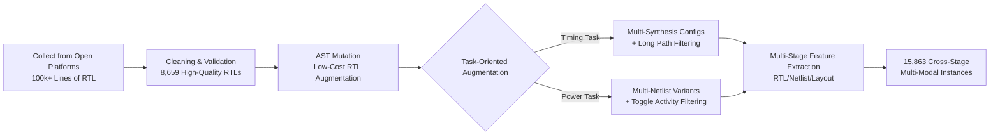

# CircuitNet 3.0: A Multi-Modal Dataset with Task-Oriented Augmentation for AI-Driven Circuit Design

**Conference**: ICLR 2026  
**OpenReview**: [https://openreview.net/forum?id=lEDb4gQ4dB](https://openreview.net/forum?id=lEDb4gQ4dB)  
**Code**: [https://github.com/sklp-eda-lab/iclr-circuitnet_3.0](https://github.com/sklp-eda-lab/iclr-circuitnet_3.0)  
**Area**: AI for EDA / Datasets & Benchmarks  
**Keywords**: Chip Design, EDA, Multi-Modal Dataset, Timing Prediction, Power Prediction, AST Data Augmentation, Cross-Stage Representation Learning  

## TL;DR
CircuitNet 3.0 is the first large-scale open-source AI4EDA benchmark for timing and power prediction. It leverages 8,659 validated open-source RTL designs, augmented via Verilog AST mutations and task-oriented filtering into 15,863 multi-modal instances across Register-Transfer Level (RTL), Netlist, and Layout stages.

## Background & Motivation
**Background**: Chip design involves transforming high-level specifications into physical layouts. Traditional "waterfall" flows require completing the RTL design → logic synthesis → physical design cycle to verify Performance, Power, and Area (PPA). Failure to meet targets triggers Engineering Change Orders (ECOs) and repeated iterations, often taking weeks or months. The industry is shifting toward a "shift-left" paradigm—using ML models to predict timing and power violations at the early RTL stage for proactive optimization.

**Limitations of Prior Work**: ML-driven EDA adoption is hindered by data issues. First, **data scarcity**: chip designs are restricted by IP, lacking large-scale public datasets like those in CV/NLP. Second, **high generation costs**: creating realistic EDA datasets requires expensive commercial tools (Synopsys DC, Cadence Innovus), domain experts, and massive compute resources over months of iteration. Third, **incomplete representations**: CircuitNet 2.0 has layout data but only 8 RTL designs; RTLCoder has 26,532 RTL files but lacks Netlist/Layout data; VerilogEval/RTLLM evaluate code generation without performance labels.

**Key Challenge**: Early-stage prediction is most valuable, yet the RTL stage lacks critical physical information (parasitic resistance/capacitance). Models must learn complex mappings from early design choices to final physical results across RTL, Netlist, and Layout modalities. Currently, there is a lack of traceable **RTL-to-Layout full-link data** and **hard samples** that push models to their limits—accuracy on "near-marginal" designs (critical timing/power budgets) is more vital than average performance.

**Goal**: Construct a large-scale, multi-stage, multi-modal open-source dataset with task-oriented augmentation specifically for timing and power prediction.

**Core Idea**: Utilize a **"cheap generation at high abstraction + precise filtering at low abstraction"** two-stage augmentation. First, use AST mutations at the coarse-grained RTL layer to cost-effectively expand design variants. Then, use commercial EDA tools at the fine-grained Netlist/Layout layers for task-oriented filtering to retain "hard samples" with tight timing (long paths) and high power relevance (toggle activity).

## Method

### Overall Architecture
The CircuitNet 3.0 construction pipeline follows: collection/cleaning → fast AST generation → task-oriented augmentation → multi-stage feature extraction. After distilling 8,659 high-quality designs from 100k+ RTL lines, Verilog AST mutations are applied to create structural variants. Commercial flows (Synopsys DC + Cadence Innovus/Voltus) are then run to generate multi-stage data and filter samples for timing and power tasks. Finally, text (RTL), graph (Netlist), and image (Layout) modalities are extracted and aligned into 15,863 instances.

### Key Designs

**1. Three-Stage Three-Modality Aligned Representation**: The EDA flow is "unfolded" into three progressive representations—RTL (behavioral Verilog code, text modality), Netlist (gate-level standard cell connectivity, graph modality), and Layout (geometric geometric images, image modality). CircuitNet 3.0 aligns these stages with ground-truth performance metrics: Arrival Time (AT), Worst Negative Slack (WNS), and Total Negative Slack (TNS) for timing; and dynamic power for power ($P_{\text{Switching}} = \alpha \times f \times C_L \times V_{DD}^2$, where $\alpha$ is toggle activity). This full-link traceability enables models to learn cross-abstraction information fusion.

**2. Fast Circuit Generation via Verilog AST**: Rather than random RTL generation (which often fails synthesis), the paper uses local syntax tree rewriting on validated designs. Context-aware mutation operators include: bidirectional swap of arithmetic operators (+/−/×/÷), cross-class logical operator replacement (&&/‖/&/|), relational operator inversion (==/!=/>/<), clock edge flipping (posedge↔negedge), assignment swap (<=↔=), and constant bit-width adjustment (±1). This approach leverages RTL's coarse-grained nature to create significant gate-level changes efficiently.

**3. Task-Oriented Augmentation for Timing**: Timing closure is determined by the longest paths. To prevent models from only seeing designs with ample slack, two steps are taken: for multi-stage generation, a full physical optimization is run (Innovus densified to >90%) to produce optimal labels; for filtering, designs with long paths are prioritized while trivial short-path designs are discarded. This shifts the WNS distribution from −2~0 ns to −6~0 ns, with layout densities covering 86%~100%.

**4. Task-Oriented Augmentation for Power**: Since power depends on gate-level toggle activity, power augmentation focuses on the Netlist layer. Multiple netlist variants are generated from a single RTL using different synthesis constraints (DC compile configs) to capture the impact of logic topology. Filtering is performed using Cadence Voltus for vectorless dynamic power analysis, excluding designs with high proportions of unreachable logic or zero-toggle nodes. This expands the power distribution from <60 mW to a uniform 0~160 mW coverage.

## Key Experimental Results

### Main Results
Comparison between single-modal and multi-modal models (multi-modal significantly outperforms):

**Timing Prediction (RTL input, RTLDistil uses cross-stage knowledge distillation)**

| Model | AT PCC↑ | AT MAPE↓ | WNS PCC↑ | WNS MAPE↓ | TNS PCC↑ | TNS MAPE↓ |
|------|---------|----------|----------|-----------|----------|-----------|
| MasterRTL | 0.520 | 43.25% | 0.698 | 65.12% | 0.593 | 68.45% |
| RTL-Timer | 0.835 | 26.48% | 0.842 | 44.36% | 0.801 | 43.92% |
| **RTLDistil** | **0.887** | **19.72%** | **0.871** | **35.28%** | **0.918** | **40.15%** |

**Power Prediction (Netlist stage, MOSS multi-modal learning)**

| Model | Toggle Rate PCC↑ | Toggle MAPE↓ | Total Power PCC↑ | Power MAPE↓ |
|------|------------------|--------------|------------------|-------------|
| DeepSeq2 | 0.759 | 29.5% | 0.872 | 22.2% |
| MOSS (w/o multi-modal) | 0.674 | 34.7% | 0.815 | 27.7% |
| **MOSS (Full)** | **0.871** | **14.4%** | **0.948** | **7.4%** |

### Ablation Study
Verification of augmentation effect using three dataset variants (Resyn-27k / Original / Augmented):

**Timing (RTLDistil)**

| Dataset | AT PCC↑ | AT MAPE↓ | WNS PCC↑ | WNS MAPE↓ | TNS PCC↑ | TNS MAPE↓ |
|--------|---------|----------|----------|-----------|----------|-----------|
| Resyn-27k | 0.842 | 23.86% | 0.825 | 40.73% | 0.876 | 44.27% |
| Original | 0.887 | 19.72% | 0.871 | 35.28% | 0.918 | 40.15% |
| **Augmented** | **0.935** | **15.28%** | **0.926** | **28.96%** | **0.968** | **35.42%** |

**Power (Total Power)**

| Dataset | Model | PCC↑ | R²↑ | MAPE↓ |
|--------|------|------|-----|-------|
| Resyn-27k | VIRTUAL | 0.675 | 0.704 | 27.48% |
| Augmented | VIRTUAL | **0.753** | **0.867** | **23.92%** |

### Key Findings
- **Multi-modal beats Single-modal**: In timing, RTLDistil improved PCC by 8.0% and reduced MAPE by 18.2% relative to the strongest RTL-only baseline (RTL-Timer). In power, MOSS (Full) improved toggle rate PCC by 31.1% over its single-modal counterpart.
- **Augmentation is Effective**: Compared to Resyn-27k, augmented data reduced timing MAPE by 36.0% and power MAPE by 12.9%. The $R^2$ of MasterRTL turned positive, indicating meaningful learning.
- **Richer Distributions**: Augmentation expanded timing coverage from −2~0 ns to −6~0 ns and power from <60 mW to 0~160 mW while maintaining EDA validity.
- **Strict Leakage Prevention**: The test set contains only original designs. If a source design is in the test set, all its augmented variants are excluded from training/validation to ensure generalization.

## Highlights & Insights
- **Pragmatic generation-filtering split**: Using RTL for generation (cheap) and Netlist/Layout for task-oriented filtering (expensive) maximizes the marginal value of expensive EDA tool compute.
- **Task-oriented augmentation vs. Volume**: It explicitly pushes the data distribution toward "industrial hard samples" (long paths, high toggle), addressing the pain point that model value is defined by accuracy on marginal designs.
- **AST Mutation for Validity**: Performing type-safe local transformations on validated base designs ensures high synthesis success rates compared to stochastic generation.

## Limitations & Future Work
- **Reliance on Commercial EDA**: Data generation depends on DC/Innovus/Voltus/PrimePower licenses, making it difficult for teams without these tools to reproduce the generation flow.
- **Modular vs. Large-Scale**: The designs are primarily modular; representation of very large SoC-level designs remains a challenge.
- **Potential for "Dead" Logic**: Mutations may introduce logic unreachability. Although power tasks filter this, the trade-off between diversity and functional "realism" needs further study.
- **Narrow Task Coverage**: Currently limited to timing and power; extensions to routability, IR-drop, and area are required.

## Related Work & Insights
- **vs CircuitNet 1.0/2.0**: Earlier versions lacked sufficient RTL (only 8 designs). 3.0 provides the large-scale cross-stage RTL-to-Layout link.
- **vs Code-Gen Datasets (VerilogEval/RTLLM)**: Those focus on LLM code generation without physical performance labels; this work focuses on prediction tasks.
- **Insight**: In data-scarce domains (EDA, Bio, Materials), "structural augmentation of validated seeds + task-driven hard-sample filtering" is often more effective than blind scaling or random generation.

## Rating
- **Novelty**: ⭐⭐⭐⭐ — First large-scale open multi-stage multi-modal benchmark for AI4EDA timing/power.
- **Experimental Thoroughness**: ⭐⭐⭐⭐ — Comprehensive coverage across tasks, baselines, and ablation studies, with rigorous leak prevention.
- **Writing Quality**: ⭐⭐⭐⭐ — Logical progression with clear alignment between challenges and solutions.
- **Value**: ⭐⭐⭐⭐⭐ — Addresses the primary bottleneck (high-fidelity public data) in AI4EDA; a foundational contribution to the community.

<!-- RELATED:START -->

## Related Papers

- [\[ICLR 2026\] OSIRIS: Bridging Analog Circuit Design and Machine Learning with Scalable Dataset Generation](osiris_bridging_analog_circuit_design_and_machine_learning_with_scalable_dataset.md)
- [\[ICLR 2026\] Ensemble Prediction of Task Affinity for Efficient Multi-Task Learning](ensemble_prediction_of_task_affinity_for_efficient_multi-task_learning.md)
- [\[ICLR 2026\] The Hot Mess of AI: How Does Misalignment Scale With Model Intelligence and Task Complexity?](the_hot_mess_of_ai_how_does_misalignment_scale_with_model_intelligence_and_task_.md)
- [\[ICLR 2026\] SONIC: Spectral Oriented Neural Invariant Convolutions](sonic_spectral_oriented_neural_invariant_convolutions.md)
- [\[ICLR 2026\] Consistency-Driven Calibration and Matching for Few-Shot Class Incremental Learning](consistency-driven_calibration_and_matching_for_few-shot_class_incremental_learn.md)

<!-- RELATED:END -->
